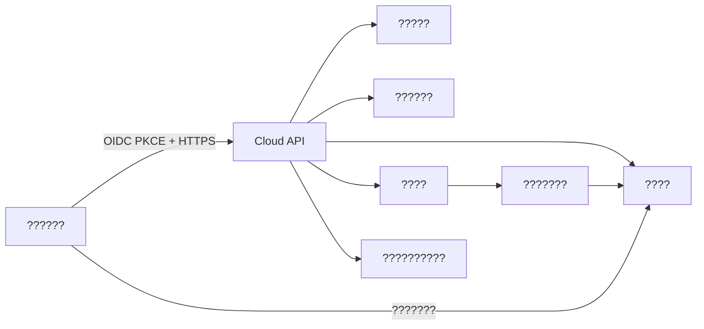

# ?????????????????

- Status: Draft for implementation gate
- Date: 2026-08-11
- Scope: ?????/?????? revision?????? operation???/???????? job
- Architecture baseline: ADR-001?ADR-003?ADR-004?ADR-005?ADR-006

## 1. ????

1. ?????????????????????????????
2. ??????????????????????????? ID ?????????
3. ?????PPT/PDF?????????????????????????????????? OpenAPI ???
4. revision?operation ????????????????????????????????????????
5. ??????????????????????????????????
6. ????????????????????????????????

## 2. ????????

?????

- ??????????????????????????????????
- ???????????????????????????????
- ????????????????? URL ?????????????????????
- ??????????????????????????????????????????
- Provider ?????????????????/?????????????????

## 3. ????

| ?? | ?? | ?? | ???? |
| --- | --- | --- | --- |
| C0 Public | ???????? | ??????????? | ?????????? |
| C1 Internal | ??????? | job ????????????? | ????????????? |
| C2 Confidential | ??????? | ?????????????operation | ??/?????RBAC??????/?? |
| C3 Restricted | ????????? | PPT/PDF/Word?????????????? | ???????? URL???????????? |
| C4 Secret | ??????? | OAuth refresh token?Provider API key????? | ?????????????????????? |

??????????????????OCR/ASR ??????????????? dump ???????????????

## 4. ??????????

????? human user?desktop device session?service account?remote executor??????

- `owner`????????????????????
- `admin`?????????????/????????
- `editor`??? revision???????? operation??? job?
- `reviewer`??????????????????????????
- `viewer`?????????
- `executor`?????? job ??????????? job ???

????? `tenant/workspace + project + action` ????????????????????????????????????????????????????????????????????????

## 5. ??????

?????????????? revision?operation log???? RBAC????????/???????????????Provider ???OAuth token????????/??????????

???????

- ??????????
- ????????/?????
- ???????? token???? URL ??? outbox?
- ??/????????? operation ??????
- ???????????? Provider?
- ???????????????????
- ??????????????????????

## 6. ?????

| ID | ?? | ?? | ???? | ?? |
| --- | --- | --- | --- | --- |
| T01 | IDOR/??????? | C2-C4 ????? | ?????? tenant?????????deny by default | ???? UUID???????? |
| T02 | ??/?????? | ??????? | Repository ??? tenant scope????????? | ??/??/??????? |
| T03 | ? token ?????????? | ????/?? | ? access token?refresh ???membership version????????? | ????????/?????? |
| T04 | OAuth code/token ?? | ???? | Authorization Code + PKCE?state/nonce???????loopback ??????????????? | ????? redirect?? PKCE ?? |
| T05 | ?????/?? | ??????? | ADR-003 ?? ID?tenant+kind+key ????????? | ???/? payload????? |
| T06 | revision/operation ?? | ?????????? | canonical JSON + SHA-256??????head CAS??? | DB/API ?????hash ?? |
| T07 | ????? base revision | ?????? | base ??????????????? | ???????? operation |
| T08 | ????/????? | ??????????? | ???????????????????? | `..`??????Unicode/????? |
| T09 | ??????????????? | ???????? | API ?????????????????????????? | ???/?????????? |
| T10 | ??? URL ?? | C3 ????/?? | ? TTL??? method/key/size/hash/content-type???????????? query | ???? method/key????? |
| T11 | ?? PPT/PDF/??????? | ????????? | ?????????????????????????/????????? | fuzz ????????????? |
| T12 | SSRF ?? Provider/?? URL | ?????????? | ????? URL??????DNS/IP ????? link-local/private?????? | DNS rebinding??????? |
| T13 | Provider ???? | ?????? | C4 ????? provider/tenant ??????????????? | ??/??/OpenAPI/?????? |
| T14 | Provider ??????? | ??????? | capability ?????????????????? payload???/???? | mock provider ??????? |
| T15 | ???????????? | ???? job/???? | ???????? job ?????????????? token????? | ? job ????????? |
| T16 | ??????/?? | ????????? | ????/?????job ?????? claim????? | ???????? worker claim |
| T17 | ???????? | ????/???? | ?? TTL?????????????????????????????? | ??????????? |
| T18 | ??/????? XSS | ????/???? | ????????????CSP???? HTML/?? URL | payload corpus???? sanitizer ?? |
| T19 | ??/??/???? | C2-C4 ?? | ?? allowlist????????/URL/token ???????? | canary secrets ??? fixture ?? |
| T20 | ????????????? | ????/???? | ????????????? restore??? tombstone??????? | ??????????? |
| T21 | ????/operation/job ?? | ???????? | tenant/user/IP ??????????????????? | burst?slow upload????? |
| T22 | ?????/?? schema | ????????? | ?????????????????????? | ?/?? schema????? |
| T23 | CSRF/CORS ?? | ???? | ?? token ????? cookie??? Web ?? SameSite/CSRF??? CORS origin | ? origin ???? |
| T24 | ???????????/?? | ???? | ????????????????????? C3 ?? | ??/??????????? |

## 7. API ????

- ???? URL ????? UUID?????????????????????? `404`?????????
- ????? `Idempotency-Key`????? `Operation-Id`??????? `If-Match` ? `base_revision_id`?
- ??????????????? cursor??? `limit`????????
- ??????????????operation ?????????????????
- OpenAPI ???????????????????????????token???????????
- ????????? code?correlation ID??????????????????????

## 8. ???????

?????

1. ??????????????MIME ????
2. ????????????????????????????
3. ????????????????????????? key?
4. ????????????????????????????? tenant/project ???
5. ?????????? renderer/provider ?????????????????

????????????????????????????????/????? `PlatformServices.files.atomic_replace`??????????????????

## 9. ???????

- outbox ? operation ????????????????? Provider/API ???
- ??????????????? project/revision?????????? operation ?????????????
- operation payload ?? schema???????????????????
- ?????????????????????????? revision?
- conflict ??????????????? payload ??? C2/C3 ???
- inbox ????????????????????????? cursor?

## 10. ?????????

?? job ???????????????????????????????????????? Provider ????????/??????????????? RFC1918?loopback?link-local???????????????

?????? CPU?GPU???????????????????????????????????? FFmpeg/Office ????? SBOM???????? SLA?????? job/attempt??? revision????????????????????????????????

## 11. ????????

?????????operation/attempt/job ??? ID????????????????????????????access/refresh token?API key???? URL query?Authorization header????????/??????????????????????? Provider ???

?????????????/????????????????? job???/????????????????????????????????? ID ???????? C3 ???

## 12. ??????

| ?? | ?? |
| --- | --- |
| ?? | ??????????????? |
| ?? | ??/?????RBAC?????? |
| ???? | ????????? tombstone?????? |
| ??/?? | ??? owner???????? |
| ???? | ??????????????????????????? |
| ???? | ???????????????????? |

??????????????????????????????????????????????????? C2/C3 ???????????????????

## 13. ??????

C2 ??????

- OpenAPI lint????????????????????????????
- JSON Schema ???????????????????????????
- RBAC ???? endpoint ??? allow/deny/????????

????????

- ???????????????????? token ???????
- ???????????????? URL???????????????
- Provider/????? mock ?????????? token?????????
- ??????trace?OpenAPI ????? dump ? canary secret ??????

??????

- ?????????/SBOM/????????????
- ?????????????????????????????
- RPO/RTO????????????? Provider ???????/?????
- C12 ?????????????? beta ?????

## 14. ????

???????????????????????????????

1. OIDC ???????? SSO/SCIM ???????
2. ??????????????? RPO/RTO ??????????
3. ??? Provider????????/??????????????
4. macOS/Linux ????????????????????????
5. ???????? GPU ???????????????????

