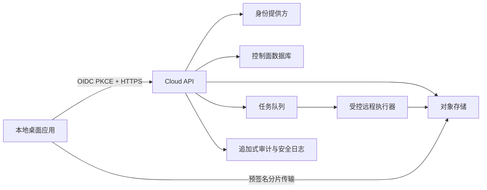

# 云端协作控制面：数据分类与威胁模型

- Status: Draft for implementation gate
- Date: 2026-08-11
- Scope: 身份、组织/工作区、项目 revision、对象、同步 operation、评论/审核、租约和远程 job
- Architecture baseline: ADR-001、ADR-003、ADR-004、ADR-005、ADR-006

## 1. 安全目标

1. 默认不联网、不上传；用户明确启用云端并选择工作区后才同步。
2. 任一请求必须同时满足身份、租户、资源和操作级授权，资源 ID 不得成为授权凭据。
3. 项目正文、PPT/PDF、旁白、字幕、真人视频、生成素材和凭证不得进入日志、指标、错误跟踪或 OpenAPI 示例。
4. revision、operation 和对象在传输、存储、重放及恢复时保持完整性，可追踪但不可由普通用户改写审计历史。
5. 离线重试、失败切换和远程执行不产生重复计费、重复对象或重复项目变更。
6. 删除、导出、保留期、备份恢复和租户退出具备可验证的数据生命周期。

## 2. 系统边界与信任区

信任边界：

- 桌面设备可能丢失、被恶意软件控制或运行旧客户端，不能视为可信服务端。
- 身份提供方只证明身份会话；组织成员资格和资源权限由控制面验证。
- 对象存储不理解项目授权，所有预签名 URL 必须由控制面按资源权限、摘要和短时限签发。
- 远程执行器处理不可信媒体和文档，属于高风险隔离区，不持有长期用户令牌或数据库写权限。
- Provider 是外部数据接收方；是否允许发送正文/音视频由工作区策略和明确任务决定。

## 3. 数据分类

| 等级            | 数据               | 示例                                            | 最低控制                                     |
| --------------- | ------------------ | ----------------------------------------------- | -------------------------------------------- |
| C0 Public       | 可公开产品元数据   | 客户端版本、公开能力名                          | 完整性校验、最小日志                         |
| C1 Internal     | 内部运行元数据     | job 状态、非敏感计数、功能开关                  | 租户隔离、访问日志、保留期                   |
| C2 Confidential | 用户项目元数据     | 标题、页结构、评论、审核、operation             | 传输/静态加密、RBAC、审计、导出/删除         |
| C3 Restricted   | 项目内容和个人数据 | PPT/PDF/Word、旁白、字幕、真人视频、声音        | 对象级授权、短期 URL、内容扫描、严格日志禁止 |
| C4 Secret       | 凭证和签名材料     | OAuth refresh token、Provider API key、签名私钥 | 专用密钥库、信封加密、不可导出、轮换、零日志 |

派生数据继承最高源数据等级。缩略图、OCR/ASR 文本、缓存、模型输入输出、调试 dump 和备份不能因“派生”自动降级。

## 4. 主体、角色和授权矩阵

主体类型为 human user、desktop device session、service account、remote executor。首版角色：

- `owner`：工作区设置、成员、计费、保留期和删除；
- `admin`：成员与项目管理，不可读取/导出工作区密钥；
- `editor`：创建 revision、上传对象、提交 operation、发起 job；
- `reviewer`：读取指定项目、评论、审核，不可修改内容或执行导出；
- `viewer`：只读已授权项目；
- `executor`：只读取单个 job 的短期输入对象、写入该 job 输出。

授权始终按 `tenant/workspace + project + action` 求交集。列表接口和对象下载必须使用与详情接口相同的过滤器。管理员不能跨租户；平台运维默认无内容读取权限，紧急访问需要工单、双人批准、时限和审计。

## 5. 资产与攻击者

关键资产包括项目内容、不可变 revision、operation log、成员和 RBAC、对象引用、评论/审核、租约、远程任务输入输出、Provider 凭证、OAuth token、审计记录、删除/保留策略和计费记录。

考虑的攻击者：

- 未认证互联网攻击者；
- 普通成员尝试横向/纵向越权；
- 被移除成员持有旧 token、预签名 URL 或离线 outbox；
- 恶意/被入侵设备提交伪造 operation 或危险文件；
- 被攻陷的远程执行器或外部 Provider；
- 误配置的运维人员、日志平台或备份系统；
- 能观察时序、对象摘要或错误差异的旁路攻击者。

## 6. 威胁与控制

| ID  | 威胁                           | 影响                   | 必需控制                                                                                    | 验证                                  |
| --- | ------------------------------ | ---------------------- | ------------------------------------------------------------------------------------------- | ------------------------------------- |
| T01 | IDOR/跨租户资源访问            | C2-C4 泄露或篡改       | 每次查询绑定 tenant；对象引用不授权；deny by default                                        | 枚举相邻 UUID、跨角色矩阵测试         |
| T02 | 列表/搜索过滤遗漏              | 批量元数据泄露         | Repository 层强制 tenant scope；禁止路由手写遗漏                                            | 列表/详情/导出一致性测试              |
| T03 | 旧 token 或成员移除后继续访问  | 持续读取/写入          | 短 access token、refresh 撤销、membership version、关键操作实时检查                         | 移除成员后的并发/离线重放测试         |
| T04 | OAuth code/token 窃取          | 账户接管               | Authorization Code + PKCE、state/nonce、系统浏览器、loopback 随机端口、刷新令牌入系统密钥库 | 重放、错误 redirect、无 PKCE 测试     |
| T05 | 幂等键混淆/重放                | 重复计费或写入         | ADR-003 三类 ID；tenant+kind+key 唯一；请求摘要比较                                         | 同键同/异 payload、并发重放           |
| T06 | revision/operation 篡改        | 历史和同步完整性丢失   | canonical JSON + SHA-256；不可变行；head CAS；审计                                          | DB/API 改写拒绝、hash 重算            |
| T07 | 客户端伪造 base revision       | 覆盖他人工作           | base 校验、显式冲突、服务端合并规则                                                         | 双设备并发、乱序 operation            |
| T08 | 路径穿越/恶意文件名            | 覆盖主机或其他项目文件 | 逻辑路径校验、内容对象隔离、下载原子落盘                                                    | `..`、绝对路径、Unicode/大小写碰撞    |
| T09 | 对象摘要探测和跨租户去重侧信道 | 推断他人内容存在       | API 不公开全局存在性；物理去重与授权元数据隔离；统一错误                                    | 已存在/不存在时序与错误比较           |
| T10 | 预签名 URL 泄露                | C3 对象泄露/替换       | 短 TTL、限定 method/key/size/hash/content-type、一次提交确认、日志清除 query                | 过期、换 method/key、超长上传         |
| T11 | 恶意 PPT/PDF/媒体利用解析器    | 远程执行或横向移动     | 隔离执行器、非特权用户、只读输入、无默认网络、资源/时间限制、补丁策略                       | fuzz 样本、压缩炸弹、超大分辨率       |
| T12 | SSRF 通过 Provider/素材 URL    | 访问内网和元数据服务   | 默认禁任意 URL；域名策略；DNS/IP 双检查；禁 link-local/private；重定向复验                  | DNS rebinding、重定向到内网           |
| T13 | Provider 凭证泄露              | 外部账户滥用           | C4 密钥库、按 provider/tenant 隔离、短期凭证优先、全链路脱敏                                | 日志/诊断/OpenAPI/异常秘密扫描        |
| T14 | Provider 接收超范围内容        | 隐私或合规违规         | capability 数据清单、工作区策略、用户提示、最小 payload、区域/保留配置                      | mock provider 断言字段最小化          |
| T15 | 远程执行器冒充或扩大权限       | 读取其他 job/写控制面  | 工作负载身份、单 job 短令牌、对象前缀限制、无成员 token、签名回执                           | 跨 job 对象访问、过期令牌             |
| T16 | 队列消息伪造/重复              | 任意任务、资源消耗     | 消息签名/服务身份、job 状态机、幂等 claim、最大尝试                                         | 重放、乱序、重复 worker claim         |
| T17 | 租约滥用或永久锁               | 拒绝服务/错误覆盖      | 有限 TTL、续租授权、服务器时间、管理员可审计解除；租约不是写权限替代                        | 断线、时钟漂移、抢租约                |
| T18 | 评论/标题存储型 XSS            | 会话窃取/恶意操作      | 纯文本默认、上下文转义、CSP；禁任意 HTML/脚本 URL                                           | payload corpus、富文本 sanitizer 测试 |
| T19 | 日志/指标/错误泄露             | C2-C4 外流             | 字段 allowlist、正文禁止、路径/URL/token 脱敏、采样前清洗                                   | canary secrets 与隐私 fixture 扫描    |
| T20 | 备份包含已删除或跨租户数据     | 生命周期/合规失败      | 加密备份、访问隔离、可验证 restore、删除 tombstone、备份到期销毁                            | 恢复演练、删除传播报告                |
| T21 | 大量对象/operation/job 滥用    | 成本和可用性损失       | tenant/user/IP 限流、配额、预算、最大尺寸、背压、取消                                       | burst、slow upload、队列饱和          |
| T22 | 客户端降级/未知 schema         | 数据损坏或绕过校验     | 明确版本协商、未知未来版本拒绝、最低安全版本                                                | 旧/未来 schema、降级攻击              |
| T23 | CSRF/CORS 错配                 | 跨站操作               | 桌面 token 不使用环境 cookie；管理 Web 使用 SameSite/CSRF；精确 CORS origin                 | 跨 origin 请求测试                    |
| T24 | 审计记录被普通用户删除/伪造    | 追责失败               | 追加式独立权限、完整性保护、时钟同步、最小 C3 内容                                          | 删除/更新拒绝、链完整性检查           |

## 7. API 安全规则

- 所有资源 URL 使用不可猜 UUID，但仍执行授权；错误对无权限与不存在统一返回 `404`，仅审计内部原因。
- 写请求要求 `Idempotency-Key`，响应返回 `Operation-Id`；并发更新使用 `If-Match` 或 `base_revision_id`。
- 分页使用不透明、带作用域签名的 cursor；限制 `limit`，禁止无界导出。
- 请求、解压后内容、对象数量、operation 数量、评论长度和批量项数均有上限。
- OpenAPI 示例只能使用合成数据；不得包含本地绝对路径、真实域名、token、人物声音或用户正文。
- 结构化错误仅含稳定 code、correlation ID、可恢复建议；内部堆栈只进受控日志且先脱敏。

## 8. 对象上传与下载

上传流程：

1. 客户端声明对象摘要、字节数、MIME 和用途。
2. 控制面验证配额、角色、项目和允许类型，签发短期上传授权。
3. 客户端分片上传；对象存储不能通过用户元数据决定最终 key。
4. 客户端提交完成；服务端验证实际长度、摘要和扫描状态，再创建 tenant/project 引用。
5. 扫描未完成对象不可被 renderer/provider 使用；失败对象隔离并按保留期删除。

下载必须绑定授权主体、对象引用和用途。客户端写临时文件，验证长度/摘要后使用 `PlatformServices.files.atomic_replace`，避免中断产生有效路径下的部分内容。

## 9. 同步与冲突安全

- outbox 中 operation 在本地加密能力允许范围内保存，不含 Provider/API 密钥。
- 服务端只接受用户当前有权提交的 project/revision；成员移除后，旧离线 operation 不因创建时间较早自动放行。
- operation payload 先做 schema、大小、引用和语义校验，再进入合并器。
- 自动合并规则必须确定且版本化；规则升级不能改变已提交 revision。
- conflict 只向有项目读取权限者暴露，冲突 payload 本身按 C2/C3 处理。
- inbox 应用过程可崩溃恢复且幂等；验证失败不推进本地已确认 cursor。

## 10. 远程执行器安全基线

每个 job 使用临时隔离环境，非特权身份，只挂载只读输入和独立可写输出；默认无出站网络。需要 Provider 网络时通过按域名/能力授权的代理，代理不允许访问 RFC1918、loopback、link-local、云元数据地址或控制面数据库。

执行器必须有 CPU、GPU、内存、磁盘、进程数、输出字节和墙钟时限；取消能终止进程树。输入解析器和 FFmpeg/Office 运行时纳入 SBOM、漏洞扫描与补丁 SLA。完成回执含 job/attempt、输入 revision、输出对象摘要、工具版本和规范化结果清单，并由工作负载身份签名。

## 11. 日志、审计和隐私

允许进入常规日志：operation/attempt/job 的随机 ID、稳定错误码、能力名、耗时桶、字节数桶和状态。禁止进入：access/refresh token、API key、预签名 URL query、Authorization header、项目正文、字幕/旁白、真实文件路径、评论全文、音视频内容和完整 Provider 响应。

安全审计记录身份变化、成员/角色变化、项目导出、对象授权、远程 job、保留/删除策略、紧急访问和密钥轮换。读取审计也被审计。审计事件应引用资源 ID 和摘要，避免复制 C3 内容。

## 12. 数据生命周期

| 状态      | 要求                                                   |
| --------- | ------------------------------------------------------ |
| 创建      | 明确用途、分类、租户和保留策略                         |
| 活跃      | 传输/静态加密、RBAC、审计和配额                        |
| 删除请求  | 立即撤销访问，创建 tombstone，停止新处理               |
| 宽限/恢复 | 仅授权 owner；所有恢复被审计                           |
| 永久清理  | 删除对象引用、派生物、缓存和过期备份；保留最小合规审计 |
| 租户退出  | 可验证导出、密钥撤销、删除报告和完成证明               |

对象物理去重不能阻止单租户删除语义；共享物理块只有在所有合法引用到期后清理。训练或产品改进不得默认使用 C2/C3 数据，任何不同用途需要独立同意与策略。

## 13. 安全测试门禁

C2 契约合入前：

- OpenAPI lint、未授权响应覆盖、所有写接口幂等声明、示例隐私扫描通过；
- JSON Schema 拒绝未知字段、绝对路径、坏摘要、超限字符串和未来版本；
- RBAC 矩阵每个 endpoint 至少含 allow/deny/跨租户三类测试。

云端原型验收前：

- 双设备断线、乱序、重复、成员移除、冲突和 token 过期场景通过；
- 对象上传的摘要、大小、类型、过期 URL、路径穿越和租户隔离测试通过；
- Provider/远程执行器 mock 证明最小权限、无长期 token、无默认内网访问；
- 诊断、日志、trace、OpenAPI 示例和备份 dump 的 canary secret 扫描零命中。

生产发布前：

- 独立渗透测试、依赖/SBOM/镜像扫描和高危修复完成；
- 备份恢复、租户删除、密钥轮换、事故响应和服务降级演练完成；
- RPO/RTO、保留期、区域、子处理者和 Provider 数据策略经产品/法务确认；
- C12 数据生命周期和运营门禁不得以 beta 标识豁免。

## 14. 未决问题

以下事项在实现前需要产品或部署环境给出配置，但不阻塞契约草案：

1. OIDC 身份提供方与企业 SSO/SCIM 是否进入首版。
2. 数据驻留区域、默认保留期、备份 RPO/RTO 和租户自管密钥范围。
3. 允许的 Provider、数据区域、训练/保留条款及工作区级禁用策略。
4. macOS/Linux 系统密钥库最低支持版本和无图形会话时的降级行为。
5. 远程执行器需要的 GPU 类型、网络出口域名和文档解析隔离强度。
