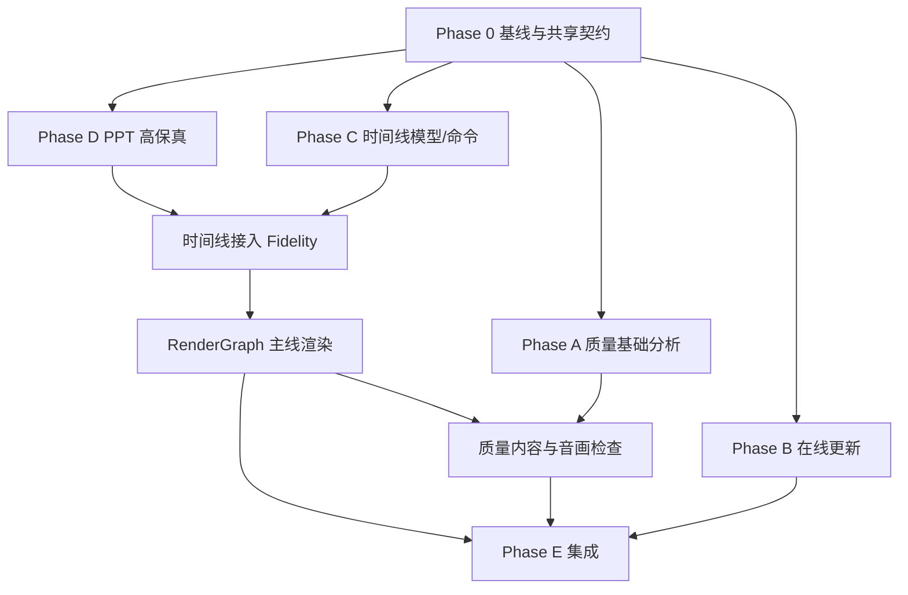

# PPT Video Workbench 四项重大能力逐项实施计划

> 本计划实施前必须先完成当前并行窗口的合并与基线验收。不要在当前多人共用的脏根工作区直接开始编码。每个项目使用独立 worktree；共享契约阶段串行完成并冻结后，四条实施线才可并行。

**Goal:** 实现成片自动质量检测、在线安全更新、统一多轨时间线、PPT 高保真与元素级动画，并把它们安全接入现有七步工作流、异步渲染、P03-P12、特效编辑器和 Windows 发布链。

**Design:** `docs/superpowers/specs/2026-08-10-four-major-video-capabilities-design.md`

**Tech Stack:** Python 3.12、FastAPI、Pydantic 2、SQLAlchemy/SQLite WAL、React 19、TypeScript、TanStack Query、Vitest/Playwright、Remotion、FFmpeg/FFprobe、Pillow/PyMuPDF、PowerPoint COM（可选）、LibreOffice、Ed25519。

## 1. 全局实施约束

- [ ] 当前异步最终渲染、P03-P12、特效编辑器、真人讲解和 Windows 修复窗口全部形成明确提交或独立可审查 worktree。
- [ ] 根目录 `git status` 的现存用户修改已登记；禁止 `reset --hard`、`clean`、批量覆盖和跨 worktree 复制。
- [ ] 所有新长任务都必须有持久 `job_id`、幂等键、进度、检查点、取消和重启恢复。
- [ ] 所有新写入都采用项目相对路径、临时文件、校验和原子替换。
- [ ] 所有 API mutation 使用 `expected_revision` 或等价并发保护。
- [ ] 预览、渲染、质量检测不得分别计算时间；发布后只消费同一 `RenderGraphV1`。
- [ ] 更新系统不得覆盖 `workspace-data`，不得让正在运行的主程序直接替换自身文件。
- [ ] Office 自动化禁止宏、外部链接、ActiveX、OLE 执行和任意网络访问。
- [ ] 任何日志、API、诊断包不得暴露密钥、认证头、完整下载 token、正文或绝对用户路径。
- [ ] 每个任务先写失败测试，再实现最小通过，再跑相邻回归，最后提交。

## 2. 分支与工作树建议

| 实施线      | 建议分支                              | 主要目录                                      |
| ----------- | ------------------------------------- | --------------------------------------------- |
| Shared      | `codex/four-capabilities-foundation`  | contracts、domain、migrations、docs           |
| Quality     | `codex/video-quality-analysis`        | quality、video、jobs、Web quality UI          |
| Update      | `codex/secure-online-update`          | updates、launcher、installer、release scripts |
| Timeline    | `codex/production-timeline`           | timeline、render graph、Remotion、Web editor  |
| Fidelity    | `codex/ppt-fidelity-animation`        | parsers、renderers、fidelity、Office adapter  |
| Integration | `codex/four-capabilities-integration` | main、workflow、contracts、E2E、release       |

共享阶段合并后，各实施线必须从同一提交创建。集成阶段只 cherry-pick/merge 已通过各自门禁的提交，不直接复制目录。

## 3. 文件责任总图

### 3.1 共享与契约

- Create: `schemas/production-timeline-v1.schema.json`
- Create: `schemas/render-graph-v1.schema.json`
- Create: `schemas/quality-report-v1.schema.json`
- Create: `schemas/slide-fidelity-v1.schema.json`
- Modify: `packages/contracts/project.schema.json`
- Modify: `packages/contracts/openapi.json`
- Modify: `apps/api/src/workbench/domain/models.py`
- Modify: `apps/api/src/workbench/domain/enums.py`
- Modify: `apps/api/src/workbench/storage/migrations.py`

### 3.2 成片质量检测

- Create: `apps/api/src/workbench/quality/`
- Create: `apps/api/src/workbench/api/quality.py`
- Create: `apps/web/src/features/quality/`
- Create: `tests/unit/quality/`
- Create: `tests/integration/test_quality_routes.py`
- Create: `tests/fixtures/quality/`

### 3.3 在线安全更新

- Modify: `apps/api/src/workbench/updates/service.py`
- Create: `apps/api/src/workbench/updates/metadata.py`
- Create: `apps/api/src/workbench/updates/downloader.py`
- Create: `apps/api/src/workbench/updates/trust.py`
- Create: `apps/api/src/workbench/updates/helper_protocol.py`
- Create: `apps/updater-helper/`
- Modify: `scripts/launcher.ps1`
- Modify: `scripts/build-release.ps1`
- Modify: `installer/workbench.iss`
- Modify: `apps/web/src/features/settings/update/UpdatePanel.tsx`

### 3.4 统一时间线

- Create: `apps/api/src/workbench/timeline/production_models.py`
- Create: `apps/api/src/workbench/timeline/commands.py`
- Create: `apps/api/src/workbench/timeline/repository.py`
- Create: `apps/api/src/workbench/timeline/compiler.py`
- Create: `apps/api/src/workbench/timeline/render_graph.py`
- Create: `apps/api/src/workbench/api/timeline.py`
- Create: `apps/web/src/features/timeline/`
- Create: `remotion/src/timeline/`

### 3.5 PPT 高保真

- Create: `apps/api/src/workbench/fidelity/`
- Create: `apps/api/src/workbench/renderers/powerpoint_adapter.py`
- Create: `apps/api/src/workbench/renderers/native_capture.py`
- Create: `apps/api/src/workbench/api/fidelity.py`
- Create: `apps/web/src/features/fidelity/`
- Create: `tests/fixtures/fidelity/`

---

## Phase 0：冻结基线与共享契约

### Task 0.1：建立可信实现基线

**Depends on:** 当前所有并行开发窗口结束或给出明确可审查停点。

- [ ] 记录根快照、特效 worktree、外围平台和恢复引用的提交 ID。
- [ ] 将当前所有未提交文件按来源分类，确认没有两个窗口负责同一正式文件。
- [ ] 跑 Python 全量测试、Ruff、mypy、Web lint/typecheck/test/build、Remotion tests。
- [ ] 在 Windows 上完成安装运行、八页项目打开、预览、渲染、制作包和关闭进程检查。
- [ ] 固定基线结果到 `docs/acceptance/four-capabilities-baseline.md`。
- [ ] 创建共享 foundation worktree；后续文档中的基线均引用该提交。

**Gate:** 任何全量门禁失败、工作树来源不明或构建脚本假绿时停止。

### Task 0.2：冻结四项契约命名和 schema 版本

**Files:** 新增四个 schema；修改 contract export 脚本和 contract tests。

- [ ] 为 `ProductionTimelineV1`、`RenderGraphV1`、`QualityReportV1`、`SlideFidelityManifestV1` 写失败契约测试。
- [ ] 定义共同的相对路径、UUID、整数微秒、revision、fingerprint 和 hash 规则。
- [ ] 禁止 schema 中出现绝对路径、任意额外字段、NaN/Infinity 和浮点时间。
- [ ] 生成 Python 模型、JSON Schema 和 TypeScript 类型快照。
- [ ] 增加规范化 JSON 跨语言 golden fixtures，确保 Python/TypeScript hash 一致。
- [ ] 更新 OpenAPI 快照，但暂不挂正式路由。

**Verify:** contract tests、schema snapshot tests、Web typecheck。

**Commit:** `feat: define four-capability contracts`

### Task 0.3：项目清单与数据库增量迁移

**Files:** `domain/models.py`、`storage/migrations.py`、project schema、migration tests。

- [ ] 增加 `production_timeline`、`slide_fidelity`、`quality_report` 摘要字段，全部可空以兼容旧项目。
- [ ] 增加 timeline revisions、quality report index、fidelity page records 所需 SQLite 表或引用表。
- [ ] 使用增量迁移，不删除或重建既有 jobs/projects 数据。
- [ ] 覆盖旧数据库、迁移中断、重复执行、磁盘写失败和回滚测试。
- [ ] 证明旧 `project.json` 加载保存不会无故生成新时间线或改写输出。
- [ ] 更新诊断数据库探针和 schema version 报告。

**Gate:** 迁移前后现有项目、任务、成片、设置 hash 保持不变。

**Commit:** `feat: add additive storage for quality timeline and fidelity`

### Task 0.4：共享任务、工件和错误码注册

- [ ] 增加 `QUALITY_ANALYZE`、`TIMELINE_COMPILE`、`PPT_FIDELITY_ANALYZE`、`PPT_NATIVE_CAPTURE` job types。
- [ ] 明确哪些任务由主 jobs worker 执行，哪些可通过 peripheral adapter 隔离。
- [ ] 增加工件类型、MIME、大小限制和 manifest schema。
- [ ] 建立四项目稳定错误码表与 HTTP 映射。
- [ ] 增加错误脱敏、路径逃逸和非法工件契约测试。
- [ ] 更新诊断中心的 capability summary，但 feature flags 默认关闭。

**Commit:** `feat: register major capability jobs and artifacts`

**Foundation Gate:** Task 0.1-0.4 全部通过后冻结 foundation 提交，四条实施线才可并行。

---

## Phase A：成片自动质量检测

### Task A1：质量领域模型、策略和结果存储

**Depends on:** Task 0.2-0.4。

- [ ] 创建 `QualityIssue`、`QualityMetric`、`EvidenceRef`、`QualityReportV1`、`QualityPolicyV1`。
- [ ] 定义 P0-P3、scope、time range、page ID、retry policy 和人工确认规则。
- [ ] 创建 strict/standard/fast 三个版本化策略 fixture；P0 不可关闭。
- [ ] 实现报告规范化 hash、相同输入缓存查找和原子保存。
- [ ] 将 manifest 只写摘要和项目相对 report path。
- [ ] 覆盖非法时间范围、未知错误码、证据逃逸、策略降级和旧报告加载测试。

**Verify:** `pytest tests/unit/quality/test_models.py tests/unit/quality/test_policy.py -q`

**Commit:** `feat: add quality report domain and policies`

### Task A2：媒体探测和基础硬门禁 Q0

- [ ] 封装 FFprobe JSON 调用，复用可取消进程执行器。
- [ ] 检查容器、视频流、音频流、codec、分辨率、fps、时长、旋转 metadata 和文件 hash。
- [ ] 对异常/超长/缺失字段返回稳定问题，不传播 stderr。
- [ ] 对成片和 package manifest 做双向一致性校验。
- [ ] 建立损坏 MP4、无音频、无视频、错误 codec、截断文件 fixtures。
- [ ] 输出 Q0 指标和 P0 issues。

**Commit:** `feat: implement media integrity quality gates`

### Task A3：视频信号分析 Q1

- [ ] 实现 blackdetect、freezedetect、场景变化、解码错误和重复片段分析适配器。
- [ ] 实现关键帧采样计划：页边界、转场、字幕、真人边界和长区间补点。
- [ ] 使用感知 hash/SSIM 聚合冻结和重复候选，避免保存每帧。
- [ ] 只保存异常区间的限量证据帧和缩略图。
- [ ] 覆盖短黑场、正常淡入、长黑场、静态 PPT 正常页和错误冻结的区分。
- [ ] 增加分析器版本参与缓存键。

**Commit:** `feat: detect black frozen and duplicate video ranges`

### Task A4：音频信号分析 Q2

- [ ] 实现 EBU R128 integrated loudness、true peak、silence、channel 和尾部截断检查。
- [ ] 区分有意页面停顿与异常整页静音。
- [ ] 依据时间线 dialogue 区间检查旁白存在性，不依赖整片平均响度。
- [ ] 生成小型波形/能量证据 JSON，不复制完整音频。
- [ ] 覆盖正常旁白、削波、低响度、单声道、空白尾部和音乐掩盖语音 fixtures。
- [ ] 证明不同 FFmpeg 小版本的数值容差不会导致随机门禁。

**Commit:** `feat: analyze loudness silence clipping and channels`

### Task A5：字幕、版面和内容一致性 Q3/Q4

- [ ] 从 RenderGraph 读取字幕框、页面 occupancy、presenter/overlay 区域。
- [ ] 检查越界、完全遮挡、过密、单 cue 过长、字体降级和安全区冲突。
- [ ] 对关键帧做 OCR，验证标题/关键字幕的最低可见性，不要求全文逐字相等。
- [ ] 对照 slide order、page ID、visual asset hash 和字幕 cue page ID。
- [ ] 覆盖竖屏、横屏、顶部/中部/底部字幕、半透明底板和真人小窗。
- [ ] OCR 不可用时明确降级，仍保留结构检查。

**Commit:** `feat: validate subtitle layout and rendered content`

### Task A6：音画同步 Q5

- [ ] 对照 RenderGraph 检查每页音频、字幕和视觉区间。
- [ ] 计算全片累积时长漂移和每页边界漂移。
- [ ] 可选使用 ASR 片段与字幕 cue 做局部对齐，输出置信度。
- [ ] 对真人模式使用源时间线和音频能量，不重复转写整个源视频。
- [ ] 500ms 以上确定性漂移为 P1；低置信候选为 P2。
- [ ] 建立人为偏移 100/300/600/1200ms 的 fixtures。

**Commit:** `feat: detect audiovisual synchronization drift`

### Task A7：质量编排器、检查点和一次安全重试

- [ ] 创建 analyzer registry，固定 Q0-Q5 顺序和各阶段进度。
- [ ] 每个 analyzer 独立异常隔离；Q0 失败时跳过依赖分析并明确原因。
- [ ] 报告写入前重新验证成片 hash，防止分析期间被替换。
- [ ] 实现 `rerender_page`、`reassemble`、`recompile` 三种白名单动作。
- [ ] 每类动作最多自动一次，创建新 job/revision，禁止循环。
- [ ] 自动动作失败时保留全部证据和旧成功产物。
- [ ] 覆盖暂停、取消、进程崩溃和重启恢复。

**Commit:** `feat: orchestrate resumable video quality analysis`

### Task A8：质量 API 与前端面板

- [ ] 实现 create/current/get/latest/evidence/action 路由和 ownership 404。
- [ ] 创建前端 DTO、查询键、条件轮询和错误映射。
- [ ] 显示总体结果、六类检查、问题筛选、证据帧、时间跳转和动作确认。
- [ ] 将质量 marker 投影到统一时间线接口；时间线未启用时使用只读问题列表。
- [ ] 支持生成制作包内的 HTML/JSON 摘要，但不内嵌私密媒体。
- [ ] 覆盖 loading/empty/error/retry/blocked/pass 和可访问性。

**Commit:** `feat: add video quality review workspace`

### Task A9：质量 corpus、性能和发布门禁

- [ ] 建立至少 20 个故障成片和 10 个正常成片 fixture 清单。
- [ ] 对所有 P0/P1 故障验证召回率 100%，正常成片 P0/P1 误报为 0。
- [ ] 测量 10 分钟 1080p fast/standard 的耗时、CPU、内存和证据大小。
- [ ] 在 Windows 安装版完成真实成片分析、重启恢复和一次安全重试。
- [ ] 先发布 report-only feature flag，再启用硬门禁。
- [ ] 更新用户手册、排障和质量策略说明。

**Quality Gate:** A1-A9 全部通过；不得用单元测试代替真实 MP4 验收。

---

## Phase B：在线安全更新

### Task B1：信任根和签名元数据

**Depends on:** Task 0.1 和稳定 release manifest。

- [ ] 使用成熟 Ed25519 库，禁止自写签名算法。
- [ ] 定义 root/timestamp/snapshot/targets strict schema 和规范化 JSON。
- [ ] 客户端嵌入测试根公钥；生产根公钥由发布流程单独注入。
- [ ] 实现阈值签名、过期、metadata version、目标 hash/size 和 anti-rollback。
- [ ] 实现旧/新根双签的密钥轮换验证。
- [ ] 建立坏签名、未知 key、过期、重放、降级、截断和键轮换 fixtures。
- [ ] 确保测试私钥永不进入生产发布包。

**Commit:** `feat: verify signed update metadata`

### Task B2：可信在线检查客户端

- [ ] 实现 HTTPS-only metadata fetcher、连接/读取超时和有限重试。
- [ ] 按 timestamp -> snapshot -> targets 顺序验证大小、hash 和签名。
- [ ] 缓存最后验证成功 metadata；离线时显示缓存状态但不伪称最新。
- [ ] 拒绝 redirect 到非 HTTPS、私有文件协议或未声明 host。
- [ ] 日志移除查询参数、认证头和完整 URL。
- [ ] 使用 mock transport 覆盖 DNS、TLS、超时、重定向和代理错误。

**Commit:** `feat: add trusted stable update discovery`

### Task B3：断点下载和内容寻址缓存

- [ ] 实现 `.part`、ETag、Range、已下载长度和目标 hash sidecar。
- [ ] 服务器支持 Range 时续传；ETag 变化或不支持时安全重下。
- [ ] 流式计算 SHA-256，限制最大包大小和磁盘预留。
- [ ] 暂停/继续/取消都保持状态机合法；取消只删除该 operation 临时文件。
- [ ] 下载完成后先 hash/size，再进入 `downloaded`。
- [ ] 覆盖断网、磁盘满、进程退出、重复请求、恶意 Content-Length。

**Commit:** `feat: download signed updates with resume support`

### Task B4：安全解包与运行时清单校验

- [ ] 仅接受规定发布包格式，拒绝绝对路径、`..`、链接、设备文件和压缩炸弹。
- [ ] 解包到随机临时目录，校验 runtime manifest 每个文件的大小/hash。
- [ ] 校验 updater helper、launcher、API exe、Web entry 和 runtime assets 必需项。
- [ ] 验证目标版本与 signed targets 完全一致。
- [ ] 校验成功后原子改名为不可变版本目录。
- [ ] 重启时清理不完整临时目录，保留完整可恢复候选。

**Commit:** `feat: stage verified immutable releases`

### Task B5：独立更新助手协议

- [ ] 建立最小 updater-helper 可执行程序，不能依赖正在被替换的主运行时。
- [ ] 定义签名 apply request：operation ID、nonce、当前/目标版本、允许根目录、父 PID。
- [ ] helper 二次验证 metadata、包 hash、runtime manifest 和目标 containment。
- [ ] 等待主进程退出，拒绝终止不属于本批次的进程。
- [ ] 使用 `current.json` 或目录指针原子切换，不覆盖旧版本目录。
- [ ] 写结构化状态和成功/失败 marker；所有参数长度和字符集受限。
- [ ] 增加 helper 协议 fuzz/path traversal 测试。

**Commit:** `feat: add isolated updater helper protocol`

### Task B6：启动健康检查、迁移和自动回滚

- [ ] launcher 读取 current pointer，启动候选版本并等待 `/api/health`。
- [ ] 候选先执行只读运行时/数据库兼容探测，再执行可回滚迁移。
- [ ] 应用前备份设置、workspace index 和数据库；不复制大型项目媒体。
- [ ] 健康、Web 入口、数据库迁移任一失败时切回 previous pointer。
- [ ] 回滚后验证旧版本可启动；失败则输出离线恢复说明并停止循环。
- [ ] 保留最近两个成功版本和相应 migration metadata。
- [ ] 覆盖杀进程、重启、候选崩溃、端口占用和数据库迁移失败。

**Commit:** `feat: verify and roll back candidate releases`

### Task B7：任务协调和更新 API

- [ ] 更新前查询活动 render/quality/fidelity/timeline jobs。
- [ ] 阻止新长任务，等待活动任务安全暂停；超时由用户选择取消更新或继续等待。
- [ ] 演进现有 update state，保留旧本地 stage 接口一个兼容周期。
- [ ] 实现 check/download/action/stage/apply/rollback/log 路由。
- [ ] API 不接受任意 URL、绝对包路径和目标目录。
- [ ] 重启后从 operation state 恢复下载或显示 apply/rollback 结果。

**Commit:** `feat: coordinate online updates with active jobs`

### Task B8：更新界面

- [ ] 展示发布者、签名、版本、发布时间、说明、大小、兼容范围和磁盘要求。
- [ ] 展示检查、下载、暂停、继续、取消、暂存、应用、健康验证和回滚状态。
- [ ] 应用和回滚均二次确认；默认不静默安装。
- [ ] 活动任务存在时显示具体阻断类别，不暴露项目路径或正文。
- [ ] 支持离线状态、缓存 metadata 状态和复制诊断 ID。
- [ ] 覆盖键盘、屏幕阅读器和窗口关闭恢复。

**Commit:** `feat: add signed online update experience`

### Task B9：发布脚本、签名和安装器接入

- [ ] 构建脚本在任何子命令失败时立即失败，禁止假绿继续打包。
- [ ] 生成不可变 release 目录、runtime manifest 和待签名 targets。
- [ ] 离线签名步骤只接收 metadata，不接触项目数据。
- [ ] 安装器部署 bootstrap launcher、helper 和初始 release pointer。
- [ ] 生成更新包 SBOM、许可证、hash 和签名证据。
- [ ] 构建期验证生产包没有测试私钥、开发 URL 和测试根信任开关。

**Commit:** `build: package signed online updates`

### Task B10：攻击测试与 Windows 闭环

- [ ] 覆盖 MITM 内容替换、metadata 重放、旧版本回退、坏压缩包、路径逃逸和 helper 参数注入。
- [ ] Windows 10/11 执行安装 Vn -> 在线更新 Vn+1 -> 健康检查 -> 手动回滚 Vn。
- [ ] 在下载、解包、切换、迁移、首次启动各阶段断电/杀进程并验证恢复。
- [ ] 验证 workspace-data 和真实项目 hash 全程不变。
- [ ] 验证防病毒/SmartScreen 可接受性并记录签名状态。
- [ ] 形成 `docs/acceptance/secure-update-report.md`。

**Update Gate:** B1-B10 全部通过前只能使用测试源，不连接生产 stable metadata。

---

## Phase C：统一多轨时间线

### Task C1：时间线领域模型和默认时间线适配器

**Depends on:** Task 0.2-0.4。

- [ ] 实现 track/clip/marker/transition/audio mix strict 模型。
- [ ] 实现 pages/audio/subtitles/effects/presenter -> 默认 timeline revision 1 的确定性适配器。
- [ ] 默认时间线只读取现有项目，不在 GET 时写入。
- [ ] 初始化必须显式 POST，且证明编译结果与旧 Props 时间一致。
- [ ] 加入整数微秒、连续 slide 主轨和媒体裁剪范围验证。
- [ ] 建立 8/50 页、横屏/竖屏、AI 旁白/真人模式 fixtures。

**Commit:** `feat: define production timeline and legacy adapter`

### Task C2：时间线仓库、revision 和原子持久化

- [ ] 按项目保存不可变 timeline revisions 和当前 pointer。
- [ ] 实现 create/get/list revisions/restore，使用 expected revision。
- [ ] 内容相同不创建重复 revision；hash 只覆盖语义内容。
- [ ] 写失败、冲突和崩溃不能破坏当前 revision。
- [ ] 审计只记录命令类型、ID、revision 和受影响区间。
- [ ] 增加恢复和并发测试。

**Commit:** `feat: persist immutable production timeline revisions`

### Task C3：命令引擎和不变量

- [ ] 实现 insert/move/trim/split/delete/set property/reorder/link/ripple/transition。
- [ ] 每个命令先验证权限、track type、锁定、源范围和 overlap。
- [ ] 计算精确受影响区间和依赖节点。
- [ ] 实现逆命令或恢复点，支持 undo/redo。
- [ ] batch command 全部成功才提交；任一失败整体回滚。
- [ ] 使用 property-based tests 覆盖随机命令序列后不变量。

**Commit:** `feat: add deterministic timeline command engine`

### Task C4：RenderGraph V1 编译器

- [ ] 定义视觉层、音频 bus、字幕 cue、效果、资源和缓存分段节点。
- [ ] 展开 EffectPlan、PresenterTimeline、SubtitleTimeline 和 MotionCueSet adapters。
- [ ] 计算跨页 overlap、z-order、音频混合、ducking 和最终 duration。
- [ ] 输出依赖图、区间 cache key 和可审计 compiler warnings。
- [ ] 同输入必须 byte-identical；禁止时间戳和绝对路径进入 hash。
- [ ] 编译失败保留上一份 RenderGraph。
- [ ] 增加 Python/TypeScript contract snapshot。

**Commit:** `feat: compile production timeline into render graph`

### Task C5：时间线 API 和编译任务

- [ ] 实现 initialize/get/commands/batch/compile/revisions/restore/render-graph 路由。
- [ ] 大项目 compile 使用 `TIMELINE_COMPILE` job，短项目仍返回 job envelope 保持一致。
- [ ] current RenderGraph 支持 ETag/304 和 ownership 404。
- [ ] command conflict 返回 current revision 和安全刷新动作，不回显完整 timeline。
- [ ] compile progress、取消、失败和恢复接入任务框架。
- [ ] 更新 OpenAPI、客户端 DTO 和契约测试。

**Commit:** `feat: expose revisioned production timeline api`

### Task C6：前端 store、编辑器骨架和虚拟化

- [ ] 建立 timeline route、项目加载、empty/error/retry 和只读兼容状态。
- [ ] store 只存 selection、viewport、gesture、local command stack 和 server revision。
- [ ] 实现轨道头、时间尺、播放头、可视窗口和属性检查器。
- [ ] 只渲染可视时间范围；1000 clip 不创建 1000 个持续动画组件。
- [ ] 拖动期间本地预览，结束时发送一个命令；冲突恢复视觉状态。
- [ ] 提供文本属性编辑替代纯拖拽，满足键盘和可访问性。

**Commit:** `feat: scaffold virtualized production timeline editor`

### Task C7：核心剪辑交互与撤销重做

- [ ] 实现选择、多选、移动、吸附、裁剪、分割、删除和轨道重排。
- [ ] 实现 page/narration/subtitle link group 和显式解锁确认。
- [ ] 实现 ripple edit 开关，默认关闭以避免意外移动后续内容。
- [ ] 实现 undo/redo、保存状态、未发布提示和 revision history。
- [ ] 覆盖 pointer/keyboard、缩放、滚动、冲突和刷新恢复 E2E。
- [ ] 测量长时间拖动无内存持续增长。

**Commit:** `feat: edit clips with snapping links and history`

### Task C8：音频轨道和确定性混音

- [ ] 增加 narration/presenter/music/sfx bus 和 clip gain/fade/mute/loop。
- [ ] 实现 dialogue 区间驱动的 music ducking，参数进入 RenderGraph。
- [ ] 生成受控 FFmpeg filter script 或预混 WAV，不拼接 shell 字符串。
- [ ] 预览实现与 FFmpeg 等价的增益/淡入淡出近似，记录允许误差。
- [ ] 检查削波并在编译阶段输出 warning，质量阶段做最终门禁。
- [ ] 覆盖多采样率、单/双声道、短音乐循环和真人音轨。

**Commit:** `feat: mix deterministic timeline audio buses`

### Task C9：跨页转场、覆盖层和字幕集成

- [ ] slide track 支持显式 overlap transition，不再假装页内转场等于跨页转场。
- [ ] 编译器保证最终时长、音频 cue 和 overlap 规则一致。
- [ ] overlay 支持图片/视频/Logo 的位置、透明度、层级和裁剪。
- [ ] subtitle track 支持锁定 cue 与局部时间微调，并触发相应失效。
- [ ] effect track 只引用发布 EffectPlan，不把特效编辑器草稿复制进项目时间线。
- [ ] Remotion 新增 RenderGraph composition 并保留旧 ProjectVideo adapter。

**Commit:** `feat: render transitions overlays and subtitles from graph`

### Task C10：预览、渲染和缓存主链接入

- [ ] Remotion Player、分页渲染和最终导出全部改为消费同一 RenderGraph。
- [ ] 旧 Props 通过兼容 adapter 转换；保留一个版本周期。
- [ ] 缓存从 page-only 扩展为受影响时间区间/segment keys。
- [ ] 修改单个 overlay 不得重渲染无关页面；修改全局音乐仅重混音/重合成。
- [ ] 输入在编译后变化时拒绝旧 graph 渲染并返回 stale error。
- [ ] 证明旧 8 页项目渲染结果与基线一致。

**Commit:** `feat: make render graph the production timing authority`

### Task C11：性能、恢复和发布门禁

- [ ] 1000 clip/30 分钟项目完成缩放、拖动、保存和编译预算测试。
- [ ] 浏览器刷新、API 重启、compile job 中断和 revision conflict 均可恢复。
- [ ] 逐帧比较预览时间、RenderGraph 和最终成片时间。
- [ ] 跑 AI 旁白、真人、横屏、竖屏和跨页转场真实项目。
- [ ] 先发布只读 timeline，再开放编辑，最后启用 RenderGraph 权威。
- [ ] 更新用户手册、快捷键、迁移和回退说明。

**Timeline Gate:** C1-C11 全部通过，且特效编辑器和真人工作台回归无破坏。

---

## Phase D：PPT 高保真与元素级动画

### Task D1：PPTX 安全预检与能力扫描

**Depends on:** Task 0.2-0.4。

- [ ] 解析 ZIP/relationships/content types，不实例化 Office。
- [ ] 检测宏、ActiveX、OLE、外部链接、嵌入媒体、SmartArt、图表、公式和动画。
- [ ] 加入 ZIP 展开大小、文件数、XML 节点、媒体像素/时长上限。
- [ ] 输出 `PptCapabilityReportV1` 和每页建议 fidelity level。
- [ ] 宏/外部关系默认隔离或阻断，不静默执行。
- [ ] 建立正常、损坏、宏、外链、压缩炸弹和超大 XML fixtures。

**Commit:** `feat: scan pptx fidelity and security capabilities`

### Task D2：SlideScene V1 语义提取

- [ ] 解析 slide size、theme、master/layout、背景和颜色映射。
- [ ] 提取 shape tree、group、z-order、边界、旋转、透明、裁剪和占位符。
- [ ] 提取文本样式、表格、图片、SVG、图表/SmartArt/公式类型和资源 hash。
- [ ] 记录 notes、hidden、section、alt text 和媒体能力，不执行链接。
- [ ] 对未知 OOXML 扩展保留安全 capability marker，不丢失整个页面。
- [ ] 使用真实 corpus 验证 shape 数、层级、边界和文本顺序。

**Commit:** `feat: extract semantic ppt slide scenes`

### Task D3：高保真静态渲染适配器

- [ ] 定义统一 `StaticSlideRenderer` 协议和 capability probe。
- [ ] 扩展 LibreOffice adapter，固定隔离 profile、DPI、超时和输出校验。
- [ ] 实现 PowerPoint COM 导出适配器，禁用宏/外部更新并隐藏 UI。
- [ ] 记录 renderer/Office/font/version，输出 PNG/PDF hash。
- [ ] PowerPoint 和 LibreOffice 结果做可选感知差异，超阈值记录 divergence。
- [ ] 单页失败不污染其他页，所有临时文件在批次清单内。

**Commit:** `feat: render high fidelity static slide assets`

### Task D4：动画树解析和 MotionCueSet V1

- [ ] 解析 timing XML、sequence、parallel、condition、trigger、delay、duration 和 target shape。
- [ ] 处理 with_previous/after_previous/on_click、repeat、auto reverse 和 group behavior。
- [ ] 建立 PowerPoint effect -> 受支持 motion preset 映射表。
- [ ] 对未知/交互/媒体动画标记 native capture required，不猜测。
- [ ] 输出规范化 cue 顺序和依赖图，检测循环/缺失 shape。
- [ ] 建立 appear/fade/wipe/fly/zoom/path/group/trigger fixtures。

**Commit:** `feat: parse powerpoint animation timelines`

### Task D5：确定性动画映射与 Remotion 解释器

- [ ] 实现 F2 支持集：appear、fade、wipe、fly、zoom、float、基础强调和直线/折线路径。
- [ ] 所有 easing、方向、持续时间和 seed 显式进入 cue。
- [ ] on-click 根据旁白句子锚点或确定性权重展开。
- [ ] Remotion 只用帧驱动 interpolate/keyframes，不使用系统时钟和自由 CSS animation。
- [ ] 对 shape group 保持 z-order、裁剪和父级变换。
- [ ] 采集 start/mid/end/边界快照并做视觉回归。

**Commit:** `feat: replay supported ppt animations deterministically`

### Task D6：原生 PowerPoint 捕获适配器

- [ ] 只在 PowerPoint capability probe 通过且页面要求 F3 时启用。
- [ ] 复制安全副本，隔离目标页和必要主题/母版，不修改原文件。
- [ ] 优先使用 PowerPoint 原生视频导出；必要时使用受控页级捕获。
- [ ] 所有自动点击来自已冻结 click plan，禁止任意用户脚本。
- [ ] 批次 PID、超时、弹窗检测和清理均有结构化证据。
- [ ] 输出页级 MP4、duration、codec、hash 和 capture environment。
- [ ] PowerPoint 不可用/失败时降级静态并生成明确 issue。

**Commit:** `feat: capture unsupported ppt animations natively`

### Task D7：Fidelity Resolver、缓存和原子发布

- [ ] 按策略和能力在 F0/F1/F2/F3 中选择最高安全等级。
- [ ] 缓存键覆盖 PPT/theme/master/font/renderer/Office/mapping/policy。
- [ ] 静态视觉、语义 scene、motion cues 和 native clip 分开缓存。
- [ ] 旁白变化只重算 cue 对齐；字体/Office 变化只失效视觉相关节点。
- [ ] 每页 `fidelity-manifest.json` 完整校验后原子发布。
- [ ] 重启清理不完整事务，保留可验证候选并提示恢复。

**Commit:** `feat: resolve and cache per-slide fidelity levels`

### Task D8：高保真任务、API 和前端复核

- [ ] 实现 analyze/current/get pages/get page/policy/recapture 路由。
- [ ] 扫描、静态渲染和捕获使用可恢复 jobs；每页独立进度和失败状态。
- [ ] 前端显示等级、能力、降级原因、renderer、字体和原始/输出对比。
- [ ] 显示动画列表、自动点击计划、支持/降级状态和重新处理动作。
- [ ] F3 操作前明确说明 PowerPoint 依赖、隔离和预计耗时。
- [ ] 覆盖无 Office、仅 LibreOffice、有 PowerPoint、宏文件和失败恢复 UI。

**Commit:** `feat: add ppt fidelity review workspace`

### Task D9：时间线与渲染集成

- [ ] timeline adapter 将 F1 视觉、F2 cues、F3 page MP4 转成 slide/effect clips。
- [ ] 同页 F3 clip 禁止再次叠加 F2 动画。
- [ ] 用户时间线调整动画 cue 时生成项目级 override，不改写原 PPTX 记录。
- [ ] RenderGraph 记录 fidelity level、asset hash 和 fallback reason。
- [ ] 质量检测对 F1/F2/F3 使用相应视觉/时长规则。
- [ ] 原 PPTX 变化时精确使相关页面 graph 和成片缓存失效。

**Commit:** `feat: compile ppt fidelity assets into render graph`

### Task D10：60 页 corpus 与 Windows/Office 门禁

- [ ] 建立至少 60 页、覆盖 15 类能力的授权 corpus 和 ground truth。
- [ ] 每页标注 expected level、关键帧、允许降级、字体和 Office 依赖。
- [ ] F1 做静态视觉比较；F2 做时间/顺序/关键帧比较；F3 做原生视频核验。
- [ ] Windows 有/无 PowerPoint 两套环境执行，确认降级路径。
- [ ] 验证宏不执行、外链不访问、批次 PID 和临时目录完整清理。
- [ ] 记录性能、失败页恢复、缓存命中和长中文路径结果。
- [ ] 更新支持矩阵、用户手册和排障。

**Fidelity Gate:** D1-D10 全部通过；所有页都有明确等级，不允许无记录静默退化。

---

## Phase E：四项目主线集成

### Task E1：跨项目失效矩阵

- [ ] 定义 PPT、字体、Office、旁白、字幕、时间线、特效、音乐、quality policy、renderer 和 runtime 变化的 preserve/rebuild 集合。
- [ ] 证明单页 PPT 动画变化只重做该页 fidelity、graph segment、page render 和 final/quality。
- [ ] 证明全局音乐变化不重做 PPT fidelity，只重混音、合成和质检。
- [ ] 证明 quality policy 变化只重做质量报告，不重渲染成片。
- [ ] 证明 updater/runtime 变化按 manifest 精确失效，不删除用户源文件。
- [ ] 将矩阵写入 cache dependency graph 和参数化测试。

**Commit:** `feat: integrate four-capability invalidation graph`

### Task E2：七步工作流接入

- [ ] 第 2 步材料处理后显示可选高保真分析，不阻断兼容流程。
- [ ] 第 6 步进入统一时间线、预览和编译状态；旧项目可使用只读默认时间线。
- [ ] 第 7 步渲染只接受当前 RenderGraph fingerprint。
- [ ] 候选成片完成后自动创建 quality job；report-only/门禁由 feature flag 控制。
- [ ] 更新面板只在没有未保存时间线手势和活动长任务时允许应用。
- [ ] 项目恢复能重新关联 fidelity/timeline/render/quality job IDs。

**Commit:** `feat: connect fidelity timeline quality and updates to workflow`

### Task E3：制作包、诊断和审计

- [ ] 制作包加入 production timeline、render graph、fidelity summary、quality report 和版本信息。
- [ ] 不加入质量证据原图/音频，除非用户显式选择扩展包。
- [ ] 日志清单记录新 job/event/error code，继续脱敏。
- [ ] 诊断中心加入更新信任、Office fidelity、quality runtime 和 timeline schema 探针。
- [ ] 诊断 ZIP 不含下载 token、PPT 正文、字幕全文、时间线素材路径和证据媒体。
- [ ] 更新 traceability 和 artifact manifest。

**Commit:** `feat: package and diagnose major video capabilities`

### Task E4：端到端场景

至少实现并自动化以下场景：

- [ ] 8 页静态 PPT -> 默认时间线 -> 渲染 -> 质量通过 -> 制作包。
- [ ] 含 10 种支持动画的 PPT -> F2 -> 时间线微调 -> 跨页转场 -> 质量通过。
- [ ] 含不支持动画的 PPT -> F3 原生捕获；无 PowerPoint 环境明确静态降级。
- [ ] 真人视频 + PPT + 字幕 + 背景音乐 -> ducking -> 渲染 -> 音画同步检查。
- [ ] 人为制造黑帧/静音/字幕越界 -> 质量阻断 -> 一次安全重试 -> 新报告。
- [ ] 渲染和质检中关闭应用 -> 重启恢复，不覆盖旧成功成片。
- [ ] 安装旧版本 -> 在线更新 -> 打开旧项目 -> 回滚 -> 项目 hash 不变。
- [ ] 50 页/30 分钟压力项目完成编译、渲染和快速质检。

**Commit:** `test: cover four-capability end to end workflows`

### Task E5：性能与资源总门禁

- [ ] 分别记录 fidelity、timeline compile、render、quality 和 update 的时间/CPU/内存/磁盘。
- [ ] 为同时存在的任务制定资源互斥：Office、Chromium、FFmpeg、OCR、ASR 不无界并发。
- [ ] 1000 clip 编辑无明显卡死；10 分钟质检符合设计预算。
- [ ] 下载/解包/渲染时磁盘预留计算包含旧版本和回滚空间。
- [ ] 24 小时稳定性观察覆盖空闲、编辑、渲染、质检、更新检查和恢复。
- [ ] 所有临时文件有所有者和清理策略；清理失败可诊断但不误删。

### Task E6：安全总门禁

- [ ] 路径逃逸、ZIP 炸弹、XML 炸弹、宏、外链、helper 注入、坏签名和 metadata 重放测试通过。
- [ ] API ownership、revision conflict、错误脱敏和 evidence asset 路由测试通过。
- [ ] 日志/诊断/制作包秘密扫描为零命中。
- [ ] PowerPoint/FFmpeg/Chromium 只结束本批次进程。
- [ ] 更新和质量自动动作均不能覆盖上一份成功产物。
- [ ] 完成威胁模型复审和 Windows Defender/SmartScreen 记录。

### Task E7：文档、迁移和发布

- [ ] 更新用户手册、排障、API setup、模板/动画支持矩阵和质量策略说明。
- [ ] 提供旧项目初始化默认时间线、回退旧渲染路径和删除新缓存的说明。
- [ ] 发布说明明确哪些动画支持、哪些原生捕获、哪些会降级。
- [ ] 在线更新生产 metadata 只有在攻击测试和 Windows 闭环后启用。
- [ ] 生成最终 acceptance report、traceability、evidence manifest 和 release freeze guard。
- [ ] 人工复核真实 PPT、真人、音乐、字幕和最终成片，不以自动测试代替视听签署。

**Integration Gate:** E1-E7 全部通过后才允许默认启用 RenderGraph 和 P0/P1 质量门禁。

---

## 4. 推荐实施顺序与可并行关系

- Phase 0 必须串行。
- Phase B 可在 foundation 后相对独立推进，但接入生产源必须最后进行。
- Phase D 的能力扫描/静态渲染可与 Phase C 的模型/命令并行。
- Phase A 的 Q0-Q2 可并行；Q3-Q5 必须等待 RenderGraph 稳定。
- Phase E 必须在四条分支各自门禁通过后集中完成。

## 5. 粗略工作量

| 项目                   | 单人开发周 | 适合并行人数 |
| ---------------------- | ---------: | -----------: |
| 共享基线与契约         |        2-4 |          1-2 |
| 成片自动质量检测       |       6-10 |            2 |
| 在线安全更新           |       6-10 |            2 |
| 统一多轨时间线         |      10-16 |          2-3 |
| PPT 高保真与动画       |      10-18 |          2-3 |
| 集成、性能、安全、发布 |        5-9 |            2 |

总量约 39-67 个单人开发周。三条专业实施线并行且共享契约稳定时，可压缩到约 16-26 个日历周；这不包含等待真实 Office、签名证书、发布服务器和人工视听验收的时间。

## 6. 最终验收清单

- [ ] 四个 feature flags 均可独立关闭并回退旧路径。
- [ ] 旧项目不迁移也能继续打开和导出。
- [ ] 预览、RenderGraph、最终视频和质量报告时间一致。
- [ ] PPT 每页具有明确 fidelity level、renderer 和降级证据。
- [ ] P0/P1 成片故障 corpus 召回率满足设计门禁。
- [ ] 在线更新拒绝所有无效签名、回退和损坏包。
- [ ] Windows 10/11 更新和回滚闭环通过，项目数据 hash 不变。
- [ ] 1000 clip 时间线性能和 50 页项目压力验收通过。
- [ ] 安装、运行、关闭、重启恢复后没有遗留本批次进程。
- [ ] 全量 Python、Web、Remotion、契约、E2E、性能、安全和发布测试通过。
- [ ] 用户手册、排障、支持矩阵、迁移、回退、traceability 和证据清单齐全。
- [ ] 人工 Windows/Office/成片视听签署完成后，才允许发布完成声明。
