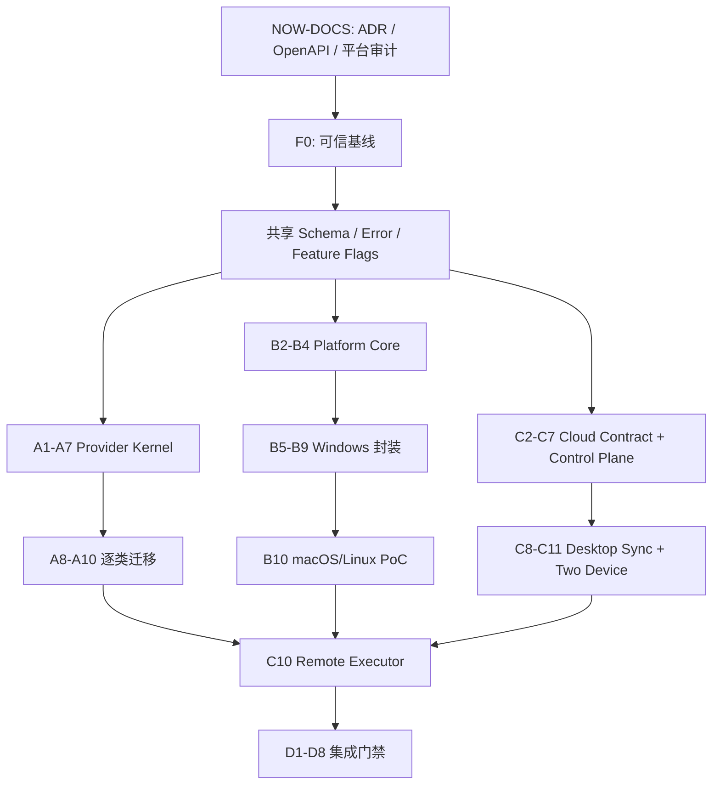

# PPT Video Workbench 三项 P2 平台基础能力逐项实施计划

> 本计划覆盖多供应商适配平台、跨平台基础层和云端协作控制面契约。当前根工作区存在多个活动窗口和大量未归档变更；除文档、隔离原型和只读审计外，不得直接在该根目录实施。正式代码必须在可信基线冻结后，从同一提交创建独立 worktree。

**Goal:** 交付统一 Provider Kernel、可测试的 `PlatformServices`、Windows 兼容封装、macOS/Linux PoC，以及独立云端控制面和双设备同步原型；保持现有本地单用户流程默认行为不变。

**Design:** `docs/superpowers/specs/2026-08-11-three-p2-platform-foundations-design.md`

**Tech Stack:** Python 3.12、FastAPI、Pydantic 2、SQLAlchemy/SQLite WAL、React 19、TypeScript、TanStack Query、Vitest/Playwright、Remotion、FFmpeg/FFprobe、HTTPX；云端原型建议 PostgreSQL、S3 兼容对象存储、OpenAPI 3.1、OIDC/OAuth 2.1 PKCE；需要本地进程隔离时优先使用 Rust 或受控 Python helper。

## 1. 执行等级

| 等级           | 含义                                                          | 当前是否允许              |
| -------------- | ------------------------------------------------------------- | ------------------------- |
| NOW-DOCS       | ADR、威胁模型、OpenAPI/Schema 草案、平台审计、fixture 设计    | 允许，仅新增隔离文件      |
| AFTER-F0       | Provider Kernel、PlatformServices、Windows 封装、云端原型代码 | 可信基线冻结后允许        |
| AFTER-UPSTREAM | 修改现有 LLM/TTS/ASR/OCR/渲染、更新、时间线和任务主链         | 对应上游窗口合并后允许    |
| FUTURE         | 生产云、多区域、企业 SSO、完整三平台发行、远程渲染规模化      | 各 MVP 门禁通过后另立计划 |

## 2. 全局实施约束

- [ ] 当前质量、最终渲染、特效模板、时间线、Windows 构建和恢复窗口形成明确提交或独立停点。
- [ ] 登记当前根目录所有 tracked/untracked 变更来源，不执行 `reset --hard`、`clean`、批量覆盖或目录复制合并。
- [ ] 所有实施 worktree 从同一个 foundation commit 创建，每条线使用独立分支和文件责任表。
- [ ] Provider、Platform、Cloud 公共 schema 在 foundation 阶段串行冻结，后续只能通过兼容 minor 变更演进。
- [ ] 本地默认路径不访问网络、不要求账号、不改变现有项目输出。
- [ ] 所有外部调用有 operation ID、幂等键、超时、取消、预算和结构化错误。
- [ ] 所有新持久化使用相对路径、临时文件、fsync、校验和原子发布。
- [ ] 任何凭证只以 `credential_ref` 出现在领域对象中，日志、项目包、同步对象和测试 fixture 不得出现真实密钥。
- [ ] 任何云端对象必须携带 tenant ownership；任何对象存储 URL 必须短寿命且绑定范围。
- [ ] 任何平台进程调用使用参数数组，禁止新增 shell 字符串拼接。
- [ ] 每个任务先写失败测试，再实现，再跑相邻回归；真实付费/三平台/双设备证据与 fake 测试分开记录。

## 3. 分支与 worktree 建议

| 实施线          | 建议分支                              | 主要责任                                         |
| --------------- | ------------------------------------- | ------------------------------------------------ |
| Foundation      | `codex/p2-platform-foundation`        | 公共 schema、错误、operation context、契约测试   |
| Provider        | `codex/provider-platform`             | provider registry、broker、policy、adapters、UI  |
| Platform        | `codex/platform-services`             | 平台审计、协议、Windows/macOS/Linux 适配、CI     |
| Cloud contracts | `codex/cloud-collaboration-contracts` | ADR、OpenAPI、模型、威胁测试                     |
| Cloud prototype | `codex/cloud-collaboration-prototype` | 独立控制面、对象、同步、executor 原型            |
| Integration     | `codex/p2-platform-integration`       | composition root、feature flags、E2E、文档、发布 |

云端生产服务建议最终迁移到独立仓库；在本仓库中的原型只验证协议和桌面兼容，不能直接当作生产部署。

## 4. 文件责任总图

### 4.1 Foundation

- Create: `schemas/operation-context-v1.schema.json`
- Create: `schemas/provider-descriptor-v1.schema.json`
- Create: `schemas/provider-invocation-v1.schema.json`
- Create: `schemas/platform-capability-v1.schema.json`
- Create: `schemas/cloud-project-revision-v1.schema.json`
- Create: `schemas/cloud-sync-operation-v1.schema.json`
- Create: `packages/contracts/p2-platform/`
- Create: `tests/contract/test_p2_platform_contracts.py`
- Modify after F0: contract export tooling and OpenAPI snapshots.

### 4.2 Provider

- Create: `apps/api/src/workbench/providers/`
- Create: `apps/api/src/workbench/api/providers.py`
- Create: `apps/web/src/features/providers/`
- Create: `tests/unit/providers/`
- Create: `tests/integration/test_provider_routes.py`
- Create: `tests/fixtures/providers/`
- Modify after upstream: narration、audio、asr、ocr、HeyGen、render services composition wiring.

### 4.3 Platform

- Create: `apps/api/src/workbench/platform/`
- Create: `apps/api/src/workbench/api/platform.py`
- Create: `apps/web/src/features/settings/platform/`
- Create: `tests/unit/platform/`
- Create: `tests/platform/`
- Modify after upstream: runtime layout、process runner、office renderer、launcher、installer、secure updater.

### 4.4 Cloud contracts/prototype

- Create: `schemas/cloud/`
- Create: `docs/adr/cloud/`
- Create: `cloud-prototype/`
- Create: `apps/api/src/workbench/sync/` only after contract prototype passes.
- Create: `apps/web/src/features/cloud/` only after desktop sync skeleton exists.
- Create: `tests/cloud/` and `tests/integration/test_sync_client.py`.

---

## Phase 0：可信基线与共享契约

### Task 0.1：登记并冻结可信实现基线

**Execution:** AFTER-F0 prerequisite  
**Depends on:** 当前所有相关窗口完成或给出可审查停点。

- [ ] 记录恢复根仓库、正式主仓库、特效 worktree 和各活动分支的 HEAD。
- [ ] 生成变更来源表，确认没有两个窗口负责同一权威文件。
- [ ] 完成 Python、Ruff、mypy、Web、Remotion、Playwright 和 Windows release 基线。
- [ ] 固定 8 页、50 页、真人、竖屏和质量检测样本的输出 hash/时长/问题报告。
- [ ] 将证据写入 `docs/acceptance/p2-platform-baseline.md`。
- [ ] 创建 foundation worktree 和分支。

**Gate:** 工作树来源不明、测试假绿、Windows 构建不稳定或长视频时长错误未收口时停止。

### Task 0.2：编写共享 ADR

**Execution:** NOW-DOCS  
**Files:** `docs/adr/p2-platform/`

- [ ] ADR-001：local-first 与云端可选原则。
- [ ] ADR-002：Provider adapter 信任和禁止动态代码执行。
- [ ] ADR-003：operation ID、幂等键和 attempt ID 的区别。
- [ ] ADR-004：规范化 JSON、hash 和版本兼容。
- [ ] ADR-005：内容对象与本地逻辑路径。
- [ ] ADR-006：云端 operation log + immutable revision。
- [ ] ADR-007：PlatformServices composition root。

**Tests:** Markdown link/format check；ADR 状态和 supersedes 字段检查。  
**Commit:** `docs: record p2 platform architecture decisions`

### Task 0.3：冻结共享 schema 命名与版本

**Execution:** AFTER-F0  
**Depends on:** Task 0.1、0.2。

- [ ] 先写非法绝对路径、未知字段、错误版本、非法 hash、NaN 和时间格式的失败契约测试。
- [ ] 实现 `OperationContextV1`、预算、结构化错误和逻辑资源引用。
- [ ] 实现 Provider、Platform、Cloud revision 和 sync operation 的外层 schema。
- [ ] 生成 Python Pydantic、JSON Schema 和 TypeScript 快照。
- [ ] 增加 Python/TypeScript 规范化 JSON golden fixtures。
- [ ] 增加向前兼容 minor 和拒绝未知 major 测试。

**Gate:** 三语言 hash 和 schema 语义一致；无绝对路径、凭证和任意扩展字典。  
**Commit:** `feat: define shared p2 platform contracts`

### Task 0.4：统一错误与审计事件

**Execution:** AFTER-F0

- [ ] 定义 Provider、Platform、Sync、Cloud、Executor 错误类别。
- [ ] 定义 retryable、failover_allowed、user_action 和 safe_details。
- [ ] 建立日志脱敏测试：API Key、Authorization、Cookie、token、正文、绝对路径零命中。
- [ ] 定义统一事件名称和低基数指标标签。
- [ ] 为现有错误提供兼容映射表，不立即改写旧业务错误。

**Gate:** 所有公共错误可序列化、可本地化、无原始异常泄露。  
**Commit:** `feat: add p2 platform errors and audit events`

### Task 0.5：冻结 feature flags 与回退矩阵

**Execution:** AFTER-F0

- [ ] 增加 `PROVIDER_PLATFORM_ENABLED`、`PLATFORM_SERVICES_ENABLED`、`CLOUD_SYNC_ENABLED`。
- [ ] 默认全部关闭；关闭状态不得创建网络请求或新数据库。
- [ ] 记录旧路径、新路径、回退开关和最短保留周期。
- [ ] 写参数化测试证明每个 flag 独立关闭时本地项目仍可工作。

**Foundation Gate:** Task 0.1-0.5 全部通过后冻结 foundation commit；Provider、Platform 和 Cloud contracts 才可并行。

---

## Phase A：多供应商适配平台

### Task A1：Provider 领域模型与静态 registry

**Execution:** AFTER-F0  
**Depends on:** Foundation Gate。

- [ ] 创建严格 `ProviderDescriptorV1`、capability、health、price book 和 credential schema 模型。
- [ ] registry 首版只读取内置受控描述；未知 Provider、重复 ID 和不兼容版本失败。
- [ ] registry 加载失败隔离到单个 Provider，不阻止应用启动。
- [ ] 为六类 Provider 建立 fake descriptors 和 golden fixtures。

**Tests:** registry 重建、重复、禁用、不兼容、损坏文件、路径安全。  
**Commit:** `feat: add provider registry and descriptors`

### Task A2：Provider adapter 协议和 fake providers

**Execution:** AFTER-F0

- [ ] 定义 `probe`、`estimate`、`invoke`、`cancel`、`normalize_error` 协议。
- [ ] 明确同步、异步、流式和长任务适配边界。
- [ ] 实现六类 deterministic fake Provider，支持注入延迟、429、超时、非法响应和未知付费状态。
- [ ] 验证 adapter 不能读取项目根以外文件或返回绝对路径。

**Gate:** fake Provider 可驱动完整 broker 测试而不依赖网络。  
**Commit:** `feat: define provider adapters and deterministic fakes`

### Task A3：能力探测与健康缓存

**Execution:** AFTER-F0

- [ ] 实现 static、health、sample 三层探测。
- [ ] 增加 TTL、退避、手工刷新和并发去重。
- [ ] 探测不提交用户正文；sample 必须明确确认是否计费。
- [ ] 保存安全能力快照，不保存完整供应商响应。
- [ ] API 支持 ETag/304，避免设置页反复探测。

**Tests:** 离线、认证失败、429、过期、恢复、并发刷新和 sample 费用标记。  
**Commit:** `feat: probe and cache provider capabilities`

### Task A4：凭证引用与系统凭证库协议

**Execution:** AFTER-F0  
**Depends on:** Platform Task B4 可先提供 fake credential service。

- [ ] 建立 credential metadata 和 `credential_ref`，项目/Provider policy 不存明文。
- [ ] 实现内存 fake store 与日志扫描测试。
- [ ] API 只返回存在性、更新时间和 scope，不回传密钥。
- [ ] 支持验证、轮换、删除和设备撤销。
- [ ] 删除凭证时受影响 Provider 变 degraded，不删除项目。

**Gate:** 项目包、诊断包、OpenAPI 示例和数据库 dump 无真实凭证。  
**Commit:** `feat: add provider credential references`

### Task A5：费用估算、预算和限流

**Execution:** AFTER-F0

- [ ] 实现版本化 price book 和币种 Decimal 计算。
- [ ] 预算支持 invocation/project/day/organization 四级组合。
- [ ] 实现 soft confirm、hard block 和估算误差说明。
- [ ] 实现 Provider/credential/capability token bucket 和 `Retry-After`。
- [ ] retry/failover 共用总尝试次数和预算。

**Tests:** 价格版本、舍入、并发扣减、预算竞争、429、重启恢复和时钟漂移。  
**Commit:** `feat: enforce provider cost budgets and rate limits`

### Task A6：路由策略与安全失败切换

**Execution:** AFTER-F0

- [ ] 实现 capability、语言、区域、隐私、模型、健康、费用和质量过滤。
- [ ] 支持用户固定、项目策略、组织策略和 local-first 默认。
- [ ] 输出候选决策证据，不包含输入正文。
- [ ] 实现允许/禁止 failover 矩阵。
- [ ] 未知付费状态、区域扩大、预算提升和人工锁定场景必须阻断自动切换。

**Tests:** 至少 40 组策略矩阵；同输入决策确定性；策略升级失效。  
**Commit:** `feat: route provider calls with safe failover`

### Task A7：Provider 缓存与工件发布

**Execution:** AFTER-F0

- [ ] 实现包含 Provider/model/adapter/参数/区域/input/output schema 的 cache identity。
- [ ] 增加内容 hash、大小、schema、项目归属和 staging 校验。
- [ ] 区分 deterministic、seeded 和 non-cacheable 调用。
- [ ] 增加引用保护和清理计划，不删除活动任务输入。
- [ ] 缓存命中返回相同规范化结果并产生非计费审计事件。

**Tests:** 跨 Provider 隔离、模型升级、参数排序、租户差异、损坏缓存和并发发布。  
**Commit:** `feat: cache provider results by complete identity`

### Task A8：迁移 LLM 与 ASR

**Execution:** AFTER-UPSTREAM  
**Depends on:** 旁白、字幕、真人 ASR 上游收口；A1-A7。

- [ ] 用 adapter 包装现有 `CompletionClient` 和本地 LLM 客户端。
- [ ] 用 adapter 包装 `TranscriptionBackend` 和 presenter ASR。
- [ ] 保持旧业务服务签名，由 feature flag 选择 broker。
- [ ] 对比旧/新输出、错误、缓存和重启恢复。
- [ ] 增加一个远程 fake 和一个本地实现，证明双实现能力。

**Gate:** 关闭 flag 输出基线不变；开启时旁白/ASR E2E 通过。  
**Commit:** `feat: route llm and asr through provider broker`

### Task A9：迁移 TTS、数字人与 OCR

**Execution:** AFTER-UPSTREAM

- [ ] 包装本地 TTS 和 HeyGen 语音/数字人调用。
- [ ] 付费请求 checkpoint 与 Provider 幂等键对齐。
- [ ] 包装 OCR 本地运行时并声明语言、GPU 和文件上限能力。
- [ ] Provider 切换触发正确依赖失效，不覆盖已锁定人工结果。
- [ ] 真实 HeyGen/供应商小额测试独立签署，不进入默认 CI。

**Gate:** 429、断网、重启和未知结果不会重复付费。  
**Commit:** `feat: adapt tts avatar and ocr providers`

### Task A10：迁移 renderer Provider

**Execution:** AFTER-UPSTREAM  
**Depends on:** 最终渲染、时间线、跨平台 B5-B7 收口。

- [ ] 包装 Pillow、Remotion、PowerPoint、LibreOffice 和远程 renderer 描述。
- [ ] capability 包含 OS、架构、Office、GPU、编码器、画幅和最大资源。
- [ ] renderer cache identity 包含字体、平台、runtime 和硬件路径。
- [ ] 保留旧 `PageRenderer` 兼容 adapter 一个版本周期。
- [ ] 不允许从远程 registry 下载 renderer 代码到主进程。

**Gate:** 8 页/50 页/竖屏/真人项目旧新输出在允许误差内。  
**Commit:** `feat: expose renderers through provider platform`

### Task A11：Provider API、设置界面与诊断

**Execution:** AFTER-F0

- [ ] 实现 provider list、capabilities、probe、estimate、health、policy、usage API。
- [ ] 设置页支持筛选、凭证状态、健康、费用和隐私区域。
- [ ] 项目页支持候选预览、固定 Provider 和预算提示。
- [ ] 覆盖 loading/empty/error/offline/degraded/confirm/blocked。
- [ ] 增加诊断导出和敏感信息零命中门禁。

**Provider Gate:** A1-A11、真实小额证据和所有上游回归通过。

---

## Phase B：跨平台基础层

### Task B1：平台绑定点审计

**Execution:** NOW-DOCS

- [ ] 使用 `rg` 和静态检查枚举 Windows、PowerShell、Inno、Office、PyInstaller、路径、锁、进程和凭证使用点。
- [ ] 按“业务必需/可封装/可替换/平台独占/测试独占”分类。
- [ ] 建立文件责任表和迁移批次，不批量机械替换。
- [ ] 记录现有 8 页、50 页和安装运行行为作为 Windows 语义基线。
- [ ] 输出 `docs/platform/platform-dependency-audit.md`。

**Gate:** 每个绑定点有 owner、目标协议、测试和降级策略。  
**Commit:** `docs: audit platform-specific dependencies`

### Task B2：PlatformCapabilitySnapshot 契约

**Execution:** AFTER-F0

- [ ] 定义 OS、架构、文件系统、凭证库、Office、浏览器、媒体、GPU、安装和更新能力。
- [ ] 区分 unsupported、missing、misconfigured、temporarily_unavailable。
- [ ] 快照不包含用户名、绝对路径、序列号和完整软件清单。
- [ ] 增加稳定 hash 和过期规则。

**Tests:** 三平台 golden fixtures、未知能力、升级兼容和隐私扫描。  
**Commit:** `feat: define platform capability snapshots`

### Task B3：路径与原子文件服务

**Execution:** AFTER-F0

- [ ] 建立逻辑目录和平台解析。
- [ ] 封装 containment、相对路径、临时文件、fsync、同卷原子替换和受控跨卷发布。
- [ ] Windows 覆盖长路径、UNC、ADS、设备名、重解析点；Unix 覆盖符号链接、权限和大小写碰撞。
- [ ] 将新模块全部接入协议，旧模块暂不批量迁移。

**Tests:** Unicode、长路径、锁、磁盘满、只读、跨卷、崩溃中断和恢复。  
**Commit:** `feat: add cross-platform atomic file services`

### Task B4：系统凭证库服务

**Execution:** AFTER-F0

- [ ] 定义 get/set/delete/list-metadata，不提供 list-secrets。
- [ ] 实现 Windows adapter 和 deterministic fake。
- [ ] 实现 macOS Keychain、Linux Secret Service PoC。
- [ ] 缺少 Linux 服务时默认阻断持久凭证，受保护文件后备必须显式开启。
- [ ] 增加设备撤销和 token 清理。

**Gate:** 明文凭证不进入日志、项目、同步对象、crash dump 和测试报告。  
**Commit:** `feat: add platform credential stores`

### Task B5：进程、取消和子进程清理

**Execution:** AFTER-UPSTREAM  
**Depends on:** 当前 render/process runner 收口。

- [ ] 定义参数数组、环境白名单、cwd、输出预算、超时、进程组和取消协议。
- [ ] Windows 用 Job Object 或等价受控实现；Unix 用 process group。
- [ ] 区分协作取消和强制终止，强杀后生成恢复状态。
- [ ] 包装 Remotion/FFmpeg/FFprobe/Office 子进程，不按进程名批量终止。
- [ ] 保留旧 runner adapter 直到回归完成。

**Tests:** 子进程、输出洪泛、编码、超时、取消、强杀、重启和用户已有进程保护。  
**Commit:** `feat: unify cross-platform process control`

### Task B6：工具发现和运行时布局

**Execution:** AFTER-UPSTREAM

- [ ] 发现捆绑 runtime 和受支持系统安装，拒绝任意 PATH 未知版本。
- [ ] 返回路径引用、版本、来源、hash/签名、架构和能力。
- [ ] 分离 Remotion 浏览器、普通预览浏览器和 Playwright 测试浏览器。
- [ ] 字体清单、浏览器和 runtime 版本进入渲染 fingerprint。
- [ ] API/诊断提供可执行修复动作。

**Gate:** 工具缺失不导致应用启动崩溃；依赖任务得到稳定阻断。  
**Commit:** `feat: discover platform runtimes and tools`

### Task B7：媒体和硬件编码适配

**Execution:** AFTER-UPSTREAM

- [ ] 探测 FFmpeg 编码器、GPU、驱动和最大并发。
- [ ] 实现软件编码基线和一次安全硬件降级。
- [ ] 不因探测到编码器名称就假定可用，使用固定短样本验证。
- [ ] 编码路径、像素格式和音频策略进入 runtime fingerprint。
- [ ] 记录性能和输出差异，不静默改变质量预设。

**Tests:** fake GPU、驱动失败、设备忙、软件回退、取消、长视频时长。  
**Commit:** `feat: add portable media runtime capabilities`

### Task B8：Office/LibreOffice 渲染适配

**Execution:** AFTER-UPSTREAM

- [ ] 将 PowerPoint COM 现状封装为 Windows adapter，输出保持不变。
- [ ] 建立 LibreOffice adapter 的三平台探测、隔离副本和超时。
- [ ] 定义静态图片/PDF 最终降级和高保真阻断条件。
- [ ] 禁止宏、外部链接、ActiveX、OLE 和任意网络。
- [ ] renderer/platform/font/version 进入缓存身份。

**Gate:** Windows PowerPoint 基线无回归；macOS/Linux 有明确静态路径。  
**Commit:** `feat: abstract office rendering by platform`

### Task B9：Windows 现状迁移门禁

**Execution:** AFTER-UPSTREAM

- [ ] 逐模块切换到 PlatformServices，每次只迁移一种能力。
- [ ] 对比项目创建、材料导入、预览、渲染、制作包、诊断、更新和关闭。
- [ ] 对比输出 hash/关键帧/时长/错误码和进程清理。
- [ ] 保留兼容开关一个小版本周期。

**Gate:** Windows 关闭/开启 PlatformServices 的基线输出一致。  
**Commit:** `refactor: route windows runtime through platform services`

### Task B10：macOS/Linux 应用 PoC

**Execution:** AFTER B2-B9

- [ ] 在干净 macOS 和 Linux 环境安装依赖并创建项目。
- [ ] 打开无 Office 项目，完成图片/PDF、旁白、字幕、预览和软件编码导出。
- [ ] PowerPoint-only 能力显示明确降级，不修改项目 revision。
- [ ] 验证 Keychain/Secret Service、Unicode 路径、进程取消和诊断。
- [ ] 记录功能矩阵和不可用项，不宣称完整对等。

**Gate:** 两个平台均完成真实 8 页 MP4，不以 Linux CI 代替 macOS。  
**Commit:** `feat: prove macos and linux desktop runtime`

### Task B11：三平台安装、更新和 CI

**Execution:** FUTURE after PoC

- [ ] Windows 保持 Inno/更新助手；macOS 建立签名/notarized app bundle；Linux 选择 AppImage 或受控包策略。
- [ ] 共用 signed metadata，目标按 OS/arch 分离。
- [ ] 每平台执行首次安装、升级、回滚、卸载保留数据和损坏包阻断。
- [ ] CI 运行契约/单元；真实签名和 GUI 安装证据在受控 runner 生成。

**Platform Gate:** B1-B11 完成，能力矩阵和发布说明准确。

---

## Phase C：云端协作控制面契约与原型

### Task C1：云端 ADR、数据分类和威胁模型

**Execution:** NOW-DOCS

- [ ] 定义控制面、对象存储、远程 executor 和桌面 sync client 信任边界。
- [ ] 定义 public/internal/sensitive/restricted 数据和默认上传策略。
- [ ] 完成 STRIDE：租户越权、IDOR、token、对象 URL、恶意 executor、重放和删除恢复。
- [ ] 记录数据驻留、保留、导出和删除接口要求。
- [ ] 明确云端不可用时本地功能边界。

**Commit:** `docs: define cloud collaboration trust boundaries`

### Task C2：Cloud OpenAPI 3.1 与 schema

**Execution:** NOW-DOCS then AFTER-F0 contract tests

- [ ] 定义 User、Organization、Workspace、Membership、Device、ServiceAccount。
- [ ] 定义 Project、Revision、Operation、ObjectRef、Comment、Review、Lease、Job、Executor。
- [ ] 所有 mutation 使用 idempotency key 和 base revision。
- [ ] 所有列表定义稳定排序、游标、过滤和 ownership 404。
- [ ] 错误 schema 与 Foundation 统一。
- [ ] 生成 mock server 和 TypeScript client，仅用于契约测试。

**Gate:** OpenAPI lint、breaking change、RBAC coverage 和示例隐私检查通过。  
**Commit:** `feat: define cloud collaboration openapi`

### Task C3：独立控制面骨架

**Execution:** AFTER-F0  
**Files:** `cloud-prototype/`

- [ ] 独立应用、配置、数据库迁移、健康检查和测试 fixture。
- [ ] PostgreSQL 表全部带 organization/workspace ownership。
- [ ] 开发认证只在测试环境；生产接口预留 OIDC issuer/audience 校验。
- [ ] 日志统一 operation ID，不记录正文/token。
- [ ] Docker/本地启动只作为原型，不自动接入桌面程序。

**Tests:** migration、health、配置失败、租户 fixture 和日志扫描。  
**Commit:** `feat: scaffold isolated cloud control plane`

### Task C4：身份、组织和 RBAC

**Execution:** AFTER-F0

- [ ] 实现 user、organization、workspace、membership 和 service account。
- [ ] 服务端逐操作授权；资源不存在和无权限统一 ownership 404。
- [ ] 实现角色矩阵和管理员覆盖审计。
- [ ] 设备注册、撤销和短寿命 access token 元数据。

**Security tests:** 横向/纵向越权、IDOR、成员移除、过期 token、设备撤销。  
**Commit:** `feat: enforce cloud tenant rbac`

### Task C5：项目 revision 和内容对象元数据

**Execution:** AFTER-F0

- [ ] 实现不可变 revision、parent、sequence、content hash 和 current pointer。
- [ ] 规范化本地 manifest，移除绝对路径、临时字段和 credential details。
- [ ] 实现 object hash/size/media type 元数据和项目引用授权。
- [ ] 相同 hash 可物理去重，但下载授权按项目/组织判断。
- [ ] current pointer 使用 expected revision，冲突返回结构化差异。

**Tests:** 重复、并发、跨租户 hash、损坏 manifest、删除/恢复。  
**Commit:** `feat: store immutable cloud project revisions`

### Task C6：分片对象上传、下载与扫描

**Execution:** AFTER-F0

- [ ] plan-upload 返回缺失 chunk/object 和短寿命 URL。
- [ ] complete-upload 验证大小/hash/类型/容器/恶意内容结果。
- [ ] plan-download 绑定 actor、project、object、scope 和过期时间。
- [ ] 支持断点、并发限制、重试和客户端内容缓存。
- [ ] restricted 类型默认阻断上传。

**Tests:** 截断、hash 错、URL 重放、过期、越权、压缩炸弹、超大媒体。  
**Commit:** `feat: transfer validated cloud project objects`

### Task C7：operation log 与同步游标

**Execution:** AFTER-F0

- [ ] 定义可重放操作及其 base revision、operation ID 和 actor。
- [ ] batch 提交原子验证；重复 operation 返回既有结果。
- [ ] 服务端产生单调 workspace/project cursor。
- [ ] pull 支持分页、断点和 tombstone。
- [ ] 建立可自动合并/必须人工冲突矩阵。

**Tests:** 重复、乱序、分页、并发、游标恢复、删除与编辑冲突。  
**Commit:** `feat: sync project operations with immutable cursors`

### Task C8：桌面 sync client outbox/inbox

**Execution:** AFTER-UPSTREAM  
**Depends on:** 项目、时间线 schema 稳定；C2-C7。

- [ ] 建立独立 SQLite WAL outbox/inbox，不写入 project.json 正文。
- [ ] 本地成功先入 outbox；云端确认后推进 cursor。
- [ ] token 过期、断网和服务端 5xx 不删除未确认操作。
- [ ] 下载对象先 staging/hash/schema 验证，再发布项目引用。
- [ ] UI 展示 local_only/syncing/synced/conflict。
- [ ] feature flag 关闭时不创建 DB、不发网络请求。

**Gate:** 未登录和 flag 关闭的本地回归完全一致。  
**Commit:** `feat: add optional desktop sync client`

### Task C9：评论、审核和租约锁

**Execution:** AFTER C7-C8

- [ ] 评论 anchor 支持字段、page、clip、时间范围和 evidence。
- [ ] ReviewDecision 绑定 revision/content hash；内容变化自动过期。
- [ ] lease 包含 scope、holder、base revision、TTL 和续租。
- [ ] 离线操作不能伪造持有 lease；上线后按冲突处理。
- [ ] 管理员强制解锁/覆盖必须填写原因并审计。

**Tests:** anchor 失效、审核过期、租约竞争、超时、强制解锁和越权。  
**Commit:** `feat: collaborate with comments reviews and leases`

### Task C10：远程 job 与 executor 契约

**Execution:** AFTER Provider A1-A7 and Platform B2-B7

- [ ] job 输入绑定项目 revision、Provider policy、runtime image 和 capability labels。
- [ ] executor 注册 OS/GPU/Office/区域能力和健康 TTL。
- [ ] lease/attempt/idempotency 防止重复执行和重复结果发布。
- [ ] 短寿命最小权限 token 只允许读取任务输入和写 attempt staging。
- [ ] 结果完成 hash/schema/media/ownership 校验后才发布。
- [ ] 首版只运行内置任务，不执行任意用户脚本/插件。

**Tests:** lease 过期、executor 崩溃、重复完成、恶意结果、取消、区域调度。  
**Commit:** `feat: schedule remote jobs by executor capabilities`

### Task C11：双设备离线同步原型

**Execution:** AFTER C8-C10

- [ ] 两个隔离桌面实例登录同一测试组织。
- [ ] A 上传项目，B 拉取并打开；断网后双方编辑不同对象可自动合并。
- [ ] 双方修改同一 clip/资产产生结构化冲突并人工解决。
- [ ] 评论、审核、租约、成员撤销和设备撤销闭环。
- [ ] 大对象断点、应用崩溃、服务端重启后恢复。

**Gate:** 不丢操作、不跨租户、不产生假同步状态。  
**Commit:** `test: prove offline two-device collaboration`

### Task C12：云端安全、备份和数据生命周期

**Execution:** FUTURE before production

- [ ] 数据库 PITR、对象版本、删除保留期、恢复演练。
- [ ] 用户/组织导出、项目删除、账号删除和审计保留策略。
- [ ] 密钥轮换、token 撤销、依赖扫描、SAST/DAST 和渗透测试。
- [ ] 数据驻留和区域路由门禁。
- [ ] 生产告警、SLO、容量和成本预算。

**Cloud Contract/MVP Gate:** C1-C11 通过；C12 是生产发布前硬门禁。

---

## Phase D：三项目集成

### Task D1：统一 composition root

**Depends on:** Provider Gate、Platform B9、Cloud C8。

- [ ] 应用启动按平台创建 `PlatformServices`。
- [ ] Provider Broker 只通过 PlatformServices 获取凭证、进程和工具。
- [ ] Sync Client 只通过逻辑对象和 OperationContext 调用云端。
- [ ] feature flag 独立组合，任何一项关闭不影响其他项。

**Commit:** `feat: compose provider platform and optional cloud sync`

### Task D2：远程 executor 使用统一 Provider/Platform 契约

- [ ] executor capability snapshot 与桌面 schema 相同。
- [ ] executor 只加载内置/签名 adapter，不接受任务携带代码。
- [ ] Provider 费用和区域策略在排队与执行前双重验证。
- [ ] 结果记录 provider/runtime/platform/input fingerprint。

**Commit:** `feat: execute cloud jobs with platform provider contracts`

### Task D3：共同失效和缓存矩阵

- [ ] Provider/model/price/policy、平台/runtime/font、云端 revision 的变化分别定义失效范围。
- [ ] 价格变化不删除内容缓存；模型/adapter/输入变化必须失效结果。
- [ ] 平台能力变化只失效受影响 renderer/媒体结果。
- [ ] 云端评论/审核不失效视频缓存；内容 revision 变化精确失效。

**Tests:** 参数化矩阵与现有 dependency graph 回归。  
**Commit:** `feat: invalidate p2 platform artifacts precisely`

### Task D4：统一诊断与隐私扫描

- [ ] 诊断中心加入 Provider、Platform、Sync、Cloud、Executor 探针。
- [ ] 支持用户选择性导出安全摘要。
- [ ] 自动扫描 API Key、token、Authorization、Cookie、正文、绝对路径、用户邮箱。
- [ ] 低基数指标和 operation ID 可关联本地/云端事件。

**Commit:** `feat: diagnose p2 platform without sensitive data`

### Task D5：本地兼容与迁移

- [ ] 旧项目确定性生成 local-first Provider policy，但不强制写回。
- [ ] 未登录项目不创建 cloud 字段；登录后显式选择项目上传。
- [ ] 平台 capability report 作为派生记录，不修改项目内容 revision。
- [ ] 回退旧版本时保留新旁路数据，不执行破坏性数据库降级。

**Commit:** `feat: migrate p2 platform state additively`

### Task D6：端到端场景

- [ ] Windows 本地：旧路径关闭所有新 flag，输出与基线一致。
- [ ] Windows Provider：LLM/ASR/TTS 双实现、预算、429、failover、缓存和恢复。
- [ ] macOS/Linux：无 Office 项目创建、预览、软件编码导出。
- [ ] 云端：双设备项目、评论、审核、冲突、对象断点和撤销。
- [ ] 远程：能力调度、executor 崩溃、重新领取、结果校验和费用记录。
- [ ] 综合：跨平台设备同步同一项目，远程执行后本地拉取候选工件。

### Task D7：性能与资源门禁

- [ ] Provider Broker 额外开销、探测频率、缓存命中和策略决策预算。
- [ ] PlatformServices 封装对 8 页/50 页渲染耗时和峰值内存影响。
- [ ] 同步千素材、长离线 outbox 和大 revision 拉取性能。
- [ ] executor 调度延迟、对象传输和结果发布性能。

### Task D8：文档与发布

- [ ] 用户手册：Provider 选择、预算、隐私、凭证、平台降级、云端状态和冲突。
- [ ] 管理手册：组织策略、区域、配额、executor、撤销和审计。
- [ ] 开发手册：新增 Provider、Platform adapter、Cloud API 兼容规则。
- [ ] 发布说明明确每平台成熟度和云端 beta 边界。
- [ ] 不把 fake Provider、CI 平台或单机 mock 冒充真实验收。

**Integration Gate:** D1-D8 通过后，Provider 和 PlatformServices 才可默认启用；Cloud Sync 仍需独立 beta 放量。

---

## 5. 推荐实际执行顺序

### 当前立即可执行

1. Task 0.2 共享 ADR。
2. Task B1 平台绑定点审计。
3. Task C1 云端威胁模型。
4. Task C2 OpenAPI/schema 草案的文档部分。
5. 为 Provider/Platform/Cloud 准备不接主程序的 golden fixtures 和失败测试清单。

### 当前禁止执行

1. 修改现有 narration、ASR、HeyGen、OCR、render service 接线。
2. 修改当前特效模板、质量、时间线、最终渲染和 Windows 构建文件。
3. 在恢复根目录新建数据库迁移或启动云端后台服务。
4. 将第三方 Provider/插件代码动态载入主程序。
5. 上传现有用户项目、素材、旁白、密钥或恢复包到云端原型。

## 6. 工期与并行配置

| 阶段             | 单人周 | 可并行人数 | 关键依赖                   |
| ---------------- | -----: | ---------: | -------------------------- |
| Phase 0          |    2-4 |        1-2 | 当前窗口收口、Windows 基线 |
| Provider A1-A7   |    3-5 |          2 | Foundation                 |
| Provider A8-A11  |    4-7 |          2 | 各业务上游收口             |
| Platform B1-B9   |    5-9 |          2 | render/update/build 收口   |
| Platform B10-B11 |    3-5 |          2 | macOS/Linux/签名环境       |
| Cloud C1-C7      |   6-10 |        2-3 | Foundation、对象存储原型   |
| Cloud C8-C11     |   8-14 |          3 | 项目/时间线契约稳定        |
| Integration D    |    4-8 |          2 | 三条线各自 Gate            |

三条专业线可在 Foundation 后并行，但共享 schema 仍由单一 owner 串行管理。模板插件和模板市场不应占用本计划并行名额。

## 7. 最终验收清单

- [ ] 关闭所有新 feature flag 时，旧本地项目和基线输出不变。
- [ ] 六类 Provider 有统一 descriptor、probe、estimate、invoke、error、cache 和 audit 契约。
- [ ] 付费重试/失败切换不重复扣费，预算和区域策略不可绕过。
- [ ] 凭证不进入项目、日志、诊断、同步对象和制作包。
- [ ] Windows 行为完成 PlatformServices 封装且输出无回归。
- [ ] macOS/Linux PoC 均真实导出 MP4，并明确 Office/硬件能力降级。
- [ ] 云端 RBAC、租户隔离、revision、对象、评论、审核、lease 和 sync 协议通过安全测试。
- [ ] 双设备离线/上线、冲突、断点、撤销和恢复不丢数据。
- [ ] 远程 executor 只运行内置签名任务，结果经过 hash/schema/media/ownership 校验。
- [ ] 本地、云端和远程结果可追溯到同一项目 revision、Provider policy、平台和 runtime fingerprint。
- [ ] 用户手册、管理手册、开发接入手册、迁移和回退说明完整。
- [ ] 真实 Provider、三平台、双设备和远程 executor 证据分别签署；不以 mock 代替。
