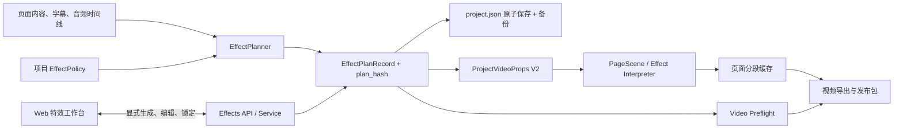

# 特效引擎 V2 接入视频主链设计文档

**状态：** 已批准，可进入实施  
**日期：** 2026-08-10  
**范围决策：** 本项目完成 EffectPlan V2 从规划、持久化、编辑、预检、Props、Remotion、缓存到导出验收的主链接入；异步渲染任务化另立项目，本设计只为其保留稳定边界。

## 1. 背景与现状证据

仓库已经有一套特效原型，但它尚未进入生产视频链：

- 根目录 `effects/` 与 `apps/api/src/effects/` 存在两套不一致的 Python schema。
- 单元测试主要导入根目录 `effects.*`，生产 `workbench` 服务没有消费 `EffectPlanV2`。
- `ProjectManifest`、`PageRecord` 与 `ProjectVideoProps` 均没有持久化或下发页面特效计划。
- Remotion 的 `effects/interpreter.tsx` 只登记了少量模板，并把 `effects[0].type` 错当作模板名。
- `ProjectVideo.tsx` 仍直接渲染固定的 `TechBoardTemplate`，没有页面级特效解释层。
- 视频分段缓存键未包含特效计划、目录版本、画幅或讲解员布局。
- Web 预览组件保留了特效控件接口，但工作流没有提供真实数据或保存能力。
- 当前导出仍是同步调用。任务 ID、进度、取消与恢复不属于本次范围。

因此，本项目不是“再做一个特效演示页”，而是建立单一权威契约，并让同一份计划贯穿所有生产环节。

## 2. 目标

1. 建立唯一的 Python `EffectPlanV2` 权威实现与可校验的 TypeScript 镜像。
2. 为每页持久化可追踪、可并发编辑、可失效判断的特效计划记录。
3. 由确定性规划器根据页面内容、字幕时间和项目策略产生可复现计划。
4. 让预检、预览、分段渲染、缓存和发布包消费完全相同的计划与哈希。
5. 在 Remotion 中完整登记 12 个用户模板及内部 `SafeSlide`，保证逐帧、可 seek、无网络依赖。
6. 提供 Web 端的自动生成、模板编辑、锁定、解锁、校验与冲突处理。
7. 兼容现有 `project.json`，不破坏已有页面、配音、字幕、旁白或预览文件。
8. 同时支持 16:9 与 9:16，并维持字幕与讲解员安全区。

## 3. 非目标

- 不在本项目中实现异步渲染队列、任务进度、取消、后台恢复或分布式 worker。
- 不引入大模型、外部地图、在线素材或付费服务参与特效规划。
- 不改写现有配音、字幕、旁白、页面正文和页面预览图。
- 不把任意 JSON 编辑器暴露给普通用户。
- 不实现跨页重叠式 `TransitionSeries`；当前分段渲染与音频时长要求页面总时长严格守恒。
- 不修复与特效主链无关的功能。

## 4. 方案选择

### 4.1 推荐方案：领域服务 + 显式 API + 共享契约

把特效能力收进 `workbench.effects` 领域包；项目清单持久化 `EffectPlanRecord`；API 提供显式生成和编辑操作；Props V2 下发完整计划；Remotion 只解释计划，不自行决策。

优点：

- 计划在预览与最终渲染间保持一致。
- 失效、缓存、回退与审计都有明确位置。
- Web 与 Remotion 不复制业务决策。
- 后续异步渲染可直接消费不可变的 Props 和计划哈希。

代价：需要同时修改 API、领域模型、Web 与 Remotion，并建立跨语言契约门禁。

### 4.2 未采用：仅在 Props 构建时临时生成计划

该方案改动较少，但计划无法被用户编辑或锁定，预览和渲染可能因输入变化产生不同结果，也无法可靠解释缓存命中。因此不采用。

### 4.3 未采用：前端选择模板，Remotion 自行补全参数

该方案把业务规则分散到浏览器和渲染器，服务端预检无法证明最终渲染有效，批处理与未来任务队列也无法复用。因此不采用。

## 5. 总体架构



### 5.1 单向责任边界

- `EffectPlanner`：只做确定性决策和 payload 构造。
- `EffectValidator`：只校验 schema、模板能力、时间、安全区和碰撞。
- `EffectService`：负责读取、生成、编辑、锁定、修订、失效与审计。
- `VideoPropsService`：把已持久化且有效的计划投影为 Props，不做隐式写入。
- `VideoPreflightService`：验证主链可渲染性，不修复用户数据。
- Remotion：逐帧解释合法 Props；不访问项目目录、不联网、不作模板选择。
- Web：提供结构化编辑器；服务端仍是最终权威。

## 6. 源码布局与单一权威

生产包统一为：

```text
apps/api/src/workbench/effects/
  __init__.py
  schema.py
  payloads.py
  catalog.py
  planner.py
  validator.py
  fingerprint.py
  service.py
  errors.py
```

同时：

- 删除生产代码对根目录 `effects/` 和 `apps/api/src/effects/` 的依赖。
- 现有原型测试迁移为导入 `workbench.effects`。
- 根目录重复包在所有引用迁移且测试通过后移除；若 Git 元数据仍损坏，只保留为待删除清单，不做不可追踪删除。
- `apps/api/pyproject.toml` 只发布 `workbench` 包。
- 从 Pydantic 模型生成并提交 `contracts/effect-plan-v2.schema.json`，TypeScript 以该快照做 parity 测试，不新增运行时 schema 生成依赖。

## 7. 核心领域契约

### 7.1 EffectPlanV2

现有 V2 缺少明确模板字段。本次在尚未进入生产持久化前完成契约校正，继续使用 `schema_version: "2.0"`：

```python
class EffectPlanV2(BaseModel):
    schema_version: Literal["2.0"] = "2.0"
    template: TemplateName
    template_payload: TemplatePayload
    cues: list[EffectCue]
    effects: list[EffectSpec]
    camera: CameraSpec
    transition: TransitionSpec
    background: BackgroundSpec
    presenter: PresenterSpec | None = None
    fallback: FallbackSpec
```

`TemplatePayload` 是按 `template` 判别并二次校验的联合类型。服务端拒绝模板与 payload 类型不匹配的计划。

### 7.2 EffectPlanRecord

```python
class EffectPlanRecord(BaseModel):
    revision: int = Field(ge=1)
    plan: EffectPlanV2
    plan_hash: str
    input_fingerprint: str
    source: Literal["automatic", "manual", "migrated", "fallback"]
    status: Literal["ready", "fallback", "stale", "invalid"]
    locked: bool = False
    decision_reasons: list[str] = []
    confidence: float = Field(ge=0, le=1)
    validation_codes: list[str] = []
    updated_at: datetime
```

规则：

- `plan_hash` 由服务端对规范化 JSON 做 SHA-256，客户端不得提交。
- `input_fingerprint` 覆盖所有会影响自动规划的输入。
- 每次成功修改 `revision + 1`。
- 客户端写入必须提供 `expected_revision`，不匹配返回 HTTP 409。
- `locked` 保护模板、payload、时间和视觉参数；自动生成永不覆盖锁定页。
- 锁定计划一旦 stale/invalid，预检阻断，不能静默回退。

### 7.3 项目策略

```python
class EffectProjectPolicy(BaseModel):
    aspect_ratio: Literal["16:9", "9:16"] = "16:9"
    default_strength: float = Field(default=0.65, ge=0, le=1)
    automatic_generation_enabled: bool = True
    catalog_version: str = "effect-catalog-v2"
    presenter_enabled: bool = False
    presenter_asset_id: str | None = None
    presenter_anchor: Literal["bottom-left", "bottom-right"] = "bottom-right"
```

`ProjectManifest.schema_version` 暂时保持 `1`，新增字段均有默认值：

```python
class PageRecord(BaseModel):
    # existing fields remain unchanged
    effect_plan: EffectPlanRecord | None = None


class ProjectManifest(BaseModel):
    # existing fields remain unchanged
    effect_policy: EffectProjectPolicy = Field(default_factory=EffectProjectPolicy)
```

这样旧项目读取无需破坏性迁移；只有显式特效写操作才落盘新字段。

## 8. 模板目录与 payload 约束

| 模板                | 用途         | 最小 payload 约束                   | 渲染说明                              |
| ------------------- | ------------ | ----------------------------------- | ------------------------------------- |
| `ProgressiveReveal` | 顺序揭示要点 | `items` 1–6 项                      | 按 cue 逐项进入                       |
| `ChapterCurtain`    | 章节转场     | 章节号、标题、palette               | 页内开场/收场，不跨页重叠             |
| `StatCounter`       | 数字强调     | label、start、end、format           | 帧驱动计数，reduced motion 直接到终值 |
| `ChartNarration`    | 数据叙述     | series 2–12、cue_points、annotation | SVG/DOM 图表，不加载网络资源          |
| `CompareMode`       | 双栏对比     | left、right                         | 普通 grid 布局，保留安全区            |
| `FocusSpotlight`    | 聚焦原页区域 | 目标矩形 1–3、label                 | 原页图为底层，遮罩聚焦                |
| `CardStack`         | 卡片编组     | cards 1–3                           | 逐帧位移和层级变化                    |
| `GaugeAndRatio`     | 比率/进度    | label、value 0–1                    | SVG gauge 或条形比率                  |
| `PathBuilder`       | 流程/路径    | nodes 2–6                           | 路径与节点按 cue 建立                 |
| `TagMatrix`         | 标签矩阵     | tags 2–15                           | flex/grid，自适应画幅                 |
| `RiskAlert`         | 风险提示     | title、reason                       | 高对比但不遮挡字幕                    |
| `MapHighlight`      | 地理点位表达 | points 1–5、conclusion              | 使用抽象内置地图背景，无网络地图      |
| `SafeSlide`         | 内部保底     | 可选 title、summary                 | 始终保留原页图与基础字幕              |

`NarrativePreview` 是工作台辅助视图，不是可持久化模板。

## 9. 确定性规划器

### 9.1 输入

- 页面标题、正文、结构化 spans 和提取结果。
- 页面匹配/大纲信息。
- 字幕 cue 内容、开始与结束时间。
- 音频时长与页面时间线。
- 画幅、默认强度、讲解员配置和目录版本。
- 当前记录的锁定状态。

### 9.2 决策顺序

1. 规范化输入并计算 `input_fingerprint`。
2. 锁定且 fingerprint 未变化：原样返回。
3. 锁定但 fingerprint 变化：标记 stale，不覆盖计划。
4. 未锁定且已有相同 fingerprint：复用记录，避免无意义 revision 增长。
5. 按内容特征与模板能力评分，固定 tie-break 顺序选择模板。
6. 从页面结构与字幕 cue 构造 typed payload 与时间点。
7. 做完整校验。
8. 校验失败时生成显式 `SafeSlide` 记录，保留失败码与原因。

规划器不得调用随机数、系统时间参与选择、外部 API 或大模型。相同规范化输入和目录版本必须生成相同的 `plan_hash`。

### 9.3 fingerprint 内容

fingerprint 至少包含：

- 页面 ID、标题、正文、结构化元素摘要。
- 字幕 cue 的文本与时间。
- 页面 timeline 时长与音频资产标识。
- 画幅、默认强度、讲解员配置。
- `catalog_version` 与 planner algorithm version。

不包含 `updated_at`、本地绝对路径或临时 URL。

## 10. 持久化、兼容与数据保护

- 所有写入经现有 `ProjectService` 与 `ManifestStore` 原子保存。
- 沿用 `project.json.bak` 备份机制；特效写操作的审计记录包含项目 ID、页 ID、旧/新 revision、旧/新 hash 和操作类型，不记录凭证。
- GET 接口绝不写 `project.json`。
- 初次打开旧项目只显示“待生成”，不自动修改项目。
- Workflow 在用户进入特效步骤或启动视频预检前，显式调用批量生成未锁定缺失页。
- 项目目录与 manifest 中的项目 ID 必须继续由现有项目服务校验。
- 测试只使用临时/夹具项目，禁止直接改动真实 Workbench 用户数据。

## 11. Effects API

### 11.1 读取目录

`GET /api/projects/{project_id}/effects/catalog`

返回目录版本、模板元数据、字段约束、支持画幅和能力标记。该接口无副作用。

### 11.2 读取工作台状态

`GET /api/projects/{project_id}/effects`

```ts
type EffectWorkspaceResponse = {
  policy: EffectProjectPolicy;
  catalog_version: string;
  pages: EffectPageState[];
};

type EffectPageState = {
  page_id: string;
  page_index: number;
  title: string;
  record: EffectPlanRecord | null;
  current_fingerprint: string;
  validation: { blocking: boolean; codes: string[] };
};
```

### 11.3 批量生成

`POST /api/projects/{project_id}/effects/generate`

请求：

```json
{ "page_ids": ["optional-page-uuid"], "force": false }
```

`force` 只允许重算未锁定页，永不覆盖锁定计划。响应返回 changed/skipped/blocked 页与依赖失效计划。

### 11.4 编辑页面计划

`PUT /api/projects/{project_id}/effects/pages/{page_id}`

请求包含 `expected_revision`、模板、typed payload、视觉参数和 `locked`。服务端重新校验、计算 hash、递增 revision，并返回新记录与缓存失效结果。

### 11.5 解锁

`POST /api/projects/{project_id}/effects/pages/{page_id}/unlock`

请求包含 `expected_revision`。解锁本身递增 revision；后续是否重算由用户或 Workflow 显式触发。

### 11.6 错误语义

- `404 project_not_found` / `page_not_found`
- `409 effect_revision_conflict`
- `422 effect_template_unsupported`
- `422 effect_payload_invalid`
- `422 effect_timing_invalid`
- `422 effect_presenter_collision`

所有错误返回稳定 `code`、用户可读 `message` 和字段级 `details`。

## 12. ProjectVideoProps V2

Props 升级为 `schema_version: 2`：

```ts
type ProjectVideoPropsV2 = {
  schema_version: 2;
  project_id: string;
  template_version: 'effect-engine-v2';
  catalog_version: string;
  fps: number;
  width: 1920 | 1080;
  height: 1080 | 1920;
  pages: VideoPagePropsV2[];
};

type VideoPagePropsV2 = VideoPagePropsV1 & {
  effect_plan: EffectPlanV2;
  effect_plan_revision: number;
  effect_plan_hash: string;
};
```

画幅映射固定为：

- `16:9` → `1920 × 1080`
- `9:16` → `1080 × 1920`

Props 构建仅接受 `ready` 或显式 `fallback` 记录。缺失、stale 或 invalid 的锁定记录均由预检阻断。

## 13. Remotion 运行时

### 13.1 组件结构

```text
ProjectVideo
  Sequence(page.startFrame, page.durationFrames, premountFor=fps)
    PageScene
      SemanticBackground
      SourcePageImage
      EffectTemplateLayer
      PresenterLayer (optional)
      SubtitleLayer (always top)
    Audio Sequence
```

`PageScene` 接收统一参数：

```ts
type EffectTemplateProps<T extends EffectPlanV2 = EffectPlanV2> = {
  plan: T;
  page: VideoPagePropsV2;
  localFrame: number;
  fps: number;
  width: number;
  height: number;
  reducedMotion: boolean;
};
```

### 13.2 时间规则

- 所有动画只由 `useCurrentFrame()`、局部帧、`interpolate()` 和显式 easing 驱动。
- 禁止 CSS `transition`、CSS `animation`、Tailwind animation 和系统时钟。
- 每页 `Sequence` 使用 `premountFor={fps}`。
- 所有插值默认 `extrapolateLeft/Right: "clamp"`。
- cue 时间先在服务端规范化为页面局部帧，Remotion 不重新推断字幕语义。
- `cut`、`crossfade`、`mask` 在本期均实现为页内 entrance/exit，不改变页面持续时长，不制造跨页音频重叠。

### 13.3 布局与可读性

- 主要内容使用 flex/grid；绝对定位仅用于背景、遮罩、装饰和指定坐标聚焦。
- 1080 基准安全区：左右至少 80px，上下至少 100px；按输出尺寸比例缩放。
- 字幕 placement 是最高优先级，字幕层始终位于模板与讲解员之上。
- 讲解员与字幕/关键内容发生碰撞时，规划器调整 anchor；无法消除时预检阻断。
- `reduced_motion` 关闭镜头、扫描、漂浮和背景运动，但保留语义揭示顺序。
- 叠加型模板必须保留原页面图像作为证据层；替换型模板仍保留可回退的原页图。

### 13.4 运行时容错

TypeScript 入口先执行严格解析。未知模板、payload 不匹配或非有限数值不得在渲染中静默吞掉；抛出含页 ID 和错误码的可分类异常。服务端预检应在启动 Remotion 前捕获同类问题。

## 14. 预检与回退策略

新增阻断码：

- `effect_plan_missing`
- `effect_plan_stale`
- `effect_plan_invalid`
- `effect_template_unsupported`
- `effect_payload_invalid`
- `effect_timing_invalid`
- `effect_presenter_collision`

规则：

- 未锁定页的规划校验失败：持久化显式 `SafeSlide`，状态为 `fallback`，记录原因；预检以 required warning 通过。
- 锁定页 stale/invalid：阻断，绝不自动改为 SafeSlide。
- Remotion 运行时异常：当前渲染失败并保存错误证据；只有显式“使用安全回退重试”才生成新的 fallback revision。
- 任何回退都必须进入导出报告和审计，不允许无痕降级。

## 15. 缓存与依赖失效

页面分段缓存键新增：

- `effect_plan_hash`
- `catalog_version`
- `aspect_ratio` 与实际 width/height
- presenter asset/anchor/enabled
- existing page props、subtitle placement、reduced motion、preview SHA

依赖事件：

| 事件                             | 失效范围                                      |
| -------------------------------- | --------------------------------------------- |
| `effect_plan_changed(page)`      | 该页分段 + 最终视频                           |
| `effect_plan_regenerated(pages)` | 实际 hash 变化的页面 + 最终视频               |
| `effect_policy_changed`          | 全部页面分段 + 最终视频；所有自动计划标 stale |
| `effect_catalog_upgraded`        | 不兼容模板所在页面；必要时全量                |

相同 fingerprint 生成相同 hash 时不得无意义清缓存。每个页面渲染完成后继续沿用现有原子缓存写入，失败不得污染已成功缓存。

## 16. Web 特效工作台

新增 `apps/web/src/features/effects/EffectWorkspace.tsx`，并在 Workflow 中以真实 API 数据驱动。界面包括：

- 页面列表、ready/fallback/stale/invalid/未生成状态。
- “生成缺失页”和“重新生成未锁定页”。
- 12 个模板的目录选择器。
- 按 payload 类型渲染的结构化字段编辑器。
- 强度、背景、镜头、页内转场、讲解员位置设置。
- 手动锁定/解锁。
- 校验码、规划理由、fallback 原因、revision 和短 hash。
- 409 冲突时保留本地草稿，提示刷新服务端版本后人工合并。

编辑器使用本地 draft；只有点击保存才写入。切页或离开时有未保存提示，不做自动覆盖。

## 17. 导出包

现有发布包增加：

```text
Remotion工程/
  ProjectVideoProps.json
  EffectCatalog.json
  effect-plans/
    page-0001.json
    ...
  EffectAuditSummary.json
```

每页计划文件包含 page ID、revision、plan hash、fingerprint、source、status、完整 plan。报告列出 fallback、warning 与阻断历史。`validate_media_probe` 必须按 Props 的 width/height 校验，不再硬编码 1920×1080。

## 18. 安全、性能与可观测性

### 18.1 安全

- API 继续使用现有项目路径边界校验，客户端不得提交本地文件路径。
- 模板 payload 严格限制数组长度、字符串长度、数值范围与枚举。
- `MapHighlight` 不接受任意 URL 或脚本。
- 审计、日志和导出文件不得记录 API 密钥或凭证。

### 18.2 性能预算

- 单页规划与校验 P95 小于 50ms（不含磁盘保存）。
- 40 页批量规划 P95 小于 2s。
- Web 首次载入不下发二进制页面图，只复用现有预览 URL。
- Remotion 模板不得按帧执行网络、文件系统或非缓存的大数组解析。

### 18.3 可观测性

结构化日志字段至少包含：`project_id`、`page_id`、`revision`、`plan_hash`、`template`、`status`、`operation`、`duration_ms`、`validation_codes`。日志不打印整份页面正文或 payload。

## 19. 测试策略

### 19.1 Python

- Pydantic schema 与 13 种模板 payload 的正反例。
- JSON Schema 快照与稳定 hash。
- 规划器确定性、tie-break、SafeSlide、锁定与 fingerprint。
- manifest 旧数据兼容、原子保存、备份与 revision 冲突。
- Effects API 的无副作用 GET、批量生成、编辑、解锁和错误码。
- Props V2、画幅、预检、缓存键和依赖失效。

### 19.2 TypeScript / Remotion

- JSON Schema parity 与所有模板 registry 完整性。
- payload 解析、未知模板和非有限数值拒绝。
- PageScene 层级、局部帧、premount、字幕顶层和 reduced motion。
- 12 模板 + SafeSlide 的起始、中间、结尾关键帧快照。
- 16:9、9:16、长文本、无字幕、讲解员碰撞。

### 19.3 Web

- 真实工作台加载、生成、保存、锁定/解锁、draft 与 409 冲突。
- 状态徽标和错误文案。
- Workflow 在视频预检前显式补齐缺失计划，GET 不产生写入。

### 19.4 集成与验收

- 6 页夹具：混合模板、缓存部分命中、导出包内容。
- 40 页夹具：性能、全目录覆盖、分段恢复、发布完整性。
- Windows：构建安装包，在临时/验收项目中验证预览、重启恢复和最终渲染创建。
- 真实用户项目只做只读验收，除非另行获得对特效字段写入的授权和备份。

## 20. 发布、迁移与回滚

### 20.1 分阶段开关

1. `effect_engine_v2_persistence`：允许写入新字段，渲染仍走旧模板。
2. `effect_engine_v2_preview`：预览消费 Props V2。
3. `effect_engine_v2_render`：最终渲染消费 Props V2。
4. 门禁通过后移除旧固定模板主链，保留 SafeSlide。

开关默认在开发/测试启用，在发布构建中按阶段启用。Props 和 plan 均带版本，日志可按版本定位。

### 20.2 回滚

- 关闭 render/preview 开关即可恢复旧渲染主链；已写入的可选 `effect_plan` 字段保留但不消费。
- 不通过删除项目字段回滚，不降级或重建 `project.json`。
- 目录升级必须保持旧目录版本解析器，直到确认所有持久化计划已显式迁移。

## 21. 风险与缓解

| 风险                       | 缓解                                                                     |
| -------------------------- | ------------------------------------------------------------------------ |
| Python/TypeScript 契约漂移 | 提交 JSON Schema 快照并在两端做 parity 门禁                              |
| 旧项目被隐式改写           | GET 只读；首次生成必须是显式 POST                                        |
| 分段渲染与跨页转场冲突     | 本期限定页内 entrance/exit，保证时长守恒                                 |
| 手工编辑被自动生成覆盖     | revision + lock；force 也不能覆盖锁定页                                  |
| fallback 掩盖真实错误      | 仅未锁定规划失败可显式 fallback，导出与审计可见                          |
| 画幅切换造成锁定计划失效   | 标 stale 并阻断，要求人工解锁或编辑                                      |
| 缓存误命中                 | cache key 包含 plan hash、目录、画幅与 presenter                         |
| 现有 Git 元数据损坏        | 不初始化或重建仓库；实施时在有效 worktree 提交，当前副本只保存可审阅文件 |

## 22. 完成标准

只有以下条件全部满足，才可宣布 V2 主链接入完成：

- 生产代码只存在一个 `EffectPlanV2` 权威实现，跨语言契约测试通过。
- 12 个用户模板与 `SafeSlide` 均能在 16:9、9:16 下逐帧渲染。
- 旧项目无特效字段时仍可读取；显式生成后能重启恢复。
- Web 可生成、编辑、锁定、解锁并正确处理 revision 冲突。
- 预检、Props、预览、最终渲染与导出包使用同一 plan hash。
- 锁定 stale/invalid 计划阻断；未锁定失败产生可审计 SafeSlide。
- 特效变更只失效必要页面缓存，未变页缓存继续命中。
- 配音、字幕、旁白、页面内容与预览文件保持不变。
- Python、Web、Remotion、契约、集成、静态检查、类型检查、构建和 Windows 验收全部通过。
- 当前同步渲染仍工作；未来异步任务化可仅围绕稳定 Props、hash、缓存和导出接口扩展。
