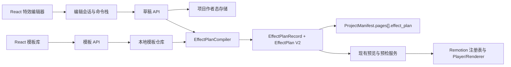

# 特效编辑器与模板管理工作台设计文档

## 1. 文档信息

- 文档状态：设计已确认，等待书面评审
- 目标版本：首个可交付版本（本地桌面工作台）
- 集成对象：PPT Video Workbench 现有 React、FastAPI、EffectPlan V2 与 Remotion 链路
- 运行边界：Windows 本地单用户应用
- 设计日期：2026-08-10

## 2. 背景与现状

现有工作台已经具备以下基础能力：

- 项目与页面清单、原子写入和备份恢复；
- `EffectPlanV2` 的 Python 严格模型、TypeScript 解析器和 JSON Schema；
- 页面级 `EffectPlanRecord`，包含 revision、plan hash、input fingerprint、来源、状态和人工锁定；
- 13 个内置语义模板与 Remotion 模板注册表；
- 模板选择、语义背景、画幅、节奏和强度的基础控件；
- Remotion Player 预览、服务端视频预检、缓存键和最终渲染链路。

当前缺口是：模板只能通过代码与简单下拉框使用，缺少面向制作人员的页面级可视化编辑、草稿恢复、版本发布、批量应用和完整模板生命周期管理。

本设计在现有架构上增加两个一级模块：

1. 特效编辑器：在项目上下文中编辑页面特效、时间轴和参数。
2. 模板库：管理本地参数化模板的元数据、预设、版本和离线模板包。

## 3. 产品目标

首版必须达成以下结果：

1. 制作人员可以在不修改代码的情况下，为项目页面选择内置渲染器、调整声明式参数、编排特效时序并即时预览。
2. 编辑中的无效状态不会破坏已发布的 EffectPlan；预览、预检和最终渲染始终可追溯到同一个不可变 revision。
3. 模板管理人员可以创建、复制、校验、版本化、发布、弃用、归档和回滚参数化模板。
4. 模板可通过本地模板包导入和导出，但模板包不能携带或执行任意代码。
5. 现有 EffectPlan V2、Remotion 注册表、项目素材、缓存与视频预览链路继续作为运行基础。
6. 16:9、9:16 和 reduced-motion 模式均纳入模板发布门禁。

## 4. 非目标

首版明确不实现：

- 无代码 React 或 Remotion 组件搭建器；
- 任意 JavaScript、第三方插件或模板包代码执行；
- 云端同步、团队权限和多人实时协作；
- 在线模板市场、计费与许可证服务；
- 完整贝塞尔曲线编辑器、粒子系统和 3D 场景编辑器；
- 自动在线升级项目依赖的模板版本；
- 用新的运行协议替代 EffectPlan V2。

## 5. 目标用户与核心任务

### 5.1 视频制作人员

- 为单页选择合适的参数化模板；
- 调整时序、强度、背景、画幅和模板业务参数；
- 在画布和时间轴之间定位问题；
- 批量应用模板或部分参数；
- 发布页面特效后进入现有完整预检和渲染流程。

### 5.2 模板管理人员

- 基于内置渲染器创建参数化模板；
- 配置名称、分类、标签、默认参数、适用页型和兼容性；
- 运行 schema、双画幅、性能和 reduced-motion 校验；
- 发布不可变版本，弃用旧版本或从历史版本回滚；
- 导入、导出和备份模板包。

### 5.3 开发人员

- 在 Remotion 注册表中实现或维护渲染器；
- 为 renderer key 提供稳定的 EffectPlan V2 payload 契约；
- 维护模板校验、编译和回归基线；
- 不依赖模板管理 UI 发布任意可执行代码。

## 6. 信息架构与导航

工作台新增两个一级入口：

- `特效编辑器`：路由 `/projects/:projectId/effects`。
- `模板库`：路由 `/templates`。

用户从无项目上下文的一级导航进入特效编辑器时，先显示项目选择器；选择项目后进入项目级编辑器。模板库不要求项目上下文，但可以从模板详情页选择一个现有项目和页面作为预览样本。

现有 `/projects/:projectId/step/:step` 工作流保留。视频预览步骤增加“在特效编辑器中打开”和“查看 EffectPlan revision/hash”入口；特效编辑器发布成功后可返回原工作流。

## 7. 特效编辑器交互设计

### 7.1 页面布局

桌面端采用四区布局：

1. 顶部工具栏：项目名、保存状态、撤销/重做、画幅、预览模式、发布、返回工作流。
2. 左侧页面与图层区：页面缩略图、筛选、页面状态、特效轨道列表。
3. 中央画布与时间轴：Remotion Player、播放控制、时间游标、吸附、缩放、轨道和特效片段。
4. 右侧参数检查器：模板、预设、节奏、背景、目标、时序、强度、模板业务参数、人工锁定和验证结果。

窗口宽度不足时，参数检查器折叠为抽屉；首版最低支持宽度为 1280 px。键盘操作、焦点顺序、ARIA 标签和 reduced-motion 预览必须可用。

### 7.2 页面状态

页面列表显示以下互斥主状态：

- 未配置：没有 EffectPlan；
- 草稿：作者态与已发布 revision 不一致；
- 有错误：草稿可以保存，但不能发布；
- 已发布：草稿与当前 revision 一致；
- 已过期：素材、旁白、时间线或模板依赖变化导致 input fingerprint 不一致；
- 降级：当前发布记录使用 fallback。

### 7.3 时间轴能力

首版支持：

- 添加、删除、复制和移动特效片段；
- 拖拽片段起止时间；
- 对页面边界、旁白 cue 和相邻片段进行吸附；
- 调整时间轴缩放和播放游标；
- 选择片段后在参数检查器编辑目标、强度和预设缓动；
- 跨页面复制或批量应用；
- 撤销和重做所有影响草稿的命令。

首版不提供任意曲线编辑；缓动只允许从渲染器声明的枚举预设中选择。编译器最终输出 EffectPlan V2 的 `cues`、`effects`、`camera`、`transition` 和 `presenter_cues`。

### 7.4 预览模式

提供三种预览：

- 即时页预览：浏览器内编译当前草稿并更新 Remotion Player；
- 双画幅检查：并排或切换检查 16:9 与 9:16；
- 发布前预检：调用现有服务端预检，验证正式 EffectPlan revision 与项目素材。

参数修改采用 150 ms 预览防抖；草稿保存采用 400 ms 防抖。即时编译失败时保留最后一次有效预览，并在画布和字段旁显示诊断。

### 7.5 批量应用

用户可选择多个页面并执行：

- 替换模板；
- 只应用背景、节奏、转场或强度；
- 复制当前页面的完整作者态配置；
- 清除人工锁定；
- 恢复每页自动推荐。

批量操作先生成影响摘要，确认后作为一个可撤销命令执行。某页参数不兼容时，该页失败并保留原草稿；其他页面按原子批次策略全部不提交，避免部分成功造成难以识别的混合状态。

## 8. 模板库交互设计

### 8.1 模板列表

模板库默认按模板产品展示，而不是把每个版本展示成独立卡片。卡片包含：

- 名称、renderer key、最新版本和状态；
- 分类、标签、支持画幅和适用页型；
- 16:9 或 9:16 缩略图；
- 项目引用数和最近更新时间；
- 校验结果摘要。

支持名称、标签、renderer key、状态、画幅和页型筛选。默认隐藏 archived，默认不向新项目推荐 deprecated。

### 8.2 模板详情与编辑

详情页包含：

- 概览：说明、分类、标签、作者和兼容性；
- 参数：参数 schema、默认值、约束、控件类型和帮助文本；
- 预设：一组具名参数集合；
- 预览：样本项目/页面、双画幅、帧定位和 reduced-motion；
- 版本：版本历史、发布说明、差异、引用和回滚；
- 校验：schema、注册表、渲染、性能和安全结果；
- 分发：模板包导入、导出和内容哈希。

参数表单只编辑声明式字段，不提供源码编辑器。

### 8.3 模板版本生命周期

模板版本状态为：

1. `draft`：可修改。
2. `validated`：校验通过，但尚未供项目引用。
3. `published`：内容冻结，可被项目引用。
4. `deprecated`：旧项目继续使用，新项目默认隐藏。
5. `archived`：只读保留，可审计和导出。

已发布版本不可原地修改。回滚的语义是：复制目标历史版本内容，创建新的补丁版本，通过校验后发布。项目始终固定引用精确版本，不自动漂移到最新版本。

## 9. 总体架构



### 9.1 模块边界

#### 前端

- `features/effect-editor`：工作区布局、页面列表、画布、时间轴、检查器和发布流程；
- `features/template-library`：模板列表、详情、编辑、版本、校验和导入导出；
- `features/effect-editor/session`：命令栈、选择状态、脏状态、自动保存和冲突处理；
- `features/effect-editor/compiler`：即时预览用的纯 TypeScript 编译适配器；
- `api/effects` 与 `api/templates`：HTTP DTO 和错误映射。

组件不直接读写文件系统，不直接修改 `ProjectManifest`，也不自行决定模板兼容性。

#### 后端

- `workbench.effects.authoring`：作者态模型与验证；
- `workbench.effects.compiler`：作者态到现有 EffectPlan V2 的确定性编译；
- `workbench.effects.repository`：草稿、revision 和模板包的安全持久化；
- `workbench.effects.service`：编辑、发布、批量应用和冲突控制；
- `workbench.templates`：模板实体、版本生命周期、校验和包管理；
- `workbench.api.effects` 与 `workbench.api.templates`：FastAPI 路由。

编译器是纯业务模块，不依赖 FastAPI、React 或具体文件路径。

#### Remotion

- 现有 `registry.ts` 继续是 renderer key 到组件的唯一映射；
- 模板包只能引用注册表中已存在的 renderer key；
- 每个 renderer 声明支持的画幅、性能等级、fallback 和参数能力；
- interpreter 继续只消费通过 TypeScript 边界校验的 EffectPlan V2。

## 10. 数据模型

### 10.1 作者态 `EffectDraftDocument`

作者态是编辑器专用、允许暂时无效的数据，不写入 `PageRecord.effect_plan`。

```json
{
  "schema_version": "1.0",
  "project_id": "uuid",
  "page_id": "uuid",
  "base_revision": 3,
  "draft_seq": 18,
  "template_binding": {
    "template_id": "progressive-reveal-blue",
    "version": "1.2.0",
    "renderer_key": "ProgressiveReveal",
    "preset_id": "standard"
  },
  "parameter_values": {},
  "timeline_tracks": [],
  "manual_lock": true,
  "updated_at": "2026-08-10T10:00:00+08:00"
}
```

字段规则：

- `base_revision` 是打开草稿时对应的已发布 revision；没有已发布记录时为 0；
- `draft_seq` 每次成功保存递增，用于多个窗口的乐观并发控制；
- `parameter_values` 可以暂时不通过模板 schema，但发布时必须通过；
- 选择、面板展开状态和时间轴缩放等瞬时 UI 状态不写入作者态，只保存在前端会话；
- 自动保存失败时，最近草稿同时备份到浏览器 IndexedDB 的恢复区。

### 10.2 参数化模板 `TemplateDefinition`

模板产品具有稳定 `template_id`，每个版本包含：

- `version`：严格 SemVer；
- `status`：draft、validated、published、deprecated 或 archived；
- `renderer_key`：现有 Remotion 注册表键；
- `parameter_schema`：JSON Schema 2020-12 子集；
- `ui_schema`：字段顺序、控件、分组和帮助文本；
- `defaults`：默认参数；
- `presets`：具名参数集合；
- `field_bindings`：声明式地将参数映射到 EffectPlan V2 的模板 payload、effects、camera 和 transition；
- `supported_aspect_ratios`、`page_types` 和 `reduced_motion_policy`；
- `minimum_workbench_version` 和 `catalog_version`；
- `thumbnail_refs` 与受限静态素材引用；
- `content_hash`、创建时间和发布说明。

`field_bindings` 只允许常量、JSON Pointer 取值、枚举映射和受限数值变换；不允许表达式求值、脚本或动态导入。

### 10.3 运行态 `EffectPlanRecord`

继续使用现有页面级 `EffectPlanRecord`：

- `revision` 每次成功发布递增；
- `plan` 是严格的 EffectPlan V2；
- `plan_hash` 由规范化 JSON 计算；
- `input_fingerprint` 覆盖素材、旁白、时间线、模板版本和参数快照；
- `source` 为 manual；自动推荐与 fallback 保留现有语义；
- `status` 为 ready、fallback、stale 或 invalid；
- `locked` 对应作者态人工锁定；
- `validation_codes` 保存可机器识别的发布结果。

模板与参数最终编译到 EffectPlan V2 已有的 `template` 和 `template_payload` 字段。模板包和源素材的内容哈希写入 `plan.source_hashes`，例如：

```json
{
  "template_package": "64-character-sha256",
  "source_material": "64-character-sha256"
}
```

精确模板 ID 与版本不放进哈希字典，而记录在项目 revision 快照的 `template_ref` 中。不把面板状态、选择状态、命令历史或无效参数写入 EffectPlan V2。

### 10.4 `EffectRevisionSnapshot`

每次成功发布同时生成一个不可变 revision 快照：

- `record`：完整的现有 `EffectPlanRecord`；
- `template_ref`：template ID、精确 SemVer、renderer key 与模板包哈希；
- `draft_content_hash`：发布所依据作者态快照的规范化哈希；
- `compiler_version`：Python 权威编译器版本；
- `created_at`：发布时间；
- `previous_revision`：上一发布 revision，没有则为 0。

`ProjectManifest.pages[].effect_plan` 仍是渲染时的当前真相源；revision 快照用于审计、回滚、模板依赖恢复和差异查看。

## 11. 持久化与目录布局

项目数据继续位于现有项目目录内：

```text
<project>/
  project.json
  effects/
    drafts/
      index.json
      snapshots/
        <page-id>/
          <draft-seq>-<draft-hash>.json
    recovery/
      <page-id>.<draft-seq>.json
    revisions/
      <page-id>/
        <revision>-<plan-hash>.json
    transactions/
```

- `project.json` 中的 `pages[].effect_plan` 是当前已发布记录；
- revision 文件保存 `EffectRevisionSnapshot`，用于审计与恢复，不作为运行时的第二真相源；
- `drafts/index.json` 是当前作者态的唯一指针表，值为不可变 snapshot 相对路径、draft_seq 和内容哈希；
- 单页保存先写入新 snapshot，再原子替换 `drafts/index.json`；
- 批量操作先写完所有新 snapshot，再通过一次 index 原子替换使全部页面同时生效，因此不会出现逻辑上的部分提交；
- 草稿文件允许暂时无效，但必须满足作者态外层结构；
- 所有写入使用临时文件、flush、fsync 和原子 rename；
- 每页保留最近 20 个恢复草稿，超出后按最旧优先清理；
- revision 不自动删除，项目清理流程必须单独估算并确认。

全局模板库存储于：

```text
workspace-data/
  template-library/
    index.json
    packages/
      <template-id>/
        <version>/
          manifest.json
          presets/
          thumbnails/
          assets/
    transactions/
    quarantine/
```

`index.json` 是可重建索引，不是模板内容真相源。启动时索引损坏则从已完成包目录重建；导入或发布先写入 `transactions`，校验成功后原子移动到目标目录。失败包进入 `quarantine` 并记录原因，不进入可用索引。

## 12. 编译与发布流程

### 12.1 即时预览

1. 用户修改作者态。
2. 前端命令栈生成新状态并标记 dirty。
3. 150 ms 防抖后运行 TypeScript 预览编译器。
4. 编译器解析精确模板版本，验证参数并生成 EffectPlan V2。
5. TypeScript parser 再次校验运行对象。
6. Remotion Player 使用新对象刷新当前页。
7. 编译失败时保留最后一次有效 plan，画布显示错误浮层。

TypeScript 预览编译器与 Python 正式编译器共享 JSON fixture 和黄金输出测试；Python 是发布时的权威实现。

### 12.2 草稿保存

1. 400 ms 防抖后提交 `base_revision`、`draft_seq` 和完整作者态。
2. 服务端比较当前草稿序号和发布 revision。
3. 匹配则原子写入并返回递增后的 `draft_seq`。
4. 不匹配则返回 409 和服务端摘要；客户端不覆盖服务端版本。
5. API 不可用时将草稿写入 IndexedDB 恢复区并明确显示“尚未持久化”。

### 12.3 发布页面特效

1. 前端提交目标 `page_id`、期望 `base_revision` 和 `draft_seq`。
2. 服务端锁定当前草稿快照。
3. 验证模板状态必须为 published 或已被当前项目固定引用的 deprecated。
4. Python 编译器生成 EffectPlan V2。
5. 运行严格模型验证、时间边界、素材依赖、fallback 和注册表兼容检查。
6. 计算 plan hash 与 input fingerprint。
7. 创建 revision 快照，并原子更新 `PageRecord.effect_plan`。
8. 记录 audit event，失效该页预览、预检和最终渲染缓存。
9. 返回新 revision、hash、validation codes 和缓存失效摘要。

任何一步失败都不得改变当前已发布记录。

### 12.4 模板发布

1. 冻结 draft 内容并生成候选模板包。
2. 验证 manifest、参数 schema、默认值、预设和 field bindings。
3. 确认 renderer key 存在且能力兼容。
4. 对标准 fixture 和选定样本页运行 16:9、9:16 与 reduced-motion 快照。
5. 运行目标帧渲染和性能预算门禁。
6. 计算包内逐文件哈希和总 content hash。
7. 原子移动到正式版本目录并更新索引。
8. 将版本状态设为 published，之后内容只读。

## 13. API 设计

所有响应继续使用现有 `{data, error, request_id}` envelope。

### 13.1 特效编辑 API

- `GET /api/projects/{project_id}/effects/summary`：页面状态、当前 revision、draft_seq 和错误摘要；
- `GET /api/projects/{project_id}/effects/pages/{page_id}/draft`：读取作者态；
- `PUT /api/projects/{project_id}/effects/pages/{page_id}/draft`：带并发令牌保存完整草稿；
- `POST /api/projects/{project_id}/effects/pages/{page_id}/compile`：无副作用编译并返回 EffectPlan V2 与诊断；
- `POST /api/projects/{project_id}/effects/pages/{page_id}/publish`：发布新 revision；
- `POST /api/projects/{project_id}/effects/pages/{page_id}/revert`：从指定 revision 生成新草稿；
- `POST /api/projects/{project_id}/effects/batch`：预检批量命令；
- `POST /api/projects/{project_id}/effects/batch/commit`：带批次令牌原子提交；
- `GET /api/projects/{project_id}/effects/pages/{page_id}/revisions`：版本历史；
- `GET /api/projects/{project_id}/effects/pages/{page_id}/revisions/{revision}`：只读快照。

### 13.2 模板 API

- `GET /api/templates`：筛选与分页列表；
- `POST /api/templates`：创建模板产品与首个 draft；
- `GET /api/templates/{template_id}`：详情和最新状态；
- `POST /api/templates/{template_id}/versions`：复制现有版本创建 draft；
- `PUT /api/templates/{template_id}/versions/{version}`：更新 draft；
- `POST /api/templates/{template_id}/versions/{version}/validate`：运行完整校验；
- `POST /api/templates/{template_id}/versions/{version}/publish`：发布不可变版本；
- `POST /api/templates/{template_id}/versions/{version}/deprecate`：弃用；
- `POST /api/templates/{template_id}/versions/{version}/archive`：归档；
- `POST /api/templates/{template_id}/versions/{version}/rollback`：创建新的补丁版本 draft；
- `POST /api/templates/import`：导入模板包；
- `GET /api/templates/{template_id}/versions/{version}/export`：导出模板包；
- `POST /api/templates/{template_id}/versions/{version}/preview`：对样本页运行预览编译。

### 13.3 错误码

至少提供以下稳定错误码：

- `effect_draft_conflict`；
- `effect_compile_failed`；
- `effect_publish_blocked`；
- `template_not_found`；
- `template_version_unavailable`；
- `template_parameter_invalid`；
- `template_renderer_unsupported`；
- `template_package_unsafe`；
- `template_validation_failed`；
- `template_version_immutable`；
- `batch_effect_conflict`；
- `effect_storage_unavailable`。

错误详情包含字段路径、页面 ID、模板 ID/版本、可执行修复动作和 blocking 标记，不返回本地绝对路径或敏感环境信息。

## 14. 模板包规范与安全

模板包扩展名为 `.pvtmpl`，本质为受限 ZIP。允许内容：

- 根目录 `manifest.json`；
- `presets/*.json`；
- `thumbnails/*.png|jpg|webp`；
- `assets/*.png|jpg|webp|svg|woff2`。

禁止内容：

- JavaScript、TypeScript、HTML、可执行文件、动态链接库、脚本和宏；
- 绝对路径、`..` 路径、替代数据流、符号链接和硬链接；
- 未在 manifest 哈希清单中的文件；
- 超过限制的压缩包或解压后内容。

默认限制：压缩包不超过 50 MB，解压后不超过 150 MB，单文件不超过 25 MB，文件数不超过 500。导入器先在隔离事务目录解析，不直接解压到正式仓库。SVG 禁止脚本、外部 URL、事件属性和嵌入 HTML。

renderer key 必须属于已安装注册表白名单。模板包无法添加新的 renderer；新增 renderer 只能随工作台代码和签名发布包交付。

## 15. 故障与恢复策略

### 15.1 参数无效

允许保存无效草稿，字段就地提示，预览保持最后有效结果，发布被阻止。修复后自动重新编译。

### 15.2 模板版本缺失

保留原始精确引用并显示导入所需版本。浏览项目时可临时使用 SafeSlide，但临时 fallback 不写入发布记录；正式发布前必须恢复精确模板版本或由用户显式更换模板。

### 15.3 Remotion 预览异常

页面级 Error Boundary 隔离故障。记录模板 ID/版本、renderer key、plan hash、帧号、画幅和已脱敏堆栈。其他页面保持可用。

### 15.4 本地 API 断开

编辑器进入恢复模式，前端草稿写入 IndexedDB，不宣称已保存到项目。重连后比较 `base_revision` 和 `draft_seq`；冲突时提供重载服务端版本、另存为恢复草稿或逐页采用本地草稿。

### 15.5 多窗口冲突

使用乐观并发控制，不使用静默最后写入获胜。409 响应返回服务端 revision、draft_seq、更新时间和差异摘要。

### 15.6 写盘中断

正式文件只通过原子替换出现。启动时清理未完成事务；存在完整临时内容时只报告可恢复候选，不自动发布。

## 16. 缓存与失效

即时预览缓存键至少包含：

- page source hash；
- draft content hash；
- template package hash；
- renderer catalog version；
- aspect ratio；
- reduced-motion 标志。

发布成功后：

- 只失效目标页面的即时预览与页面渲染缓存；
- 失效项目级视频预检和最终视频导出缓存；
- 不失效无依赖关系的其他页面作者态缓存；
- 模板新版本发布不会失效固定引用旧版本的项目；
- 模板版本被弃用只更新推荐索引，不改变已有渲染结果。

## 17. 性能与容量预算

基线环境使用发布包支持的最低 Windows 配置，50 页项目、1000 个模板版本索引规模：

| 指标                 | P95 预算 | 说明                                     |
| -------------------- | -------: | ---------------------------------------- |
| 编辑器进入可操作状态 |    1.5 s | 常用模板索引已加载，当前项目清单本地可用 |
| 参数修改到预览反馈   |   300 ms | 不含首次加载 Remotion 资源               |
| 草稿原子持久化       |   500 ms | 从防抖触发到服务端确认                   |
| 模板库本地筛选       |   150 ms | 1000 个版本索引                          |
| 页面切换到首帧       |   800 ms | 页面素材已在本地                         |
| 批量应用预检         |      2 s | 50 页，不执行视频渲染                    |

模板发布性能门禁使用基线 fixture 记录目标帧渲染时间与峰值内存。相对当前 SafeSlide 基线超过 2.5 倍或触发进程资源限制时阻止发布，并输出具体模板和帧位置。

## 18. 可观测性与诊断

记录结构化本地事件：

- 草稿保存成功、冲突和恢复；
- 编译开始、成功、失败和耗时；
- 页面发布、批量应用和回滚；
- 模板导入、校验、发布、弃用和归档；
- 预览错误、fallback 和缓存失效。

事件包含 request ID、project ID、page ID、template ID/version、revision、hash 前缀、错误码和耗时；不记录素材正文、旁白全文、模板参数中的自由文本或本地绝对路径。

诊断包增加：

- 脱敏后的草稿结构摘要；
- EffectPlan V2 validation codes；
- 模板 manifest 与内容哈希；
- 最近一次编译/预览错误；
- 注册表能力清单和工作台版本。

## 19. 测试策略

### 19.1 单元与契约测试

- 作者态模型、模板 manifest 和 `.pvtmpl` 约束；
- Python 与 TypeScript 编译器黄金 fixture 一致；
- EffectPlan V2 严格校验和未知字段拒绝；
- 命令栈、撤销/重做和批量原子性；
- plan hash、input fingerprint 和模板包 hash；
- 模板状态机与版本不可变；
- 缓存失效矩阵。

### 19.2 前端组件测试

- 页面状态、时间轴拖拽、吸附、检查器验证和批量摘要；
- 自动保存、防抖、断线恢复和 409 冲突；
- 模板筛选、版本差异、发布门禁和导入错误；
- 键盘操作、ARIA 标签、焦点管理和 reduced-motion。

### 19.3 Remotion 与视觉回归

- 所有 published 模板的 16:9、9:16 快照；
- 关键开始帧、中间帧、结束帧和转场边界；
- reduced-motion 输出；
- SafeSlide fallback；
- presenter cue 和字幕避让不回归。

### 19.4 集成与安全测试

- 草稿保存、发布、revision 恢复和项目清单原子写入；
- 模板发布、导入、导出、索引重建和 quarantine；
- ZIP Slip、符号链接、超大包、压缩炸弹、恶意 SVG 和未知 renderer；
- API 断开、进程中止、磁盘满、写盘失败和残留事务清理；
- 预览、预检与最终渲染使用相同 revision/hash。

### 19.5 端到端验收

至少覆盖：

1. 选择项目 → 编辑页面 → 即时预览 → 自动保存 → 发布 → 完整预检 → 最终渲染。
2. 创建模板 → 校验 → 双画幅预览 → 发布 → 项目引用 → 模板弃用 → 旧项目继续渲染。
3. 导出模板包 → 删除本地副本 → 重新导入精确版本 → 项目恢复预览。
4. 多窗口编辑冲突 → 另存恢复草稿 → 手动解决 → 发布。
5. Remotion 模板抛错 → 当前页隔离 → SafeSlide 浏览降级 → 诊断包可定位。

## 20. 兼容与迁移

### 20.1 现有项目

- 已有 `PageRecord.effect_plan` 继续有效；
- 第一次打开编辑器时，如果没有作者态草稿，则从当前 EffectPlan V2 生成只包含可逆字段的初始作者态；
- 无法反向映射的字段以“高级运行参数”只读展示，发布前保持原值；
- 未打开编辑器的项目不发生文件迁移；
- 项目清单 schema 版本在首版不因作者态草稿而升级。

### 20.2 现有模板

- 现有 13 个内置 renderer 各生成一个只读系统模板产品，初始版本为 `1.0.0`；
- 系统模板不可删除，可复制为用户模板；
- 当前 catalog version 与 renderer 能力写入模板 manifest；
- `SafeSlide` 保持内部保底模板，不向普通用户提供归档或弃用操作。

### 20.3 现有预览与渲染

- `PreviewWorkspace` 继续显示 revision 与 hash；
- 发布后仍由现有 `VideoPreviewService` 和 `VideoExportService` 工作；
- 新编辑器不建立第二套最终渲染服务；
- 服务端发布编译结果必须通过现有 Python EffectPlan V2 模型，Remotion 边界必须再次通过 TypeScript parser。

## 21. 验收标准

首版只有在以下条件全部满足时才可交付：

1. 两个一级入口可从现有工作台导航访问，特效编辑器能够正确建立项目上下文。
2. 用户可以对页面完成模板选择、参数编辑、时序编辑、撤销/重做、即时预览、自动保存和发布。
3. 无效草稿可恢复但不能覆盖当前发布 revision。
4. 每次发布生成递增 revision、稳定 plan hash 和可验证 input fingerprint。
5. 预览、预检和最终渲染显示并使用相同 revision/hash。
6. 模板可以完成创建、复制、校验、发布、弃用、归档和回滚状态流。
7. 已发布模板不可原地修改，项目固定引用精确版本。
8. `.pvtmpl` 可安全导入导出，恶意路径、可执行内容、未知 renderer 和超限包被拒绝。
9. 所有 published 模板通过 16:9、9:16、reduced-motion、目标帧和性能门禁。
10. 批量应用失败时不产生部分提交。
11. API 断线、多窗口冲突、Remotion 异常和写盘中断都有可验证的恢复路径。
12. 性能指标在基线环境达到第 17 节预算。
13. 新增契约、前端、Remotion、集成、安全和 E2E 测试全部通过；现有相关回归测试无新增失败。
14. 用户文档说明模板包边界、版本语义、恢复操作和首版限制。

## 22. 风险与控制

| 风险                              | 影响                     | 控制措施                                            |
| --------------------------------- | ------------------------ | --------------------------------------------------- |
| Python 与 TypeScript 编译结果漂移 | 即时预览与正式发布不一致 | 共享 fixture、黄金输出和发布时 Python 权威校验      |
| 作者态过度通用                    | 编辑器复杂且难以稳定     | 只覆盖现有 EffectPlan V2 能力，参数由 renderer 声明 |
| 模板包成为代码执行入口            | 本地安全风险             | 数据包限定、renderer 白名单、隔离解压和严格资源限制 |
| 已发布模板被覆盖                  | 旧项目不可复现           | 版本目录不可变、精确版本引用和内容哈希              |
| 大项目预览频繁重编译              | 交互卡顿                 | 页面级缓存、增量编译、防抖和按依赖失效              |
| 多窗口最后写入获胜                | 用户修改丢失             | base_revision + draft_seq 乐观并发控制              |
| 草稿进入严格项目清单              | 无效状态破坏项目加载     | 作者态独立文件，只有成功发布写入 manifest           |

## 23. 设计决策摘要

1. 采用“独立工作台模块 + 项目上下文联动”。
2. 模板管理定位为参数化模板管理，不做无代码渲染器搭建。
3. 首版采用本地模板库和模板包导入/导出，预留未来仓库适配器边界。
4. 作者态草稿与运行态 EffectPlan V2 分层；现有 EffectPlan V2 是发布和渲染的唯一运行契约。
5. 模板包不携带代码，只引用内置 Remotion renderer key。
6. 发布结果不可变、可追溯、可回滚，项目固定引用精确模板版本。
7. 预览失败保留最后有效结果，发布失败不改变当前发布记录。
8. 首版交付以双画幅、reduced-motion、安全、性能和端到端恢复门禁为准。
