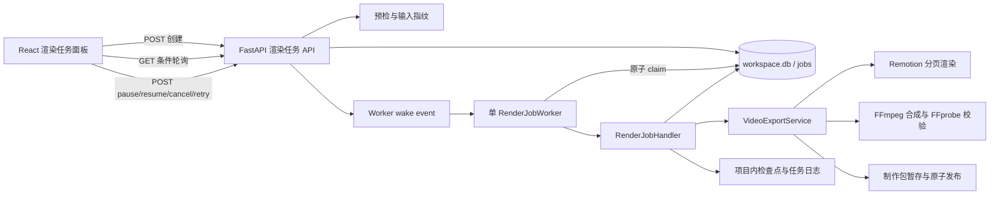
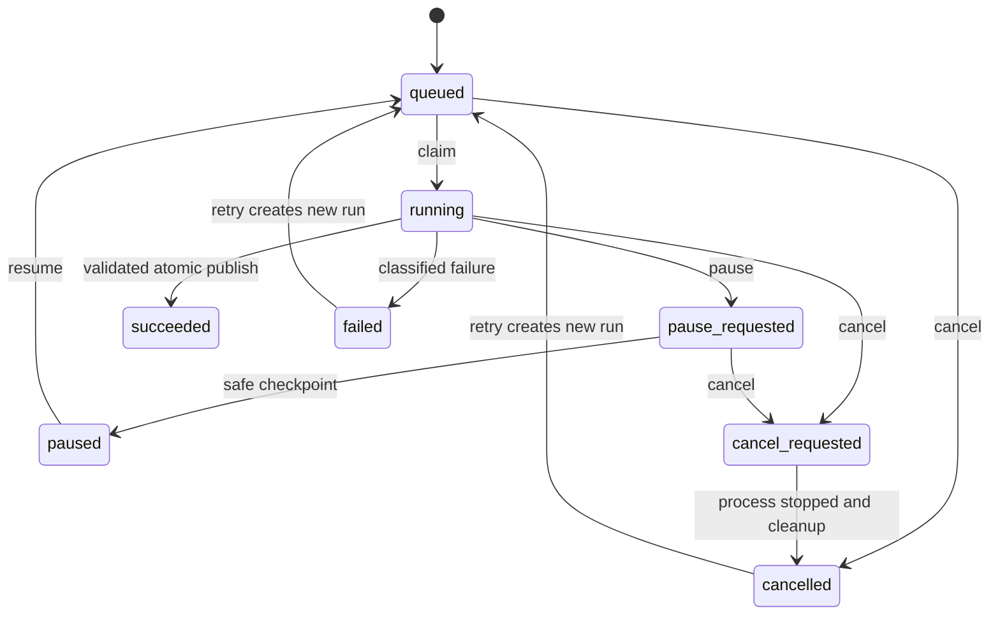

# 最终渲染异步任务化设计

## 1. 文档信息

- 主题：将“最终渲染与制作包导出”从同步 HTTP 调用改造成可查询、可暂停、可取消、可恢复的本地持久化异步任务。
- 适用版本：PPT Video Workbench `0.1.x`，Python 3.12、FastAPI、SQLite、React 19、TanStack Query 5、Remotion 4、FFmpeg/FFprobe。
- 设计日期：2026-08-10。
- 决策状态：可实施。

## 2. 背景与现状

当前最终渲染链路由 `POST /api/projects/{project_id}/video/render` 直接调用
`VideoExportService.export()`。请求线程依次完成完整预检、逐页 Remotion 渲染、分页音视频合成、整片拼接、媒体校验、制作包组装和项目清单写回，直到全部完成才返回 `VideoExportResult`。

前端 `WorkflowShell` 使用一个 React Query mutation 等待该请求；等待期间只能显示“正在渲染与导出”。刷新页面、请求超时、关闭桌面应用或后端进程退出后，前端无法重新关联本次渲染，也无法展示准确阶段、逐页进度或可操作的失败原因。

项目已经具备可复用基础：

- `workspace.db` 使用 SQLite WAL，已有 `jobs` 表、`JobRepository`、`JobRunner`、`CheckpointStore` 和中断任务恢复测试。
- `VideoRenderService` 已支持逐页缓存、原子替换输出和失败页局部重做。
- `VideoExportService` 已把导出划分为可识别的页面渲染、分页合成、整片拼接、媒体校验和制作包阶段。
- `ProjectService` 启动时会把遗留的 `running` 任务恢复为 `paused`。
- `peripheral-platform` 提供独立进程任务底座，但默认关闭，当前定位为通用外围能力而非最终渲染业务承载层。

现有作业设施仍不足以直接承载最终渲染：没有后台取队列循环、原子领取、任务输入/结果持久化、控制请求、细粒度阶段、错误码、心跳和前端任务 API；`subprocess.run()` 也不能在运行中响应取消。

## 3. 目标

1. 创建渲染后在 500 ms 内返回 `202 Accepted` 和稳定 `job_id`，HTTP 请求不等待渲染完成。
2. 页面刷新或重新进入项目后，能够通过 `job_id` 或项目当前任务恢复进度展示。
3. 同一进程全局最多执行 1 个最终渲染任务，避免 Remotion、Chromium 和 FFmpeg 争抢资源；其他任务进入持久化队列。
4. 任务状态、阶段、进度、输入指纹、结果、错误和时间戳持久化到 `workspace.db`。
5. 支持暂停、继续、取消和失败后重试；控制动作最迟在当前外部进程停止或当前原子阶段结束后生效。
6. 应用异常退出后，不把遗留任务误判为成功；下次启动显示为“已中断”，用户可从最近有效检查点继续。
7. 保留现有逐页缓存能力。已成功且缓存键匹配的页面不得重复渲染。
8. 最终 MP4 和制作包只在完整校验成功后原子发布，取消、失败或输入过期不得覆盖上一份成功结果。
9. 不向日志、任务错误、检查点或 API 暴露命令行敏感信息、绝对项目路径或底层 stderr 全文。
10. 不引入 Redis、Celery、RabbitMQ 或新的常驻服务依赖。

## 4. 非目标

- 本期不把其他同步流程统一迁移为异步任务。
- 本期不支持多机、远程 Worker、云渲染或跨用户调度。
- 本期不并行渲染多个页面；先确保单 Worker 的稳定性、可恢复性和资源上界。
- 本期不要求 SSE 或 WebSocket；进度传输采用条件轮询。
- 本期不改变最终成片规格、Remotion 模板、字幕算法、制作包内容或预检业务规则。
- 本期不把最终渲染移入 `peripheral-platform`。后续只有在需要进程级故障隔离或插件式渲染器时再评估。

## 5. 方案比较与决策

### 方案 A：FastAPI `BackgroundTasks`

请求返回后在同一服务进程执行导出，改动最少，但没有持久队列、原子领取、重启恢复和可靠控制；进程重启即丢失执行上下文。它只适合短小、可丢弃的后台工作，不满足本任务。

### 方案 B：主应用内置持久化队列与单 Worker（采用）

扩展现有 `workspace.db` 和 `workbench.jobs`，由 FastAPI lifespan 启动一个后台 Worker 线程。API 只负责验证、入队和返回；Worker 原子领取任务并调用可检查控制信号的导出编排器。前端用 TanStack Query 轮询任务状态。

优点是复用现有作业表、检查点、分页缓存和桌面应用生命周期；没有额外部署单元；能够渐进上线并保留同步服务内部接口。缺点是渲染进程仍由主应用托管，Python 进程崩溃会中断当前任务，但持久状态和检查点允许安全恢复。

### 方案 C：把渲染实现成 `peripheral-platform` 独立模块

进程隔离、调度和取消能力最强，但需要新增跨进程输入/产物协议、渲染模块打包、安装器联动、功能开关降级和双数据库一致性处理。当前外围平台默认关闭，首发迁移成本和回归面明显大于收益。

### 决策

采用方案 B。把任务领域和导出业务保持在主应用内，同时把外部进程执行抽象为独立 `CancellableProcessRunner`。这一边界使未来迁移到 `peripheral-platform` 时可以替换执行适配层，而不改变 Web API、任务状态或前端组件。

## 6. 总体架构



职责边界：

- API：同步做低成本门禁、创建/复用任务、查询和记录控制意图，不执行渲染。
- Repository：持久化状态、原子领取、幂等入队、乐观修订号和控制动作。
- Worker：单消费者生命周期、任务领取、异常隔离、关停协调，不包含视频业务。
- Handler：把任务记录转换为一次导出执行，维护检查点、错误分类和最终状态。
- Export Service：确定性的业务阶段，接受进度与控制上下文，不感知 HTTP 或线程。
- Process Runner：执行 Remotion/FFmpeg/FFprobe，轮询取消/暂停信号，负责温和终止与强制清理。
- UI：展示权威任务状态；mutation 仅用于创建或控制，进度来自 query。

## 7. 任务模型

### 7.1 状态

新增独立 `JobStatus`，不再用项目节点状态表达作业生命周期：

| 状态 | 含义 | 是否终态 |
| --- | --- | --- |
| `queued` | 已持久化，等待 Worker | 否 |
| `running` | Worker 已领取并执行 | 否 |
| `pause_requested` | 用户请求暂停，等待安全点 | 否 |
| `paused` | 已在检查点停下，可继续 | 否 |
| `cancel_requested` | 用户请求取消，等待安全清理 | 否 |
| `succeeded` | 结果已校验并发布 | 是 |
| `failed` | 执行失败，保留错误分类 | 是 |
| `cancelled` | 用户取消且临时产物已清理 | 是 |

状态转换：



`succeeded` 任务不可再次执行；用户再次点击时，若输入指纹和结果校验都未变化，则直接返回该任务。失败或取消后的“重试”创建新任务记录，并通过 `parent_job_id` 关联原任务，避免抹掉历史。

### 7.2 阶段与进度

| 阶段 | 进度区间 | 更新时机 |
| --- | ---: | --- |
| `queued` | 0% | 入队 |
| `validating_input` | 1%–5% | 恢复输入快照并重新核对指纹 |
| `rendering_pages` | 5%–65% | 每页缓存命中或成功发布后 |
| `muxing_pages` | 65%–85% | 每个分页音视频段校验后 |
| `concatenating` | 85%–91% | 整片生成并完成 FFprobe 后 |
| `packaging` | 91%–98% | 制作包文件和清单生成后 |
| `publishing` | 98%–99% | 最终输入复核与原子目录替换 |
| `completed` | 100% | 项目清单、任务结果和审计事件都落盘 |

页级进度按页数等分。缓存命中也推进一页，但 UI 同时显示 `cached_pages`。进度只允许单调增加；恢复执行从检查点进度开始，不倒退。

### 7.3 持久化字段

`jobs` 表升级到 schema version 2，保留已有列并增加：

- `status`：使用 `JobStatus` 值；迁移时 `not_started -> queued`、`completed -> succeeded`。
- `input_fingerprint`：本次导出输入指纹。
- `idempotency_key`：`video-export:{project_id}:{input_fingerprint}`。
- `parent_job_id`：失败/取消后重试的来源任务。
- `payload_json`：版本化、已脱敏的任务输入元数据，只保存相对路径和指纹。
- `result_json`：成功时的 `VideoExportResult`。
- `stage`、`message`、`progress`：用户可见阶段、短消息和 0–1 进度。
- `error_code`、`error`：稳定错误码和脱敏摘要。
- `revision`：每次状态或进度更新加 1，供条件轮询和并发控制。
- `heartbeat_at`：运行中至少每 5 秒更新。
- `started_at`、`finished_at`：执行边界。
- `created_at`、`updated_at`：保留。

建立部分唯一索引，限制同一项目同一任务类型只有一个活动任务：

```sql
CREATE UNIQUE INDEX uq_jobs_active_project_type
ON jobs(project_id, job_type)
WHERE job_type = 'export_package'
  AND status IN ('queued', 'running', 'pause_requested', 'paused', 'cancel_requested');
```

该索引只约束最终导出编排任务，不约束 `render_page` 等允许同一项目存在多条记录的任务类型。

数据库迁移必须在事务中执行。迁移前不删除或重建用户数据库；失败则应用启动失败并给出诊断，不在未知结构上继续写入。若 schema v1 中同一项目已经存在多条活动 `export_package` 记录，迁移保留 `updated_at` 最新的一条，其他记录转为 `failed`，错误码记为 `render_job_superseded_during_migration`，然后再创建部分唯一索引。`ProjectManifest.jobs` 中的旧 `not_started`/`completed` 值在模型加载时分别兼容映射为 `queued`/`succeeded`，不要求升级项目清单 schema。

## 8. 输入快照、幂等与一致性

### 8.1 入队时

创建任务执行以下同步步骤：

1. 读取项目并运行现有最终渲染门禁。
2. 生成 `ProjectVideoProps` 和预检输入指纹。
3. 计算 `input_fingerprint = SHA-256(canonical ProjectVideoProps + preflight input_fingerprint + renderer runtime version)`。
4. 在项目目录 `09_日志/render-jobs/{job_id}/input.json` 原子写入版本化快照，只包含相对路径、哈希、Props 和预检摘要。
5. 在同一数据库事务内创建或复用任务。

如果同一指纹存在活动任务，返回该任务且 `created=false`；如果存在成功任务且最终 MP4、制作包和清单校验通过，也返回成功任务；如果旧任务失败、取消或成功产物损坏，则创建新 run。

### 8.2 执行时

Worker 不信任入队时的门禁结果。开始执行时重新计算当前输入指纹：

- 一致：使用快照中的 Props 继续。
- 不一致：任务以 `render_input_stale` 失败，不自动对新输入渲染；UI 提示重新创建任务。

每个分页阶段使用现有页面缓存键验证素材内容。发布最终结果前再次计算指纹；若渲染期间上游输入改变，则以 `render_input_changed` 失败，保留可复用分页缓存，但不覆盖上一份成功输出。

### 8.3 输出发布

所有本次输出先写入 `08_输出/.render-jobs/{job_id}/`。只有整片媒体校验、制作包清单和输入二次复核全部通过后，才把文件原子替换到稳定路径。Windows 下目录不能保证跨目录原子替换，因此稳定路径中的文件逐个 `os.replace()`，制作包先生成带任务 ID 的完整目录，再切换一个小型 `latest.json` 指针；旧成功包保留到新指针写入成功后再按清理策略回收。

## 9. Worker 与执行控制

### 9.1 Worker 生命周期

- FastAPI lifespan 启动 `RenderJobWorker` 后再接受请求。
- Worker 使用一个守护线程、一个停止事件和一个唤醒事件；无任务时最多等待 500 ms。
- `claim_next()` 通过单条带 `RETURNING` 的条件更新原子把最早 `queued` 任务改为 `running`。
- 当前版本全局并发固定为 1，配置常量 `RENDER_WORKER_CONCURRENCY = 1`，不暴露用户配置。
- 每个任务顶层捕获 `BaseException` 之外的所有执行异常并落为分类后的 `failed`；Worker 循环继续服务后续任务。
- 正常关闭时先停止领取新任务，把当前任务请求为暂停，最多等待 10 秒到安全点；超时则保留 `running`，下次启动恢复为 `paused` 并标记 `worker_interrupted`。

### 9.2 暂停

暂停是协作式控制：

- `queued` 可直接变为 `paused`。
- `running` 先变为 `pause_requested`。
- Handler 在每个页面、分页合成、拼接、打包文件之间检查状态。
- 外部进程运行时，暂停不杀死当前命令；当前命令结束并校验后写检查点，再进入 `paused`。
- `resume` 把 `paused` 改回 `queued`，由 Worker 从检查点和页面缓存继续。

这样可以避免为了暂停而丢弃一个已经运行数分钟、即将成功的页面。UI 必须显示“正在完成当前页后暂停”。

### 9.3 取消

取消优先于暂停：

- `queued`、`paused` 可直接进入 `cancelled`。
- `running` 或 `pause_requested` 进入 `cancel_requested`。
- `CancellableProcessRunner` 每 250 ms 检查任务状态。收到取消后先 `terminate()`，等待 3 秒，仍未退出则 `kill()`，并等待子进程回收。
- 删除本任务登记过的临时路径，不删除已验证的共享页面缓存和上一份成功输出。
- 最终写入 `cancelled` 和 `render_cancelled` 审计事件。

### 9.4 心跳与中断恢复

运行中的进度更新自然刷新心跳；单个外部命令超过 5 秒时，Process Runner 单独刷新 `heartbeat_at`。应用启动时：

- 遗留 `running`、`pause_requested` 任务改为 `paused`。
- 遗留 `cancel_requested` 任务在登记的临时路径清理完成后改为 `cancelled`；清理失败则改为 `failed` 并记录 `render_cancel_cleanup_failed`。
- `message` 设为“应用上次运行期间中断，可继续或取消”。
- 不自动继续，避免应用刚启动就占满 CPU/GPU；由用户明确点击继续。
- 恢复前校验最新检查点产物的路径、大小和 SHA-256；无有效检查点时从阶段起点重做，但仍复用页面缓存。

## 10. 导出服务重构

引入 `RenderExecutionContext` 协议：

```python
class RenderExecutionContext(Protocol):
    job_id: UUID
    input_fingerprint: str

    def checkpoint(
        self,
        *,
        stage: str,
        progress: float,
        message: str,
        artifacts: Iterable[Path] = (),
        payload: Mapping[str, object] | None = None,
    ) -> None: ...

    def raise_if_cancelled(self) -> None: ...
    def pause_if_requested(self) -> None: ...
```

`VideoExportService.export(project_id, context=...)` 保留同步可调用性；测试或内部调用未传 context 时使用 `InlineRenderExecutionContext`，行为与现状一致。异步 Handler 传 `PersistentRenderExecutionContext`。

`VideoRenderService.render_pages()` 新增逐页回调和控制检查。Remotion、FFmpeg、FFprobe 统一通过 `CancellableProcessRunner`，不再直接调用 `subprocess.run()`。制作包逻辑拆成小阶段，但不改变已有产物清单和校验规则。

任务只有在以下顺序全部成功后才能标为 `succeeded`：

1. 临时输出校验通过。
2. 稳定输出发布成功。
3. `ProjectManifest.video_export` 保存成功。
4. 成功审计事件保存成功。
5. `jobs.result_json` 与 `succeeded` 状态在同一数据库事务内保存。

如果第 3 或第 4 步失败，任务失败且稳定输出可以存在，但 UI 不宣称完成；重试时先验证并复用已发布输出，再补写项目状态。

## 11. HTTP API 契约

### 11.1 创建或复用任务

`POST /api/projects/{project_id}/video/render-jobs`

成功返回 `202 Accepted`；若复用已存在任务则返回 `200 OK`。

```json
{
  "data": {
    "job": {
      "id": "uuid",
      "project_id": "uuid",
      "job_type": "export_package",
      "status": "queued",
      "stage": "queued",
      "progress": 0.0,
      "message": "已加入渲染队列",
      "input_fingerprint": "sha256",
      "cached_pages": 0,
      "total_pages": 8,
      "error_code": null,
      "error": null,
      "result": null,
      "revision": 1,
      "created_at": "2026-08-10T00:00:00Z",
      "updated_at": "2026-08-10T00:00:00Z",
      "started_at": null,
      "finished_at": null
    },
    "created": true
  },
  "error": null,
  "request_id": "uuid"
}
```

预检未通过仍返回 `409 video_preflight_blocked`，且不创建任务。

### 11.2 查询

- `GET /api/projects/{project_id}/video/render-jobs/current`：返回该项目最新活动任务；无活动任务时返回最新终态任务；从未创建过则 `data=null`。
- `GET /api/projects/{project_id}/video/render-jobs/{job_id}`：返回指定任务，必须校验任务属于该项目。
- 支持请求头 `If-None-Match: W/"job-{id}-{revision}"`；revision 未变化返回 `304`，降低轮询负担。

### 11.3 控制

`POST /api/projects/{project_id}/video/render-jobs/{job_id}/actions`

```json
{ "action": "pause" }
```

`action` 允许 `pause`、`resume`、`cancel`、`retry`。合法转换返回更新后的任务；终态重复取消等幂等操作返回当前任务；非法转换返回 `409 render_job_action_conflict`。`retry` 仅允许 `failed` 或 `cancelled`，创建新任务并返回 `202`。

### 11.4 兼容策略

原 `POST /api/projects/{project_id}/video/render` 保留一个小版本周期，但改为调用新建任务服务并返回同样的 `RenderJobSubmission`，同时增加 `Deprecation: true` 和 `Link` 响应头。前端立即切换到 `/render-jobs`。下一主版本删除旧路由。

## 12. 前端交互

新增 `RenderJobPanel`，在第 7 步成为唯一的最终渲染入口；第 6 步的快捷按钮也调用相同创建 API并导航到第 7 步。

面板显示：

- 状态标题、阶段文案、总进度条和百分比。
- 当前页/总页数、缓存命中页数、已用时和更新时间。
- 排队时显示“前面还有任务”而不是“正在渲染”。
- 暂停请求时显示“正在完成当前页后暂停”。
- 成功时显示 MP4 与制作包相对路径，并提供“打开输出目录”现有桌面能力可用时的入口。
- 失败时显示稳定错误摘要、建议动作和“重试”；输入过期时显示“项目内容已变化，请重新开始渲染”。
- 取消需要二次确认，并明确“已完成页面缓存将保留”。

轮询规则：

- `queued`、`running`、`pause_requested`、`cancel_requested`：每 1 秒。
- `paused`：每 5 秒，或控制 mutation 成功后立即刷新。
- 终态：停止轮询。
- 页面重新获得焦点、网络恢复、控制动作成功时立即刷新。
- 用 query key `['render-job', projectId, jobId]`；创建 mutation 成功后写入缓存，不依赖原 mutation 持续 pending。

创建按钮防重复不依赖前端锁；后端幂等是最终保证。用户离开页面不会取消任务。

## 13. 错误分类

| 错误码 | 场景 | 可重试 | 建议动作 |
| --- | --- | --- | --- |
| `video_preflight_blocked` | 入队前门禁失败 | 否 | 回到预检修复 |
| `render_input_stale` | 开始时输入指纹已变化 | 否 | 重新创建任务 |
| `render_input_changed` | 执行期间输入变化 | 否 | 确认修改后重新创建 |
| `renderer_runtime_unavailable` | Node/Remotion/Chromium 缺失 | 条件性 | 运行环境诊断后重试 |
| `render_page_failed` | Remotion 页面失败 | 是 | 查看页码并重试 |
| `ffmpeg_mux_failed` | 分页音视频合成失败 | 是 | 检查媒体与磁盘后重试 |
| `ffmpeg_concat_failed` | 整片拼接失败 | 是 | 检查分页产物后重试 |
| `media_validation_failed` | 编码、尺寸或时长不符 | 是 | 查看诊断并重试 |
| `package_validation_failed` | 制作包缺失或哈希不符 | 是 | 清理临时包后重试 |
| `render_disk_full` | 空间不足 | 是 | 释放空间后重试 |
| `render_cancelled` | 用户取消 | 是 | 需要时重新创建 |
| `render_worker_interrupted` | 应用异常退出 | 是 | 点击继续 |
| `video_export_rejected` | 未分类的安全兜底 | 条件性 | 导出诊断包 |

数据库中允许保存经过脱敏的内部摘要；API 只返回稳定文案。命令行参数、stderr、用户绝对路径和可能含凭据的值只能写入经过现有 redaction 处理的诊断日志。

## 14. 并发与项目修改策略

- 全局只有一个渲染 Worker，因此不会同时启动两个 Chromium/FFmpeg 导出链。
- 同一项目只允许一个活动 `EXPORT_PACKAGE` 任务。
- 不阻止用户查看或编辑项目，但每次上游写操作成功后，前端显示“当前渲染可能过期”。后端以输入指纹二次复核为准。
- 清理接口不得删除活动任务输入快照、检查点、已登记临时文件或当前 Worker 使用的缓存；`CleanupService` 需要把它们加入保护路径。
- 项目删除当前未实现；未来实现时必须先取消并等待活动任务终止。

## 15. 可观测性与审计

新增结构化审计事件：

- `video_render_job_created`
- `video_render_job_started`
- `video_render_job_pause_requested`
- `video_render_job_paused`
- `video_render_job_resumed`
- `video_render_job_cancel_requested`
- `video_render_job_cancelled`
- `video_render_job_failed`
- `video_render_job_succeeded`

任务日志按 `job_id` 隔离，记录阶段、页码、耗时、缓存命中、外部命令退出码和错误码。日志不复制到 `ProjectManifest.jobs`，避免项目清单持续膨胀；清单只保留最终 `video_export` 和关键审计事件。

诊断中心增加：Worker 是否存活、队列长度、是否存在超过 30 秒无心跳的 running 任务、最近失败错误码分布。健康检查不读取或散列大型媒体文件。

## 16. 测试策略

### 单元测试

- schema v1 到 v2 迁移、幂等入队、活动唯一约束和旧状态转换。
- 合法/非法状态转换、revision 单调增加、原子 claim 和结果事务。
- Worker 空闲唤醒、单消费者、任务异常后继续、优雅关停。
- Process Runner 正常退出、terminate、kill 兜底、心跳与脱敏错误。
- 进度权重、缓存命中、暂停安全点、取消清理、输入变化阻断发布。
- 输出暂存和 `latest.json` 原子切换。

### 集成测试

- 创建任务在渲染未完成前返回 202。
- 轮询从 queued/running 到 succeeded，并取得原 `VideoExportResult`。
- 连续创建相同输入只产生一个活动任务。
- 页面刷新等价场景可通过 current API 找回任务。
- 暂停后不再启动下一页，继续后复用已完成页。
- 取消正在运行的假进程并清理临时产物，不破坏上一份成功输出。
- 模拟进程重启后 running 变 paused，再继续成功。
- 渲染期间修改输入，最终稳定路径不被覆盖。
- 数据库迁移保留已有项目与任务记录。

### 前端测试

- 创建后 mutation 立即结束，面板由 query 展示进度。
- 只在活动状态轮询，终态停止。
- 刷新后通过 current API 恢复。
- queued、running、pause_requested、paused、failed、cancelled、succeeded 的文案和按钮矩阵。
- 重复点击、取消确认、错误建议、成功路径展示。

### Windows 实机验收

- 8 页和 50 页项目分别运行一次，记录 UI 响应、CPU/内存峰值和总耗时。
- 渲染中刷新页面、切换步骤、关闭再打开应用、暂停、继续和取消。
- 中文路径、长路径、F 盘映射目录、磁盘空间不足和被占用输出文件。
- Remotion/Chromium、FFmpeg 与 FFprobe 真进程取消后无孤儿进程。
- 最终 H.264/AAC、1920×1080、时长容差、SRT、DOCX、分页音频和制作包 SHA-256 全部通过。

## 17. 验收标准

1. 创建请求 P95 小于 500 ms（不含首次完整预检；若预检缓存失效，接口仍不得执行任何渲染命令）。
2. 活动任务状态最多 1 秒在前端可见，页面刷新后 2 秒内恢复任务面板。
3. 全局同时运行的最终渲染外部命令链不超过 1 条。
4. 相同输入连续点击 10 次只创建 1 个活动任务。
5. 暂停后不启动下一原子阶段；继续后已完成页面缓存命中率 100%。
6. 取消后 5 秒内结束假进程；Windows 真实 Remotion/FFmpeg 进程在 10 秒内退出且无孤儿进程。
7. 应用中断后任务不显示成功；重启后显示 paused，并能继续完成。
8. 任务失败、取消、输入变化或包校验失败时，上一份成功 MP4 和制作包仍可用。
9. 成功任务的 API result、项目 `video_export`、稳定输出和制作包清单一致。
10. Python、Web、契约、集成、E2E 和 Windows 实机回归通过，且无新增运行时依赖。

## 18. 发布与回滚

按“数据库与后端内部能力 → 新 API → 新前端 → 旧路由弃用”顺序发布。schema v2 迁移只增列、增索引并转换状态值，不删除旧列。

首个版本保留环境开关 `WORKBENCH_ASYNC_RENDER_ENABLED`：默认 `true`。关闭时旧路由可以继续使用 `InlineRenderExecutionContext` 同步执行，便于紧急业务降级；已经创建的异步任务仍可查询和取消，但关闭状态下 Worker 不领取新任务。

应用版本回滚不得对 `workspace.db` 做降级 SQL。旧版本若不认识 schema v2，应明确拒绝启动并提示恢复升级前数据库备份；发布流程在首次迁移前创建数据库副本。代码回滚时保留项目产物、分页缓存和任务日志。

## 19. 后续演进

- 任务量和实时性证明有必要后，再从轮询升级为 SSE；查询 API 和 revision/ETag 保持不变。
- 资源基线稳定后，可评估“页面渲染并发 2、FFmpeg 串行”，但必须重新做 Windows 内存和 Chromium 稳定性验收。
- 需要进程级隔离时，把 `RenderJobHandler` 封装成外围模块；主 API、Job DTO 和 UI 状态机保持不变。
- 后续其他长任务可复用 Worker 和 Repository，但必须分别设计任务输入、幂等键、检查点和取消语义，不能只因已有队列就自动迁移。
