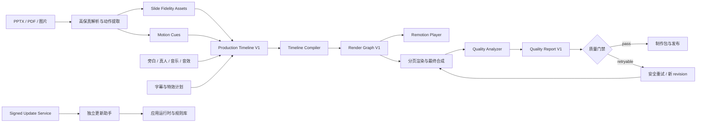
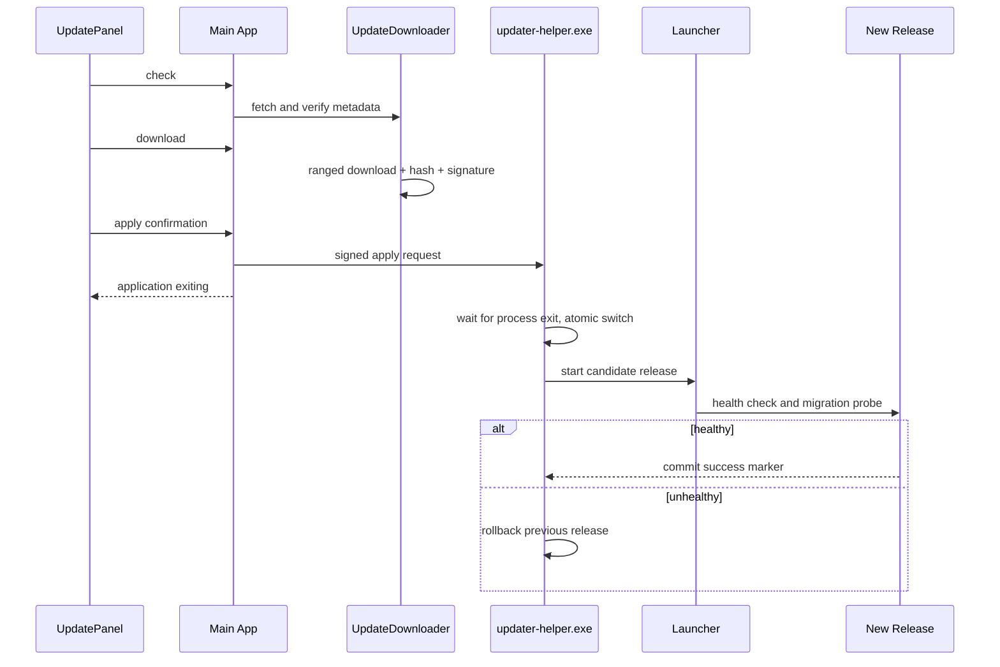
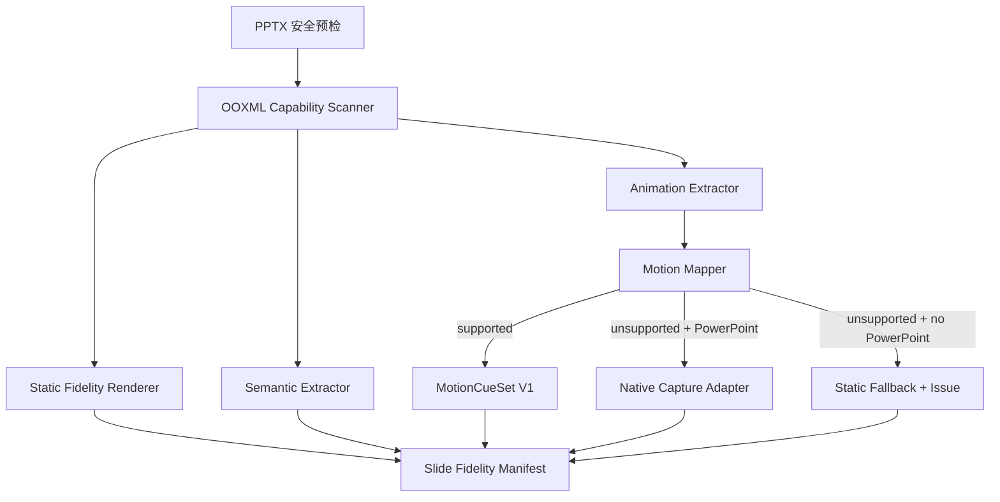

# PPT Video Workbench 四项重大能力完整设计

## 1. 文档信息

- 主题：成片自动质量检测、在线安全更新、统一多轨时间线、PPT 高保真与元素级动画。
- 设计日期：2026-08-10。
- 适用基线：当前 `PPT Video Workbench v3` 恢复工作区；最终渲染异步任务、P03-P12、特效编辑器与真人讲解任务完成并形成可验证基线之后。
- 决策状态：设计完成，待基线冻结后实施。
- 配套计划：`docs/superpowers/plans/2026-08-10-four-major-video-capabilities.md`。

## 2. 背景与现状

当前系统已经形成七步本地制作流程，具备材料导入、页面解析、旁白、音频、字幕、效果预览、预检、分页渲染、最终合成、制作包、诊断和本地更新等基础能力。正在并行推进的任务还会补齐异步最终渲染、P03-P12 外围模块、特效编辑器、真人讲解、Windows 构建和发布验收。

本设计不重复这些进行中的范围，而是解决四个下一阶段的产品级缺口：

1. 系统能证明文件存在和编码正确，但还不能系统发现黑帧、冻结、字幕遮挡、音频削波、静音和音画漂移等成片质量问题。
2. 当前更新以本地 manifest 和本地发布目录为核心，还没有在线签名元数据、断点下载、独立更新助手和抗回滚保护。
3. 页面、旁白、真人、字幕和特效分别拥有局部时间数据，但没有项目级、可编辑、可撤销、可编译的统一多轨时间线。
4. 当前 PPT 主要以整页图像进入视频，语义提取集中在文本和表格；不能还原组合、图表、SmartArt、媒体和原生动画顺序。

这四项能力相互依赖：PPT 高保真产生可靠的视觉资产和动作线索；统一时间线把它们与音频、字幕、真人和特效编排在一起；最终渲染输出成片；质量检测验证结果；在线更新安全交付新运行时和规则库。

## 3. 总体目标

### 3.1 产品目标

1. 每份最终成片都有机器可读质量报告、可复核证据和明确放行结论。
2. 用户可从可信在线源检查、下载、暂存、应用和回滚更新，任何失败不破坏现有程序与项目数据。
3. 用户可在一条项目级时间线上编辑 PPT 页面、旁白、真人视频、字幕、特效、音乐、音效和覆盖素材。
4. PPT 页面在可用环境中达到接近 PowerPoint 的静态视觉保真度，并尽可能确定性还原元素级动画；无法还原时有明确、安全的降级路径。
5. 四项能力全部沿用现有本地单用户、安全路径、原子写入、审计日志、输入指纹和可恢复任务原则。

### 3.2 工程目标

1. Python 领域模型是持久化和校验权威；TypeScript 契约由同一 schema 导出或快照校验。
2. 所有长任务使用稳定 `job_id`、幂等键、检查点、取消语义和结构化错误码。
3. 预览、渲染和质检消费同一份不可变编译产物，禁止三套时间逻辑。
4. 任何自动修复都必须可回滚，且不能覆盖上一份已验证成功成片。
5. 在线更新只修改程序发布区；项目、设置和用户素材不属于可替换发布包。

## 4. 非目标

- 不实现云端协作、账号、多人实时编辑和远程渲染。
- 不实现任意第三方 JavaScript、模板插件或宏代码执行。
- 不承诺 100% 重放 PowerPoint 的全部动画、VBA、ActiveX、OLE 和外部链接行为。
- 不建设完整非线性专业剪辑软件的调色、抠像、粒子和三维合成能力。
- 不自动上传成片、截图、旁白、项目正文或诊断证据。
- 不让质量检测模型直接修改用户项目；自动处置只能创建新 revision 或重新执行确定性步骤。
- 不在首版支持多机更新分发、企业域策略或差分二进制补丁。

## 5. 全局架构



### 5.1 权威边界

| 领域         | 唯一权威                                  | 派生产物                                    |
| ------------ | ----------------------------------------- | ------------------------------------------- |
| 项目制作时间 | `ProductionTimelineV1` 已发布 revision    | `RenderGraphV1`、预览 Props、分页渲染 Props |
| 单页特效     | 现有 EffectPlan/EffectDraft 发布 revision | 时间线中的只读嵌套效果片段                  |
| PPT 静态视觉 | `SlideFidelityRecord` 指向的已验证资产    | 缩略图、预览图、渲染图                      |
| PPT 动作     | `MotionCueSetV1`                          | 时间线片段或原生捕获视频                    |
| 成片质量     | `QualityReportV1`                         | UI 摘要、制作包报告、放行结论               |
| 更新状态     | 安装根目录外的 `update-state.json`        | UI 状态、更新日志、回滚记录                 |

### 5.2 与当前任务的边界

- 最终渲染异步任务继续负责执行、暂停、取消、恢复和原子发布；本设计只新增可复用 job 类型和编译输入。
- P03-P12 继续负责业务模块执行；高保真处理和质量检测以新 job 类型接入，不重写 P04/P11。
- 特效编辑器只编辑单页 EffectPlan；项目级时间线通过嵌套引用消费发布后的 EffectPlan。
- 真人讲解时间线继续描述讲解员出现方式；项目级时间线将其作为 presenter track 的受控子结构。
- 当前 Windows 构建和验收先形成干净基线；在线更新不接管尚未稳定的构建产物。

## 6. 共享数据与兼容策略

### 6.1 时间与坐标

- 持久化时间统一使用整数微秒 `time_us`，避免长视频中毫秒和帧取整累计漂移。
- 帧号只在编译和渲染边界计算：`frame = round(time_us * fps / 1_000_000)`。
- 首版输出仍以 30fps 为默认，但契约允许 24/25/30/50/60fps；同一项目 revision 的 fps 固定。
- 画布坐标使用 0-1 归一化矩形；实际像素仅存在于渲染产物。

### 6.2 版本、指纹与原子写入

- 所有新契约包含 `schema_version`、`revision`、`input_fingerprint`、`content_hash`。
- hash 使用规范化 JSON 和 SHA-256，不包含时间戳、绝对路径、临时目录或密钥。
- 大型报告和时间线单独保存为项目相对路径文件；`project.json` 只保存摘要和引用。
- 写入流程为临时文件、fsync、校验、原子替换；失败保留旧 revision。
- API mutation 必须携带 `expected_revision`；冲突返回 409，不做静默覆盖。

### 6.3 新增项目记录

```text
ProjectManifest
├── production_timeline: TimelineRecord | null
├── slide_fidelity: SlideFidelitySummary[]
├── quality_report: QualityReportSummary | null
└── update 不进入项目 manifest
```

建议新增独立工件：

- `07_视频工程/timeline/production-timeline-v1-rNN.json`
- `07_视频工程/timeline/render-graph-v1-rNN.json`
- `02_页面预览/fidelity/page-NNNN/fidelity-manifest.json`
- `02_页面预览/fidelity/page-NNNN/motion-cues-v1.json`
- `09_日志/质量检测/quality-report-v1-<job_id>.json`
- `09_日志/质量检测/evidence/<job_id>/...`

## 7. 项目 A：成片自动质量检测

### 7.1 目标

在最终 MP4 原子发布前或发布为候选版本后，自动执行结构、视频、音频、字幕、内容和音画同步检查，生成明确的 `pass`、`pass_with_warnings` 或 `blocked` 结论。

### 7.2 检测分层

| 层级          | 检查内容                                      | 主要实现                            |
| ------------- | --------------------------------------------- | ----------------------------------- |
| Q0 文件与编码 | 文件、哈希、容器、流、分辨率、fps、码率、时长 | FFprobe、manifest 校验              |
| Q1 视频信号   | 黑帧、纯色帧、冻结、重复片段、解码错误、闪烁  | FFmpeg filter、采样帧、感知哈希     |
| Q2 音频信号   | 静音、削波、过低/过高响度、声道异常、尾部截断 | `astats`、`silencedetect`、EBU R128 |
| Q3 版面与字幕 | 字幕越界、遮挡、过密、字体缺失、文本裁切      | 现有安全区、OCR、像素边界           |
| Q4 内容一致性 | 页序、标题、字幕文本、音频页长、视觉资产 hash | RenderGraph、字幕、源页记录         |
| Q5 音画同步   | cue 是否位于正确页面、语音/字幕偏移、跨页漂移 | 时间线、ASR 对齐、能量包络          |

### 7.3 核心契约

```python
class QualityIssue(BaseModel):
    code: str
    severity: Literal["P0", "P1", "P2", "P3"]
    scope: Literal["project", "page", "time_range", "artifact"]
    page_id: UUID | None
    start_us: int | None
    end_us: int | None
    message: str
    action: str
    evidence_refs: list[str]
    retry_policy: Literal["none", "rerender_page", "reassemble", "recompile"]


class QualityReportV1(BaseModel):
    schema_version: Literal["1.0"]
    project_id: UUID
    render_job_id: UUID
    report_id: UUID
    input_fingerprint: str
    result: Literal["pass", "pass_with_warnings", "blocked"]
    metrics: dict[str, float | int | str]
    issues: list[QualityIssue]
    analyzer_versions: dict[str, str]
    sampled_frames: list[int]
    created_at: datetime
```

### 7.4 采样策略

- 必采：首帧、末帧、每页开始/25%/50%/75%/结束附近、全部转场边界、字幕 cue 边界、真人出现/消失边界。
- 长区间补充每 5 秒一帧；连续异常区间提升为每 250ms 一帧。
- 黑帧和冻结检测先用 FFmpeg 全流扫描；OCR 和遮挡仅对候选帧执行。
- 报告记录实际采样位置和工具版本，保证结果可复现。

### 7.5 阈值与门禁

- P0：成片无法解码、缺少音视频流、产物 hash 不符、路径越界；立即阻断。
- P1：连续黑帧超过 500ms、有效语音被截断、字幕完全不可见、音画漂移超过 500ms；阻断。
- P2：短冻结、响度偏差、字幕密度过高、局部遮挡；允许修复或人工确认。
- P3：非阻断审美建议；不影响发布。
- 阈值存放在版本化 `quality-policy-v1.json`，项目可以选择严格/标准/快速预设，但不能关闭 P0。

### 7.6 安全自动处置

只允许以下自动动作：

1. 缓存键失配或单页解码异常时重新渲染该页。
2. 最终拼接异常且分页 MP4 均通过时重新合成。
3. RenderGraph 与成片时长不一致时重新编译并创建新渲染任务。
4. 每种动作最多一次自动重试；再次失败转人工，不进入循环。
5. 自动重试生成新 job/revision，旧成功产物和失败证据全部保留。

禁止自动改写旁白、字幕文本、特效参数、页面顺序和用户时间线。

### 7.7 API 与界面

- `POST /api/projects/{id}/quality/jobs`
- `GET /api/projects/{id}/quality/jobs/{job_id}`
- `GET /api/projects/{id}/quality/latest`
- `GET /api/projects/{id}/quality/evidence/{evidence_path}`
- `POST /api/projects/{id}/quality/issues/{issue_id}/actions`

界面新增“成片质检”面板：总体结论、六类检查、时间轴问题标记、证据帧、音频波形片段、建议动作和重试历史。证据读取必须经过项目根路径约束，不能直接暴露绝对路径。

### 7.8 性能预算

- 8 页、10 分钟、1080p 标准模式：无 GPU 时不超过成片时长的 35%，峰值额外内存不超过 1GB。
- 快速模式不超过成片时长的 15%，但仍执行 Q0/Q1/Q2 硬门禁。
- 相同成片 hash、策略版本和 analyzer 版本命中缓存时 2 秒内返回既有报告。

## 8. 项目 B：在线安全更新

### 8.1 目标

在不暴露用户数据、不让主程序自覆盖、不信任传输网络的前提下，实现稳定通道检查、签名验证、断点下载、暂存、应用、健康检查和一键回滚。

### 8.2 信任模型

- HTTPS 只提供传输保护；发布真实性由离线根密钥签名保证。
- 客户端内置一个或多个 Ed25519 根公钥，不内置私钥。
- 元数据采用规范化 JSON；签名覆盖 `version`、`channel`、`published_at`、`expires_at`、`min_supported_version`、文件大小、SHA-256、下载 URL 和运行时清单 hash。
- 生产签名必须在发布机离线步骤完成；CI 只组包和生成待签名元数据。
- 支持根公钥轮换：新 root metadata 必须同时由旧阈值和新阈值签名。
- 客户端拒绝过期元数据、未知通道、版本回退、hash 不符、签名不足和 URL 非 HTTPS。

### 8.3 元数据

```text
update-metadata/
├── root.json       # 根公钥、阈值、版本
├── timestamp.json  # 最新 snapshot 版本和过期时间
├── snapshot.json   # targets 元数据 hash/size
└── targets.json    # 发布包、版本、兼容范围和签名
```

首版可只有 stable 通道，但协议保留 beta 字段；UI 不暴露 beta，除非构建显式启用开发者模式。

### 8.4 组件



### 8.5 目录边界

```text
%LOCALAPPDATA%/PPTVideoWorkbench/
├── app/releases/<version>/       # 不可变版本目录
├── app/current.json              # 当前版本指针，原子替换
├── updater/updater-helper.exe    # 独立、版本化、受签名保护
├── updates/downloads/            # .part 和已验证包
├── updates/state/                # 非项目更新状态
├── updates/backups/              # 设置/索引迁移备份
└── workspace-data/               # 永不作为发布包覆盖目标
```

### 8.6 下载与应用状态机

```text
idle -> checking -> available -> downloading -> downloaded -> staged
staged -> applying -> verifying -> applied
applying/verifying -> rolling_back -> rolled_back
任意非终态 -> failed（保留稳定错误码和可执行动作）
```

- `.part` 文件记录 ETag、已下载字节和目标 hash；服务器不支持 Range 时安全重下。
- 暂存前解包到随机临时目录，校验每个 runtime manifest 条目后原子改名。
- 应用前阻止新的长任务，并等待现有渲染/质检任务到安全点；用户可取消更新。
- 更新助手校验调用者 nonce、包签名和目标目录，拒绝任意路径参数。
- 首次启动只进行向前兼容探测；真正不可逆迁移必须延迟到健康检查通过且有备份之后。
- 保留最近两个成功版本；旧版本清理必须单独确认并保护当前/回滚版本。

### 8.7 API 与界面

保留现有 `/api/updates` 前缀并演进：

- `GET /api/updates`
- `POST /api/updates/check`
- `POST /api/updates/download`
- `POST /api/updates/{operation_id}/actions`：pause/resume/cancel
- `POST /api/updates/stage`
- `POST /api/updates/apply`
- `POST /api/updates/rollback`
- `GET /api/updates/log`

界面必须展示发布者、版本、发布时间、说明、大小、签名状态、兼容范围、下载进度、预计磁盘占用和回滚版本。应用更新需要二次确认；不得静默自动安装。

### 8.8 错误码

- `update_metadata_expired`
- `update_signature_invalid`
- `update_rollback_blocked`
- `update_download_interrupted`
- `update_package_hash_mismatch`
- `update_runtime_manifest_invalid`
- `update_jobs_still_active`
- `update_helper_launch_failed`
- `update_candidate_health_failed`
- `update_automatic_rollback_failed`

错误响应和日志不得包含完整下载 URL 查询参数、用户名、认证头或绝对用户路径。

## 9. 项目 C：统一多轨时间线

### 9.1 定位

项目级时间线负责“何时出现什么、持续多久、如何混合”，是最终预览和渲染的唯一时间权威。它不替代：

- 单页 EffectPlan 对页内表现的描述；
- PresenterTimeline 对真人布局状态的描述；
- SubtitleTimeline 对词句时间的原始记录。

这些局部模型通过适配器变成项目时间线的嵌套或只读轨道。用户发布项目时间线后，编译器产生不可变 `RenderGraphV1`；预览和最终渲染只消费 RenderGraph。

### 9.2 轨道模型

| 轨道      | 用途                   | 首版编辑能力              |
| --------- | ---------------------- | ------------------------- |
| slide     | PPT 页面与原生捕获片段 | 排序、时长、裁剪、转场    |
| narration | 本地/HeyGen 旁白       | 音量、淡入淡出、锁定同步  |
| presenter | 真人讲解视频           | 裁剪、布局引用、显隐      |
| subtitle  | 字幕 cue               | 断句边界、样式引用、锁定  |
| effect    | 已发布 EffectPlan      | 起止、强度覆盖、只读展开  |
| overlay   | 图片、Logo、视频覆盖   | 位置、尺寸、透明度、层级  |
| music     | 背景音乐               | 裁剪、循环、音量、ducking |
| sfx       | 音效                   | 位置、音量、淡入淡出      |
| marker    | 章节、审核和质量问题   | 跳转、筛选、说明          |

### 9.3 契约

```python
class TimelineClipV1(BaseModel):
    id: UUID
    track_id: UUID
    kind: str
    start_us: int
    duration_us: int
    source_in_us: int = 0
    source_duration_us: int | None = None
    source_ref: str
    locked: bool = False
    link_group_id: UUID | None = None
    payload: dict[str, JsonValue]


class TimelineTrackV1(BaseModel):
    id: UUID
    kind: str
    name: str
    order: int
    muted: bool = False
    locked: bool = False
    clips: list[TimelineClipV1]


class ProductionTimelineV1(BaseModel):
    schema_version: Literal["1.0"]
    project_id: UUID
    revision: int
    fps: int
    width: int
    height: int
    duration_us: int
    tracks: list[TimelineTrackV1]
    markers: list[TimelineMarkerV1]
    input_fingerprint: str
    content_hash: str
```

### 9.4 编辑命令

前端不直接任意改写整个 JSON。所有改变归一化为可验证命令：

- `insert_clip`
- `move_clip`
- `trim_clip`
- `split_clip`
- `delete_clip`
- `set_clip_property`
- `reorder_track`
- `link_clips` / `unlink_clips`
- `ripple_shift`
- `set_transition`
- `restore_revision`

命令携带 `command_id`、`expected_revision` 和最小 payload。后端应用命令、验证不变量、生成新 revision；批量拖动手势在 mouse-up 时合并为一个命令。Undo/redo 通过逆命令和本地 command stack 实现，刷新后通过 revision 历史恢复，不依赖浏览器内存。

### 9.5 不变量

- `start_us >= 0`、`duration_us > 0`，源裁剪范围不得超出媒体时长。
- 同一 slide 主轨不能出现未声明的空洞或重叠；跨页转场必须由显式 overlap 表示。
- narration 与其 page link 默认锁定；解锁需要明确确认并触发字幕/质量报告失效。
- 同一音频资产可重复引用，但不能共享可变临时文件。
- 轨道层级必须确定；同层视觉 clip 重叠必须有混合规则。
- 任何变更都重新计算受影响区间，而不是默认使全部分页缓存失效。

### 9.6 编译器

`TimelineCompiler` 分四步：

1. 解析并验证资源、时长、链接和轨道规则。
2. 展开 EffectPlan、PresenterTimeline、SubtitleTimeline 和 MotionCueSet。
3. 计算视觉层级、音频混合、转场 overlap、字幕避让和页面缓存分段。
4. 生成不可变 `RenderGraphV1`、依赖图和区间级 cache keys。

`RenderGraphV1` 只含渲染需要的数据，不含编辑历史、UI 选择和绝对路径。旧项目第一次进入时间线时，由现有 pages/audio/subtitles/effects 确定性生成默认 revision 1；生成后不改变既有项目输出，直到用户发布时间线。

### 9.7 音频混合

- 内部使用 float32 混音图，最终输出 AAC。
- narration/presenter 为 dialogue bus，music 为 music bus，sfx 为 effects bus。
- 首版提供 per-clip gain、fade、mute、loop 和 dialogue ducking；所有参数持久化。
- ducking 由已知 dialogue clip 时间决定，不使用不可复现的实时检测。
- 编译器输出 FFmpeg filter graph 或预混 WAV；命令仍使用参数数组和受控 filter script 文件。

### 9.8 前端

界面由页面轨道、轨道头、时间标尺、播放头、可缩放画布、检查器和迷你预览组成。

- 1 秒到 30 分钟可连续缩放。
- 拖动以 requestAnimationFrame 更新视觉位置，提交时才写后端。
- 1000 个 clip 下保持交互流畅；只渲染可视时间窗口和轨道。
- 键盘支持播放/暂停、逐帧、删除、分割、撤销重做和缩放。
- 屏幕阅读器提供选中 clip 的文本属性编辑入口；不要求通过画布拖动完成所有操作。

### 9.9 API

- `GET /api/projects/{id}/timeline`
- `POST /api/projects/{id}/timeline/initialize`
- `POST /api/projects/{id}/timeline/commands`
- `POST /api/projects/{id}/timeline/commands/batch`
- `POST /api/projects/{id}/timeline/compile`
- `GET /api/projects/{id}/timeline/revisions`
- `POST /api/projects/{id}/timeline/revisions/{revision}/restore`
- `GET /api/projects/{id}/render-graph`

## 10. 项目 D：PPT 高保真与元素级动画

### 10.1 设计原则

PPTX 不是浏览器动画格式。系统必须区分“语义理解”“静态视觉真值”和“动作重放”，不能假设 python-pptx 可以完整还原 PowerPoint。采用四级能力模型：

| 等级 | 能力         | 输出                                           |
| ---- | ------------ | ---------------------------------------------- |
| F0   | 现有兼容模式 | 整页静态图、基础文本                           |
| F1   | 高保真静态   | PowerPoint/LibreOffice 导出图、元素边界与语义  |
| F2   | 可解释动画   | 支持动画映射为确定性 MotionCue                 |
| F3   | 原生捕获     | 不支持动画由 PowerPoint 原生播放并捕获页级视频 |

每页独立选择最高可用等级；同一项目允许混合，但必须在 manifest 中记录 renderer、Office 版本、字体能力、降级原因和资产 hash。

### 10.2 处理流水线



### 10.3 安全预检

- 拒绝或隔离宏启用文件、外部关系、ActiveX、OLE、嵌入可执行文件和损坏 ZIP。
- 不执行宏、不点击链接、不加载外部模板、不允许 PowerPoint 更新外部链接。
- Office 自动化使用独立临时副本、隐藏窗口、超时和批次 PID 所有权；超时强制终止仅限本批次创建的进程。
- 所有输出必须位于项目 fidelity 临时区，完成校验后原子发布。

### 10.4 语义模型

`SlideSceneV1` 至少描述：

- slide size、背景、主题色和母版引用；
- shape id、z-order、边界、旋转、透明度、裁剪和组合关系；
- 文本段落、字体、字号、颜色、粗斜体、对齐和占位符角色；
- 图片、SVG、表格、图表、SmartArt、公式、音频、视频和超链接能力标记；
- notes、hidden、section、speaker notes 和 alt text；
- 资源引用只使用项目相对路径和内容 hash。

SmartArt、复杂图表、公式和嵌入对象首版可以保留为静态视觉层，但仍记录类型和边界，供字幕避让和质检使用。

### 10.5 动画模型

`MotionCueSetV1` 描述：

- cue id、shape ids、trigger、sequence order；
- start condition：with_previous、after_previous、on_click；
- delay、duration、repeat、auto_reverse；
- entrance、emphasis、exit、motion path、media action；
- easing preset、direction、group behavior；
- supported、degraded、native_capture_required 状态。

首版确定性支持：appear、fade、wipe、fly-in/out、zoom、float、basic emphasis、直线/折线路径和组级顺序。随机效果必须使用由 slide hash 派生的 seed；不允许系统时钟和 CSS 自发动画。

### 10.6 点击触发策略

自动视频没有真实点击。默认把 `on_click` 按动画树顺序自动展开：

1. 若旁白或大纲含对应分段，优先对齐到句子 cue。
2. 无语义锚点时按总页时长和动画权重分配。
3. 用户可在时间线上拖动 cue，但不能改变原动画的先后依赖。
4. 无法安全展开的交互动画进入原生捕获或静态降级。

### 10.7 静态渲染优先级

1. Windows 安装且可用的 Microsoft PowerPoint 导出 PNG/PDF，作为最高优先级视觉真值。
2. LibreOffice 无头导出，作为跨机器兼容路径。
3. 现有 PDF/图片输入直接使用其页面视觉。
4. 纯 Python 重建只用于语义和局部可编辑层，不作为复杂页面像素真值。

两种 Office 渲染结果可选做感知差异比较；差异过大时记录 `office_renderer_divergence`，不静默切换。

### 10.8 原生捕获

F3 只针对无法映射且用户要求保留的动画页：

- 复制演示文稿到隔离区，只保留目标页和必要母版资源。
- 关闭宏与外部更新，按确定性点击计划播放。
- 首选 PowerPoint 原生导出视频；无法页级导出时使用受控窗口/屏幕捕获适配器。
- 捕获结果 FFprobe 校验，裁剪为该页片段并进入 slide track。
- 捕获页不再叠加同一套元素动画，避免双重运动。

### 10.9 API 与界面

- `POST /api/projects/{id}/fidelity/jobs`
- `GET /api/projects/{id}/fidelity/jobs/{job_id}`
- `GET /api/projects/{id}/fidelity/pages`
- `GET /api/projects/{id}/fidelity/pages/{page_id}`
- `POST /api/projects/{id}/fidelity/pages/{page_id}/policy`
- `POST /api/projects/{id}/fidelity/pages/{page_id}/recapture`

界面提供逐页等级、能力、降级原因、原始/输出对比、动画列表、点击展开方式和重新处理入口。F3 原生捕获必须明确显示需要 PowerPoint、预计时长和隔离说明。

### 10.10 缓存与失效

缓存键包含：PPTX hash、页索引、相关主题/母版 hash、字体指纹、渲染器名称/版本、Office 版本、DPI、画幅、动画映射器版本和策略。

- 旁白变化只重算动画 cue 对齐，不重做静态视觉。
- 字体环境或 Office 版本变化使静态视觉失效。
- 单页策略变化只重做该页。
- 动画映射器升级只使 F2 cue 和依赖渲染失效，不删除原始 PPTX。

## 11. 四项目集成顺序

1. 先冻结共享契约、目录和错误码。
2. PPT 高保真先建立静态资产与动作契约，不立即替换现有渲染链。
3. 统一时间线接收现有资产和新 fidelity 资产，编译出兼容 RenderGraph。
4. 最终渲染改为消费 RenderGraph，同时保留旧 Props 适配器一个版本周期。
5. 质量检测接在候选成片之后，并先以只报告模式上线。
6. 在线更新最后接入，用已经稳定的发布包格式交付四项能力。

## 12. 错误与降级原则

- 每个错误必须包含稳定 `code`、用户可读 `message`、可执行 `action` 和 `blocking`。
- 外部工具 stderr 只保存在限长、脱敏的内部日志，不进入 API。
- PowerPoint 不可用时降级到 LibreOffice/static，不阻断不要求动画的项目。
- OCR/质量高级分析不可用时仍执行 Q0/Q1/Q2 基础门禁并标记降级。
- 时间线编译失败不覆盖上一份 RenderGraph。
- 更新失败不改变当前版本指针；自动回滚失败时停止尝试并输出离线恢复步骤。

## 13. 安全与隐私

1. 所有项目路径经过 `ProjectPaths` containment 校验；证据、时间线和 fidelity 资产不能逃逸项目根。
2. 更新下载只接受签名 metadata 中声明的 HTTPS 目标，不接受用户任意 URL。
3. 更新助手不接受任意命令参数和任意目标目录。
4. Office 自动化不执行宏、外部链接、嵌入对象或网络请求。
5. 质量证据默认本地保存，不自动上传；诊断包只包含用户显式选择的脱敏摘要。
6. 新日志不得记录旁白全文、字幕全文、完整媒体路径、API Key、认证头和下载 token。
7. 所有解析器对压缩炸弹、超大 XML、像素炸弹和异常媒体时长设置上限。

## 14. 可观测性

统一结构化事件：

- `quality_job_started/completed/blocked/retry_requested`
- `update_check/download/stage/apply/rollback`
- `timeline_command_applied/conflict/compiled/published`
- `fidelity_scan/render/map/capture/degraded`

事件只记录 ID、版本、耗时、状态、错误码和大小区间，不记录正文。诊断中心新增四组探针：quality runtime、update trust、timeline contract、PowerPoint/LibreOffice fidelity capability。

## 15. 测试策略

### 15.1 单元与契约

- Pydantic/JSON Schema/TypeScript 快照一致。
- 规范化 hash、revision conflict、路径安全、错误脱敏。
- 质量分析器的确定性 fixture。
- 更新签名、过期、回退、断点下载和密钥轮换。
- 时间线命令、不变量、逆命令和编译确定性。
- OOXML 能力扫描、shape 树、动画序列和降级决策。

### 15.2 集成

- 旧项目生成默认时间线后输出不变。
- 同一 RenderGraph 用于预览、渲染和质量对照。
- 候选成片质检失败不覆盖旧成片。
- 更新应用失败自动回滚，项目数据 hash 不变。
- PowerPoint 不可用时确定性降级；可用时完成隔离捕获并清理批次进程。

### 15.3 真实样本

建立至少 60 页 PPT corpus：文本、表格、图表、SmartArt、公式、组合、透明、SVG、音视频、母版、常见动画、触发器和损坏样本。每页记录预期 fidelity level、允许降级和关键帧。

建立成片故障 corpus：黑帧、冻结、无声、削波、字幕越界、重复页、错序、时长漂移、音画偏移和损坏容器。所有 P0/P1 必须被稳定识别，误报率受门禁约束。

## 16. 验收门禁

### Gate F0：共享基线

- 当前并行任务已经合并或明确隔离。
- 全量测试、类型检查、Windows 构建和真实八页导出有基线证据。
- 两份新契约不会覆盖现有 EffectPlan/PresenterTimeline 权威。

### Gate QA

- 故障 corpus 的 P0/P1 召回率 100%，标准正常成片 P0/P1 误报为 0。
- 报告、证据和重试均可恢复；旧成功成片不被覆盖。
- 10 分钟 1080p 标准模式满足性能预算。

### Gate UPDATE

- 无签名、坏签名、过期、回退、截断、hash 不符全部阻断。
- 断网续传、磁盘不足、程序占用、迁移失败和健康检查失败均可恢复。
- 干净 Windows 10/11 完成安装版本到下一版本再回滚的实机闭环。

### Gate TIMELINE

- 旧项目默认时间线渲染与基线成片在允许误差内一致。
- 1000 clip 编辑保持目标交互性能；刷新、冲突、撤销、恢复不丢数据。
- 预览与最终渲染的帧/音频时间一致。

### Gate FIDELITY

- 60 页 corpus 全部产生明确等级和证据；无静默降级。
- F1 静态关键帧达到约定视觉阈值；F2 动画时间和顺序通过关键帧复核。
- F3 不执行宏和外部链接，批次进程及临时文件可验证清理。

### Gate INTEGRATION

- 高保真资产进入时间线、编译、异步渲染、质检、制作包的完整链路通过。
- 在线更新能安全交付该版本并回滚。
- 用户手册、排障、错误码、迁移和发布说明完整。

## 17. 风险与缓解

| 风险                       | 影响           | 缓解                                                             |
| -------------------------- | -------------- | ---------------------------------------------------------------- |
| 多窗口同时修改同一根工作区 | 覆盖或伪绿     | Gate F0 前只写设计；实施使用独立 worktree 和明确文件责任         |
| PowerPoint COM 不稳定      | 卡进程、弹窗   | 隔离副本、禁止宏、批次 PID、超时、LibreOffice/static 降级        |
| 自定义更新协议漏洞         | 供应链风险     | 标准 Ed25519 库、阈值签名、规范化 metadata、离线根密钥、攻击测试 |
| 时间线成为第二套时间权威   | 预览和导出漂移 | 发布后只由 RenderGraph 驱动；局部模型通过适配器进入              |
| 质量检测误报               | 阻塞用户       | P0/P1 高精度规则、P2 可确认、证据可视化、版本化策略              |
| 证据和缓存膨胀             | 磁盘压力       | 内容寻址、报告保留策略、受保护清理计划                           |
| 大 PPT/XML/媒体耗尽资源    | 安全和稳定性   | 大小、递归、像素、时长、XML 节点上限和子进程资源预算             |

## 18. 发布策略

1. 所有能力先由 feature flag 关闭发布。
2. 高保真先提供“分析与对比”，不替换默认页面资产。
3. 时间线先生成只读默认轨道，再开放编辑和发布。
4. 质量检测先只报告，再对 P0/P1 启用门禁，最后开放一次安全自动重试。
5. 在线更新先在本机离线测试源和 beta 构建验证，稳定后才连接生产 metadata。
6. 每阶段保留旧路径一个小版本周期，并提供显式回退开关和迁移报告。

## 19. 完成定义

只有同时满足以下条件，四项目才能称为完成：

- 设计中的核心契约、API、UI、任务、缓存、迁移、安全和诊断全部实现。
- 单元、契约、集成、E2E、性能、安全和 Windows 实机门禁全部有真实证据。
- 旧项目可迁移、可回退，旧成功成片和制作包不丢失。
- 预览、最终渲染和质检使用同一 RenderGraph。
- PowerPoint 不可用、网络断开、更新失败和质量工具降级时，程序仍有明确可用路径。
- 不以 mock、静态脚本检查或人工口头确认代替 Windows/Office/成片实测。
