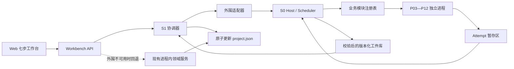

# 外围平台 S1 / P03—P12 业务模块设计

**版本：** 1.0  
**日期：** 2026-08-10  
**适用代码库：** `F:\ppt-video-workbench-v3`  
**前置条件：** S0 G1—G4 自动化门禁通过；S0 Windows G5 在进入 S1 发布候选前必须补齐实机证据。

## 1. 背景与结论

现有程序已经形成一条稳定的七步制作流程：新建项目、导入材料、材料解析与匹配、逐页旁白校对、配音与音频对齐、效果预览与完整预检、渲染与导出。现有 S0 外围平台则提供了独立进程、任务状态、重试、取消、事件、工件发布、SQLite 恢复、路径隔离和主程序降级能力，但只注册了 Echo 模块，不承载业务逻辑。

S1 采用“主程序掌握业务状态，外围平台承担重任务”的渐进式模块化方案：

- 主程序继续作为 `project.json`、工作流门禁、人工确认和缓存失效规则的唯一权威。
- S0 继续作为任务状态、模块进程、重试、取消、事件和工件校验的唯一权威。
- P03—P12 每个模块是独立进程入口，通过版本化请求和结果工件通信，不直接修改 `project.json`。
- 主程序中的 S1 协调器验证结果工件、物化文件并通过类型化投影器原子更新项目清单。
- 外围平台关闭、崩溃或版本不兼容时，原有同步业务接口仍可按功能开关回退，不阻断项目打开、编辑和旧流程运行。

该方案优先复用现有 `workbench` 服务和领域模型，不复制 DOCX/PPTX/PDF/OCR、旁白、音频、字幕、特效、预检和渲染算法。

## 2. 方案比较

### 2.1 方案 A：渐进式进程模块化（采用）

保留现有主程序 API 和领域服务，将耗时业务包装成 P03—P12 独立进程。主程序通过 S1 协调器提交任务并消费结果，未迁移的调用仍走原有进程内服务。

优点是改动可分批发布、回滚简单、复用率高，并且 S0 已有的重试和恢复能力能直接承接。代价是迁移期需要维护“外围执行/本地回退”双路由，但两条路共用同一领域服务和验收样例，避免行为分叉。

### 2.2 方案 B：一次性把全部业务复制到外围平台（不采用）

这种方式表面上边界清晰，但会复制现有领域模型、缓存、门禁和错误处理，造成 `project.json` 双写、行为漂移和打包体积失控。P03—P12 任一处差异都可能让主程序与外围数据库出现不可恢复的不一致。

### 2.3 方案 C：拆成十个常驻服务（不采用）

十个独立服务需要端口管理、发现、升级、鉴权和跨服务追踪，明显超过单机桌面应用当前需要。S0 的单主控加短生命周期子进程已经能提供故障隔离，不需要引入服务网格式复杂度。

## 3. 目标与非目标

### 3.1 目标

1. 将现有完整制作链映射为 P03—P12 十个边界稳定的业务模块。
2. 长任务可观测、可取消、可重试、可恢复，付费任务不重复提交。
3. 任务结果可审计：每个输入、输出、版本、哈希、人工确认和错误均可追溯。
4. 以页面为最小增量单元，复用现有依赖图，单页变化不重算无关页面。
5. 维持本机安全边界：仅回环地址、相对路径、工件哈希校验、日志脱敏。
6. 维持现有用户工作流和七步界面，不要求用户理解 P03—P12 编号。

### 3.2 非目标

- 不让业务模块直接写主程序的 `project.json`、设置文件或工作区索引。
- 不把 S0 SQLite 变成第二份完整项目数据库。
- 不在 S1 引入云端控制面、消息队列或新的常驻 Windows 服务。
- 不改变本地录音和 HeyGen 两条音频路线互斥、旁白确认门禁、预检门禁。
- 不以静态检查代替 Windows、Office、真实 HeyGen、真实音视频主观验收。

## 4. 总体架构



### 4.1 权威边界

| 数据或动作                       | 唯一权威                      | 说明                                   |
| -------------------------------- | ----------------------------- | -------------------------------------- |
| 项目业务状态、当前步骤、人工确认 | 主程序 `ProjectManifest`      | 只由主程序存储服务原子写入             |
| 任务队列、attempt、重试、取消    | S0 SQLite                     | 主程序不自行推断外围运行状态           |
| 工件版本、大小、SHA-256          | S0 工件仓库                   | 发布后不可覆盖，只能产生新版本         |
| 缓存失效范围                     | 主程序 `DependencyGraph`      | 模块只报告输入指纹，不决定业务清理范围 |
| 远端付费请求 ID                  | P07 结果及检查点              | 重试前必须先查询远端状态               |
| 最终放行与人工确认               | P10/P12 报告 + 主程序确认记录 | 模块不能自行越过阻断项                 |

### 4.2 代码组织

S0 的 `peripheral_contracts`、`peripheral_host` 和 `workbench_peripheral_adapter` 保持独立。S1 业务模块放在主程序包的 `workbench.business_modules` 下，从现有领域服务导入实现；S0 通过可选注册表动态加载这些模块。这样不形成 Python 包依赖环，也不复制领域算法。

每个模块包含四个小单元：参数模型、执行器、结果投影模型、CLI 入口。通用的请求读取、事件输出、原子结果写入、错误映射、检查点和脱敏由 `workbench.business_modules.runtime` 提供。

## 5. 通用契约

### 5.1 任务命名

业务任务使用稳定的小写点分名称：`material.ingest`、`document.extract`、`content.match`、`narration.generate`、`audio.transcribe`、`subtitle.build`、`effect.plan`、`preflight.run`、`video.render`、`quality.verify`。job type 一旦发布不重命名；语义变化通过参数中的 `payload_schema_version` 和模块语义版本表达。

### 5.2 输入快照

每次提交都必须包含：

- `project_id`、`project_revision` 和调用者；
- `job_type`、`idempotency_key`、优先级；
- 输入工件 ID、相对路径、大小和 SHA-256；
- `payload_schema_version = "1.0"`；
- 影响页面列表、运行时版本、算法/模板版本；
- 不含密钥明文的配置引用。

幂等键固定由 `job_type + project_id + project_revision + normalized_parameters + input_hashes` 的 SHA-256 生成。相同请求返回已有任务；业务参数或任一输入变化才生成新任务。

### 5.3 业务结果清单

每个成功任务至少发布一个 `business-result.json`，其公共字段为：

```json
{
  "schema_version": "1.0",
  "module_id": "P04",
  "job_type": "document.extract",
  "project_id": "uuid",
  "project_revision": 12,
  "input_fingerprint": "64-char-sha256",
  "cache_key": "64-char-sha256",
  "result_type": "document_extraction",
  "payload": {},
  "artifacts": []
}
```

`payload` 必须由 job type 对应的严格 Pydantic 模型验证；不允许模块提交任意 JSON Patch。主程序的结果投影器只接受当前项目 revision，或在输入哈希仍一致时接受可证明安全的旧 revision 结果。其余结果进入 `quarantine` 并记录 `STALE_PROJECT_REVISION`，不写项目清单。

### 5.4 工件传递

主程序不读取 S0 的绝对路径。S0 新增按 artifact ID 的本机流式读取接口；适配器分块下载到项目内临时文件，校验声明大小和 SHA-256 后通过 `os.replace` 发布。大型 MP4 也走流式传递，不把内容装入内存。S0 仍不向浏览器或日志暴露物理路径。

### 5.5 事件

公共事件包括：`module.started`、`module.progress`、`module.checkpointed`、`module.warning`、`module.completed`。事件 data 只允许页 ID、阶段、计数、百分比、稳定错误码和脱敏指标，不含旁白正文、密钥、完整用户路径或模块 stderr。

## 6. P03—P12 模块定义

| 编号 | 模块               | 主要 job type                                                            | 输入                                        | 输出                                       | 放行条件                                |
| ---- | ------------------ | ------------------------------------------------------------------------ | ------------------------------------------- | ------------------------------------------ | --------------------------------------- |
| P03  | 项目与素材接入     | `material.ingest`、`material.reorder`                                    | DOCX/PPTX/PDF/图片及项目快照                | 安全副本、来源清单、顺序、哈希             | 文件头合法、路径安全、无同名覆盖        |
| P04  | 文档解析与 OCR     | `document.extract`、`document.ocr`                                       | P03 来源工件                                | 大纲、逐页文本、bbox、预览图、解析报告     | 页数一致；加密/空页/低置信度显式报告    |
| P05  | 页面匹配与结构校审 | `content.match`                                                          | P04 大纲与页提取                            | 候选、置信度、匹配理由、冲突清单           | 每个目标页有唯一有效匹配或人工覆盖      |
| P06  | 旁白生成与版本确认 | `narration.generate`、`narration.import`、`narration.export`             | 当前页、匹配大纲、LLM 配置引用              | 不可变旁白 revision、来源引用、DOCX        | 所有当前 revision 经人工确认            |
| P07  | 配音与音频对齐     | `audio.normalize`、`audio.transcribe`、`audio.synthesize`、`audio.align` | P06 确认旁白、本地录音或 HeyGen 引用        | 逐页音频、转写、差异、时间线、远端审计     | 单一路线完整；差异已处理；revision 一致 |
| P08  | 字幕与时间轴       | `subtitle.build`                                                         | P07 逐页音频、词级时间戳、确认旁白          | 字幕时间线、SRT、字幕布局约束              | 时间戳有序、无负时长和不可接受重叠      |
| P09  | 视觉效果与视频参数 | `effect.plan`、`video.props.build`                                       | 页面预览、文本、P07/P08 时间轴              | EffectPlan V2、ProjectVideoProps、避让结果 | schema 有效；碰撞与节奏规则通过         |
| P10  | 效果预览与完整预检 | `preview.build`、`preflight.run`                                         | P03—P09 当前工件、运行时探针                | 预览、六域问题目录、JSON/Markdown 报告     | 阻断项为零，确认项均有审计记录          |
| P11  | 分页渲染与制作包   | `video.render`、`video.assemble`、`package.build`                        | P09 props、P08 字幕、P07 音频、P10 放行报告 | 分页 MP4、成片、制作包和清单               | 每页和成片编码、时长、哈希验证通过      |
| P12  | 质量验收与交付归档 | `quality.verify`、`delivery.archive`                                     | P11 制作包、P10 报告、验收策略              | 质量报告、交付判定、归档索引、证据清单     | 自动门禁通过；需人工项完成签署          |

### 6.1 P03 项目与素材接入

P03 复用现有文件头校验、安全复制、自然排序和手动排序能力。浏览器上传仍先进入主程序受控临时区，再以输入工件方式提交，模块无权读取任意用户路径。模块不创建项目，只对已存在项目 revision 生成来源清单。重复导入相同哈希命中已有结果，不覆盖同名文件。

### 6.2 P04 文档解析与 OCR

P04 复用 DOCX、PPTX、PDF、图片和 PaddleOCR 适配器。解析策略进入缓存键：解析器版本、LibreOffice 版本、OCR 模型/策略、源哈希和目标预览尺寸。PPTX 隐藏页保留标记但默认不进入制作页；加密 PDF 直接产生不可重试 `INPUT/PDF_ENCRYPTED`。低置信度 OCR 可成功产出，但必须附带需确认警告。

### 6.3 P05 页面匹配与结构校审

P05 复用固定权重匹配和候选分解。自动结果只产生建议，不覆盖既有人工绑定；人工绑定由主程序记录并成为下一次任务的约束输入。空页、重复页、标题冲突和一对多候选进入结构化冲突清单。

### 6.4 P06 旁白生成与版本确认

P06 的生成任务每次只接收当前页和匹配大纲，避免跨页正文泄漏。LLM 密钥只由主程序凭证服务解析成短生命周期调用环境，绝不进入 envelope、结果或日志。生成、编辑、恢复和导入均产生新的不可变 revision。确认动作仍在主程序执行，外围模块不能代替用户确认。

### 6.5 P07 配音与音频对齐

P07 同时承载本地录音和 HeyGen 两条互斥路线。对本地录音执行规范化、ASR、旁白差异和动态分页面；对 HeyGen 执行声音选择后的逐页合成、成功页缓存和失败页重试。付费调用在提交前保存远端请求 ID；主机恢复或重试时先查询远端状态，禁止重复计费。任何页面绑定旧旁白 revision 都阻断 P08。

### 6.6 P08 字幕与时间轴

P08 以当前 `PageAudio[]`、词级时间戳和确认旁白构建无重叠字幕。没有可靠词级时间戳时使用确定性的字数/时长分配并标记降级来源。输出同时包含机器可读时间线与 SRT；样式和安全区约束单独版本化，不把最终像素布局写死在文本字幕中。

### 6.7 P09 视觉效果与视频参数

P09 将现有 EffectPlan V2、节奏、背景、图表、模板、字幕避让和 presenter 碰撞规则收口为确定性输入到确定性输出。AI 只可提出受 schema 限制的候选，最终计划必须经过本地校验器。`ProjectVideoProps` 固定 1920×1080、16:9、30 FPS，并记录 EffectPlan revision/hash、模板版本和 reduced-motion。

### 6.8 P10 效果预览与完整预检

P10 生成与生产渲染同源的 Remotion 预览，并运行 materials、content、audio、video、runtime、resources 六域预检。输入指纹未变化的检查可复用。阻断项禁止渲染；确认项由主程序记录人员、时间和说明后重新投影为放行报告。P10 故障不损坏项目，用户仍可返回前序步骤修复。

### 6.9 P11 分页渲染与制作包

P11 以页面为缓存和重试单元，先生成分页 MP4，再由 FFmpeg 合并 H.264/AAC 成片。每个页面在 30% 和 70% 处写检查点；取消仅清理检查点声明的临时文件。制作包至少包含最终视频、SRT、旁白确认版、逐页音频、Remotion props、预检报告、日志清单和工件清单。

### 6.10 P12 质量验收与交付归档

P12 对制作包执行 ffprobe 编码/分辨率/帧率/时长校验、音视频总时长容差、字幕边界、工件清单哈希、敏感信息扫描和交付目录安全检查。自动通过不等于正式签署：Windows/Office、真实 HeyGen、人工听感和画面检查按验收策略决定是否为必需。归档采用不可变版本目录和索引，不删除源项目或覆盖历史交付。

## 7. 端到端数据流

1. 用户在现有七步界面发起动作，API 根据功能开关选择外围执行或本地回退。
2. S1 协调器读取当前 `ProjectManifest`，冻结输入工件、项目 revision 和依赖版本，计算幂等键。
3. 适配器提交 `JobEnvelope`；API 返回 202 和 job ID，前端展示进度、取消、重试和降级提示。
4. S0 调度器启动对应模块进程；模块只在 attempt 目录写临时输出，通过 NDJSON 输出事件。
5. 模块原子写 `JobResult`；S0 验证契约、job ID、工件大小和哈希后发布版本化工件。
6. 主程序协调器检测成功状态，流式获取 `business-result.json` 和业务工件，再次校验哈希与结果类型。
7. 投影器检查项目 revision 和输入指纹，调用现有存储服务一次性写入文件、领域记录、审计事件和缓存失效计划。
8. 项目保存成功后记录 `projection.applied`；重复消费同一 job ID 返回既有投影，不重复写入。
9. 若投影失败，任务结果保持可重放，项目保持旧状态，用户看到稳定错误码而非半完成结果。

## 8. 状态、重试、取消和恢复

- 沿用 S0 状态：`queued → running → succeeded|failed`，可重试错误进入 `retry_wait`，取消经过 `cancelling → cancelled`。
- 自动重试最多三次，退避为 5、30、120 秒；认证、输入、QA 和契约错误默认不可重试。
- P07 付费任务、P11 长渲染必须写业务检查点；重启后先验证检查点工件哈希。
- 模块退出码 0 不代表成功；必须有合法 `JobResult` 且所有工件通过校验。
- S0 数据库异常时停止外围写入，不重建原库；主程序状态显示 degraded 并保留本地回退。
- 投影采用 inbox 记录：`job_id` 唯一，状态为 `pending/applied/quarantined`，解决“任务成功但主程序尚未写入”的恢复窗口。

## 9. 错误模型

沿用十类错误：`ENVIRONMENT`、`CONFIGURATION`、`AUTHENTICATION`、`NETWORK`、`PROVIDER`、`INPUT`、`PROCESSING`、`STORAGE`、`QA`、`INTERNAL`。每个错误包含稳定代码、用户说明、可重试标志和脱敏详情。

关键规则：

- HTTP 401/403 为 `AUTHENTICATION`；429/5xx 为 `PROVIDER`；连接/DNS 为 `NETWORK`。
- 加密文件、损坏文件、旧 revision 和门禁缺项为不可重试 `INPUT` 或 `QA`。
- 运行时缺失和磁盘不足为 `ENVIRONMENT`/`STORAGE`；修复环境后可由用户重试。
- 未捕获异常统一映射为 `INTERNAL/MODULE_INTERNAL_ERROR`，API 和日志不返回堆栈或 stderr。
- 错误详情不得包含密钥、Authorization、Cookie、旁白正文、用户目录或绝对路径。

## 10. 安全与隐私

- Host 与主程序只监听 `127.0.0.1`/`localhost`，不开放任意 CORS、Swagger 或外部绑定。
- 输入只允许工作区内相对路径；拒绝盘符、UNC、`..`、ADS、符号链接、重解析点和保留设备名。
- 模块进程只继承白名单环境变量；凭证通过专用短生命周期引用注入，事件和检查点自动脱敏。
- 请求体默认上限 1 MiB；大文件只作为已哈希工件流转。
- 发布工件不可覆盖；下载时验证 artifact ID 与 job/project 归属，支持长度限制和分块读取。
- P12 对交付包和诊断证据进行密钥、Bearer、JWT、用户路径和请求正文残留扫描。

## 11. 性能与资源策略

- S1 第一版保持 S0 单调度 worker，避免 CPU、内存、FFmpeg、OCR 和浏览器互相争抢；后续只有在实测证明安全后才按资源类别增加并发。
- 页面级任务优先批量提交但独立缓存；成功页不因另一页失败而重算。
- OCR、ASR、HeyGen、页面渲染和成片合成必须上报 0—100 整数进度。
- 默认资源门禁：剩余空间低于 5 GiB 警告，低于 1 GiB 阻断 P11；实际预计输出大于剩余空间 70% 时阻断。
- 运行时、算法、模板和模型版本均进入缓存键，升级只失效声明不兼容的节点。

## 12. 界面与兼容

七步导航保持不变，P03—P12 编号仅在任务详情、诊断和技术文档中显示。耗时操作显示任务状态、百分比、当前阶段、取消/重试按钮和错误处理建议。外围不可用时显示统一 degraded 提示；支持本地回退的动作继续执行，不支持回退的新能力保持禁用但不锁死项目。

API 兼容策略：现有同步端点保留；S1 新增异步提交后，旧端点内部可等待短任务完成或返回受控 202。前端逐步迁移到统一任务面板，不要求一次性改完所有页面。

## 13. 测试与验收门禁

### 13.1 每模块共同门禁

- 参数和业务结果模型的单元测试、JSON Schema 快照和未知字段拒绝。
- 成功、永久失败、可重试失败、取消、超时、非法结果、旧 revision 的进程集成测试。
- 同一幂等键不重复执行；输入哈希变化会创建新任务。
- 工件缺失、大小不符、哈希不符、路径越界全部失败且零投影。
- 日志、事件、检查点、API 错误和交付包敏感信息扫描零命中。
- 外围关闭、Host 被杀、SQLite 不可用时主程序仍可打开项目并使用允许的本地回退。

### 13.2 端到端样例

固定 8 页项目依次通过 P03—P12，覆盖 DOCX/PPTX/可搜索 PDF/扫描 PDF/多图片、本地音频和 fake HeyGen。验证：

- 8 页顺序、匹配、旁白 revision、逐页音频、字幕、效果计划和 props 一致；
- 单页旁白变化只重建该页 P07—P11 依赖和最终成片；
- P07 第 5 页失败重试时其余成功页不重复调用；
- P11 第 5 页渲染失败只重试该页；
- Host 在 30%/70% 被杀后恢复，最终工件哈希与不中断基线一致；
- 制作包文件齐全、哈希正确，P12 产生明确 pass/block 决策。

### 13.3 发布门禁

S1 进入发布候选必须同时满足：Python 全量、Ruff、严格 mypy、Web/Remotion 测试、TypeScript、ESLint、Prettier、生产构建、Playwright、S0/S1 契约与安全测试全部通过。Windows 10/11 中文用户名/中文路径、Office/LibreOffice、PaddleOCR、faster-whisper、FFmpeg/Remotion、真实 HeyGen 小额调用和人工音视频验收必须形成独立证据，不得由 fake 测试冒充。

## 14. 分阶段交付

1. **S1-A 基础契约与投影：** 结果清单、工件流、inbox、协调器、注册表和统一任务 UI。
2. **S1-B P03—P05：** 素材、解析/OCR、匹配，完成前半段无外部付费链路。
3. **S1-C P06—P08：** 旁白、音频、字幕，重点验证凭证、付费幂等和页面增量。
4. **S1-D P09—P10：** 效果计划、props、预览和完整预检，冻结生产渲染输入。
5. **S1-E P11—P12：** 长渲染、制作包、质量验收和归档。
6. **S1-RC：** 全链故障注入、Windows 实机、真实服务、小额付费、主观音视频与回滚演练。

每个阶段可独立启用 `PERIPHERAL_S1_MODULES` 白名单；未启用模块继续使用现有本地路径。回滚只关闭对应模块并回退二进制，不执行数据库降级 SQL、不删除项目和已验证工件。

## 15. 完成定义

S1/P03—P12 完成必须同时满足：十个模块均通过契约、进程、集成、安全和端到端门禁；主程序不存在双写和半投影；外围故障不破坏原有流程；固定 8 页项目可从素材进入到 P12 交付；单页增量、取消、重试、重启恢复、付费幂等和工件哈希均有自动化证据；Windows 与真实服务所需的人工证据已签署；发布、降级和回滚步骤可重复执行。
