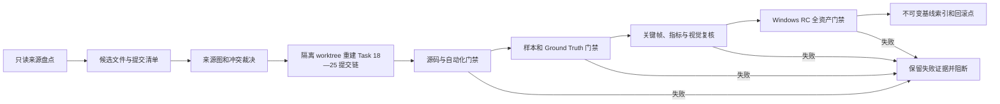

# Effects V2 Task 18—25 正确源码找回与验收基线冻结设计

**状态：** Draft  
**日期：** 2026-08-11  
**适用范围：** Effects V2 Task 18—25 的源码、真实样本、Ground Truth、自动化结果、视觉复核及 Windows RC 证据  
**最终目标：** `TASK18_25_BASELINE_FROZEN=PASS`

## 1. 背景与当前结论

本项目的 Task 18—25 构成一条连续的发布收口链：Task 18 建立 Windows 发布/回滚入口，Task 19 冻结全绿自动化基线，Task 20 建立 G0—G6 门禁模型，Task 21—24 完成真实样本、Ground Truth、量化指标和逐页视觉复核，Task 25 冻结单一 Windows RC。

当前工作区保留了相当一部分代码和证据，但不能直接认定为正确、完整、可发布的 Task 25 基线。2026-08-11 的只读检查得到以下事实：

| 检查项             | 当前观察                                                                                                                                                                 | 判定                                                       |
| ------------------ | ------------------------------------------------------------------------------------------------------------------------------------------------------------------------ | ---------------------------------------------------------- |
| 当前分支/HEAD      | `recovery/root-snapshot-20260810` / `117fb60cbb0ca877c0920a26f5ceb31d8e42e901`                                                                                           | 恢复快照，不等于 Task 25 冻结点                            |
| 工作区             | 大量已修改和未跟踪文件                                                                                                                                                   | 不允许直接作为冻结源码                                     |
| 状态文档记录的提交 | Task 18 `a68d7ee`、Task 19 `1169409`/基线 `353b911...`、Task 20 `a601226`、Task 21 `6864866`、Task 22 `817dac6`、Task 23 `32eec78`、Task 24 `4c9d8ce`、Task 25 `3900bf5` | 当前对象库全部不可解析，必须找回或重建来源链               |
| 不可达 Git 对象    | `git fsck --full --no-reflogs --unreachable` 未发现不可达提交                                                                                                            | 当前对象库内部没有可直接捞回的 Task 18—25 提交             |
| 30 页样本          | 当前目录有 30 个 PPTX 及元数据                                                                                                                                           | 仅证明文件存在，尚未证明与原授权压缩包和 Task 21 提交同源  |
| Task 22—24 代码    | 当前 `ground_truth.py`、`acceptance_runner.py`、`frame_output.py`、`visual_review.py` 及对应原始测试缺失                                                                 | 当前源码链不完整                                           |
| Windows 安装包     | `release/ppt-video-workbench-setup.exe` 存在，SHA-256 为 `6f6f84a06b76a0f4638d767496de388b12251c2539de543849a42453c5b04d6d`                                              | 与 RC 清单中的安装包哈希一致                               |
| RC 资产            | 当前 manifest SHA-256 为 `55b1384e...`，Ground Truth 为 `524b313c...`，visual review 为 `fa51b8ea...`                                                                    | 前两项与 RC 清单声明的 `0c82cda2...`、`0a5f8252...` 不一致 |
| RC 校验器          | 当前 `verify_effect_release.py --root .` 返回 `valid=true`                                                                                                               | 校验器只校验安装包，未校验清单中的三项资产，属于假绿风险   |
| 外部 Windows 证据  | `F:\Video\acceptance-effects-v2\acceptance-evidence.jsonl` 当前存在                                                                                                      | 必须校验内容、候选身份、时间、哈希和阶段完整性后才能采用   |
| 恢复包             | 当前工作区未找到文档提到的两个 Task 26 ZIP 和原始上传 ZIP                                                                                                                | 需要按来源清单继续定位，不能根据文档描述假定存在           |

因此，本方案把“历史文档声称通过”“当前文件可以运行”“当前候选可冻结”严格区分。历史结果可以作为找回线索，但不能代替当前可复现证据。

## 2. 目标与非目标

### 2.1 目标

- 找回或可审计地重建 Task 18—25 的逐任务源码状态，并给每个文件确定唯一来源。
- 形成一条可复现、可二分、可回滚的 Task 18 → Task 25 线性提交链。
- 分层冻结源码基线、自动化基线、样本基线、视觉复核基线和 Windows RC 基线。
- 让所有验收结果绑定同一个 `source_commit`、依赖锁哈希、样本哈希和 `candidate_id`。
- 修复任何会产生假绿的门禁；缺证据、错哈希、来源冲突和候选漂移一律阻断。
- 保留原始恢复材料和失败证据，不覆盖、不清理、不改写现有 Git 历史。

### 2.2 非目标

- 不在找回阶段继续开发 Task 26 之后的新功能。
- 不把当前脏工作区整体提交成“恢复基线”。
- 不以文档中的短哈希、测试数量或 `passed` 字样替代实际提交和日志。
- 不重新制作 30 页素材，也不改变原授权范围和页面分类。
- 不在缺少 Windows 实机证据时宣称 Windows RC 通过。
- 不删除旧安装包、旧证据、用户项目、生产数据库或恢复包。

## 3. 核心术语和冻结层级

| 层级          | 标记                        | 内容                                                         | 通过条件                                            |
| ------------- | --------------------------- | ------------------------------------------------------------ | --------------------------------------------------- |
| L0 来源清单   | `PROVENANCE_FROZEN`         | Git 对象、分支、worktree、恢复包、安装包、外部证据的只读清单 | 每个候选有路径、大小、SHA-256、采集时间和来源级别   |
| L1 源码链     | `SOURCE_FROZEN`             | Task 18—25 的线性源码提交链                                  | 每个任务一个可解析提交，文件归属无冲突，树可重建    |
| L2 自动化     | `AUTOMATION_FROZEN`         | Task 19 全绿基线及 Task 20 门禁测试                          | 从 L1 的干净快照首轮通过，日志不可变且可追溯        |
| L3 样本合同   | `SAMPLE_FROZEN`             | Task 21 manifest、30 个 PPTX、元数据、Task 22 Ground Truth   | 授权、数量、分类、全部哈希和交叉引用一致            |
| L4 效果验收   | `EFFECT_ACCEPTANCE_FROZEN`  | Task 23 指标、关键帧和 Task 24 视觉复核                      | 输出可复现，无 P0/P1，缺陷记录完整且绑定 L1/L3      |
| L5 Windows RC | `WINDOWS_RC_FROZEN`         | Task 25 安装包、全资产清单、Windows 证据                     | 同一候选、全哈希复核、V2 默认关闭、Windows 阶段完整 |
| L6 总基线     | `TASK18_25_BASELINE_FROZEN` | 上述各层的索引、签署和回滚点                                 | L0—L5 全部通过；任一层阻断则总状态为 BLOCKED        |

“历史通过”只是一条 `historical_claim`；只有在本次恢复运行中复核后，才可提升为对应冻结层级。

## 4. 来源权威顺序与冲突处理

### 4.1 来源优先级

从高到低采用以下权威顺序：

1. 可解析的原始 Git 提交，且父链、提交树和任务文档能够互相印证。
2. 可验证来源的 Git bundle/裸库/仓库备份中的原始提交。
3. SHA-256 已登记的只读恢复包，并能恢复出完整文件集和元数据。
4. 其他 worktree 或快照中的文件，且能通过内容、时间和交叉引用证明来源。
5. 当前脏工作区的文件差异。
6. 状态文档、README、日志中的叙述性记录。

低优先级来源不能覆盖高优先级来源。两个同级候选冲突时，均保留并标记 `conflict`，通过父链、内容哈希、测试及下游引用解决；禁止按修改时间或“看起来更新”直接选择。

### 4.2 每个文件必须记录的来源字段

```json
{
  "path": "apps/api/src/workbench/effects/ground_truth.py",
  "task": 22,
  "source_kind": "git_commit|archive|worktree|working_tree|reconstructed",
  "source_locator": "<commit-or-absolute-evidence-id>",
  "source_sha256": "<64-hex>",
  "selected_sha256": "<64-hex>",
  "decision": "selected|rejected|conflict|reconstructed",
  "decision_reason": "<reason>",
  "reviewed_by": "<reviewer>",
  "reviewed_at": "<ISO-8601>"
}
```

重建文件必须同时记录依据文件、行为契约、红灯测试和审查结论，不能伪装成找回的原始文件。

## 5. Task 18—25 追踪矩阵

| Task | 目标与历史提交线索                                                     | 应找回的核心文件/证据                                                                        | 冻结门禁                                                            |
| ---- | ---------------------------------------------------------------------- | -------------------------------------------------------------------------------------------- | ------------------------------------------------------------------- |
| 18   | Windows 发布、回滚与最终验收；`a68d7ee`                                | `verify_effect_release.py`、Windows 验收脚本、operator/release/rollback 文档、发布完整性测试 | 发布校验 fail-closed；回滚只关 V2、不删数据；实机缺失不得假绿       |
| 19   | 消除 OpenAPI 漂移并冻结全绿基线；提交 `1169409`，历史基线 `353b911...` | `packages/contracts/openapi.json`、`current-test-baseline.json`、完整测试日志                | 契约/后端/Web/Remotion/typecheck/ruff/mypy 首轮通过并绑定源码提交   |
| 20   | G0—G6 发布门禁；`a601226`                                              | `release_models.py`、`release_gate.py`、16 个门禁测试                                        | G1—G5 缺证据必须拒绝，纯模型不改变运行路径                          |
| 21   | 真实 30 页样本、哈希与授权；`6864866`                                  | 原上传 ZIP 或等价来源证据、30 个 PPTX/元数据、manifest、inventory                            | 30/30 授权、唯一哈希、十类各 3 页、相对路径、无占位值               |
| 22   | Ground Truth 和字幕安全区；`817dac6`                                   | `ground_truth.py`、Ground Truth JSON、8 个测试                                               | 30/30 绑定；cue、安全区、关键帧、L3 约束及 source hash 全部一致     |
| 23   | 计划、关键帧和量化指标；`32eec78`                                      | `acceptance_runner.py`、`frame_output.py`、两个脚本、测试、结果和 90 帧                      | 30/30 输入复核、90/90 帧、六项指标、plan hash 一致、L3 假阳性为 0   |
| 24   | 逐页视觉复核和缺陷闭环；`4c9d8ce`                                      | `visual_review.py`、测试、visual-review JSON、报告、实际帧                                   | 30 页独立记录；P0/P1=0；P2/P3 必须有影响和规避；静态/动态边界明确   |
| 25   | 单一 Windows RC 和全哈希清单；`3900bf5`                                | `rc_manifest.py`、build/verify 脚本、RC manifest、安装包、Windows 日志                       | 安装包和所有资产逐项重算；同一候选；V2=false；完整 Windows 阶段通过 |

## 6. 目标恢复架构



恢复工作在新分支 `codex/effects-task18-25-recovery` 和独立 worktree 中进行。当前恢复根工作区仅作为只读来源，不执行 reset、clean、checkout 覆盖或批量复制。

## 7. 恢复与重建方法

### 7.1 来源盘点

- 记录所有 Git refs、worktree、HEAD、状态和 object database 健康度。
- 对文档声明的每个完整/短提交执行 `git cat-file -e`；短哈希只有唯一解析后才有效。
- 检查 reflog、`git fsck`、Git bundle、裸库、仓库备份及恢复快照。
- 定位文档所指 Task 26 恢复包、原始 30 页上传包、旧安装包和外部 Windows 证据。
- 对每个外部来源先计算 SHA-256，再复制到唯一只读证据目录；压缩包先做路径穿越、重复项、绝对路径和符号链接检查。
- 若需要读取 `F:\git仓库` 下的仓库，必须先刷新并读取仓库注册表，按精确路径选择仓库，禁止根据邻近目录猜测。

### 7.2 提交和文件归属重建

- 以 Task 17 的可信末端作为重建父提交；若 Task 17 自身不可信，先阻断并建立前置恢复项。
- 每个 Task 只引入该任务追踪矩阵列出的源码、测试和文档，不整目录覆盖。
- 对每个候选执行语义 diff：公共 API、schema、默认值、路径处理、哈希算法、错误码和测试契约均需逐项比较。
- 每个任务先复现历史红灯或缺失行为，再选择/重建实现并运行该任务门禁。
- 每个任务形成一个恢复提交和一个 stop-point；提交信息标注 `recovered-from` 或 `reconstructed-from-contract`。
- 任何文件同时被多个 Task 声称所有时，记录演化链而不是只保留最终文件。

### 7.3 验收重放

- Task 19 的全绿基线必须从干净、依赖锁定的快照首轮运行；当前脏工作区的通过结果不能采用。
- Task 21—22 先重算每个源 PPTX 的 SHA-256，再验证 manifest、metadata 和 Ground Truth 的三方一致性。
- Task 23 产生的新输出写入按 `run_id` 隔离的目录；不得覆盖旧帧和旧结果。
- Task 24 只接受实际 Task 23 输出的引用；自动生成的占位 reviewer、时间或决策不得作为人工签署。
- Task 25 verifier 必须重算安装包、education manifest、Ground Truth、visual review 以及源码/锁文件清单，而不是只校验安装包。
- Windows 证据必须包含 candidate/source/installer/asset hashes；任一字段缺失、候选不一致或阶段不完整时均为 `BLOCKED`。

## 8. 基线与证据数据模型

本次恢复输出根目录建议为：

```text
docs/acceptance/effects-task18-25-recovery/
├── README.md
├── runs/<run_id>/
│   ├── environment.json
│   ├── source-inventory.json
│   ├── commit-resolution.json
│   ├── candidate-ledger.json
│   ├── path-ownership.json
│   ├── command-log.jsonl
│   ├── test-results/
│   ├── sample-audit/
│   ├── visual-review/
│   └── windows/
├── stop-points/task-18.json ... task-25.json
├── task18-25-source-manifest.json
├── task18-25-acceptance-baseline.json
└── task18-25-freeze-index.json
```

冻结索引至少包含：

- schema version、freeze id、UTC 时间、决策和 reason codes；
- Task 18—25 每个恢复提交及其父提交；
- `git status --porcelain=v1` 为空的证明；
- Python/Node/pnpm/uv/FFmpeg/Remotion/Windows 版本；
- `uv.lock`、`pnpm-lock.yaml`、OpenAPI/schema 的哈希；
- 30 个 PPTX、metadata、manifest、Ground Truth、视觉复核的完整哈希树；
- 安装包大小和 SHA-256；
- 每条测试/实机证据的相对路径、大小和 SHA-256；
- 已知警告、豁免、缺陷、签署人及失效条件。

大型 PPTX、PNG、日志和 EXE 可保存在受控外部证据目录，但仓库内索引必须记录内容哈希和稳定 locator，且冻结工具必须能够重新解析它们。

## 9. 门禁设计

| Gate | 名称              | 核心检查                                         | 失败处理                     |
| ---- | ----------------- | ------------------------------------------------ | ---------------------------- |
| R0   | Workspace Safety  | 当前工作区只读、恢复 worktree 隔离、证据目录唯一 | 阻断任何源码写入             |
| R1   | Provenance        | 声明提交逐一解析；候选来源、哈希、冲突完整登记   | 标记缺失/冲突，不猜测        |
| R2   | Source Chain      | Task 18—25 提交线性、文件归属完整、工作树干净    | 回到最后一个 stop-point      |
| R3   | Automation        | Task 19 全量、Task 20 G0—G6 及任务级测试首轮通过 | 保留红灯日志，修复后新 run   |
| R4   | Sample Contract   | 30 页、授权、十类、唯一哈希、GT 绑定             | 阻断 Task 23 以后流程        |
| R5   | Effect Acceptance | 90 帧、量化指标、visual review、P0/P1            | 阻断 RC 构建                 |
| R6   | RC Integrity      | installer 与全部资产哈希、候选身份、V2=false     | RC 状态为 BLOCKED            |
| R7   | Windows Chain     | 安装/启动/预览/导出/重启/回滚/隔离/保留数据      | 不得生成 Windows freeze 标记 |
| R8   | Final Freeze      | L0—L5 引用无漂移、双重复核、rollback 可用        | 不生成总冻结标记             |

### 9.1 假绿防护

以下任一情况必须失败关闭：

- verifier 只验证部分 manifest 字段；
- 文档记录的哈希与实际文件不一致；
- 测试日志未绑定 source commit 或来自脏工作区；
- evidence 引用绝对临时路径、缺文件或哈希错误；
- 人工视觉复核引用的帧不是本次 Task 23 输出；
- Windows 验收使用了不同安装包、不同源码或不同资产；
- 重跑覆盖第一次失败，或仅保留最终通过结果；
- V2/L3 默认开关被打开。

## 10. 验证策略

### 10.1 Git 与来源

```powershell
git fsck --full
git cat-file -e <commit>^{commit}
git show -s --format="%H %P %T %s" <commit>
git diff --no-index <candidate-a> <candidate-b>
Get-FileHash -Algorithm SHA256 <evidence>
```

### 10.2 Python 与 Effects

```powershell
uv run pytest tests/unit/effects -q
uv run pytest tests/contracts/test_project_schema.py -q
uv run ruff check apps/api/src/workbench/effects tests/unit/effects scripts
uv run mypy apps/api/src
```

恢复出的 Task 22—25 原始测试必须加入对应命令，不能用当前简化的 recovery contract 代替。

### 10.3 Web、Remotion 与契约

```powershell
pnpm --filter @workbench/web typecheck
pnpm --filter @workbench/web test
pnpm --filter @workbench/remotion typecheck
pnpm --filter @workbench/remotion test
```

实际包名和测试命令从恢复提交的 `package.json`/锁文件读取并记录；禁止为了让命令通过而静默跳过项目。

### 10.4 样本、视觉与 RC

```powershell
uv run python scripts/run_effect_acceptance.py --help
uv run python scripts/render_effect_regression.py --help
uv run python scripts/verify_effect_release.py --root .
```

RC verifier 的验收测试至少覆盖：缺安装包、安装包错哈希、每一种资产缺失/错哈希、路径越界、脏源码、V2 默认开启、错误 candidate id、证据引用缺失和跨候选混用。

## 11. 安全、数据和回滚

- 当前工作区有大量用户改动；整个恢复过程中禁止 `git reset --hard`、`git clean`、强制 checkout 和递归删除。
- 原始文件只读保存；规范化换行、重命名或解压都会生成新派生物并保留原哈希。
- 每次运行使用新 `run_id`，失败证据追加写，不覆盖。
- 外部证据索引不得包含 API key、token、cookie、真实用户数据库或不必要的个人绝对路径。
- 回滚以 Task 18—25 的 stop-point 提交为边界，只移动恢复分支或新建 worktree，不改写源 refs。
- 产品回滚继续遵守 Task 18 原则：关闭 V2 开关、切回已验证版本，不删除 V2 数据或用户工作区。

## 12. 最终冻结与命名

建议产生以下不可变身份：

- 恢复分支：`codex/effects-task18-25-recovery`
- 源码冻结标签：`checkpoint/effects-task18-25-source-<freeze_id>`
- 总冻结标签：`checkpoint/effects-task18-25-baseline-<freeze_id>`
- 候选 ID：`effects-v2-rc-<source_short_sha>-<build_id>`
- 证据运行 ID：`effects-recovery-<UTC timestamp>-<random suffix>`

标签只在对应门禁通过后创建。若组织策略不允许标签，则以受保护的 freeze commit 和仓库内 freeze index 替代；无论采用哪种方式，都不得移动已有冻结标记。

## 13. 完成定义

只有同时满足以下条件，才能宣布完成：

- Task 18—25 的历史提交已找回并验证，或每个缺失提交都有经过审计的重建提交和明确说明。
- 所有 Task 18—25 文件均有来源、哈希、任务归属和选择理由，无未解决冲突。
- 重建提交链可以从可信父提交在干净 worktree 中逐步检出和复验。
- Task 19 全绿基线从冻结源码首轮产生；Task 20 的缺证据门禁保持 fail-closed。
- Task 21 的 30 页授权、分类和哈希真实可复核；Task 22 引用完全一致。
- Task 23 的帧和指标可复现；Task 24 的复核引用真实输出，P0/P1 为零。
- Task 25 verifier 重算安装包和全部资产，当前已知 manifest/GT 哈希漂移已解决并有测试防回归。
- Windows 实机证据与同一 source commit、installer 和资产清单绑定，且 V2 默认关闭。
- 总冻结索引能离线重新校验；回滚点和回滚步骤已演练。

若 Windows 实机或原始授权来源仍缺失，可以完成到较低冻结层级，但总状态必须明确为 `BLOCKED`，不得把“历史通过”升级为当前正式基线。
