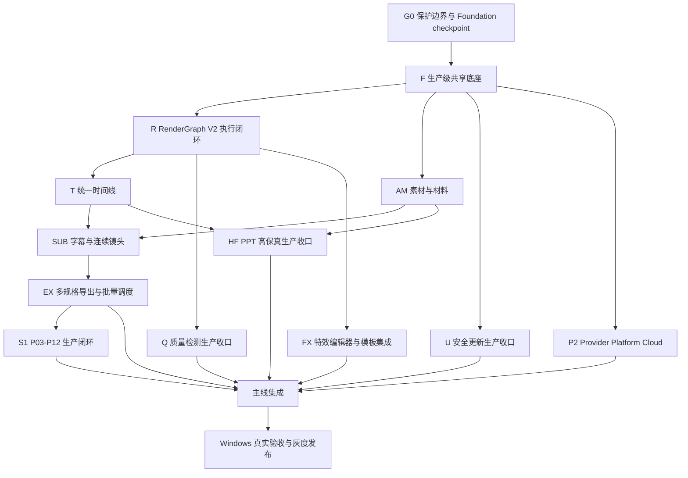

# PPT Video Workbench 剩余主线开发与隔离集成完整设计

## 1. 文档信息

- 项目名称：剩余主线开发与隔离集成工程（Mainline Development Orchestration）。
- 设计日期：2026-08-11。
- 适用工作区：`F:\ppt-video-workbench-v3`。
- 当前恢复分支：`recovery/root-snapshot-20260810`。
- 当前基线提交：`9bca5e97c3d11718a604eb3f2344d19a723de700`。
- 配套计划：`docs/superpowers/plans/2026-08-11-mainline-development-orchestration.md`。
- 决策状态：设计完成；只有保护门禁 G0 通过后才允许继续代码开发。

本文整合现有共享底座、RenderGraph V2、七项 P1、四项重大视频能力、P03-P12、特效编辑器、P2 平台和 Windows 发布计划。它不替代各专项设计，而是定义剩余工作的唯一开展顺序、集成边界和发布条件。

## 2. 当前事实与完成边界

当前代码不是空白项目，以下能力已经存在，不得重新实现：

- 最终渲染异步任务的入队、查询、暂停、恢复、取消、重试、原子发布和 Web `RenderJobPanel` 已完成主体闭环。
- 8 页与 50 页 Windows 真进程渲染已有通过记录；最终渲染不再作为独立新项目，仅作为共享 Job v3 和 RenderGraph 的兼容消费者。
- Presenter 静态问题和 Playwright 浏览器环境已处理；Presenter 自动化链路已形成 RC1，剩余主要是私有样本和人工 Windows 签署。
- RenderGraph V2 已有 schema、编译器、snapshot、preflight、Remotion composition、FFmpeg 音频/字幕/final mux 和 render job snapshot 绑定。
- 质量检测、安全更新、统一时间线和 PPT 高保真已经有基础领域模型、API、Web 工作区和定向测试。
- 七项 P1 已有时间线、素材、材料、字幕、连续镜头、多规格导出和批量调度基础模块及 UI 骨架。
- P03-P12 十个模块均有 runner 和集成入口；实现深度不同，尚未全部达到真实生产门禁。
- 特效引擎 V2 的自动化、真实 30 页样本、RC 完整性和隔离验收入口已完成；完整安装后产品流程仍待人工实机验收。
- P2 独立 worktree 已包含 Provider、Platform、Cloud 原型和定向测试证据，但生产云、真实 Provider 和三平台验收未完成。

因此后续工作的核心是“生产化、集成、迁移、真实验收和发布”，不是复制现有骨架。

## 3. 保护边界

### 3.1 当前共享根目录

共享根目录当前存在未提交的 Job v3/共享底座改动，涉及：

- `apps/api/src/workbench/domain/enums.py`
- `apps/api/src/workbench/domain/models.py`
- `apps/api/src/workbench/storage/migrations.py`
- `apps/api/src/workbench/storage/workspace_db.py`
- `apps/api/src/workbench/jobs/`
- `apps/api/src/workbench/video/render_job.py`
- `scripts/foundation/`
- 对应 foundation、jobs、storage 测试

这些文件在形成 owner stop point 和 foundation checkpoint 前视为受保护区。任何其他窗口不得修改、格式化、还原或复制覆盖。

### 3.2 现有 P2 worktree

独立 worktree：

```text
F:\ppt-video-workbench-v3\.worktrees\p2-platform-integration
branch: codex/p2-platform-integration
```

当前可见未提交范围包括：

- `cloud_prototype/app.py`
- `tests/cloud/test_cloud_api.py`
- `cloud_prototype/migrations/`

只有 P2 owner 可以继续这些文件。主线集成不得从该目录复制整棵源码，不得在此运行全仓格式化、clean、reset 或依赖重装。

### 3.3 用户与运行时数据

下列位置永不作为开发写入目标：

- 正式用户 `workspace.db` 和现有 workspace-data。
- `F:\app\app` 或其他正式安装目录。
- `F:\Video` 中既有项目、旁白、成片和制作包。
- 其他窗口的 `.worktrees/*`、临时验收目录和未提交工件。

测试必须使用新建的隔离数据根、隔离数据库、唯一端口和唯一输出目录。

### 3.4 Git 与文件操作

- 禁止 `git reset --hard`、`git clean`、批量 checkout、历史重写和目录覆盖式合并。
- 禁止从 dirty root 直接创建下游开发 worktree。
- 禁止删除或替换未知来源的未跟踪文件。
- 合并只接受可审查提交；跨 worktree 移植只使用显式 commit/cherry-pick 或逐文件审查补丁。
- 每个窗口必须声明 `owned_paths`、`shared_paths_touched`、`will_write_again` 和 `safe_resume`。

## 4. 目标

### 4.1 产品目标

1. 预览、正式渲染、质量检测和制作包绑定同一个不可变 RenderGraph snapshot。
2. 素材、材料、字幕、转场、导出和批量生产形成完整可用的七项生产工作流。
3. 质量检测、安全更新和 PPT 高保真从基础实现升级为可发布能力。
4. P03-P12 在统一持久任务、真实媒体和失败恢复语义下完成生产闭环。
5. 特效编辑器、模板库和特效引擎进入可迁移、可回滚的正式工作流。
6. Provider、PlatformServices 和 Cloud Sync 保持本地优先、默认关闭并通过各自生产门禁。
7. Windows 安装、修复、升级、回滚、真实媒体和人工视听验收形成单一证据包。

### 4.2 工程目标

1. 所有长任务共用版本化 Job/Attempt/Checkpoint/Publication/Lease 契约。
2. 所有执行输入在 enqueue 时冻结，Worker 不重新读取可变编辑状态。
3. 所有可见工件先完成 hash、size、schema 和媒体探测，再原子发布。
4. 所有缓存键包含输入 hash、参数、工具版本、平台能力和 graph hash。
5. 所有共享 schema、迁移、OpenAPI 和主 composition root 由单一 owner 串行修改。
6. 所有新能力默认由 feature flag 关闭，关闭时不创建新数据库、不发网络请求、不改变旧输出。
7. 每一阶段都能独立回退，不以删除数据或降级 SQL 作为回滚手段。

## 5. 非目标

- 不删除 V1 渲染和旧项目兼容路径。
- 不重写已经通过的最终渲染异步任务。
- 不用 fake Provider、mock 媒体或 CI 平台结果替代真实验收。
- 不在本轮构建模板市场、任意第三方插件执行或用户代码运行能力。
- 不在生产云门禁完成前上传用户项目、密钥或媒体到云端原型。
- 不在真实 Windows/Office/安装版证据完成前默认启用 V2 export、Presenter、Effects V2 或 Cloud Sync。

## 6. 总体项目结构



严格依赖：G0 → F → R → 时间线/字幕/导出 → 主线集成 → Windows 发布。P2 可以在现有独立 worktree 内继续，但在 Foundation 契约冻结前不得修改主程序共享接线。

## 7. 主线项目设计

### 7.1 F：生产级共享底座

范围：统一 Job v3、Attempt generation、checkpoint、resource lease、exactly-once publication、内容寻址缓存、权威预览任务、旧项目迁移、资源调度和诊断。

关键决策：

- Job 状态和 attempt 状态分别持久化；旧 attempt 不能结束新 attempt。
- Publisher 使用 reservation + verified artifact manifest；重复回调只能返回同一发布结果。
- pause 只有在 checkpoint 持久化后才完成；cancel 只清理当前 operation 的临时文件。
- 恢复扫描只处理过期 lease/heartbeat，不自动重跑需要人工确认或付费的任务。
- 数据库迁移只向前、幂等并保留旧字段；回滚通过 feature flag 和旧 reader 完成。

### 7.2 R：RenderGraph V2 执行闭环

范围：补齐权威区间预览 Worker、graph-aware cache invalidation、LegacyProjectAdapter、Web stale/diagnostics、真实媒体矩阵和灰度切换。

权威标识：

```text
project_id + project_revision + graph_id + graph_hash + runtime_fingerprint
```

预览与导出都只读取 snapshot store。graph 在任务入队后即使变 stale，当前任务仍按冻结 snapshot 完成，但结果必须显示来源 revision/hash，不能冒充最新结果。

### 7.3 P1：七项生产能力

七项能力按以下边界实现：

1. 统一时间线：命令、revision、拖动/裁剪/分割/吸附/ripple、撤销重做和冲突重放。
2. 素材库：内容寻址对象、批量导入、代理、缩略图、波形、授权和品牌包。
3. 材料组织：多文档/课件、无大纲、章节合并拆分、页面替换和显式同步时间线。
4. 高级字幕：词级时间、双语、翻译确认、模板、逐词高亮和软/烧录输出。
5. 连续镜头：跨页转场、J/L Cut、章节 continuity 和 overlay。
6. 多规格导出：多画幅、分辨率、fps、codec、GIF/切片/章节和制作包。
7. 批量生产：批次 DAG、优先级、资源租约、夜间窗口、页面级重跑和恢复。

各能力不得建立自己的 Job 真相、时间基准、素材对象存储或最终发布器。

### 7.4 Q/U/HF：三项重大能力生产收口

质量检测：补真实 MP4 corpus、P0/P1 召回门禁、低误报、一次安全重试、QualityJob 与 graph hash 绑定。

安全更新：补独立更新助手、签名/轮换、下载恢复、安全解包、启动健康检查、升级回滚、攻击测试和安装器接入。

PPT 高保真：补 Office/LibreOffice 能力矩阵、60 页 corpus、原生捕获适配器、Fidelity Resolver、缓存、元素动画解释器和时间线接入。

统一多轨时间线不在本项目重复实现，归入 P1/RenderGraph。

### 7.5 S1：P03-P12 生产闭环

P03-P12 保留主程序对 ProjectManifest 的唯一写权限。外围模块只返回严格业务结果和工件声明，由主程序 projector 校验 revision、fingerprint、hash 后原子投影。

需要重点收口：

- P07：真实录音、ASR/HeyGen 互斥、付费 request id 和恢复。
- P11：分页渲染、FFmpeg、制作包、失败页重跑和缓存复用。
- P12：质量归档、人工签署、交付审计和脱敏。
- S0/S1：host restart、artifact streaming、能力发现、runtime manifest 和 Windows G5。

### 7.6 FX：特效编辑器与模板管理

在继续开发前先找回最后 worktree/branch/commit 和 Task 15 stop point，确认文件是否已进入当前 checkpoint。禁止以旧恢复总图的 Task 5 状态覆盖较新的实现。

最终边界包括：不可变模板版本、草稿恢复、发布事务、模板校验、Remotion renderer capability、编辑会话、E2E 和回滚。Effects V2 默认保持关闭，人工验收通过后再进入 stable optional。

### 7.7 P2：Provider、跨平台与云端协作

P2 保持现有 worktree 和本地优先架构：

- Provider：descriptor、probe、estimate、invoke、budget、region、cache、audit 和显式 failover。
- Platform：路径、凭证、进程、工具发现、媒体/硬件、Office adapter 和三平台 capability snapshot。
- Cloud：OIDC、组织/RBAC、revision、对象、operation log、outbox/inbox、评论审核、remote executor 和双设备同步。

Cloud 原型在 PostgreSQL、对象保留、OIDC、租户安全、备份恢复和扫描门禁完成前不得接收生产流量。

## 8. Worktree 与所有权模型

### 8.1 分支建议

```text
codex/foundation-g1-closure
codex/rendergraph-v2-closure
codex/p1-timeline
codex/p1-assets-materials
codex/p1-subtitles-continuity
codex/p1-export-scheduler
codex/quality-production
codex/secure-update-production
codex/fidelity-production
codex/s1-p03-p12-closure
codex/effects-workbench-integration
codex/p2-platform-integration   # 已存在，继续使用
codex/mainline-release-integration
```

所有新 worktree 必须从同一 `FOUNDATION_READY` commit 创建。任何 foundation 合并后，下游共享契约消费者必须 rebase/cherry-pick 明确提交或重新创建 worktree，不能继续依赖过期 schema。

### 8.2 共享串行区

以下路径只能由当前 integration/foundation owner 修改：

- `apps/api/src/workbench/domain/`
- `apps/api/src/workbench/storage/migrations.py`
- `apps/api/src/workbench/storage/workspace_db.py`
- `apps/api/src/workbench/jobs/`
- `apps/api/src/workbench/main.py`
- `apps/api/src/workbench/api/video.py`
- `apps/api/src/workbench/api/timeline_production.py`
- `apps/web/src/api/client.ts`
- `apps/web/src/features/workflow/WorkflowShell.tsx`
- `remotion/src/Root.tsx`
- `packages/contracts/openapi.json`
- `packages/contracts/project.schema.json`
- `installer/`、`runtime-assets/`、launcher 和 release scripts

功能 worktree 若需要共享区变更，只提交“integration request”文档或最小补丁，由 owner 串行应用。

### 8.3 Stop point 契约

每个窗口结束或暂停时必须写入：

```json
{
  "branch": "codex/example",
  "head": "40-hex",
  "mode": "idle",
  "owned_paths": [],
  "shared_paths_touched": [],
  "completed": [],
  "remaining": [],
  "evidence": {},
  "will_write_again": false,
  "safe_resume": "..."
}
```

只有 `mode=idle|completed` 且 `will_write_again=false` 的窗口可以进入集成候选。

## 9. 契约与数据治理

- JSON Schema 使用明确 major version，生产入口拒绝额外字段。
- Python、TypeScript、数据库和 OpenAPI 对同一枚举、状态和字段保持镜像测试。
- 时间统一使用整数微秒；帧转换通过版本化 timebase；不在不同模块重复四舍五入。
- 路径只保存受控根下相对 POSIX 路径和 hash；拒绝盘符、UNC、`..`、ADS、symlink/reparse escape。
- 密钥只保存 credential reference；正文、密钥、Authorization、Cookie 和完整用户路径不进入 Job、日志、诊断或制作包。
- schema 变更先提供 reader 兼容和 migration fixture，再修改 writer；旧 reader 的退役必须单独立项。

## 10. 集成策略

1. Foundation owner 生成冻结 commit、schema hash 和 ownership map。
2. 各功能 worktree 只提交自身 owned paths 和定向证据。
3. Integration owner 按依赖顺序逐个 cherry-pick，不合并多个未知 dirty tree。
4. 每次共享契约变化后先运行 contract/migration/OpenAPI gate，再继续功能集成。
5. 每合入一条主线即运行受影响回归；四条以上主线合并后运行完整矩阵。
6. 集成失败时撤回当前候选提交或关闭 feature flag，不修改其他 worktree。
7. 发布候选从新的 clean integration commit 构建，不从开发根目录打包。

## 11. 测试与验收体系

### 11.1 自动化层级

- L0：模型、纯函数、命令和状态机单元测试。
- L1：schema、OpenAPI、Python/TypeScript golden contract。
- L2：数据库迁移、repository、API、Worker、恢复和安全集成测试。
- L3：Web Vitest、Playwright、Remotion、FFmpeg/ffprobe 真实短媒体。
- L4：8 页、50 页、Presenter、竖屏、质量 corpus 和 P03-P12 完整链。
- L5：Windows 安装、修复、升级、回滚、异常终止、进程清理和人工签署。

### 11.2 必须保留的证据

- 完整命令、退出码、版本、开始/结束时间和日志路径。
- 输入 fixture/hash、graph hash、runtime fingerprint 和 Job ID。
- MP4/制作包 hash、ffprobe、时长、分辨率、codec 和 artifact manifest。
- 失败注入点、恢复后 attempt/checkpoint/publication 记录。
- Windows 安装包、workbench.exe、runtime manifest 和验证脚本 hash。
- 人工视觉/听觉、Presenter、Effects V2、真实 HeyGen 和发布签署。

### 11.3 不可替代门禁

单元测试不能替代真实 FFmpeg、Office、浏览器、安装版、云安全或人工视听验收。跳过项必须带稳定 reason code，并在发布 Gate 中保持阻断。

## 12. 安全与隐私

- 所有外部文件先做大小、类型、压缩炸弹、路径和恶意结构检查。
- 外部进程使用参数数组、受控 cwd、环境白名单、超时、取消和进程树清理。
- Provider 自动失败切换不得扩大费用、区域或隐私边界；未知付费状态必须人工确认。
- 更新只接受 HTTPS、受信 metadata、签名、版本防回滚和内容 hash。
- Cloud 必须验证 tenant/project/object ownership，远程 executor 只运行内置签名任务。
- 诊断包默认脱敏并提供机器可验证的 privacy scan 结果。

## 13. 兼容、灰度与回滚

灰度顺序统一为：

```text
contract-only → compile-only → preview-only → internal export
→ stable optional → new-project default → legacy migration offer
```

回滚只执行：关闭 feature flag、停止新任务领取、保留数据库和工件、恢复旧 reader/旧执行路径。禁止删除新 schema 数据、覆盖旧成片或执行数据库降级 SQL。

## 14. 发布 Gate

只有同时满足以下条件才可形成 `RELEASE_READY`：

1. 所有活动窗口均有可验证 stop point，未知源码所有权为 0。
2. Foundation、RenderGraph、P1、三项重大能力、S1、FX 和 P2 的适用 Gate 通过。
3. 全量 Python、Ruff、mypy、Web、Remotion、Playwright、contract 和 release 测试通过。
4. 8 页、50 页、Presenter、竖屏、质量 corpus、Effects V2 和 P03-P12 真实链通过。
5. Windows 安装、首次启动、修复、升级、回滚、卸载保留和异常恢复通过。
6. 没有 P0/P1 未解决缺陷；P2/P3 有明确影响、规避和 owner。
7. 所有默认开启决策有 feature flag、回退条件、观察指标和签署人。

## 15. 完成定义

本总项目只有在以下事实成立时才完成：

- 预览、渲染、质量和制作包可追溯到同一不可变输入。
- 七项 P1 在真实媒体和安装版中可用，而不只是 API/UI 骨架。
- 质量、更新和高保真达到各自生产门禁。
- P03-P12、Presenter、Effects V2 和模板工作台具有真实恢复与发布证据。
- P2 保持本地优先，真实 Provider、三平台和生产云能力准确声明成熟度。
- 旧项目、旧成片和用户数据在迁移、失败、回滚和卸载中保持安全。
- 所有窗口、分支、worktree、提交、工件和证据都可审计且无覆盖式集成。
