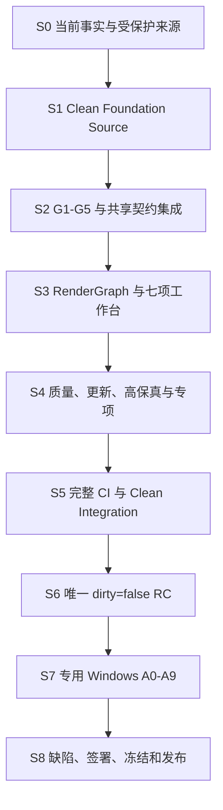

# PPT Video Workbench V1.0 非干扰式开发与生产收口设计

## 1. 文档信息

- 设计日期：2026-08-11
- 适用仓库：`F:\ppt-video-workbench-v3`
- 当前恢复分支：`recovery/root-snapshot-20260810`
- 当前已提交 HEAD：`e81b455c4903889ac25697a4a030e523adb7650f`
- 配套实施计划：`docs/superpowers/plans/2026-08-11-non-interference-v1-closure.md`
- 上位设计：`docs/superpowers/specs/2026-08-11-v1-production-closure-design.md`
- 上位计划：`docs/superpowers/plans/2026-08-11-v1-production-closure.md`

本文把现有生产收口方案进一步约束为“非干扰式执行”：在完成唯一 Release Candidate 之前，所有源码整理、集成、测试、媒体验证和证据生成都不得复用、关闭、控制或污染其他 Codex 窗口和用户正在运行的 Workbench、浏览器、Office、Node、Python、FFmpeg、安装器及工作区。

## 2. 目标与非目标

### 2.1 总目标

按以下严格顺序完成 PPT Video Workbench 本地 Windows V1.0：

1. 从受保护的 dirty recovery root 重建 clean、可审计、可重建的 Foundation Source。
2. 逐层接入 G1-G5、RenderGraph、Effects 和默认关闭的 P2 能力。
3. 完成七项生产工作台、质量、安全更新和 PPT 高保真能力。
4. 补齐 Presenter、Effects、P03-P12 的真实或明确关闭证据。
5. 在 clean integration commit 上完成完整 CI，并构建唯一 `dirty=false` RC。
6. 在预约的专用 Windows 验收窗口执行同一 RC 的 A0-A9、真实媒体、异常恢复和人工视听。
7. 完成缺陷关闭、五类签署、冻结、tag 和发布。

### 2.2 非目标

以下事项不进入本地 Windows V1.0 的强制主链：

- 生产云协作、正式 OIDC/RBAC、PostgreSQL/PITR 和远程执行。
- 第三方插件沙箱和模板市场商业化。
- macOS/Linux 正式安装、签名和真实成片。
- 未经单独授权的真实付费 Provider 调用、代码签名证书使用和云资源创建。

这些能力可以在独立 Platform worktree 中完成默认关闭的契约准备，但不能被描述为 V1.0 生产能力。

## 3. 当前事实基线

### 3.1 已确认完成或可复用

- Program W0 的 `G0_ACTIVE_LINES_CLOSED` 已通过。
- Windows 工程全链曾完成安装、启动、导入、旁白、音频、预检、分页渲染、最终合成、恢复、回滚和卸载。
- RenderGraph V2 closure 已形成 clean 停点 `1bef208`，真实 FFmpeg/FFprobe runtime 已验证。
- Effects Task 18-25 已形成 clean 重建停点 `fc41bdf`，自动化和静态 30 页证据可复用。
- P2 Platform baseline 已形成 clean 停点 `51cc325`，功能开关默认关闭。
- recovery root 中已有 Durable Job、Asset Derivative、Authoritative Preview、Cache Invalidation 和 Legacy Migration 的实现与定向测试证据。

### 3.2 尚不能作为发布事实

- recovery root 仍含大量 tracked/untracked 变更，不是 clean source。
- G1-G5 成果尚未统一绑定到一个 clean Foundation commit。
- 当前 `release-artifacts.json` 记录 `dirty=true`，产品版本仍为 `0.1.0`。
- 当前 Windows 工程全链和最终修复不属于同一 continuous schema 2.0 candidate run。
- 真实 ASR 未证明；既有全链使用确定性 transcript injector。
- Effects 同一 RC 的 30 页动态播放、字幕/效果检查和最终导出未完成。
- RC1 evidence manifest 仍为 `pending_manual_windows`，P0-P3 未评估且未签署。
- 真实 Local Audio、Presenter 和 HeyGen E2E 仍由环境变量条件跳过。

因此，源码存在、定向测试通过或历史安装包存在，都不能替代 clean integration、唯一 RC 和同一候选真实验收。

## 4. 非干扰等级

每项任务必须声明下列等级之一。

| 等级 | 允许动作                                                             | 禁止动作                           | 默认执行时机       |
| ---- | -------------------------------------------------------------------- | ---------------------------------- | ------------------ |
| N0   | 阅读、diff、静态分析、生成文档和清单                                 | 启动任何服务或外部程序             | 任意时间           |
| N1   | 独立 worktree 内编辑、单元测试、类型检查和构建                       | 使用共享端口、共享数据库、共享缓存 | 任意时间           |
| N2   | 独立临时 workspace、独立端口下启动 API、Web、Worker、FFmpeg/Remotion | 连接、关闭或重用其他窗口进程       | 资源允许时         |
| N3   | 安装器、Office、真实浏览器、系统级更新、回滚、卸载和人工视听         | 与其他窗口并行运行                 | 预约的专用验收窗口 |

### 4.1 默认策略

- G1-G6 的源码和自动化工作默认只能使用 N0-N2。
- N2 必须使用明确登记的进程 PID、端口、workspace、cache、log 和 output root。
- N3 只能在唯一 RC 已冻结后执行。
- 任何任务若发现必须控制未知进程、共享安装目录或共享用户数据，立即停止并降为 `pending_exclusive_windows`。

## 5. 隔离执行架构

### 5.1 Worktree 拓扑

在 Foundation Source 重建完成前，不创建新的长期功能 worktree。完成后从同一 clean commit 派生：

```text
recovery/root-snapshot-20260810           受保护来源，只读审计
codex/v1-foundation-closure               Foundation 重建与共享契约
codex/v1-core-workbench                   Web、时间线、素材、材料、字幕、Continuity
codex/v1-render-release                   RenderGraph、Remotion、FFmpeg、质量、Effects、RC
codex/v1-platform-disabled                Provider/Cloud 默认关闭的契约准备
codex/v1-release-integration              短生命周期串行集成，不开发新功能
```

长期工作树只从同一 `foundation_source_commit` 派生。Integration worktree 只接收已提交、已验证、可回退的变更。

### 5.2 每个工作树的资源隔离

每个工作树必须拥有自己的：

- Python 虚拟环境或受控共享只读依赖缓存。
- Node 构建输出和 Playwright browser profile。
- `WORKBENCH_WORKSPACE`、SQLite 数据库、对象存储和 migration staging。
- API/Web/CDP 端口。
- Remotion、FFmpeg 临时目录和最终输出目录。
- 日志与 evidence root。
- candidate/build/staging 目录。

推荐资源登记格式：

```json
{
  "owner": "task-id",
  "worktree": "absolute-path",
  "ports": [18101, 18102],
  "workspace": "absolute-path",
  "cache": "absolute-path",
  "evidence": "absolute-path",
  "pids": [],
  "cleanup_required": true
}
```

### 5.3 进程所有权

允许清理的进程必须同时满足：

1. 由当前任务启动。
2. PID 已写入本次 run context。
3. 命令行或监听端口与本次隔离资源一致。
4. 停止前再次验证 PID 未被复用。

禁止使用名称级批量终止，例如停止全部 `node.exe`、`python.exe`、`msedge.exe`、`soffice.exe` 或 `ffmpeg.exe`。

## 6. 单一事实源

| 领域   | 权威事实                                          | 禁止的替代事实                        |
| ------ | ------------------------------------------------- | ------------------------------------- |
| 源码   | clean integration commit                          | dirty root、目录复制、历史 staging    |
| 契约   | versioned schema/OpenAPI/golden fixture           | Python/TS 各自维护影子字段            |
| 项目   | ProjectManifest + revision                        | UI 本地长期保存第二份项目状态         |
| 任务   | Job/Attempt/Checkpoint/Lease/Publication          | 各模块自建任务状态机                  |
| 素材   | AssetRef + project ownership + content hash       | 仅使用绝对路径                        |
| 时间线 | ProductionTimeline revision                       | Presenter/字幕/Effects 各自维护时间轴 |
| 渲染   | immutable RenderGraph snapshot + graph hash       | Worker 重读当前可变项目               |
| 缓存   | dependency graph + runtime fingerprint            | 文件名或 mtime 命中                   |
| 输出   | verified artifact manifest + atomic pointer       | 临时文件直接成为正式成片              |
| 发布   | candidate manifest + evidence manifest + sign-off | 搜索最新 EXE 或复用旧报告             |

## 7. 总体交付主链



严格 Gate 为：

```text
SOURCE_READY
→ FOUNDATION_READY
→ GRAPH_READY
→ WORKBENCH_READY
→ FEATURE_GATES_READY
→ INTEGRATION_READY
→ RC_READY
→ WINDOWS_ACCEPTED
→ RELEASE_READY
```

任何 Gate 未通过，只修复当前阶段，不以缩小测试、降低断言、复用旧证据或改写报告状态进入下一阶段。

## 8. Foundation 与共享契约设计

### 8.1 来源重建

Foundation 重建必须采用逐文件审查和小提交：

1. Domain、错误码和枚举。
2. Project Schema、OpenAPI 和 golden fixtures。
3. Storage migration 和兼容 reader。
4. Durable Job、Attempt、Checkpoint、Lease 和 Publication。
5. Asset、Object Store、Probe 和 Derivative。
6. Preview、Cache、GC 和 Legacy Migration。
7. API wiring、Web client 和最小 UI wiring。
8. 测试与证据。

生成物、安装包、日志、ZIP、备份、用户项目、缓存和临时目录永远不进入源码提交。

### 8.2 契约冻结

必须冻结并建立 drift test 的对象：

- Project、Page、Source、MaterialCollection、AssetRef。
- ProductionTimeline、SubtitleDocument、Continuity、Overlay。
- RenderGraph、Snapshot、PreviewPlan、ExportPlan。
- Job、Attempt、Checkpoint、Lease、Publication、BatchPlan。
- QualityReport、EffectPlan、PresenterTimeline。
- Candidate、ReleaseArtifact、EvidenceManifest、WindowsAcceptanceReport。

Python、TypeScript、JSON Schema、OpenAPI 和 fixture 必须从同一语义产生或相互校验。

### 8.3 Migration 与回滚

- migration 只向前、幂等、可中断恢复。
- 旧项目来源零写入，迁移只作用于隔离副本。
- 发布 V2 pointer 前必须验证完整 bundle。
- 回滚切换 reader/pointer，不执行数据库降级 SQL。
- 不可逆迁移必须阻断“可回滚”声明。

## 9. RenderGraph 与媒体执行设计

### 9.1 Frozen Snapshot

长任务入队时冻结：

- project revision。
- graph id/hash。
- asset hashes。
- timeline range。
- subtitle/effect/presenter revisions。
- export preset 和 quality policy。
- runtime/toolchain fingerprint。

Worker 只能消费 frozen snapshot，不读取最新可变项目。

### 9.2 Preview 与 Export 同源

Interactive preview、authoritative preview、quality、final export 和 production package 必须引用同一 graph lineage。第六步预览和第七步导出若 graph hash 不同，导出必须阻断并要求重新预检。

### 9.3 媒体 Oracle

自动验收至少使用：

- FFprobe：流、编码器、画布、fps、时长、字幕轨。
- waveform：J/L Cut、静音、爆音和音画边界。
- frame oracle：黑帧、冻结、裁切、转场和 Overlay。
- subtitle oracle：cue 越界、重叠、软/烧录策略。
- hash manifest：输入、snapshot、输出和制作包。

## 10. 七项工作台设计边界

### 10.1 Web 状态

明确区分 server truth、selection、viewport、playhead、pending command 和 conflict。所有写命令携带 revision/CAS；失败后保留可重放 payload。

### 10.2 时间线与周边能力

时间线、素材、材料、字幕、Continuity、Overlay、Presenter 和 Effects 共用同一时间轴与 revision，不允许建立平行编辑模型。

### 10.3 性能目标

- 1000 clips/30 分钟项目可操作。
- 平移和缩放 p95 小于 50 ms。
- 拖动主线程预算目标 16 ms。
- 大量 cue、波形和缩略图必须虚拟化或按视口预取。

## 11. 质量、安全更新和高保真

### 11.1 质量

P0/P1 质量规则必须版本化且不可被普通用户关闭。质量结果绑定 graph、policy、candidate 和 MP4 hash；人工豁免必须有人员、原因、时间和适用范围。

### 11.2 安全更新

更新系统采用 trust root、threshold、expiry、anti-rollback、内容寻址下载、安全解包、独立 helper、健康激活和自动回滚。正式密钥和 SmartScreen 证据属于 N3。

### 11.3 PPT 高保真

Office、LibreOffice 和静态 F0 必须是显式能力矩阵。无法忠实执行的元素必须生成降级诊断，不得静默声称原生动画等价。

## 12. Effects、Presenter 与外围专项

### 12.1 Effects

- 只接入 provenance 完整或明确标记 reconstructed 的提交。
- 模板发布后不可变；修改产生新 revision。
- `.pvtmpl` 导入执行路径、大小、内容和引用校验。
- 默认关闭；关闭后旧链不得读取或写入 Effects V2 状态。
- V1 放行前，同一 RC 完成冻结 30 页的动态播放、字幕/效果检查和最终导出。

### 12.2 Presenter

- PresenterTimeline 与 ProductionTimeline 共享 revision 边界。
- ASR、页面匹配、锚点修正和人工锁定必须可追溯。
- 主音轨唯一；Presenter、字幕、Overlay 和 Effects 使用统一安全区。
- 真实长短样本、强杀恢复和音画同步是 N3 门禁。

### 12.3 P03-P12

所有模块通过 Job v3 adapter 运行，保存 request fingerprint、费用、未知远端结果、checkpoint 和 publication。P12 负责汇总质量、artifact manifest、脱敏归档和签署，不建立另一套发布真相。

## 13. CI 与候选设计

### 13.1 完整 CI

CI 必须覆盖：

- Python pytest、Ruff、format check、strict mypy。
- Web lint、typecheck、Vitest、production build。
- Remotion typecheck、Vitest、build、visual snapshots。
- Playwright 项目生命周期、刷新恢复、冲突、暂停取消、旧项目和 UI 播放。
- Schema/OpenAPI/generated client/migration drift。
- security、secret、license、SBOM、runtime 和 installer validation。
- 测试数量冻结、`.only` 禁止和 `.skip` 审批。

### 13.2 唯一 RC

唯一 RC 必须：

- 从 clean integration commit 构建。
- `dirty=false`。
- 产品、Python、Web、installer 和 manifest 版本一致为 `1.0.0`。
- candidate、source、lock、schema、runtime 和 artifact hash 一致。
- 含 installer、launcher、runtime manifest、SBOM、许可证和校验文件。
- 构建后禁止修改；任何源码变化创建新 candidate。

## 14. Windows A0-A9 验收设计

N3 验收必须在同一物理 Windows 环境、同一 run、同一 candidate 连续完成：

| 阶段 | 目标                                                              |
| ---- | ----------------------------------------------------------------- |
| A0   | 验证 candidate、installer、payload、SBOM、许可证和 launcher hash  |
| A1   | 标准用户全新安装、目录和数据分区                                  |
| A2   | 首启、无黑窗、二次点击、浏览器关闭后重开                          |
| A3   | 旧项目只读来源、隔离迁移副本和 hash 保护                          |
| A4   | 分页 checkpoint 后强杀并恢复，禁止重复 publication                |
| A5   | fresh preflight 三轮，跨 API/launcher 重启指纹一致                |
| A6   | 真实 UI 从 0 播放到 ended，无 stall、console error 和资源 4xx/5xx |
| A7   | UI 导出、FFprobe、制作包和 artifact hash                          |
| A8   | 卸载保留 workspace、重装同 RC 并重新发现项目                      |
| A9   | baseline→candidate→baseline，指针和项目兼容正确                   |

同时覆盖真实 ASR、本地录音、扫描 PDF、图片排序、Effects 30 页、Presenter 长短样本和受控 HeyGen。

## 15. 证据模型

每个任务必须产生：

1. task ID、owner、branch/worktree、source commit。
2. owned/shared paths 和明确非目标。
3. 隔离资源与进程所有权。
4. 失败测试或非法 fixture。
5. 实现提交与契约/migration 影响。
6. 完整命令、工具版本、开始结束时间、退出码和日志 hash。
7. 输入、snapshot、candidate 和输出 hash。
8. 已知失败、外部 blocker、回退与 safe resume。
9. stop point JSON，且 `will_write_again=false`。

推荐目录：

```text
docs/acceptance/v1-non-interference/
  source/
  foundation/
  graph/
  workbench/
  capabilities/
  feature-gates/
  integration/
  rc/
  windows/
  release/
```

大型视频可以外置，但 evidence manifest 必须保存批准位置、大小、SHA-256、媒体类型和脱敏结果。

## 16. 回退策略

| 阶段        | 回退方式                                             |
| ----------- | ---------------------------------------------------- |
| Foundation  | 回退独立小提交；不修改 recovery root                 |
| Contract    | 保留旧 reader/adapter；禁止删除旧字段                |
| Migration   | 切换 reader/pointer；保留诊断 bundle                 |
| Feature     | flag 关闭并验证旧链输出                              |
| Integration | revert 当前单一集成提交                              |
| RC          | 废止整个 candidate，不修改已冻结产物                 |
| Windows     | 激活 previous release，保留 workspace 和上一成功成片 |
| Release     | 使用上一稳定 installer 和回滚手册                    |

## 17. 完成定义

V1.0 只有在以下条件全部满足时完成：

1. Foundation 和 integration commit clean、可重建、来源可审计。
2. 全量自动化首轮通过，无未知 skip、only、重试或测试数量下降。
3. Schema、OpenAPI、migration、Python/TS fixture 和 client drift 为零。
4. Job、Lease、Cache、Preview、Export 和 Publication 使用统一事实。
5. 七项工作台的成熟度与真实实现和性能证据一致。
6. Quality、Update、Fidelity 有真实证据或保持关闭。
7. Effects、Presenter、P03-P12 有真实证据或保持明确阻断。
8. 唯一 `dirty=false` RC 完成同一 run 的 Windows A0-A9。
9. 真实媒体、ASR、异常恢复和人工视听完成适用门禁。
10. P0=0、P1=0，产品、工程、安全、Windows 和视听签署完成。
11. 用户项目、workspace、上一成功成片在失败、卸载和回滚中保持安全。
12. freeze guard 只接受当前 candidate 的完整 schema 2.0 报告。

在以上条件全部满足前，状态只能是 `development`、`internal`、`stable_optional`、`pending_manual_windows` 或 `blocked`，不得宣布 V1.0 已发布。
