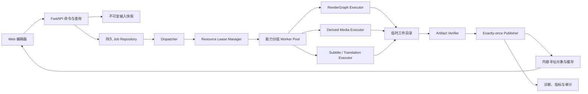
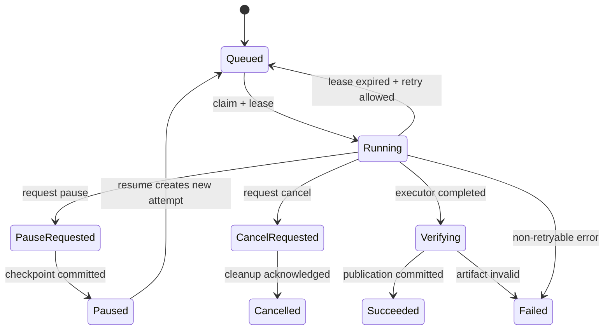
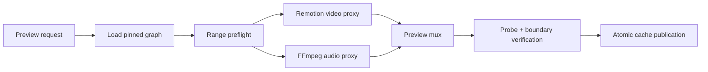
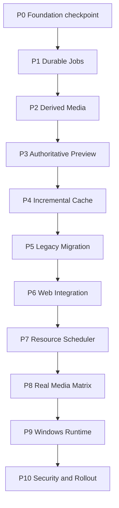

# PPT Video Workbench 生产级共享底座完整设计

## 1. 文档信息

- 项目名称：生产级共享底座工程（Production Foundation）。
- 设计日期：2026-08-11。
- 适用仓库：`F:\ppt-video-workbench-v3`。
- 基线提交：`9bca5e97c3d11718a604eb3f2344d19a723de700`。
- 配套计划：`docs/superpowers/plans/2026-08-11-production-foundation-heavy-engineering.md`。
- 上游方案：共享 Foundation、RenderGraph V2 渲染闭环、七项 P1 生产能力。
- 下游消费者：统一时间线、字幕、转场、素材、材料、多规格导出、批量生产和 Windows 发布。
- 决策状态：设计完成；正式编码必须从可信 foundation commit 建立独立 worktree，并按 Gate 串行推广。

## 2. 背景与当前状态

仓库已经具备大量可用骨架，不是从零开始：

- RenderGraph V2 已有模型、编译器、snapshot、preflight、Remotion composition、FFmpeg 音频与封装流水线。
- graph 已能表达 transition、J/L Cut、overlay、高级字幕、授权快照和受影响区间。
- preview-plan 已能验证区间并生成包含 graph hash、range、preset 和 runtime version 的确定性缓存键。
- RenderJob 已能固定 graph snapshot，并在正式导出时校验 graph hash 和产物。
- AssetRegistry 已有内容 hash、项目隔离、授权记录和派生引用。
- BatchScheduler 已有批次、优先级、资源数字段和基础派发逻辑。
- Web 已有时间线、字幕、素材、连续镜头、导出、批量和 RenderGraph Player 的工作区骨架。

但这些能力仍存在生产级缺口：

1. 通用 Worker 仍主要领取 `EXPORT_PACKAGE`，预览、代理、素材派生、翻译和质量任务没有统一执行闭环。
2. 素材派生当前主要登记确定性元数据，没有真实执行裁剪、抠图、转码、代理、缩略图和波形生成。
3. authoritative preview 只有计划契约，没有持久 Job、音视频代理、缓存产物和取消恢复。
4. 缓存失效还没有由 graph affected ranges 驱动完整的选择性清理与复用。
5. 旧项目缺少完整 LegacyProjectAdapter、显式迁移、双读、回滚和降级打开流程。
6. Web 时间线仍以展示和离散命令为主，缺少生产级拖动、裁剪、吸附、历史、冲突重放和预览诊断。
7. Scheduler 主要使用 JSON 批次状态和单类 Job，尚无持久资源租约、多 Worker、公平性和 exactly-once 发布协调。
8. 真实媒体、Windows 安装版、安全、性能和灰度门禁尚未形成自动化闭环。

本项目只解决这些共享底座，不重复实现七个产品功能本身。

## 3. 目标

### 3.1 产品目标

1. 让所有长任务拥有一致、可恢复、可取消、可审计的执行语义。
2. 让代理预览与最终成片消费同一 graph snapshot，剪辑边界完全一致。
3. 让素材派生、缓存、预览、导出和质量产物都可通过输入 fingerprint 重建和复用。
4. 让旧项目在不改正文的前提下安全打开，并可显式、可回滚地升级到 V2。
5. 让 Web 编辑器准确显示 revision、stale、降级和诊断状态，不隐藏后台实际执行情况。
6. 让批量生产在 CPU、GPU、内存和磁盘约束下公平调度，重启后不重复发布。
7. 让 Windows 安装版在真实媒体、异常环境和升级回滚场景下具备可发布证据。

### 3.2 工程目标

1. 权威状态进入 SQLite/版本化 JSON 契约；内存对象只作缓存。
2. 所有 Job 输入在提交时冻结，Worker 不读取可变业务对象重新推导语义。
3. 所有工件先写临时路径，完成 hash、大小和媒体探测后原子发布。
4. 所有缓存键包含输入 hash、参数、工具版本和运行时能力摘要。
5. 所有资源占用由显式 lease 管理，进程异常后可回收。
6. 所有迁移幂等、可中断、可审计，不覆盖旧项目正文。
7. 所有阶段都拥有单元、契约、集成、故障注入和真实媒体门禁。

## 4. 非目标

- 不在本项目中设计七项 P1 功能的最终交互细节。
- 不删除 V1 渲染、旧项目读取或单消费者 Worker。
- 不直接引入云队列、Kubernetes、远程对象存储或多租户 SaaS。
- 不把 GPU 当作必需条件；无 GPU 时必须有受控 CPU 降级或明确拦截。
- 不在没有真实 Windows 证据前默认开启 V2 export。
- 不使用单元 mock 代替 FFmpeg、FFprobe、Remotion、浏览器或安装版验收。
- 不修改用户真实 workspace-data、安装目录和既有成片作为测试输入。

## 5. 核心设计原则

### 5.1 单一权威输入

预览、正式渲染、质量检测和制作包都绑定不可变 `graph_id + graph_hash`。Worker 只能加载已提交 snapshot，不能在执行时重新编译时间线。

### 5.2 命令与执行分离

API 负责校验、冻结输入和创建 Job；Worker 负责执行；Publisher 负责校验并原子发布。任一执行器不得直接修改编辑正文。

### 5.3 内容寻址与可复现

素材对象、派生产物、preview、video-only、audio master、subtitle package 和 final mux 都使用内容 hash。相同输入、参数和工具版本必须得到相同 cache key。

### 5.4 失败可见

任何代理缺失、缓存降级、授权阻断、Worker 能力不足、迁移失败或 runtime 不兼容都要形成结构化诊断，不允许静默回退改变成片。

### 5.5 渐进迁移

旧项目默认只读适配；只有用户显式启用新能力才创建 V2 revision。迁移不覆盖旧 manifest、字幕、素材和成片。

### 5.6 串行共享契约、并行独占实现

数据库 schema、Job 契约、RenderGraph、主 API wiring、Remotion Root、launcher 和 installer 串行修改。互不重叠的执行器、测试 fixture 和 UI 组件可在独立 worktree 并行。

## 6. 总体架构



### 6.1 权威数据层

权威数据分为五类：

| 类型       | 权威存储                  | 说明                                         |
| ---------- | ------------------------- | -------------------------------------------- |
| 编辑正文   | 项目 revision/版本化 JSON | 时间线、字幕、素材引用和输出 preset          |
| 执行输入   | immutable snapshot        | graph、派生请求、翻译输入和质量策略          |
| 任务状态   | SQLite                    | Job、attempt、checkpoint、lease、publication |
| 对象和缓存 | 内容寻址目录              | 源对象、代理、波形、预览和渲染中间产物       |
| 证据       | manifest + hash           | probe、质量报告、运行时能力和发布报告        |

内存字典只能缓存查询结果，进程退出后必须可从权威存储重建。

## 7. Phase 0：Foundation checkpoint 与开发隔离

### 7.1 输入基线

本设计以 `9bca5e97c3d11718a604eb3f2344d19a723de700` 为规划基线。正式编码前必须确认该提交已通过 Foundation 对应门禁，并记录：

- branch、HEAD、依赖锁 hash 和源码状态。
- 当前数据库 schema version。
- Python、Node、pnpm、Remotion、FFmpeg、FFprobe 和 PowerShell 版本。
- V1/V2 feature flag 默认值。
- 当前工作树和其他 worktree 的写入责任。

### 7.2 工作区策略

建议建立以下串行或独占 worktree：

1. `foundation-jobs`：Job、attempt、checkpoint、publication 和数据库迁移。
2. `foundation-media`：素材派生执行器与内容寻址缓存。
3. `foundation-preview`：authoritative preview Worker。
4. `foundation-migration`：LegacyProjectAdapter 和旧 API 投影。
5. `foundation-web`：Web 工作流接入。
6. `foundation-scheduler`：资源租约、队列和批量恢复。
7. `foundation-release`：真实媒体、Windows、安全和发布门禁。

每个 worktree 从已放行的上一阶段提交创建。共享文件不跨 worktree 同时修改。

## 8. Phase 1：统一持久长任务执行框架

### 8.1 Job 类型

扩展 `JobType`，至少支持：

- `render_preview`
- `derive_asset`
- `build_proxy`
- `build_waveform`
- `translate_subtitles`
- `quality_scan`
- `render_export`

旧 `export_package` 保留兼容。新增类型必须注册 executor、输入 schema、checkpoint 策略、资源需求和发布策略。

### 8.2 数据模型

建议新增或冻结以下模型：

```text
JobRecord
  id, project_id, job_type, status, priority
  input_snapshot_ref, input_fingerprint
  current_attempt_id, stage, progress
  created_at, updated_at, revision

JobAttempt
  attempt_id, job_id, generation
  worker_id, started_at, heartbeat_at, finished_at
  runtime_fingerprint, exit_code, error_code

JobCheckpoint
  job_id, attempt_id, stage, sequence
  checkpoint_ref, checkpoint_hash, created_at

ArtifactPublication
  publication_key, job_id, attempt_id
  artifact_manifest_ref, artifact_manifest_hash
  state, published_at

ResourceLease
  lease_id, job_id, attempt_id, worker_id
  cpu_cores, memory_mb, gpu_slots, disk_mb
  generation, expires_at, heartbeat_at
```

`input_fingerprint` 只由规范化输入构造，不包含提交时间、临时目录或绝对用户路径。

### 8.3 状态机



状态迁移通过带 revision 条件的数据库更新完成。旧 attempt 的 heartbeat 或 publish 请求必须因 generation 不匹配而拒绝。

### 8.4 Worker 能力与执行边界

Worker 启动时发布 `WorkerCapability`：

- worker/runtime version。
- 可执行 job types。
- CPU、内存、GPU 和临时磁盘容量。
- FFmpeg/FFprobe/Chrome/Node/Remotion 路径与版本。
- 支持的 encoder、decoder、pixel format 和硬件加速。

Dispatcher 只把 Job 分配给满足能力和资源要求的 Worker。Worker 不自行选择更低质量 preset；降级必须由显式策略决定并记录。

### 8.5 Checkpoint 与恢复

- 每个长阶段定义安全 checkpoint 边界。
- checkpoint 先写临时文件，再写 hash，最后在数据库登记。
- pause 只有在 checkpoint 提交成功后才进入 `paused`。
- 应用启动时扫描 running、pause_requested、cancel_requested 和过期 lease。
- 可重试错误创建新 attempt；不可重试错误保持输入和失败证据。

### 8.6 Exactly-once 发布

publication key 推荐为：

```text
sha256(project_id + job_type + input_fingerprint + output_slot)
```

Publisher 在单个事务中声明 publication key；已发布且 manifest/hash 有效时直接复用。文件发布使用同卷临时目录和原子 rename。数据库成功但文件丢失时必须标记损坏，不得返回成功。

## 9. Phase 2：素材派生与内容寻址缓存

### 9.1 派生类型

第一阶段覆盖：

- 图片/视频裁剪和缩放。
- 视频转码与代理生成。
- 缩略图和关键帧。
- 音频波形和瞬态索引。
- 透明度、alpha 规范化和背景移除适配器。
- 字体、LUT、贴纸和 Logo 的安全标准化。

抠图模型可使用 provider adapter，但输入输出契约、缓存和安全检查必须本地统一。

### 9.2 派生请求

`AssetDerivativeRequestV1` 包含：

- project_id、parent asset id/revision/hash。
- operation 与版本化 parameters。
- output media contract。
- tool/runtime fingerprint。
- license snapshot 和用途。
- resource request。

派生记录只有在新对象实际存在、hash 匹配且 probe 通过后才可发布。不得继续使用“只登记派生元数据但指向父对象”的生产语义。

### 9.3 对象目录

```text
workspace-data/assets/objects/<hash-prefix>/<content-hash>.<ext>
workspace-data/cache/proxies/<cache-prefix>/<cache-key>/artifact
workspace-data/cache/waveforms/<cache-prefix>/<cache-key>/waveform.json
workspace-data/cache/previews/<cache-prefix>/<cache-key>/preview.mp4
workspace-data/cache/manifests/<cache-key>.json
```

所有路径保存在项目根或 workspace 根的相对路径中。API 不返回任意绝对路径。

### 9.4 媒体探测

每个实际媒体产物发布前保存：

- 容器、codec、duration、time base。
- width、height、sample rate、channel layout。
- fps_num/fps_den、pixel format、alpha。
- 文件大小和 SHA-256。
- FFprobe 版本和命令参数摘要。

probe 失败、时长为零、流缺失或参数不符均阻止发布。

### 9.5 缓存维护

- 设置总容量、高低水位和按项目配额。
- 权威源对象和制作包不参与普通缓存淘汰。
- 正在被 Job/Player 使用的对象拥有引用 lease。
- LRU 只能删除无 lease、可重建且 manifest 完整的缓存项。
- 崩溃遗留临时文件通过年龄和 owner attempt 清理。

## 10. Phase 3：权威区间预览

### 10.1 输入

沿用现有 `RenderGraphPreviewRequest` 和 `RenderGraphPreviewPlan`，新增持久提交接口。请求包含：

- graph_id、graph_hash。
- start_us、end_us。
- preview preset。
- runtime version。
- 可选 priority 和 client request id。

API 加载 immutable graph snapshot，生成 plan/cache key，再创建 `render_preview` Job。

### 10.2 执行流水线



- 视频和音频必须消费同一 graph hash 与区间。
- source-in、J/L Cut、转场重叠和字幕边界使用统一 timebase。
- preview preset 只能改变分辨率、码率和代理资源选择，不能改变剪辑语义。
- 命中缓存时仍验证 manifest、文件存在性和 runtime compatibility。

### 10.3 产物契约

`PreviewArtifactManifestV1` 至少包含：

- graph_id/hash、range、preset、cache key。
- video/audio/subtitle runtime fingerprint。
- output relative path、hash、size、duration、codec。
- source revision 摘要。
- warnings 和 degradation decisions。

### 10.4 Web 播放

Web 分为两种预览：

1. interactive preview：直接使用 Player 和代理素材，追求低延迟。
2. authoritative preview：播放持久 Job 产物，作为最终成片边界参考。

UI 必须明确标识当前模式、graph revision/hash、是否 stale、缓存命中和降级原因。

## 11. Phase 4：增量缓存与依赖失效

### 11.1 缓存域

至少区分：

- `visual-node`
- `transition`
- `overlay`
- `subtitle-burn-in`
- `audio-mix`
- `soft-subtitle`
- `preview-range`
- `video-only`
- `final-mux`

每个缓存节点记录上游依赖 hash 与覆盖时间区间。

### 11.2 失效规则

| 变更                   | 必须失效                             | 不应失效     |
| ---------------------- | ------------------------------------ | ------------ |
| soft subtitle 文本     | soft subtitle、相关 preview mux      | video-only   |
| burn-in 字幕样式       | subtitle visual、相关 video/preview  | 无关页面代理 |
| 音量、ducking、J/L Cut | audio mix、preview/final mux         | visual node  |
| overlay 时间/位置      | overlay、相关视觉区间                | 无关音频     |
| transition             | 相邻视觉重叠区间、相关 preview       | 其他章节     |
| 画幅/fps               | 布局、字幕、overlay、preview、export | 原始源对象   |
| 素材 revision          | 所有引用该 revision 的节点           | 未引用节点   |

### 11.3 失效实现

编译器输出依赖边和 affected ranges。缓存索引通过反向依赖查找受影响节点，并将其状态标为 stale。删除物理文件由异步 GC 完成，不阻塞编辑命令。

## 12. Phase 5：旧项目适配与迁移

### 12.1 双读策略

打开项目时按以下顺序：

1. 存在 V2 manifest 和有效 revision：读取 V2。
2. 只有旧 manifest：构建内存 LegacyProjectView，不写盘。
3. 旧数据损坏：返回诊断和可恢复选项，不自动覆盖。

### 12.2 LegacyProjectAdapter

Adapter 将旧 ProjectManifest、SourceFile、页面 timeline、subtitle artifact 和旧 Props 投影为只读 ProductionTimeline/RenderGraph 兼容视图。旧路径先登记为 legacy asset snapshot，禁止任意绝对路径透传。

### 12.3 显式迁移

迁移前生成 `MigrationPreviewV1`：

- 将创建的文件、revision、asset snapshot 和预计磁盘占用。
- 无法迁移或会失效的功能。
- 备份位置和回滚条件。

迁移执行使用 journal：prepare、copy/snapshot、validate、commit。commit 前失败可清理临时目录；commit 后回滚恢复旧入口但保留新 revision 供诊断。

### 12.4 兼容 API

- V1 项目继续使用旧 Props 和旧导出。
- V2 项目 `/video/preflight` 返回 graph preflight 的兼容投影。
- 使用 V2 独占语义后禁止静默回退 V1。
- 每次 legacy fallback 记录结构化审计事件。

## 13. Phase 6：Web 生产工作流接入

### 13.1 客户端状态

服务端 revision 是权威。客户端保存：

- server revision 与 last acknowledged command。
- 尚未提交的本地交互意图。
- selection、viewport、zoom 和 playhead 等非权威 UI 状态。
- graph revision/hash、preview artifact 和 stale reasons。

命令冲突时保留本地意图，刷新服务端状态后进行可解释重放；无法安全重放时进入人工冲突面板。

### 13.2 时间线交互底座

实现统一 pointer/keyboard 编辑器：

- 拖动、裁剪、分割、多选、框选、吸附、ripple 和链接。
- 播放头、缩放、水平滚动、虚拟化轨道和片段。
- 分层波形、缩略图和代理渐进加载。
- undo/redo 对应服务端命令 revision，不维护另一套业务真相。

### 13.3 预览状态

UI 同时展示：

- interactive preview 是否与当前 revision 同步。
- authoritative preview 的 Job 状态和 cache key。
- 当前 graph 是否 stale 以及受影响区间。
- 缺失代理、授权阻断、runtime 降级和最终导出差异。

### 13.4 七步工作流接入

材料集合、素材、匹配、旁白、音频、字幕、时间线、预览和导出都通过统一项目 revision 串联。关闭新 feature flag 时旧七步流程仍可完成。

## 14. Phase 7：资源调度与批量恢复

### 14.1 调度对象

Batch、BatchItem、Job、Attempt 和 ResourceLease 全部持久化。JSON 可以作为导出快照，但不再作为运行时唯一权威。

### 14.2 调度策略

默认策略：

1. 优先级队列。
2. 同优先级按项目轮转。
3. 等待老化只增加权重，不突破资源上限。
4. 前台预览保留最低 CPU/内存/磁盘带宽。
5. GPU Job 可等待、受控 CPU 降级或明确失败。
6. 项目级并发上限防止单项目占满资源。

### 14.3 夜间队列

- 使用明确时区和本地时间窗口。
- 支持跨午夜。
- 睡眠、唤醒、重启和时钟回拨后重新计算，不重复派发。
- 夜间窗口结束时，安全 checkpoint 后暂停可暂停任务。

### 14.4 页面级重跑

BatchItem 保存 page/preset/input fingerprint。失败页重跑创建新 attempt，成功页和有效缓存不重复计算。最终批次发布只有在所有必需 item 成功且 manifest 完整后执行。

## 15. Phase 8：真实媒体自动验收平台

### 15.1 Fixture 结构

```text
tests/fixtures/production-media/<case-id>/
  manifest.json
  sources/
  expected/
  licenses/
  probes/
```

manifest 记录来源、授权、预期 duration、fps、画幅、音频流、字幕流、关键帧和允许误差。大文件可由确定性生成器构造，不将成片直接提交仓库。

### 15.2 覆盖矩阵

- 24/25/30/60fps。
- 16:9、9:16、1:1。
- 720p、1080p、4K。
- CFR/VFR、单声道/立体声、多采样率。
- SRT/WebVTT/ASS、soft/burn-in/both/none。
- transition、J/L Cut、overlay、真人视频和透明素材。
- 缺失素材、授权过期、时长越界和损坏媒体。

### 15.3 自动比较

- FFprobe 元数据与 duration 边界。
- 波形/响度和音频事件时间。
- 指定帧视觉 snapshot 和感知差异。
- subtitle stream、字体 fallback 和字符覆盖。
- graph range 与 preview/final 输出边界一致性。

## 16. Phase 9：Windows 运行时闭环

### 16.1 Runtime manifest

安装版必须产生能力清单：

- Node、Chrome/Chromium、Remotion、FFmpeg、FFprobe。
- 可用 codec、encoder、decoder、hardware acceleration。
- 字体目录和必需字体覆盖。
- Office、LibreOffice 和无 Office 三种能力状态。
- VC Runtime、临时目录、磁盘和长路径能力。

### 16.2 子进程执行

统一 ProcessRunner 负责：

- 参数数组调用，不拼接 shell 命令。
- 中文、空格、长路径和特殊字符。
- stdout/stderr 限量收集与脱敏。
- 取消、超时、进程树关闭和退出码。
- 临时文件和 filter script 的安全路径。

### 16.3 故障场景

必须覆盖安装、升级、回滚、端口占用、断网、睡眠、磁盘满、文件锁、GPU 不可用、编码器缺失、Office 不可用和强杀恢复。

## 17. Phase 10：安全、可观测性与灰度发布

### 17.1 安全门禁

- 路径穿越、junction/symlink 逃逸和跨项目 asset 引用。
- 伪 MIME、恶意容器、压缩炸弹、超大媒体和恶意 Office。
- FFmpeg/filter/文件名模板参数注入。
- 字体、LUT、字幕附件和远程 URL 安全。
- lease generation、越权取消和 publication 重放。
- 日志、数据库、制作包和 API 脱敏。

### 17.2 可观测性

每个 Job/Attempt 记录：

- queue wait、stage duration、重试和恢复次数。
- CPU、峰值内存、GPU、磁盘读写和临时空间。
- cache hit/miss、失效原因和复用字节数。
- 子进程版本、退出码和脱敏错误摘要。
- graph、project、batch、job、attempt 和 publication 关联 ID。

诊断中心需要能回答“为什么重新编译”“为什么没有命中缓存”“为什么降级”“为什么阻止导出”。

### 17.3 Feature flags

建议采用依赖明确的开关：

```text
WORKBENCH_DURABLE_JOBS_V2
WORKBENCH_DERIVED_MEDIA_V1
WORKBENCH_RENDERGRAPH_V2_PREVIEW
WORKBENCH_RENDERGRAPH_V2_EXPORT
WORKBENCH_INCREMENTAL_CACHE_V1
WORKBENCH_PROJECT_MIGRATION_V2
WORKBENCH_RESOURCE_SCHEDULER_V1
```

依赖不满足时启动诊断必须解释原因，不能悄悄组合出未测试路径。

### 17.4 灰度顺序

1. compile-only。
2. interactive preview 只读。
3. authoritative preview 内部启用。
4. V2 export 内部启用。
5. 新项目默认 V2，旧项目保持双读。
6. 完成一个发布周期观察后冻结 V1 新功能。

每一阶段定义错误率、失败恢复率、缓存命中率、性能和回退阈值。

## 18. API 设计摘要

建议新增或扩展：

| 方法 | 路径                                                               | 用途               |
| ---- | ------------------------------------------------------------------ | ------------------ |
| POST | `/api/projects/{project_id}/render-graphs/{graph_id}/preview-jobs` | 提交权威区间预览   |
| GET  | `/api/projects/{project_id}/preview-jobs/{job_id}`                 | 查询预览状态和产物 |
| POST | `/api/projects/{project_id}/assets/{asset_id}/derivatives`         | 创建真实派生任务   |
| GET  | `/api/projects/{project_id}/assets/{asset_id}/derivatives`         | 查询派生和缓存     |
| POST | `/api/projects/{project_id}/migration-preview`                     | 生成迁移预览       |
| POST | `/api/projects/{project_id}/migrations`                            | 执行显式迁移       |
| POST | `/api/jobs/{job_id}/pause`                                         | 请求安全暂停       |
| POST | `/api/jobs/{job_id}/resume`                                        | 从 checkpoint 恢复 |
| POST | `/api/jobs/{job_id}/cancel`                                        | 请求取消           |
| GET  | `/api/runtime/capabilities`                                        | 查询运行时能力     |
| GET  | `/api/scheduler/resources`                                         | 查询资源和 lease   |

所有写接口使用 idempotency key 和 expected revision；所有响应通过统一 Envelope 返回结构化诊断。

## 19. 数据库迁移策略

### 19.1 原则

- 只新增表、列和索引；兼容期不删除旧字段。
- 每个 migration 独立事务、可重复执行。
- 大量文件扫描不在数据库事务中执行。
- migration journal 记录 schema version、开始/结束、错误和校验 hash。
- 启动发现未完成 migration 时进入只读诊断，不继续写业务数据。

### 19.2 建议新增表

- `job_attempts`
- `job_checkpoints`
- `artifact_publications`
- `resource_leases`
- `workers`
- `batches`
- `batch_items`
- `cache_entries`
- `cache_dependencies`
- `project_migrations`
- `diagnostic_events`

大 payload、graph 和 manifest 存相对文件引用与 hash，不直接塞入数据库正文。

## 20. 故障与恢复矩阵

| 故障                        | 预期行为                                        |
| --------------------------- | ----------------------------------------------- |
| API 在 enqueue 后崩溃       | idempotency key 返回同一 Job                    |
| Worker 在阶段中崩溃         | lease 过期后从最后有效 checkpoint 新建 attempt  |
| Worker 旧进程恢复           | generation 不匹配，禁止 heartbeat 和发布        |
| 临时产物写到一半            | 不出现在可见缓存；启动清理                      |
| 文件已发布、数据库未提交    | Publisher 根据 publication key 和 manifest 对账 |
| 数据库成功、文件丢失        | 标记 artifact corrupted，禁止成功复用           |
| 素材授权过期                | preflight 阻断 preview/export，保留诊断         |
| preview 缓存 runtime 不兼容 | cache miss，创建新 key，不覆盖旧产物            |
| 迁移中断                    | journal 指示回滚或继续，不覆盖旧项目            |
| 磁盘满                      | 安全停止、保留 checkpoint、释放 lease           |
| 系统睡眠/时钟回拨           | 使用 UTC lease；夜间窗口重新计算                |

## 21. 性能目标

- 1,000 节点 graph 全量编译 p95 < 500ms。
- 增量编译 p95 < 150ms。
- 500 clips/20 tracks 编辑器常规交互维持 50fps 以上，拖动不低于 30fps。
- interactive preview 首帧 p95 < 3 秒。
- 10 秒 authoritative preview 缓存命中 p95 < 8 秒。
- 1080p30 graph 解释开销相对基线 < 10%。
- 任务重启后 60 秒内恢复可调度状态。
- 成功工件重复发布为 0。
- 缓存 GC 不阻塞前台编辑和预览。

性能门槛在固定硬件档位和 runtime manifest 下测量，报告必须包含样本量、p50、p95、峰值资源和源码 hash。

## 22. 测试策略

### 22.1 单元与属性测试

- Job 状态机、revision CAS、lease generation 和 retry policy。
- cache key、canonical JSON、依赖反向索引和区间相交。
- 时间线随机重叠、裁剪、恢复和 timebase 不变量。
- 迁移幂等、重复执行和 rollback journal。

### 22.2 契约测试

- Python、TypeScript、JSON Schema 对相同 fixture 解析一致。
- API OpenAPI 与前端 client 类型一致。
- manifest、checkpoint、publication 和 runtime capability 拒绝未知 major 和额外字段。

### 22.3 集成与故障注入

- SQLite 事务冲突、进程崩溃、lease 过期和旧 Worker 回归。
- FFmpeg/FFprobe/Remotion 子进程失败。
- 临时文件、发布中断、缓存损坏和磁盘满。
- 旧项目迁移中断、回滚和降级打开。

### 22.4 端到端

- 无大纲、多套 PPT、双语字幕、横竖屏导出。
- 真人视频、J/L Cut、overlay、音乐和 4K 成片。
- 多文档、替换页面、差异同步和失败页重跑。
- 20 项目夜间批次、系统重启、质量报告和制作包。

## 23. 阶段依赖和并行边界



- P2 的纯执行器与 P1 后半段测试可并行，但不能在 Job 契约冻结前接入主线。
- P3 的 Remotion/FFmpeg range 执行可并行开发，主 API/Job wiring 串行。
- P5 的 adapter fixture 可提前准备，数据库迁移必须等待 P1 schema 稳定。
- P6 可先完成纯 UI 交互，但权威状态接入必须等待 P3-P5。
- P7 模拟器可提前开发，但不得在所有长任务可恢复前接管真实队列。
- P8 fixture 可持续建设，最终 Gate 必须测试已冻结的 P7 以后源码。

## 24. 工作量与人员建议

| 阶段           |   估算 | 建议主责任        |
| -------------- | -----: | ----------------- |
| P0 基线与隔离  | 1–3 天 | Integration owner |
| P1 统一长任务  | 4–7 周 | Backend/Runtime   |
| P2 素材派生    | 4–7 周 | Media/Backend     |
| P3 权威预览    | 3–5 周 | Rendering         |
| P4 增量缓存    | 3–5 周 | Rendering/Storage |
| P5 迁移双读    | 4–7 周 | Backend/Migration |
| P6 Web 接入    | 5–8 周 | Frontend          |
| P7 资源调度    | 5–8 周 | Runtime/Scheduler |
| P8 真实媒体    | 3–5 周 | QA/Media          |
| P9 Windows     | 3–6 周 | Release/Windows   |
| P10 安全与灰度 | 3–5 周 | Security/Release  |

总量约 37–63 人周。三条独立开发线在共享契约串行的前提下，日历工期约 4–6 个月。

## 25. 分阶段 Gate

| Gate            | 放行条件                                                    |
| --------------- | ----------------------------------------------------------- |
| G0 Foundation   | checkpoint、ownership、依赖锁和基线测试可信                 |
| G1 Durable Jobs | 所有状态迁移、checkpoint、lease 和 publication 故障注入通过 |
| G2 Media        | 真实派生产物、probe、授权、缓存和 GC 通过                   |
| G3 Preview      | 同 graph 的视频、音频、字幕和成片边界一致                   |
| G4 Cache        | 选择性失效不漏算、不扩大到无关域                            |
| G5 Migration    | 旧项目只读、显式迁移、回滚和 hash 不变                      |
| G6 Web          | revision、undo/redo、冲突、stale 和诊断闭环                 |
| G7 Scheduler    | 资源租约、公平性、夜间队列、重启和 exactly-once             |
| G8 Real Media   | 完整媒体矩阵和视觉/音频自动比较通过                         |
| G9 Windows      | 安装、升级、异常恢复和 packaged runtime 通过                |
| G10 Release     | 安全、性能、诊断、灰度和回退条件全部满足                    |

未通过对应 Gate 的能力只能处于关闭的 feature flag 后。

## 26. 最终完成定义

本项目只有同时满足以下条件才算完成：

1. 所有长任务均通过统一 Job/Attempt/Checkpoint/Lease/Publication 执行。
2. 素材派生生成独立可验证对象，不再只有元数据占位。
3. interactive preview、authoritative preview 和 final export 绑定同一 graph 语义。
4. affected ranges 能驱动正确的增量缓存失效和复用。
5. 旧项目可只读打开、显式迁移、回滚和降级导出。
6. Web 能展示权威 revision、stale、诊断、任务与资源状态。
7. 多项目批次可公平调度、恢复和 exactly-once 发布。
8. 真实媒体、Windows、安全、性能和发布报告全部绑定精确源码 hash。
9. 新项目默认 V2 前已经完成内部灰度，并保留可验证回退路径。
