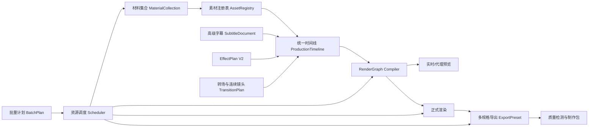
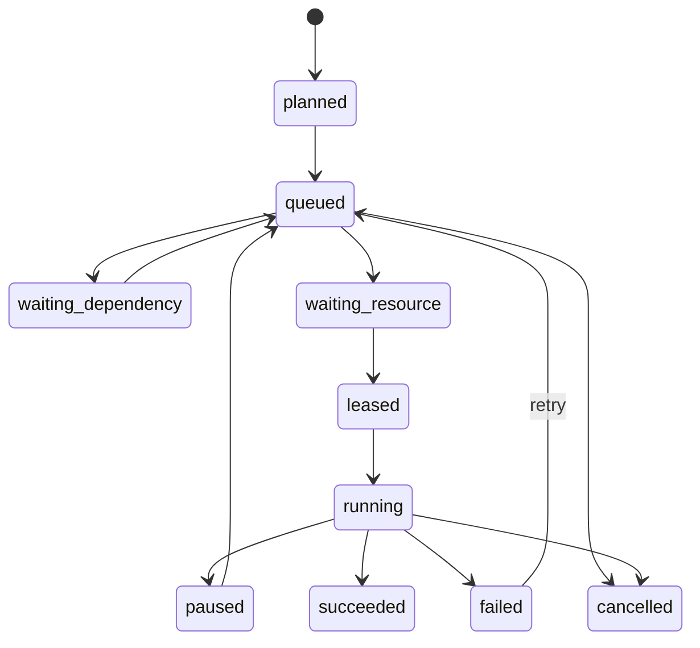
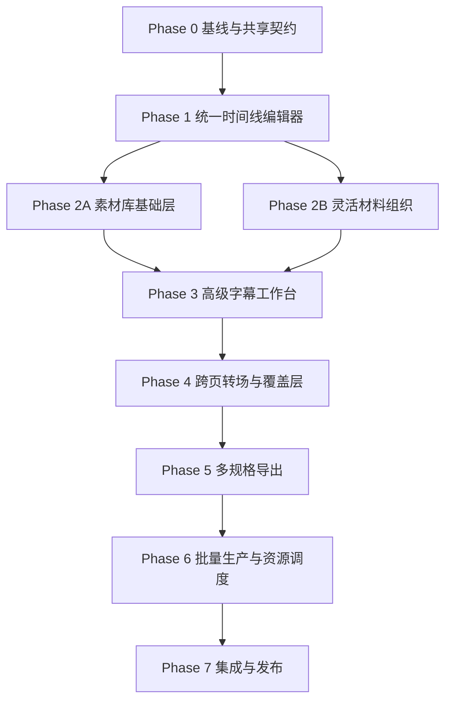

# 七项 P1 视频生产能力统一设计方案

**状态：** 设计基线 1.0  
**日期：** 2026-08-11  
**适用仓库：** `F:\ppt-video-workbench-v3`  
**配套实施计划：** `docs/superpowers/plans/2026-08-11-seven-p1-production-capabilities.md`

## 1. 目标

本方案统一设计以下七项 P1 能力，并按依赖关系逐步接入现有七步视频生产流程：

1. 统一多轨时间线编辑器。
2. 素材库与媒体覆盖层。
3. 灵活的材料组织模式。
4. 高级字幕工作台。
5. 跨页转场与连续镜头。
6. 多规格导出系统。
7. 多项目批量生产与资源调度。

最终目标不是增加七套互不相通的功能面板，而是形成一个可恢复、可审计、可扩展的视频制作内核：所有编辑行为落到同一时间线，所有媒体引用来自同一素材注册表，预览与正式渲染消费同一 RenderGraph，所有长任务进入同一任务与资源调度系统。

## 2. 当前实现基线

本项目不是从零开始。以下能力应直接复用：

- `workbench.timeline.production` 已有 `ProductionTimeline`、track、clip、marker、乐观 revision、命令引擎和 RenderGraph 编译骨架。
- `/api/projects/{project_id}/timeline` 已有初始化、命令、编译、revision 和恢复接口。
- `TimelineWorkspace.tsx` 已有轨道、片段和时间标尺骨架。
- `SubtitleTimeline`、P08 字幕业务模块和 Remotion `SubtitleLayer` 已能表达基础字幕。
- EffectPlan V2 已负责页内特效，不应被转场系统重复实现。
- 最终渲染已有持久任务、检查点、暂停、恢复和单消费者 Worker。
- P03-P12 外围业务模块已有工件清单、结果投影和安全路径边界。
- 质量检测已经能够消费成片、时间范围、字幕布局和输出规格。

现有基线的主要缺口：

- 时间线 UI 仍是展示骨架，缺少真实拖拽、吸附、框选、缩放、撤销重做和实时预览联动。
- 字幕样式能力非常有限，字幕内容、样式、翻译和输出模式尚未形成独立版本化契约。
- 页间仍按时长守恒的相邻片段处理，没有真正的重叠转场、J/L Cut 和章节连续镜头。
- 素材仍以项目文件和业务模块工件为中心，没有统一素材库、授权记录、品牌包和可复用派生资产。
- 材料导入仍隐含单大纲、单主课件的工作方式。
- 视频输出契约和部分渲染路径仍倾向固定 30fps 与少数画幅。
- Worker 仍是单消费者，不具备跨项目优先级、资源配额和夜间队列。

## 3. 范围边界

### 3.1 本期包含

- 桌面端单用户、多个本地项目的专业视频编辑与批量生产。
- PPT/PDF/图片/视频/音频/字幕/文档/品牌资产的统一引用。
- 横屏、竖屏、方屏及常见平台预设。
- 确定性预览、可恢复渲染和可审计导出。
- CPU/GPU/内存/磁盘资源的本地调度。
- 软字幕、烧录字幕和双语字幕。
- 页内特效、页间转场、覆盖层和音频剪辑的协同。

### 3.2 本期不包含

- 多人实时协同编辑、云端项目共享和在线评论。
- 任意第三方插件执行或不受信任脚本执行。
- 完整替代 Premiere、After Effects 或 PowerPoint 的所有高级能力。
- 自动购买素材、自动判断复杂版权法律结论。
- 分布式渲染农场；本期只预留远程 executor 接口。
- 在没有授权信息的情况下自动发布到外部平台。

## 4. 核心设计原则

### 4.1 一个时间权威

项目中的页面、旁白、真人视频、字幕、页内特效、音乐、音效和覆盖层只允许由 `ProductionTimeline` 决定最终时间。页面模型、字幕模型和渲染 Props 可以保存源信息，但不得分别计算最终开始和结束时间。

### 4.2 一个素材权威

所有可复用媒体进入 `AssetRegistry`，使用不可变 `asset_id + revision + content_hash` 引用。项目目录中的临时文件不能直接成为长期时间线引用。

### 4.3 一个渲染权威

编辑预览、代理预览、页面缓存、正式渲染、质量检测和制作包都消费同一版本的 `RenderGraph`。不同执行器可以降低质量或使用代理文件，但不能改变剪辑语义。

### 4.4 一个任务系统

导入、转码、代理生成、字幕翻译、时间线编译、预览、正式渲染、导出切片和质量检测都使用现有 JobRepository、检查点和状态机。批量调度只是现有任务系统之上的资源与依赖层。

### 4.5 增量迁移

旧项目可继续打开。读取旧项目时只构造内存适配视图，只有用户明确初始化或编辑新能力时才写入新契约。迁移不得修改旧素材正文或无故改变成片。

### 4.6 确定性与可恢复性

- 时间使用整数微秒，帧号只在预览/渲染边界计算。
- 所有 mutation 使用 `expected_revision` 和 `command_id`。
- 相同输入、版本和配置必须得到相同 hash、RenderGraph 和缓存键。
- 长任务必须拥有持久 job_id、检查点、取消点和重启恢复规则。

## 5. 总体架构



### 5.1 后端分层

| 层     | 责任                               | 主要模块                                    |
| ------ | ---------------------------------- | ------------------------------------------- |
| 契约层 | 严格模型、Schema、hash 和兼容版本  | `packages/contracts`、`schemas`、`domain`   |
| 素材层 | 导入、去重、授权、代理、派生资产   | `workbench/assets`                          |
| 材料层 | 多文档、多课件、章节和页面序列     | `workbench/materials`                       |
| 编辑层 | 时间线命令、字幕文档、转场和覆盖层 | `workbench/timeline`、`workbench/subtitles` |
| 编译层 | RenderGraph、依赖图、缓存区间      | `workbench/rendering`                       |
| 执行层 | Remotion、FFmpeg、Office、代理预览 | `remotion`、`workbench/video`               |
| 编排层 | Job、批次、资源租约、恢复          | `workbench/jobs`、`workbench/scheduler`     |
| 交互层 | React 工作台、快捷键、状态管理     | `apps/web/src/features`                     |

### 5.2 数据存储

- 项目权威数据继续位于 workspace-data 项目目录和 SQLite WAL 数据库。
- 大型媒体按内容 hash 存入工作区级对象存储；项目清单保存逻辑引用。
- 时间线 revision、字幕 revision、材料集合 revision 和导出 preset revision 均不可变。
- current pointer 使用原子替换。
- 代理、缩略图、波形和转码文件都是可重建缓存，不进入权威清单正文。

## 6. 共享契约

### 6.1 AssetManifest V1

```text
asset_id: UUID
revision: int
kind: image | video | audio | document | presentation | logo | sticker | icon | font | lut
content_hash: sha256
relative_object_path: string
original_name: string
mime_type: string
size_bytes: int
duration_us: int | null
width: int | null
height: int | null
fps_num: int | null
fps_den: int | null
alpha_mode: none | straight | premultiplied
license: LicenseRecord
tags: string[]
brand_pack_id: UUID | null
derived_assets: DerivedAssetRef[]
created_at: datetime
```

授权记录至少包含来源、作者/供应商、许可类型、许可文本引用、适用项目、到期时间和人工确认状态。未知授权素材允许编辑预览，但默认阻断最终发布。

### 6.2 MaterialCollection V1

```text
collection_id: UUID
revision: int
project_id: UUID
documents: MaterialDocumentRef[]
presentations: MaterialPresentationRef[]
sections: MaterialSection[]
page_sequence: MaterialPageRef[]
outline_mode: none | generated | selected | merged
merge_policy: manual | append | chapter_match
content_hash: sha256
```

每个页面拥有稳定 `material_page_id`，替换源文件时通过显式替换命令保持或重建身份，不依赖文件名和数组下标。

### 6.3 ProductionTimeline V2

V2 兼容现有 V1 的 project、revision、fps、画布、track、clip、marker 和 content_hash，并增加：

- `timebase = 1_000_000`。
- 轨道组、折叠、可见性、音频 bus 和锁定所有者。
- clip 的 `source_in_us`、`source_out_us`、playback_rate、freeze frame。
- transform、crop、mask、opacity、blend mode 和 chroma key 引用。
- fade、gain、pan、ducking 和 channel map。
- transition edge，而不是把转场复制成两个 clip。
- proxy policy 和 preview quality。
- command audit summary 和 affected ranges。

轨道类型：

```text
slide | narration | presenter | subtitle | effect | overlay_image |
overlay_video | music | sfx | adjustment | marker
```

转场是相邻视觉 clip 之间的边关系；J/L Cut 是相邻叙事单元的视觉边界和音频边界不同步关系。二者都不能通过修改源媒体文件实现。

### 6.4 SubtitleDocument V2

```text
document_id: UUID
revision: int
project_id: UUID
language_tracks: SubtitleLanguageTrack[]
cue_groups: SubtitleCueGroup[]
style_template_ref: VersionedRef
render_mode: burn_in | soft | both | none
safe_area_policy: string
content_hash: sha256
```

每个 cue 支持：

- 精确 start/end、page_id、speaker、原文和译文。
- word timing、人工断句锁、阅读速度和最大行数。
- 逐词高亮策略、强调片段、双语排列方式。
- cue 级样式覆盖，但默认继承版本化模板。
- 翻译来源、模型版本、人工确认和术语表版本。

### 6.5 TransitionPlan V1

```text
transition_id: UUID
left_clip_id: UUID
right_clip_id: UUID
duration_us: int
visual_kind: cut | dissolve | wipe | slide | zoom | blur | custom
audio_kind: cut | crossfade | j_cut | l_cut
easing: string
parameters: object
continuity_group_id: UUID | null
```

页内 EffectPlan 不得跨越页面边界；跨页 TransitionPlan 不得修改页面内部动画。

### 6.6 ExportPreset V1

```text
preset_id: UUID
revision: int
name: string
container: mp4 | mov | webm | gif | hls
video_codec: h264 | h265 | vp9 | av1 | gif
width: int
height: int
fps_num: int
fps_den: int
video_bitrate: int | null
quality_mode: crf | bitrate | lossless
audio_codec: aac | opus | pcm | none
audio_bitrate: int | null
subtitle_mode: burn_in | soft | both | none
segment_policy: SegmentPolicy | null
platform_profile: string | null
```

内置 preset 只读、版本化；用户 preset 可复制和修改。每个导出任务固定引用 preset revision，运行中修改 preset 不影响已有任务。

### 6.7 BatchPlan V1

```text
batch_id: UUID
revision: int
items: BatchItem[]
priority: int
schedule_window: LocalTimeWindow | null
failure_policy: stop_all | continue | retry_failed
resource_policy: ResourcePolicy
dependency_graph: BatchDependency[]
```

资源请求使用逻辑单位：CPU 线程、内存 MiB、GPU 设备/显存 MiB、磁盘临时空间、独占 Office、独占浏览器。Scheduler 发放有过期时间的 lease，任务异常退出后可回收。

## 7. 项目一：统一多轨时间线编辑器

### 7.1 功能范围

- 多轨显示、轨道分组、折叠、锁定、静音和独奏。
- 片段拖动、跨轨移动、边缘裁剪、分割、复制、删除和 ripple edit。
- 时间缩放、水平/垂直虚拟化、播放头、范围选择和循环播放。
- 吸附到页面边界、字幕 cue、marker、音频瞬态和其他 clip 边缘。
- 单选、多选、框选、键盘微调和批量属性编辑。
- 本地即时预览与服务端权威 revision 协调。
- undo/redo 以命令和恢复点实现，不保存完整可变副本。

### 7.2 命令模型

现有单命令接口扩展为：

- `TimelineCommandV2`：单一原子命令。
- `TimelineCommandBatchV1`：一组全成或全败的命令。
- `PreviewCommand`：拖动期间只在客户端生效，pointer up 时才提交。
- `CommandResult`：返回 revision、content_hash、affected_ranges、warnings 和 inverse_hint。

相同 command_id 重放必须返回第一次结果。revision 冲突只返回当前 revision 和刷新建议，不回传完整私密时间线。

### 7.3 前端结构

- `TimelineEditorShell`：查询、revision、快捷键和错误边界。
- `TimelineViewport`：虚拟滚动、缩放和时间坐标变换。
- `TrackHeaderList`：轨道控制。
- `TrackLane`：片段和转场边。
- `SelectionModel`：选择、框选、焦点和无障碍导航。
- `DragController`：preview command、吸附和提交。
- `TimelineInspector`：剪辑、转场、音频和覆盖层属性。
- `HistoryPanel`：undo/redo、revision 列表和恢复。

### 7.4 实时预览

交互期间优先使用代理文件和低分辨率 Remotion Player。修改影响区间由编译器返回，仅重建相关 RenderGraph 节点。播放头附近 5-15 秒采用预取和 premount；正式预览仍使用权威 graph hash。

## 8. 项目二：素材库与媒体覆盖层

### 8.1 素材库

- 工作区库、项目库、品牌包和最近使用四个视图。
- 批量导入、拖放、hash 去重、标签、搜索、收藏和归档。
- 图片/视频/音频探测、缩略图、波形、代理和透明通道检查。
- Logo、贴纸、图标、片头、片尾、字体和 LUT 类型。
- 授权记录、来源 URL 脱敏、到期提醒和发布阻断。
- 源文件不可变；裁剪、抠图和转码生成派生资产。

### 8.2 覆盖层编辑

图片和视频覆盖层以 timeline clip 存在，支持：

- position、scale、rotation、anchor、crop、opacity 和 z-order。
- 圆角、阴影、边框、mask、简单 chroma key 和背景移除派生资产。
- 入场/退场时间、页内绑定、跨页持续和循环。
- fit/fill/stretch、保持比例、对齐线和安全区吸附。
- 品牌锁：限制 Logo 最小尺寸、边距、颜色和可编辑属性。

### 8.3 派生资产

抠图、裁剪、转码、压缩和代理生成都创建新的 `DerivedAssetRef`，记录父 asset、操作参数、工具版本和输出 hash。派生任务失败不得修改源资产；相同输入与参数允许复用缓存。

## 9. 项目三：灵活的材料组织模式

### 9.1 支持的工作方式

- 无大纲，直接从一套或多套课件生成。
- 多个 Word/PDF/Markdown 文档合并成资料集合。
- 多套 PPT/PDF/图片页面组成章节。
- 自动生成大纲后人工调整。
- 章节合并、拆分、排序、禁用和替换。
- 替换页面时保留旁白、字幕和特效的可迁移部分，并明确显示失效内容。

### 9.2 权威结构

材料集合只描述来源、章节和页面顺序；时间线描述最终视频时间。材料重组先产生新的 `MaterialCollection` revision，再通过显式同步命令更新时间线。GET 不得隐式重写 timeline。

### 9.3 失效传播

| 变化         | 保留                 | 失效                              |
| ------------ | -------------------- | --------------------------------- |
| 文档文字修改 | 页面媒体、人工时间线 | 匹配、旁白候选、翻译              |
| 页面顺序调整 | page_id、素材        | 默认页面主轨顺序、章节 marker     |
| 替换同一页面 | 人工标题、章节归属   | 预览、OCR、匹配、特效、质量缓存   |
| 删除页面     | 历史 revision        | 对应 timeline clip 和所有下游引用 |
| 合并章节     | 页面身份             | 章节标题、章节转场和导出切片      |

### 9.4 同步策略

材料集合和时间线之间采用三种同步模式：

- `append_missing`：仅把新增页面追加到默认页面轨。
- `reconcile_order`：根据材料顺序移动未被人工锁定的页面 clip。
- `manual_map`：显示差异，由用户选择插入、替换、忽略或保留孤立 clip。

同步必须先生成差异预览，再使用 batch command 原子提交。

## 10. 项目四：高级字幕工作台

### 10.1 内容工作区

- 波形、播放头、cue 列表和页面定位联动。
- 人工断句、合并、拆分、时间拖动和批量偏移。
- 单语、双语和只显示译文模式。
- 翻译任务、术语表、逐 cue 审核和确认状态。
- 阅读速度、行数、字符数、遮挡和安全区告警。

### 10.2 样式工作区

- 字体、字号、字重、颜色、描边、阴影、背景、圆角和边距。
- 顶部、中部、底部、自定义锚点和 presenter 避让。
- 逐词高亮、卡拉 OK、整句淡入、说话人配色和关键词强调。
- 双语上下、左右或交替布局。
- 16:9、9:16、1:1 分画幅模板覆盖。
- 模板预览、复制、版本化和恢复默认。

### 10.3 输出

- 烧录字幕由 RenderGraph 字幕节点生成。
- 软字幕生成 WebVTT/SRT/ASS；支持容器时作为独立字幕流封装。
- `both` 同时输出烧录主视频和软字幕文件，但不得重复显示。
- 质量检测验证 cue 边界、阅读速度、画面遮挡、字体可用性和双语一致性。

### 10.4 翻译与人工确认

翻译是可恢复长任务，输入包含源 revision、目标语言、术语表 revision 和模型配置摘要。服务端只保存译文、来源引用和模型版本，不保存密钥。源 cue 变化后对应译文标记 stale；人工锁定译文不会被自动覆盖。

## 11. 项目五：跨页转场与连续镜头

### 11.1 视觉重叠

页面 A 和 B 的主视觉片段允许在 transition duration 内重叠。时间线总时长按区间并集计算，而不是简单求和。编译器负责生成 z-order、mask 和过渡参数；Remotion 和 FFmpeg 执行器必须得到一致边界。

### 11.2 J/L Cut

- J Cut：下一段音频先于下一画面进入。
- L Cut：上一段音频在下一画面进入后继续。
- 默认限制在相邻叙事单元和可配置最大窗口内。
- 音频 bus 自动建立短 crossfade，避免边界爆音。
- 字幕跟随实际语音而不是页面视觉边界。

### 11.3 连续性

- `continuity_group_id` 表示章节或连续镜头组。
- 组内可共享背景音乐、调色、镜头运动和标题状态。
- 章节边界可应用不同于普通页面边界的 transition preset。
- presenter 画面、字幕和覆盖层分别声明是否跨边界持续。

### 11.4 边界约束

- 转场 duration 不得超过任一相邻视觉 clip 的可用 handle。
- 没有额外源帧时，系统可选择 freeze、缩短转场或阻断，不能静默越界。
- J/L Cut 不得把语音移出所属章节允许范围。
- 重叠区的字幕、presenter 和 overlay z-order 必须由 graph 明确给出。

## 12. 项目六：多规格导出系统

### 12.1 规格维度

- 分辨率：720p、1080p、1440p、4K 和自定义安全范围。
- 帧率：24、25、30、50、60fps，使用有理数表达。
- 画幅：16:9、9:16、1:1、4:5 和自定义。
- 编码：H.264 主线，按运行时能力开放 H.265、VP9、AV1。
- 码率/质量：CRF、目标码率、最大码率和无损中间文件。
- 音频：AAC、Opus、PCM、无音频。
- 产物：完整视频、GIF、短视频切片、章节视频、封面和字幕文件。

### 12.2 重排策略

同一时间线 revision 可以编译到多个画布，但布局不是简单缩放：

- `fit`：保持原布局并留边。
- `responsive`：按安全区和约束重新排版字幕、presenter 和 overlay。
- `manual_override`：保存画幅专用 transform 覆盖。

输出 preset 必须在渲染前运行布局预检和字体/编码能力检查。

### 12.3 平台预设

内置 YouTube、Bilibili、抖音、视频号、快手和通用演示预设。预设只描述技术参数，不自动发布。平台要求可能变化，因此预设带版本和来源日期。

### 12.4 导出矩阵

一个 ExportBatch 可以对同一 timeline revision 选择多个 preset。共享中间渲染只在画布、fps、字幕烧录和视觉布局完全相同时复用；仅码率或容器变化可走快速转码，避免重复渲染。

## 13. 项目七：多项目批量生产与资源调度

### 13.1 调度模型



### 13.2 资源治理

- 全局 CPU、内存、磁盘临时空间和并发进程上限。
- 每个 GPU 的显存预算和独占/共享策略。
- Office、LibreOffice、浏览器和特定模型可声明独占资源。
- 前台交互预览拥有保底资源；后台批量任务不得拖垮编辑器。
- 资源不足时等待，不通过盲目并发制造 OOM。
- 夜间队列使用本地时间窗口，休眠/重启后恢复。

### 13.3 失败与重跑

- 任务级重试遵守错误码白名单和退避策略。
- 页面级渲染失败只重跑失效页面及依赖区间。
- 输入 hash 变化时旧任务标记 stale，不继续发布。
- 批次可选择 stop_all、continue 或 retry_failed。
- 重试生成新 attempt/checkpoint，不覆盖上一次成功工件。

### 13.4 公平性

默认使用“优先级队列 + 同优先级轮转 + 项目并发上限”。一个大项目不能永久占用全部资源；等待时间达到阈值后仅提升调度权重，不突破安全资源上限。

## 14. API 总图

### 14.1 时间线

```text
GET    /api/projects/{id}/timeline
POST   /api/projects/{id}/timeline/initialize
POST   /api/projects/{id}/timeline/commands
POST   /api/projects/{id}/timeline/commands:batch
GET    /api/projects/{id}/timeline/revisions
POST   /api/projects/{id}/timeline/revisions/{revision}:restore
POST   /api/projects/{id}/timeline:compile
GET    /api/projects/{id}/render-graph
```

### 14.2 素材和材料

```text
GET/POST /api/assets
GET      /api/assets/{asset_id}
POST     /api/assets:import
POST     /api/assets/{asset_id}:derive
PATCH    /api/assets/{asset_id}/license
GET/POST /api/brand-packs

GET/POST /api/projects/{id}/material-collections
POST     /api/projects/{id}/material-collections/{revision}:reorder
POST     /api/projects/{id}/material-collections/{revision}:replace-page
POST     /api/projects/{id}/material-collections/{revision}:sync-timeline
```

### 14.3 字幕

```text
GET/POST /api/projects/{id}/subtitles/documents
POST     /api/projects/{id}/subtitles/commands
POST     /api/projects/{id}/subtitles:translate
GET/POST /api/subtitle-templates
POST     /api/projects/{id}/subtitles:export
```

### 14.4 导出和批量

```text
GET/POST /api/export-presets
POST     /api/projects/{id}/exports
GET      /api/projects/{id}/exports/{job_id}
POST     /api/projects/{id}/exports/{job_id}/actions

GET/POST /api/batches
GET      /api/batches/{batch_id}
POST     /api/batches/{batch_id}/actions
GET      /api/scheduler/resources
PATCH    /api/scheduler/policy
```

所有 mutation 均使用严格请求模型、项目 ownership、相对路径、expected_revision 或幂等键。API 不接收任意本地绝对路径。

## 15. 前端信息架构

### 15.1 项目级工作台

工作流第 2-6 步增加统一“编辑工作台”入口，内部使用标签页或可停靠面板：

- 材料结构。
- 素材库。
- 时间线。
- 字幕。
- 转场与连续性。
- 预览与质量。
- 导出。

### 15.2 全局工作台

- 全局素材库与品牌包。
- 导出 preset 管理。
- 批量生产中心。
- 资源监视器和调度策略。

### 15.3 状态管理

- TanStack Query 管理服务端权威对象。
- 编辑器使用局部 store 保存选择、viewport、拖动预览和未提交表单。
- command 成功后以返回 revision 更新缓存；冲突时保留本地意图并提供刷新/重放。
- 大对象不进入全局 React context。

### 15.4 无障碍与快捷键

- 时间线、字幕和素材列表均提供键盘焦点与可见焦点环。
- 拖动操作提供键盘等价操作和屏幕阅读器状态通知。
- 快捷键按工作区作用域注册，输入框获得焦点时不触发删除/分割命令。
- 所有仅用颜色表达的状态同时提供文字或图标。

## 16. 缓存与失效

缓存键至少包含：

```text
source content hash
asset revision
material collection revision
timeline revision/content hash
subtitle revision/style template revision
effect plan hash
transition plan hash
export preset revision
renderer/analyzer version
```

编译器输出受影响区间和节点依赖。字幕文字修改不应使无关视觉代理失效；画幅修改必须使布局、字幕、overlay、preview 和正式渲染失效；音乐替换不应重新渲染纯视觉页面缓存。

## 17. 安全设计

- 所有导入验证 MIME、扩展名、magic bytes、大小、像素、时长和压缩比。
- ZIP/PPTX/Office 文件拒绝路径穿越、宏、ActiveX、OLE 执行和外部链接自动访问。
- 远程 URL 导入默认关闭；开启时只允许 HTTPS、受限域名和大小上限。
- FFmpeg/Remotion/Office 使用参数数组，不使用 shell 拼接。
- 字体和 LUT 视为不受信任资产，发布前探测并隔离失败。
- 授权信息、密钥、绝对路径和素材正文不进入日志或诊断包。
- 调度器只终止由当前 lease 启动且身份匹配的进程。
- 制作包只包含声明的工件，不包含素材库原始文件，除非用户明确选择。

## 18. 性能目标

### 18.1 编辑器

- 50 页、500 clips、20 tracks 时滚动和缩放保持可交互。
- pointer move 的本地预览预算小于 16ms；服务端命令不阻塞拖动。
- 普通命令服务端 P95 小于 200ms（不含媒体转码）。
- 初次打开只加载可视区域和摘要，完整波形/缩略图渐进加载。

### 18.2 渲染与调度

- 相同 revision 重复预览优先复用缓存。
- 资源调度不得使前台 API 健康检查超时。
- 单任务内存超过租约时主动暂停或失败，不拖垮主进程。
- 批次重启后 60 秒内恢复可调度状态，不重复发布成功工件。

## 19. 可观察性与诊断

- 每个命令记录 command_id、revision、受影响区间和稳定错误码。
- 每个 job 记录 queue wait、resource wait、run time、checkpoint 和 cache hit。
- 调度器提供当前 lease、资源预算、等待原因和最近失败摘要。
- 导出报告记录 RenderGraph hash、preset revision、编码器版本和质量报告引用。
- 诊断包只包含结构摘要、hash 和脱敏日志。

## 20. 迁移策略

### 20.1 旧项目

1. 旧页面、音频、字幕、特效和 presenter 数据通过 adapter 生成只读默认时间线。
2. 用户点击“启用专业时间线”后写入 revision 1。
3. 旧字幕转换成 SubtitleDocument V2 revision 1，保留原 cue ID。
4. 旧项目文件转换成项目级素材引用；不立即搬移大文件。
5. 首次修改素材时再进入内容寻址对象存储。

### 20.2 兼容期

- 至少一个发布周期同时读取旧 Props 和 RenderGraph。
- 新编辑器只写新契约。
- 旧渲染入口在项目已启用 V2 后转发到 RenderGraph 编译器。
- 兼容期结束前提供迁移报告和回滚说明。

## 21. 测试策略

### 21.1 契约测试

- JSON Schema、Pydantic、TypeScript 类型和 OpenAPI 快照一致。
- 规范化 JSON/hash 跨语言 golden fixtures。
- 拒绝绝对路径、额外字段、浮点时间、NaN/Infinity 和未知枚举。

### 21.2 单元与性质测试

- 随机时间线命令序列后不变量成立。
- 重叠、吸附、ripple、split、undo/redo 和 batch command。
- 字幕断句、词级时间、双语布局和模板继承。
- 素材去重、授权阻断和派生资产链。
- 调度公平性、资源租约、优先级和死锁避免。

### 21.3 集成测试

- 材料集合到默认时间线。
- timeline + subtitle + effect + transition 到 RenderGraph。
- RenderGraph 到横屏、竖屏、方屏多规格导出。
- 中断、重启、磁盘满、GPU 不可用和单页失败恢复。
- 多项目并发时资源限制和前台交互保底。

### 21.4 视觉与真实媒体测试

- 16:9、9:16、1:1 的字幕和 overlay 截图回归。
- 转场开始、中点、结束关键帧。
- 软字幕流、烧录字幕和双语字幕真机播放。
- 真实 4K、60fps、透明 PNG、带 alpha 视频和长音频。
- Windows 安装版、Office/LibreOffice 可用和不可用两种环境。

## 22. 发布策略

使用独立 feature flags：

```text
timeline_editor_v2
asset_registry_v1
material_collection_v1
subtitle_workbench_v2
continuous_transitions_v1
multi_export_v1
batch_scheduler_v1
```

发布顺序：内部只读预览 → 可编辑但旧渲染 → 新 RenderGraph 预览 → 新正式渲染 → 默认开启。每个阶段都必须能够关闭 flag 并继续读取既有项目。

## 23. 推荐实施顺序



Phase 2A 和 2B 可在共享 Asset/Material 契约冻结后并行。高级字幕可提前做纯 UX，但正式时间编辑必须等待 Timeline V2。多规格导出必须等待 RenderGraph 对画布和帧率完全参数化。批量调度必须等待各类长任务都能持久恢复。

## 24. 工作量与里程碑

在不计算现有恢复、验收和合并成本的情况下：

| 阶段     |    估算 | 关键产物                         |
| -------- | ------: | -------------------------------- |
| Phase 0  |  1-2 周 | 基线、共享契约、迁移骨架         |
| Phase 1  | 7-11 周 | 可用多轨编辑器和权威 RenderGraph |
| Phase 2A |  5-8 周 | 素材库、授权、代理和品牌包       |
| Phase 2B |  4-6 周 | 多材料集合、章节和页面重组       |
| Phase 3  |  4-7 周 | 高级字幕内容/样式/翻译/输出      |
| Phase 4  |  5-8 周 | 真重叠转场、J/L Cut、覆盖层      |
| Phase 5  |  3-6 周 | 多规格和平台预设导出             |
| Phase 6  |  5-9 周 | 批次、优先级、资源调度和夜间队列 |
| Phase 7  |  2-4 周 | E2E、迁移、Windows 和发布门禁    |

单线串行约 36-61 周；在 Phase 2 开始使用 2-3 条独立实施线并严格控制文件责任后，可压缩关键路径，但不得并行修改共享契约和主渲染入口。

## 25. 最终验收标准

- 一个 50 页项目可在统一时间线完成页面、旁白、真人、字幕、音乐、音效、特效和覆盖层编辑。
- 拖动、裁剪、分割、吸附、撤销重做和实时预览形成完整闭环。
- 字幕支持双语、翻译、人工断句、逐词高亮、模板、软字幕和烧录切换。
- 页面拥有真实重叠转场，音频可执行 J/L Cut，字幕跟随语音时间。
- 素材可跨项目复用，有 hash、代理、授权和品牌约束。
- 项目可无大纲、多文档、多课件、章节合并拆分和替换页面。
- 同一时间线可稳定导出至少 1080p30 横屏、1080x1920 竖屏、1080x1080 方屏和 4K30。
- 批量中心可排队至少 20 个项目，遵守优先级、资源上限、依赖和夜间窗口。
- 应用异常退出后可恢复编辑 revision、任务状态和未完成批次，不重复发布成功工件。
- 旧项目可打开、预览和导出；迁移前后原素材 hash 不变。
