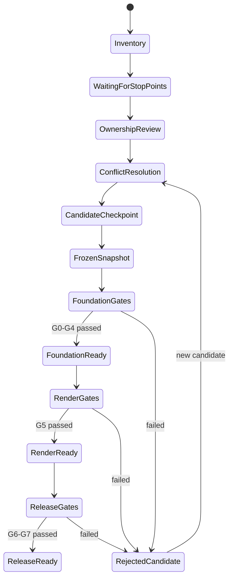
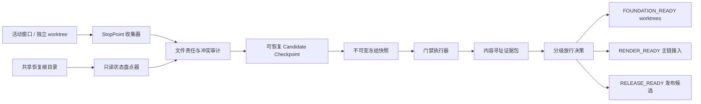

# PPT Video Workbench 共享开发基线冻结与隔离集成完整设计

## 1. 文档信息

- 项目名称：共享开发基线冻结与隔离集成（Shared Foundation Freeze）。
- 设计日期：2026-08-11。
- 适用仓库：`F:\ppt-video-workbench-v3`。
- 决策状态：设计完成；当前只允许新增本设计和配套实施计划，正式冻结必须等待活动窗口形成停点。
- 配套计划：`docs/superpowers/plans/2026-08-11-shared-foundation-freeze.md`。
- 上游输入：恢复总图、现有冻结验收结果、P1/P2 基线文档、RenderGraph V2 迁移基线和所有活动窗口的变更。
- 下游消费者：RenderGraph V2、P1 七项生产能力、P2 平台能力、Windows 发布与安装验收。

## 2. 背景与问题

当前程序已经有一条可工作的 PPT 转视频链路，并且冻结快照完成过真实 8 页项目的预检、渲染、制作包、重启和任务持久化验收。与此同时，恢复根目录正在承载多条并行开发线，包括最终渲染、质量检测、时间线、特效、素材、材料、字幕、连续镜头、导出、调度和平台契约。

根目录存在大量 tracked/untracked 状态项。不同窗口可能同时修改共享契约、主应用 wiring、渲染入口、发布脚本和测试基础设施。此时直接继续集成会产生四类风险：

1. 无法证明某个文件的最终内容来自哪个窗口，也无法安全决定覆盖或保留。
2. 在持续变化的目录上运行全量门禁，会得到不可复现的结果或把后续写入混入验收。
3. 根目录构建、格式化、依赖安装、服务重启或安装验收可能影响其他窗口的工作进程和中间产物。
4. 已通过验收的冻结快照与当前根目录不是同一源码指纹，不能把旧证据直接声明为当前主线通过。

因此，所有正式集成前必须先完成一个独立的基础项目：收集每个窗口的可审查停点，建立文件责任和冲突清单，形成可恢复 checkpoint，从单一源码指纹创建冻结快照，在冻结副本上完成统一门禁，并按风险分级放行后续开发、渲染接入和发布。

## 3. 设计目标

### 3.1 产品与交付目标

1. 保留已经通过验收的转视频能力，不因新模块整合而回退。
2. 为所有后续项目提供唯一、可重建、可审计的 foundation commit 和源码指纹。
3. 允许互不重叠的后续工作在独立 worktree 并行，不再共享一个可写根目录。
4. 让每一次“通过”都绑定精确源码、依赖锁、运行环境、测试日志和产物 hash。
5. 将“可继续开发”“可接入真实渲染”“可制作发布包”分成三个明确放行等级。

### 3.2 工程目标

1. 活动窗口、文件责任、停点、冲突、冻结清单和门禁证据全部采用版本化、机器可读契约。
2. 所有冻结产物以内容 hash 标识；冻结后不允许原地修改。
3. 所有测试、构建、渲染和打包在冻结副本或独立 worktree 中执行，不写入活动根目录。
4. 用户数据库、安装目录、媒体目录与源码目录保持边界隔离。
5. 门禁失败产生新的失败证据和候选快照，不覆盖上一份已通过基线。
6. 所有恢复操作都有明确入口，不依赖聊天记录、窗口标题或人工记忆。

## 4. 非目标

- 本项目不实现 RenderGraph V2 编译器、Remotion V2 执行器、Provider Kernel、云端协作或新的业务功能。
- 不自动合并存在语义冲突的文件，不按修改时间猜测“最新版本”。
- 不执行 `git reset --hard`、`git clean`、批量 checkout、目录覆盖复制、worktree prune 或历史重写。
- 不在未授权时修改 `F:\app\app`、用户数据库、用户真实项目或 `F:\Video` 中的既有产物。
- 不读取、导出或复制 API Key、Cookie、Token、凭证库内容和其他密钥。
- 不把未提交工作树、超时命令、后台仍运行的进程或旧日志当作通过证据。
- 不要求所有未来功能在本项目内完成；本项目只建立可信起点和分级门禁。

## 5. 四个强制边界

| 边界                | 路径                                              | 权威内容                                 | 本项目允许操作                                    | 禁止操作                                              |
| ------------------- | ------------------------------------------------- | ---------------------------------------- | ------------------------------------------------- | ----------------------------------------------------- |
| 主源码              | `F:\ppt-video-workbench-v3`                       | 当前恢复开发源码、文档、测试和未归档成果 | 只读盘点；停点齐备后创建 checkpoint 和冻结副本    | 活动窗口写入时格式化、构建、批量覆盖或破坏性 Git 操作 |
| 安装目录            | `F:\app\app`                                      | 用户当前安装版                           | RELEASE_READY 阶段经明确授权后做隔离安装/升级验证 | 未授权覆盖、重装、卸载或用其反推源码                  |
| 用户 workspace-data | `%LOCALAPPDATA%\PPTVideoWorkbench\workspace-data` | 用户项目、任务、数据库和项目相对产物     | 使用只读清单；验收时复制项目到隔离数据根          | 改真实数据库、迁移真实项目或删除缓存/产物             |
| 视频目录            | `F:\Video`                                        | 缓存和输出目录                           | 读写新的带 freeze ID 的隔离子目录                 | 覆盖、移动或清理既有 `Cache`/`Output` 内容            |

边界规则必须写入冻结清单；任何脚本发现目标路径超出声明边界时立即失败。

## 6. 术语和状态模型

### 6.1 术语

- **活动窗口**：可能继续写入主源码或关联 worktree 的任务窗口。
- **停点**：一个窗口声明的精确 HEAD、状态清单、文件责任、已完成内容、未完成内容和安全恢复方式。
- **候选基线**：已经完成来源归属和冲突处理、但尚未通过全部门禁的单一源码状态。
- **冻结快照**：由候选基线生成、内容不可变、拥有 manifest 和 SHA-256 指纹的测试输入。
- **Foundation ID**：`foundation-YYYYMMDD-HHMMSS-<short-hash>` 格式的全局标识。
- **证据包**：命令、版本、退出码、日志摘要、完整日志路径、产物元数据和 hash 的集合。

### 6.2 状态机



已冻结快照不得退回原地修改。修复必须进入新的候选 checkpoint，并产生新的 Foundation ID。

## 7. 总体架构



### 7.1 只读状态盘点器

负责读取以下事实，不修改工作区：

- Git branch、HEAD、worktree、porcelain v2 状态和 unmerged 数量。
- tracked/untracked 文件清单及目录分布。
- 当前相关进程、端口和命令行摘要，但不得停止进程。
- 四个边界的存在性、可写性、磁盘空间和规范化路径。
- 依赖锁文件、运行时版本和最近冻结验收引用。

盘点输出写入新的证据目录；若主源码仍有活动写入，只允许写到预先登记的隔离文档/证据目录。

### 7.2 StopPoint 收集器

每个活动窗口必须提交 `WindowStopPointV1`，至少包含：

- `window_id`、任务名称、负责人/代理标识。
- `repository_path`、`worktree_path`、branch、HEAD。
- 精确 tracked/untracked/unmerged 清单 hash。
- 拥有和可能继续修改的路径模式。
- 已完成能力、已运行门禁和证据位置。
- 未完成任务、已知失败和下一安全步骤。
- 是否仍会写入、进入 idle 的时间和恢复命令。

未提供停点的活动写入窗口会阻断 G1；只读窗口可以登记为 `read_only`，不阻断冻结。

### 7.3 文件责任与冲突审计

审计器将所有 stop point 与实际 Git 状态合并为 `OwnershipMapV1`：

- 每个正式文件只能有一个 authoritative owner。
- 生成物、缓存、备份和日志必须与源文件分开分类。
- 多窗口修改同一文件时标记 `semantic_conflict`，禁止自动选边。
- 共享入口文件只允许在集成阶段由 integration owner 修改。
- 未知来源文件必须明确归档、纳入、隔离或删除候选；在作出决定前不得进入 checkpoint。

共享入口至少包括：

- `apps/api/src/workbench/main.py` 及主路由 wiring。
- 领域公共模型、数据库迁移和项目 manifest。
- `packages/contracts/`、OpenAPI 和前端 API client。
- `remotion/src/Root.tsx` 与主 composition。
- `scripts/build-release.ps1`、launcher、runtime manifest 和 installer。
- 根 `pyproject.toml`、`uv.lock`、`package.json`、pnpm lock 和统一 lint 配置。

### 7.4 Candidate Checkpoint 管理器

候选 checkpoint 必须：

1. 来自单一源码目录和单一 Git 元数据源。
2. 保留所有已接受的源文件和必要未跟踪文件。
3. 排除缓存、构建、安装、用户数据和无关备份，但排除规则必须可审计。
4. 记录 `git diff --binary`、未跟踪文件清单和内容 hash。
5. 能在新目录重建并得到相同 manifest hash。
6. 不覆盖旧 checkpoint、冻结快照或验收证据。

推荐同时保存 Git commit/ref、恢复 bundle 或补丁、未跟踪内容归档和重建说明。任何一种单独机制都不能替代可重建验证。

### 7.5 冻结快照生成器

冻结快照位于独立的、带 Foundation ID 的目录。生成后执行：

- 路径 containment 校验。
- 文件数量、大小、SHA-256 和总 manifest hash。
- Git HEAD、dirty patch hash、依赖锁 hash 和工具版本记录。
- 源码目录只读约束或变更探针。
- 生成前后双次 hash；不一致说明仍有写入，冻结失败。

门禁开始后再次发现 snapshot 内容变化，立即将本次结果标为无效。

### 7.6 门禁执行器

门禁只消费冻结快照，所有输出写入 `evidence/<foundation-id>/<gate-id>/`。每条命令保存：

- 命令标识和参数数组。
- 工作目录、工具版本和必要的非敏感环境摘要。
- 开始/结束时间、超时、退出码和是否仍有子进程。
- stdout/stderr 文件、摘要和 SHA-256。
- 输入 snapshot hash 和输出产物 hash。

超时、后台子进程未退出、只运行失败项、日志缺失或输入 hash 变化均视为失败。

## 8. 版本化契约

### 8.1 `WindowStopPointV1`

```json
{
  "schema_version": "1.0",
  "window_id": "string",
  "task_name": "string",
  "mode": "writer|read_only|idle",
  "repository": {
    "path": "logical-source-root",
    "branch": "string",
    "head": "40-char-sha",
    "status_manifest_sha256": "sha256"
  },
  "owned_paths": ["glob"],
  "shared_paths_touched": ["relative/path"],
  "completed": ["string"],
  "remaining": ["string"],
  "evidence_refs": ["relative/path"],
  "will_write_again": false,
  "safe_resume": "string"
}
```

真实绝对路径只保存在本机证据包中；可共享契约使用逻辑根和相对路径。

### 8.2 `FoundationFreezeManifestV1`

关键字段：

- schema/version、Foundation ID、创建时间和创建工具版本。
- source root logical ID、branch、HEAD、checkpoint ref 和 snapshot hash。
- 四边界解析结果和禁止写入声明。
- 输入 stop point IDs、ownership map hash 和冲突决议 hash。
- include/exclude 规则、文件清单 hash、依赖锁 hash。
- gate evidence refs、放行等级、未决风险和回退点。

### 8.3 `GateEvidenceV1`

关键字段：

- gate ID、输入 Foundation ID、snapshot hash。
- command ID、工具版本、开始/结束时间、退出码。
- 测试数量、passed/failed/skipped/warning 统计。
- 日志和产物的相对路径、大小、媒体元数据和 SHA-256。
- `valid`、`invalid_reason`、`approved_by` 和批准时间。

所有 schema 默认拒绝未知 major、绝对路径、凭证字段、NaN/Infinity 和无法规范化的数据。

## 9. 分级放行门禁

### 9.1 G0：边界识别

- 四个边界被准确识别。
- 源码、安装、用户数据和视频目录没有互相嵌套。
- 所有后续写入目标均为新的隔离子目录。

### 9.2 G1：窗口停点

- 所有 writer 窗口提交 stop point 并进入 idle，或迁移到独立 worktree。
- 两次间隔盘点得到相同的主源码状态 hash。
- 不存在来源未知的进行中进程写入根目录。

### 9.3 G2：文件责任与冲突

- 每个正式文件有且只有一个 owner。
- 所有共享文件冲突完成逐文件人工决议。
- unmerged 为 0；未知来源状态项为 0。

### 9.4 G3：可恢复 checkpoint 与冻结快照

- checkpoint 可在新目录重建。
- 重建 manifest hash 与原 checkpoint 一致。
- 冻结前后文件 hash 一致，snapshot 不再变化。

### 9.5 G4：Foundation 质量矩阵

- Python 全量测试、Ruff check/format check、mypy。
- Web lint、Prettier、typecheck、unit、build。
- Remotion typecheck、unit 和 composition contract。
- 契约、Schema、路径安全、日志脱敏和恢复测试。
- 关键本地 Playwright 流程。

G0-G4 全部通过后状态为 `FOUNDATION_READY`。此时可以从 foundation commit 创建独立 P1/P2/RenderGraph worktree，但不得默认切换真实渲染主链。

### 9.6 G5：真实渲染矩阵

- 已验收 8 页项目重跑，预检为 allowed，问题数为 0。
- 固化 MP4/制作包、时长、H.264/AAC、分辨率和 SHA-256。
- 50 页长项目记录耗时、峰值内存、缓存命中和取消/恢复。
- 真人模式验证源视频、音画同步、锚点、字幕和降级。
- 竖屏项目验证画幅、裁剪、安全区和输出元数据。
- 质量检测样本固定规则版本、问题清单和报告 hash。
- 重启后任务终态与产物仍可查询。

G5 通过后状态为 `RENDER_READY`，允许 RenderGraph/连续镜头/字幕/导出正式接入渲染主链。

### 9.7 G6：Windows 发布矩阵

- 从冻结 snapshot 构建，而不是从共享根目录构建。
- 运行时 manifest、依赖、FFmpeg filters 和许可证清单通过。
- 安装、首次启动、端口冲突、优雅退出、修复安装通过。
- 升级和回滚不破坏既有项目。
- 构建、安装和运行日志与 Foundation ID 绑定。

### 9.8 G7：最终推广与恢复演练

- 发布候选在隔离数据根完成端到端项目生命周期。
- checkpoint、snapshot、证据包均可按文档重建和验证。
- 回滚到上一已通过版本后项目仍可打开。
- 已知限制、feature flags 和未完成能力写入发布说明。

G6-G7 通过后状态为 `RELEASE_READY`。只有此等级可以申请更新 `F:\app\app` 或对外分发。

## 10. 后续项目放行关系

| 后续项目                               | 最低放行等级       | 额外前置                                           |
| -------------------------------------- | ------------------ | -------------------------------------------------- |
| P1 素材库、材料组织、字幕 UI 隔离开发  | `FOUNDATION_READY` | 独立 worktree 和不重叠文件责任                     |
| P2 Provider/Platform/Cloud 契约实现    | `FOUNDATION_READY` | P2 Foundation schema 冻结，默认 feature flags 关闭 |
| RenderGraph V2 编译器                  | `FOUNDATION_READY` | V2 schema/golden fixtures 保持兼容                 |
| RenderGraph/连续镜头接入正式预览和成片 | `RENDER_READY`     | GraphPreflight 先于 Job 入队                       |
| 多规格导出、批处理和调度主线集成       | `RENDER_READY`     | 所有长任务支持取消、恢复和输入 fingerprint         |
| 安装包、升级、回滚和正式发布           | `RELEASE_READY`    | 明确用户授权和安装目录保护                         |

## 11. 并发与文件责任策略

1. 根恢复目录在 G1 开始后进入冻结窗口，除集成 owner 外全部只读。
2. 每条功能线从同一个 foundation commit 创建独立 worktree。
3. 共享契约先串行冻结；功能实现只新增或修改责任目录。
4. 主应用 wiring、数据库迁移、OpenAPI/client、主 Remotion composition 和发布脚本只在集成分支串行修改。
5. 合并顺序由依赖决定，不由完成时间决定。
6. 任一分支修改不属于自己的共享文件，必须先更新 ownership map；否则拒绝集成。
7. 合并后只重跑受影响门禁不构成发布证据；最终必须在新的冻结 snapshot 上跑完整等级门禁。

## 12. 安全设计

- 工具只接受规范化绝对根加相对目标，不允许未解析变量、`..`、软链接逃逸或目录根递归删除。
- 进程管理只终止由当前 gate 启动且记录了 PID/creation time/command fingerprint 的子进程。
- 验收数据库使用真实数据库的只读复制，不对真实项目执行迁移。
- 日志过滤 Authorization、Cookie、API key、token、用户正文和非必要绝对路径。
- 证据包不收集密钥文件、浏览器 profile、凭证库、系统环境全量 dump。
- 安装、升级、卸载、迁移或删除操作必须单独授权，不能从“完成前置项目”推导授权。
- 所有媒体发布先写 staging，完成 size/hash/ffprobe 校验后原子发布。

## 13. 失败处理与恢复

| 失败场景             | 行为                         | 恢复方式                                     |
| -------------------- | ---------------------------- | -------------------------------------------- |
| 活动窗口继续写入     | G1 失败，不创建冻结 snapshot | 等待停点或迁移该窗口到独立 worktree          |
| 文件责任冲突         | G2 失败，保留双方内容        | 逐文件评审并生成显式决议                     |
| checkpoint 无法重建  | G3 失败，候选不可用          | 补齐未跟踪内容或恢复元数据后生成新候选       |
| snapshot hash 变化   | 所有门禁证据作废             | 丢弃本次 gate 输出，创建新 Foundation ID     |
| 测试失败             | 保留完整失败证据             | 在开发 worktree 修复，重新冻结，不原地补测   |
| 渲染超时但子进程存活 | G5 失败                      | 只终止受管子进程，记录日志并修复进程管理     |
| 安装验收失败         | 保留当前安装版               | 在隔离安装根修复候选，不覆盖 `F:\app\app`    |
| 用户中途取消         | 当前 gate 标记 cancelled     | 保留 checkpoint 和已完成证据，可按 gate 继续 |

## 14. 可观测性与证据保留

每个 Foundation ID 至少保留：

- inventory、stop points、ownership map、冲突决议。
- checkpoint manifest、重建说明、snapshot manifest。
- 每个 gate 的命令、版本、退出码、日志和统计。
- MP4、制作包、报告和安装包的元数据与 hash；大文件可以外置，但引用必须可验证。
- 放行决策、已知限制、feature flags 和回滚入口。

证据默认追加写；禁止用新结果覆盖旧结果。无效或失败证据保留 `invalid`/`failed` 状态，避免以后误用。

## 15. 验收标准

本项目只有在以下条件全部满足时才算完成：

1. 四个边界有机器可读且人工确认的记录。
2. 所有活动 writer 有 stop point，主源码在冻结窗口内稳定。
3. 冻结时盘点出的全部状态项都有来源和处置，不要求状态项数量变成 0，但未知来源必须为 0。
4. 共享文件不存在未决语义冲突，Git unmerged 为 0。
5. foundation checkpoint 可以在新目录重建并得到相同 hash。
6. 冻结 snapshot 在所有门禁期间保持不变。
7. G0-G4、G5、G6-G7 分别有完整退出码和证据包。
8. 真实 8 页、50 页、真人、竖屏和质量检测样本完成冻结验收。
9. Windows 安装、启动、修复、升级和回滚在隔离环境完成。
10. 形成唯一 foundation commit、分级放行决定和后续 worktree 创建说明。

## 16. 关键决策摘要

1. **先停点再冻结。** 不尝试在活动写入目录中获得可信通过结果。
2. **先归属再合并。** 不使用时间戳、文件大小或“看起来更新”决定冲突。
3. **验证冻结副本。** 根目录只用于盘点和集成，测试与构建不在其上执行。
4. **证据绑定指纹。** 旧验收可作为回归基准，只有源码指纹一致时才能复用为当前证据。
5. **分级放行。** FOUNDATION_READY 允许安全并行开发，RENDER_READY 允许接入成片，RELEASE_READY 才允许发布。
6. **真实数据只读复制。** 用户项目和数据库不承担开发测试风险。
7. **安装单独授权。** 完成源码门禁不自动授权覆盖现有安装。
