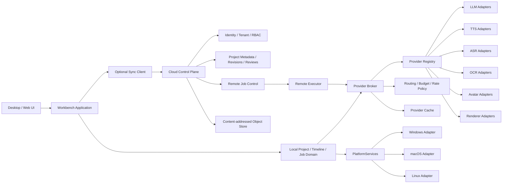
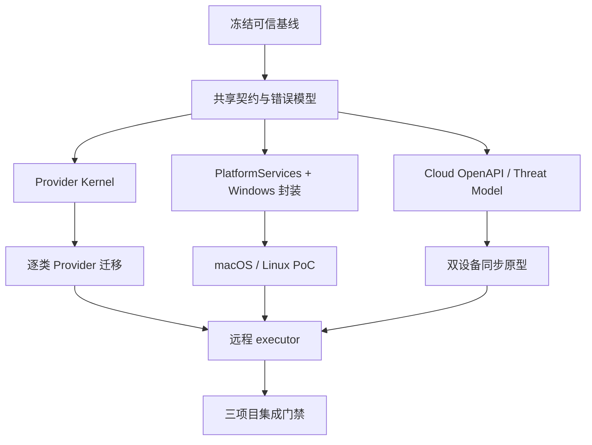

# PPT Video Workbench 三项 P2 平台基础能力完整设计

## 1. 文档信息

- 主题：多供应商适配平台、跨平台基础层与云端协作控制面契约。
- 设计日期：2026-08-11。
- 适用产品：PPT Video Workbench v3 及其后续桌面端、云端控制面和远程执行器。
- 决策状态：设计完成；允许先实施隔离契约、审计和原型，不允许在当前多人共用的脏根工作区直接接线。
- 配套计划：`docs/superpowers/plans/2026-08-11-three-p2-platform-foundations.md`。
- 上游基线：异步最终渲染、P03-P12、特效模板工作台、统一时间线、质量检测、在线安全更新和 Windows 发布链形成可审查停点后，由共同基线提交派生实施 worktree。

## 2. 背景与现状

当前程序已经具备本地七步制作流程、局部供应商接口、分页渲染、项目级缓存、任务恢复、模板包、Windows 打包和本地单用户数据模型。现有能力足以支撑单机生产，但还存在三个平台级缺口：

1. LLM、TTS、ASR、OCR、数字人和渲染器分别使用自己的客户端、配置、错误和缓存逻辑，无法统一探测能力、预算、限流、回退和审计。
2. 路径、进程、凭证、Office、浏览器、编码器、安装和更新仍明显绑定 Windows，尚未形成可测试的平台服务边界。
3. 项目、素材、时间线、任务和审核都以本地单用户为权威，没有可供云端账号、组织、评论、版本、远程任务和跨设备同步消费的稳定协议。

仓库中已经存在可复用的局部抽象，例如 `CompletionClient`、`TranscriptionBackend`、`PageRenderer`、任务仓库、项目 revision、输入 fingerprint 和声明式模板包。新设计以这些能力为迁移输入，不另建第二套业务流程，也不立即替换正在运行的本地链路。

## 3. 设计范围

### 3.1 本期包含

#### A. 多供应商适配平台

- 统一 Provider 描述、能力、健康、费用、限流、凭证引用和调用结果契约。
- 覆盖 LLM、TTS、ASR、OCR、数字人和渲染器六类 Provider。
- 支持显式选择、策略路由、能力过滤、费用预估、预算门禁、限流和受控失败切换。
- 统一缓存身份、错误分类、审计事件和诊断视图。
- 以适配器方式逐项接入现有实现，旧接口在迁移期继续可用。

#### B. 跨平台基础层

- 完成 Windows 绑定点清单和平台能力矩阵。
- 建立路径、原子文件、进程、凭证、工具发现、浏览器、媒体编码、Office 渲染、安装更新和系统诊断的 `PlatformServices`。
- Windows 行为先兼容封装，再建设 macOS/Linux 适配器和确定性降级。
- 建立三平台 CI 契约和最小可运行 PoC，不在首期承诺三平台完整功能对等。

#### C. 云端协作控制面契约

- 设计账号、组织、项目、角色、成员、评论、审核、锁定、版本和远程任务 API。
- 定义本地项目快照、内容寻址素材、操作日志和云端 revision 的同步协议。
- 设计离线继续工作、冲突检测、幂等重试和跨设备恢复。
- 建立独立控制面/数据面原型，不让云端成为本地项目的隐式强依赖。

### 3.2 本期不包含

- 不在当前阶段建设完整模板市场、支付、退款、分成和税务系统。
- 不允许模板包或 Provider 包把任意 Python、JavaScript、React、宏、EXE 或 DLL 注入主程序进程。
- 不在未冻结项目/时间线契约前实现多人实时共同编辑同一字段。
- 不在本地链路未稳定前默认启用云端存储、远程渲染或自动跨设备上传。
- 不承诺 macOS/Linux 支持 PowerPoint COM、Windows Media Foundation、Inno Setup 或 Windows 凭证管理器的原样语义。
- 不把不同 Provider 的输出视为内容等价，也不在未获用户授权时自动切换到更昂贵或外部数据处理区域。
- 不让云端服务直接读取本地绝对路径、用户密钥、未选择素材或诊断全文。

## 4. 总体目标

### 4.1 产品目标

1. 用户可以按能力、费用、隐私、区域和质量选择供应商，并清楚看到实际使用者、预计费用、失败原因和回退结果。
2. 同一项目可以在 Windows、macOS 或 Linux 上打开并得到明确的能力结果；缺少 Office 或硬件编码器时有可解释降级。
3. 本地用户可以选择性登录云端、同步项目、邀请成员、审核版本、添加评论和提交远程任务，同时保持离线可用。
4. 三项能力通过稳定契约连接，桌面端、云端和远程执行器不共享不受控实现细节。

### 4.2 工程目标

1. Provider、平台和云端契约全部版本化，并有 Python、JSON Schema、TypeScript/OpenAPI 一致性测试。
2. 所有外部调用携带稳定 request ID、幂等键、预算上下文、超时和取消信号。
3. Provider 缓存键完整包含供应商、能力、模型、版本、参数、区域和输入 fingerprint。
4. 平台差异只能出现在 `PlatformServices` 适配器中，业务模块不得散落新的 `sys.platform`、硬编码路径或 shell 拼接。
5. 云端对象不保存本地绝对路径；素材以内容哈希和项目内逻辑引用表达。
6. 本地项目仍可在未登录、断网、云端故障或账号失效时打开、预览和导出允许的内容。

## 5. 总体架构



### 5.1 权威边界

| 领域              | 权威                                                | 不得成为权威的对象                       |
| ----------------- | --------------------------------------------------- | ---------------------------------------- |
| 本地项目内容      | 本地已发布 project/timeline revision                | UI 临时状态、云端缓存、Provider 原始响应 |
| Provider 目录     | 签名或本地受控的 `ProviderDescriptorV1`             | 任意动态导入模块、环境变量扫描结果       |
| Provider 调用结果 | 规范化 `ProviderInvocationResultV1`                 | 日志文本、供应商 SDK 私有对象            |
| 平台能力          | 当前进程启动时生成的 `PlatformCapabilitySnapshotV1` | 用户代理字符串、未经验证的路径存在性     |
| 云端项目版本      | 云端不可变 revision + 操作日志                      | 最后写入者的可变 JSON、客户端本地时间    |
| 二进制素材        | SHA-256 内容对象 + 项目引用                         | 本地绝对路径、临时上传 URL               |
| 审核结论          | 对明确 revision 的 ReviewDecision                   | 对“当前项目”的模糊批准                   |

### 5.2 本地优先原则

- 云端功能默认关闭，未登录用户行为保持不变。
- 启用同步后，本地仍保存完整可打开的项目工作副本。
- 云端连接失败不自动回滚本地成功操作；操作进入可重放 outbox。
- 远程任务只消费冻结输入快照，不能直接操作用户正在编辑的本地目录。
- 云端删除使用逻辑删除和保留期；本地素材不因云端删除立即物理删除。

## 6. 共享契约与基础规则

### 6.1 共同信封

```python
class OperationContextV1(BaseModel):
    schema_version: Literal["1.0"]
    operation_id: UUID
    project_id: UUID | None
    project_revision: int | None
    actor_id: UUID | None
    idempotency_key: str
    requested_at: datetime
    deadline_ms: int | None
    cancellation_token_id: UUID | None
    data_classification: Literal["public", "internal", "sensitive", "restricted"]
    region_policy: list[str]
    budget: "BudgetEnvelopeV1 | None"
```

规则：

- `operation_id` 用于端到端追踪，`idempotency_key` 用于防止重复付费和重复写入，两者不可混用。
- 所有时间使用 UTC RFC 3339；媒体时间仍使用整数微秒。
- 任何跨边界引用使用 UUID、内容哈希或逻辑 URI，不传绝对路径。
- 结构化错误包含 `code`、`category`、`retryable`、`user_action`、`provider_id`、`operation_id`，不回显凭证和原始正文。

### 6.2 版本与兼容

- 协议使用 `major.minor`；major 不兼容，minor 只能增加可选字段和枚举扩展机制。
- Provider/平台/云端分别声明 `contract_min`、`contract_max` 和自身实现版本。
- 未知必需能力直接判定不兼容，不做猜测性降级。
- schema 解析默认拒绝额外字段；扩展数据只能进入明确的 namespaced `extensions`。
- 所有规范化 JSON 排序、编码和 hash 规则跨 Python/TypeScript/Rust 保持一致。

### 6.3 数据分类

| 分类       | 示例                        | 默认策略                         |
| ---------- | --------------------------- | -------------------------------- |
| public     | 内置模板 ID、公开模型名     | 可进入普通诊断                   |
| internal   | 项目 ID、任务 ID、模型参数  | 只进结构化本地日志               |
| sensitive  | 旁白正文、字幕、截图、音频  | 必须获得对应 Provider/上传授权   |
| restricted | API Key、访问令牌、购买凭证 | 只存凭证库引用，禁止日志和项目包 |

## 7. 项目 A：多供应商适配平台

### 7.1 领域模型

```python
ProviderKind = Literal["llm", "tts", "asr", "ocr", "avatar", "renderer"]


class ProviderCapabilityV1(BaseModel):
    capability_id: str
    modalities: list[str]
    languages: list[str]
    models: list[str]
    max_input_bytes: int | None
    max_duration_us: int | None
    supports_streaming: bool
    supports_cancellation: bool
    supports_idempotency: bool
    supports_word_timestamps: bool | None
    supports_cost_estimate: bool
    data_regions: list[str]


class ProviderDescriptorV1(BaseModel):
    schema_version: Literal["1.0"]
    provider_id: str
    display_name: str
    kind: ProviderKind
    adapter_version: str
    execution_mode: Literal["in_process_builtin", "local_process", "remote_https"]
    capabilities: list[ProviderCapabilityV1]
    credential_schema_id: str | None
    privacy_policy_ref: str | None
    enabled: bool


class ProviderInvocationV1(BaseModel):
    operation: OperationContextV1
    provider_id: str | None
    capability_id: str
    model: str | None
    input_refs: list[str]
    parameters: dict[str, JsonValue]
    expected_output_schema: str


class ProviderInvocationResultV1(BaseModel):
    operation_id: UUID
    provider_id: str
    capability_id: str
    model_resolved: str | None
    status: Literal["succeeded", "failed", "cancelled", "degraded"]
    output_refs: list[str]
    usage: dict[str, Decimal]
    estimated_cost: Decimal | None
    billed_cost: Decimal | None
    cache_identity: str
    provider_request_id: str | None
    warnings: list[str]
```

### 7.2 Provider 生命周期

```text
discovered -> validating -> available
available -> degraded -> available
available/degraded -> disabled
任意状态 -> incompatible
```

- 内置适配器来自应用发布包，启动时读取静态 registry。
- 外部远程 Provider 只注册描述和 HTTPS 端点，不下载执行代码。
- 本地进程 Provider 必须来自签名运行时清单，通过受限参数数组调用。
- 探测失败只影响该 Provider，不阻止本地应用启动。
- 自动探测有 TTL 和退避，不允许每次 UI 打开都产生外部付费请求。

### 7.3 能力探测

能力探测分三层：

1. `static`：读取内置/签名描述，不访问网络。
2. `health`：验证端点、认证、模型可用性和速率头，不提交用户内容。
3. `sample`：用户明确触发后使用固定无敏感 fixture 做最小真实调用。

探测结果记录：

- `observed_at`、`expires_at`、延迟区间和错误分类；
- 可用模型、语言、区域、输入上限和取消能力；
- 是否使用真实计费调用；
- 探测证据摘要，不保存供应商完整响应。

### 7.4 路由与失败切换

路由顺序：

1. 过滤禁用、过期、不兼容和缺凭证 Provider。
2. 过滤不满足语言、模态、时长、区域和隐私政策者。
3. 应用项目固定 Provider、用户偏好和组织策略。
4. 比较预算、健康、近期错误率、预计费用和质量等级。
5. 生成有序候选，不立即调用。
6. 调用第一候选；仅在策略允许且错误可切换时尝试下一候选。

禁止自动切换的情况：

- 输入或 schema 错误；
- 用户固定了 Provider/model；
- 下一候选的数据区域或隐私等级更宽；
- 下一候选预计费用超过剩余预算或确认阈值；
- 已产生不可撤销的付费副作用但幂等状态未知；
- 输出差异会破坏已锁定的人工审核结果。

### 7.5 费用、预算与限流

- `CostEstimator` 返回估算值、币种、价格表版本和误差说明。
- 预算可定义到调用、项目、日、组织四级；优先使用最严格有效上限。
- 调用前执行软/硬门禁；软门禁需要确认，硬门禁禁止执行。
- 限流使用 Provider/凭证/能力维度的 token bucket，并尊重 `Retry-After`。
- 自动重试和失败切换共享一次调用预算，不能各自无限重试。
- 账单记录只保存用量、价格版本和供应商请求 ID，不保存密钥或正文。

### 7.6 统一缓存

```text
cache_identity = SHA256(
  provider_id + capability_id + adapter_version + model_resolved +
  normalized_parameters + input_fingerprints + output_schema_version +
  locale + region + deterministic_seed
)
```

- 不同 Provider、模型或 adapter 版本绝不共享结果缓存。
- 非确定性调用只有在业务明确允许时缓存，并记录 seed/temperature。
- 缓存对象先校验 hash、大小、schema 和项目归属，再发布引用。
- 凭证轮换一般不失效内容缓存，但 Provider 租户影响输出时必须进入 identity。
- 缓存命中仍产生轻量审计事件，但不重复计费。

### 7.7 凭证管理

- 项目清单只保存 `credential_ref`，不保存密钥。
- Windows 使用 Credential Manager/DPAPI 适配器；macOS 使用 Keychain；Linux 优先 Secret Service，缺失时要求用户显式启用受保护文件后备。
- 凭证解析只发生在调用边界，业务模型和日志不可访问明文。
- 远程 executor 使用短寿命、最小权限令牌，不复制桌面长期密钥。
- 导出项目、诊断包和云端同步默认排除所有凭证引用详情。

### 7.8 现有模块迁移

迁移采用 strangler pattern：

1. 先包装现有 `CompletionClient`、`TranscriptionBackend`、HeyGen 客户端和 `PageRenderer`。
2. 保持现有业务服务方法签名，通过 feature flag 选择旧路径或 Provider Broker。
3. 逐类比较旧/新输出 schema、缓存键、错误码和故障恢复。
4. 新路径稳定一个小版本后，旧路径只保留紧急回退。
5. 完成真实样本和 Windows 门禁后才删除旧直接调用。

### 7.9 API 与界面

- `GET /api/providers`
- `GET /api/providers/capabilities`
- `POST /api/providers/{provider_id}/probe`
- `POST /api/providers/estimate`
- `GET /api/providers/health`
- `GET /api/projects/{id}/provider-policy`
- `PUT /api/projects/{id}/provider-policy`
- `GET /api/projects/{id}/provider-usage`

设置界面展示 Provider 类型、模型、语言、区域、健康、预计费用、凭证状态和最近失败；项目界面只展示当前项目可用候选和策略，不暴露全局密钥。

## 8. 项目 B：跨平台基础层

### 8.1 支持矩阵

| 能力                | Windows 首版             | macOS PoC               | Linux PoC             | 降级原则             |
| ------------------- | ------------------------ | ----------------------- | --------------------- | -------------------- |
| 本地项目/素材       | 完整                     | 必须                    | 必须                  | 无降级               |
| Remotion/Chromium   | 完整                     | 必须                    | 必须                  | 缺失则禁止预览/渲染  |
| FFmpeg/FFprobe      | 完整                     | 必须                    | 必须                  | 缺失则阻断媒体任务   |
| PowerPoint COM      | 支持                     | 不支持                  | 不支持                | LibreOffice/静态渲染 |
| LibreOffice         | 可选                     | 可选                    | 可选                  | 静态图片/PDF 输入    |
| 硬件编码            | 探测启用                 | 探测启用                | 探测启用              | 软件编码             |
| 系统凭证库          | DPAPI/Credential Manager | Keychain                | Secret Service        | 明确配置的后备       |
| 安装更新            | Inno/独立助手            | 签名 app bundle/updater | AppImage/deb/rpm 策略 | 手工更新说明         |
| Office 原生动画捕获 | 支持                     | 不支持                  | 不支持                | F2/静态降级          |

### 8.2 PlatformServices

```python
class PlatformServices(Protocol):
    info: PlatformInfoService
    paths: PlatformPathService
    files: AtomicFileService
    processes: ProcessService
    credentials: CredentialService
    tools: ToolDiscoveryService
    browser: BrowserService
    media: MediaRuntimeService
    office: OfficeRenderService
    updates: UpdatePlatformService
    power: PowerStateService
```

业务模块只能依赖协议，不得实例化具体平台实现。应用 composition root 根据平台和能力快照创建实现。

### 8.3 路径与原子文件

- 使用逻辑目录：`app_data`、`workspace_data`、`cache`、`logs`、`runtime`、`temp`、`downloads`。
- 所有项目引用保持正斜杠相对路径；平台适配器负责转换。
- Windows 防御盘符、UNC、ADS、保留设备名和重解析点；macOS/Linux 防御符号链接、大小写碰撞和挂载边界。
- 原子替换必须声明同卷要求；无法跨卷原子替换时使用复制、fsync、hash 校验和受控指针切换。
- 文件锁失败、杀毒占用、Finder/索引器占用和 NFS/网络盘不可靠语义均产生稳定错误码。

### 8.4 进程与取消

- 只使用参数数组，不拼接 shell 命令。
- `ProcessService` 统一 stdout/stderr 限长、编码、超时、进程组、取消和子进程清理。
- Windows 使用 Job Object/受控终止；Unix 使用 process group 和 SIGTERM/SIGKILL 分级。
- 取消必须区分协作式安全点和强制终止；强杀后任务进入可恢复状态，不假报成功。
- 任何平台都不能按进程名批量杀死用户已有 Office、浏览器或 FFmpeg。

### 8.5 工具与媒体运行时

- 工具发现返回路径、版本、来源、签名/哈希、功能能力和探测时间。
- 优先使用应用捆绑运行时，其次使用受支持的系统安装；不从任意 PATH 静默选择未知二进制。
- FFmpeg 编码器能力通过真实探测获得；硬件编码失败可在同一任务内降级一次软件编码并记录原因。
- 浏览器能力区分 Remotion 渲染、普通预览和自动化测试，不共享不兼容启动参数。
- 字体清单和字体替代进入渲染 fingerprint，避免跨平台静默漂移。

### 8.6 Office 与高保真替代链

```text
Windows + PowerPoint -> PowerPoint adapter
PowerPoint 不可用 -> LibreOffice adapter
LibreOffice 不可用 -> 已验证 PDF/整页图
均不可用 -> 明确阻断需要高保真的任务
```

- macOS 首版不通过 UI 自动化控制 PowerPoint，避免脆弱且不可复现的脚本路径。
- 不在任何平台执行宏、ActiveX、OLE、外部链接更新或不受控网络请求。
- 同一 PPT 在不同 renderer 上的输出不能共享视觉缓存。
- 项目记录 renderer、版本、字体环境、平台和降级原因。

### 8.7 安装、更新与签名

- 共用更新元数据和包内容清单，平台包分别签名。
- Windows 使用 Authenticode/Inno/更新助手；macOS 使用 Developer ID、notarization 和 app bundle；Linux 发布 AppImage 或受控包仓库，并校验清单签名。
- 更新助手只操作不可变 release 目录和当前版本指针，不覆盖 workspace data。
- 不同平台可处于不同功能成熟度；更新元数据声明平台、架构和最低数据 schema。

### 8.8 平台诊断 API

- `GET /api/platform/info`
- `GET /api/platform/capabilities`
- `POST /api/platform/probes/{probe_id}`
- `GET /api/platform/tools`
- `GET /api/platform/degradations`

诊断界面必须区分“功能不支持”“运行时缺失”“配置错误”“临时故障”，并提供平台对应动作，不向用户展示原始堆栈。

## 9. 项目 C：云端协作控制面契约

### 9.1 部署边界

云端采用独立服务，不嵌入桌面 FastAPI 进程：

```text
cloud-control-plane/
├── identity
├── organizations
├── projects
├── revisions
├── reviews-comments
├── sync
├── jobs-executors
├── audit
└── object-metadata

cloud-object-store/
└── content-addressed encrypted objects

desktop/
└── optional sync client + local outbox/inbox
```

控制面保存元数据、权限、revision、操作、评论和任务；大素材进入对象存储；远程执行器只获得单任务、短寿命、最小范围访问。

### 9.2 身份与租户

核心对象：

- `User`：人类账号；
- `Organization`：计费、策略和数据边界；
- `Workspace`：团队项目容器；
- `Membership`：用户在组织/工作区中的角色；
- `ServiceAccount`：CI/远程 executor，不可交互登录；
- `Device`：授权桌面设备和同步游标。

首版角色：

| 角色     | 权限摘要                            |
| -------- | ----------------------------------- |
| owner    | 组织策略、成员、删除、导出          |
| admin    | 工作区、成员和项目管理              |
| editor   | 上传、编辑、创建 revision、提交审核 |
| reviewer | 评论、比较、批准/拒绝明确 revision  |
| viewer   | 只读预览和下载允许工件              |
| executor | 仅领取任务、读取输入、写入结果      |

权限由服务端每次校验；客户端隐藏按钮不能替代授权。

### 9.3 云端项目模型

```python
class CloudProjectRevisionV1(BaseModel):
    project_id: UUID
    revision_id: UUID
    parent_revision_ids: list[UUID]
    sequence: int
    manifest_object_hash: str
    operation_log_hash: str
    asset_refs: list[str]
    created_by: UUID
    created_at: datetime
    status: Literal["draft", "in_review", "approved", "rejected", "archived"]
    content_hash: str
```

- revision 不可变；“当前版本”只是受并发保护的指针。
- 审核、评论和远程任务全部绑定 revision ID。
- 项目清单先规范化、移除本地绝对路径和凭证，再成为云端对象。
- 大文件按内容哈希去重，但授权仍按项目/组织引用判断，不能因 hash 相同越权访问。

### 9.4 同步协议

同步采用操作日志 + 不可变快照，不采用整个 JSON 的最后写入者获胜。

```text
local operation -> outbox
outbox -> POST operations (idempotent)
server validates base revision and permissions
accepted -> new cloud revision / cursor
conflict -> structured conflict set
client pulls missing operations and objects
client rebases safe operations or asks user
```

操作至少包括：

- 元数据字段更新；
- 页面/素材增删和排序；
- 时间线命令；
- 模板/Provider 策略引用；
- 评论和审核动作；
- 锁定与解锁；
- 归档和恢复。

不能自动合并：

- 同一时间线 clip 的互斥 trim/move；
- 已批准 revision 上的内容改写；
- 同一路径但不同 hash 的资产替换；
- Provider/费用策略扩大数据区域或预算；
- 删除与编辑同一对象。

### 9.5 锁定、评论与审核

- 锁定使用有 TTL 的 lease，不是永久布尔值；包含 holder、scope、base revision 和续租时间。
- 离线编辑不能保证持有云端 lease，重新上线后按操作冲突处理。
- 评论使用稳定 anchor：项目字段、page ID、timeline clip ID、时间范围或 evidence ID。
- 审核批准绑定内容 hash；任何内容变化自动使批准过期。
- 管理员强制解锁和审核覆盖必须进入审计日志并填写原因。

### 9.6 素材上传与下载

- 客户端先提交 hash/size/media type，服务端返回缺失对象和短寿命分片 URL。
- 上传完成后服务端验证大小、hash、容器和恶意内容扫描，再允许 revision 引用。
- 下载 URL 绑定用户、对象、范围和短过期时间，日志不记录完整查询 token。
- 支持断点、分片、重试和本地内容缓存；对象解密后仍必须验证 hash。
- restricted 数据默认不上传；组织策略可以完全禁用某些素材类别。

### 9.7 远程任务与 executor

```text
queued -> leased -> running -> uploading_result -> succeeded
queued/leased/running -> cancelling -> cancelled
leased/running -> retry_wait -> queued
任意执行状态 -> failed
```

- 任务输入绑定不可变项目 revision、Provider policy revision 和运行时镜像版本。
- executor 通过能力标签领取任务，如 OS、GPU、Office、区域和模型运行时。
- lease 过期可重新领取，但结果提交以 attempt ID 和幂等键去重。
- 远程结果进入候选工件区，完成 hash、schema、媒体和权限校验后才发布。
- 首版不做任意用户脚本和不受信任插件执行。

### 9.8 云端 API 草案

#### 身份与组织

- `GET /v1/me`
- `GET/POST /v1/organizations`
- `GET/POST/DELETE /v1/organizations/{id}/members`
- `GET/POST /v1/workspaces`

#### 项目与版本

- `GET/POST /v1/workspaces/{id}/projects`
- `GET /v1/projects/{id}`
- `GET/POST /v1/projects/{id}/revisions`
- `GET /v1/projects/{id}/revisions/{revision_id}`
- `POST /v1/projects/{id}/current-revision`
- `POST /v1/projects/{id}/operations:batch`

#### 素材、评论与审核

- `POST /v1/objects:plan-upload`
- `POST /v1/objects:complete-upload`
- `POST /v1/objects:plan-download`
- `GET/POST /v1/projects/{id}/comments`
- `POST /v1/projects/{id}/reviews`
- `POST /v1/projects/{id}/leases`
- `POST /v1/projects/{id}/leases/{lease_id}:renew`

#### 任务

- `POST /v1/projects/{id}/jobs`
- `GET /v1/jobs/{job_id}`
- `POST /v1/jobs/{job_id}:cancel`
- `POST /v1/executors:register`
- `POST /v1/executors/{id}:lease-job`
- `POST /v1/jobs/{job_id}/attempts/{attempt_id}:complete`

### 9.9 认证与安全

- 人类客户端使用授权码 + PKCE；不在桌面嵌入客户端私钥。
- Access token 短寿命，refresh token 进入系统凭证库并支持设备撤销。
- 服务账号使用轮换密钥或工作负载身份，不共用用户 token。
- 所有租户表和对象访问必须显式包含 organization/workspace ownership 条件。
- 审计记录登录、成员、权限、revision、审核、下载、远程任务和管理员覆盖。
- 对象存储服务端加密；高敏组织可选客户管理密钥，但不能让普通 executor 获得长期解密权。

### 9.10 离线与失败恢复

- 本地 outbox/inbox 使用 SQLite WAL、幂等 operation ID 和校验游标。
- 网络中断保留本地成功状态；UI 显示 `local_only`、`syncing`、`synced`、`conflict`。
- Token 过期暂停同步，不删除 outbox。
- 客户端崩溃后从最后确认 cursor 和未确认 outbox 恢复。
- 服务端不可用时禁止创建“已云端批准”的假状态。

## 10. 三项目集成

### 10.1 Provider 与跨平台

- Provider descriptor 声明支持的 OS/架构和执行模式。
- 本地 Provider 由 `PlatformServices` 发现运行时、启动进程和读取凭证。
- 云端远程 Provider 不依赖桌面平台，但客户端仍用统一能力和费用模型展示。
- renderer Provider 的缓存身份包含平台、renderer、字体和硬件路径。

### 10.2 Provider 与云端

- 云端项目只保存 Provider policy revision 和 credential policy，不保存桌面密钥。
- 远程任务在服务端解析组织允许的凭证引用或托管连接。
- 费用估算在任务创建和 executor 开始前各执行一次，价格表变化超过阈值则重新确认。
- 供应商请求 ID、费用和错误进入租户审计，但正文按数据分类策略处理。

### 10.3 跨平台与云端

- Device 记录 OS、架构和能力摘要，不上传完整本机路径和软件清单。
- 同步对象使用逻辑路径和内容 hash，避免大小写、分隔符和盘符差异。
- 只有满足任务 capability labels 的 executor 才能领取 PowerPoint、GPU 或特定编码任务。
- 跨平台打开项目时生成 degradation report，不静默改写原 revision。

## 11. 存储与目录建议

```text
workspace-data/
├── providers/
│   ├── registry.json
│   ├── health/
│   ├── price-books/
│   └── cache-index/
├── platform/
│   ├── capability-snapshots/
│   └── tool-probes/
├── sync/
│   ├── accounts/
│   ├── outbox.db
│   ├── object-cache/
│   └── conflicts/
└── projects/
```

- Provider registry、平台快照和同步状态不写入单个项目正文。
- 项目只保存 policy/revision/逻辑引用。
- `workspace-data` 永不属于应用更新替换范围。
- 缓存、下载和对象 staging 有独立配额、清理保护和引用计数。

## 12. 错误模型

统一类别：

- `PROVIDER_UNAVAILABLE`
- `PROVIDER_AUTHENTICATION`
- `PROVIDER_RATE_LIMITED`
- `PROVIDER_BUDGET_BLOCKED`
- `PROVIDER_POLICY_BLOCKED`
- `PLATFORM_UNSUPPORTED`
- `PLATFORM_RUNTIME_MISSING`
- `PLATFORM_PROCESS_FAILED`
- `SYNC_AUTH_REQUIRED`
- `SYNC_CONFLICT`
- `SYNC_OBJECT_INVALID`
- `CLOUD_PERMISSION_DENIED`
- `REMOTE_EXECUTOR_UNAVAILABLE`
- `INTERNAL_CONTRACT_VIOLATION`

错误响应必须给出稳定 code、用户动作、是否可重试、operation ID 和安全摘要。原始 Provider 响应、token、绝对路径、正文和堆栈只可进入限长脱敏内部证据。

## 13. 可观测性

统一事件：

- `provider_probe_started/completed/degraded`
- `provider_invocation_started/cache_hit/retried/failed/completed`
- `provider_failover_considered/blocked/applied`
- `platform_probe_completed/degradation_selected`
- `sync_push/pull/conflict/resolved`
- `cloud_revision_created/reviewed/approved`
- `remote_job_leased/completed/requeued`

指标：

- Provider 成功率、P50/P95 延迟、429、超时、缓存命中、估算/实际费用差；
- 平台能力覆盖、工具探测耗时、软件/硬件编码降级率；
- 同步积压、冲突率、对象去重率、上传失败率、远程任务恢复率。

指标标签禁止使用项目名、正文、素材名、用户邮箱和完整 Provider request ID。

## 14. 安全威胁模型

| 威胁                      | 影响                     | 核心控制                                                 |
| ------------------------- | ------------------------ | -------------------------------------------------------- |
| 恶意 Provider 响应        | 路径逃逸、资源耗尽、注入 | schema、大小/时长上限、内容校验、隔离 staging            |
| Provider 自动切换泄露数据 | 隐私和区域违规           | 数据分类、区域过滤、显式确认、组织策略                   |
| 重试导致重复计费          | 成本损失                 | 幂等键、attempt 状态、预算共享、未知状态阻断             |
| 平台命令注入              | 本机代码执行             | 参数数组、签名运行时、无 shell 拼接                      |
| 凭证写入项目或日志        | 账号泄露                 | 系统凭证库、credential ref、日志扫描                     |
| 跨租户对象去重越权        | 数据泄露                 | 引用授权、租户条件、短寿命下载 URL                       |
| 同步最后写入覆盖          | 用户修改丢失             | operation log、base revision、结构化冲突                 |
| 恶意远程 executor         | 结果篡改、数据外泄       | 最小令牌、隔离输入、结果校验、审计与撤销                 |
| 平台差异造成静默输出漂移  | 成片不可复现             | capability snapshot、renderer/font fingerprint、降级报告 |

## 15. 测试策略

### 15.1 契约测试

- Python/JSON Schema/TypeScript/OpenAPI 快照一致。
- 未知字段、未知枚举、错误版本、NaN、绝对路径和非法 hash 被拒绝。
- 规范化 JSON 在三语言 fixture 上生成相同 hash。
- Provider adapter 与 broker 使用统一 golden result。

### 15.2 Provider 测试

- 成功、认证、429、超时、断网、取消、未知付费状态和非法响应。
- 能力不匹配、区域不允许、预算不足和用户固定 Provider。
- 自动回退允许/禁止矩阵；最多尝试次数和总预算上界。
- 缓存隔离、模型升级失效、凭证轮换和 Provider tenant 变化。
- fake Provider 做自动化，真实小额调用单独签署证据。

### 15.3 平台测试

- Windows、macOS、Linux 的路径、大小写、Unicode、长路径、符号链接和锁。
- 进程取消、子进程、超时、退出码、编码和强杀恢复。
- Chromium、FFmpeg、FFprobe、字体、Office/LibreOffice 和硬件编码探测。
- 每平台安装、首次启动、升级、回滚、卸载保留数据和诊断包。

### 15.4 云端测试

- RBAC/租户隔离、IDOR、对象 URL 过期、成员撤销和设备撤销。
- outbox 重放、断点上传、游标恢复、重复 operation 和服务端重试。
- 双设备并发、离线编辑、锁过期、审核失效和人工冲突解决。
- executor lease 过期、重复结果、恶意结果、取消和区域调度。
- 大项目、千素材、长时间离线和高延迟网络性能。

## 16. 发布与迁移策略

1. 所有能力先以 feature flag 关闭交付。
2. Provider 平台先旁路记录选择结果，不发真实调用；随后单能力灰度。
3. PlatformServices 先包装 Windows 现状，确保输出无变化，再启用 macOS/Linux PoC。
4. 云端先提供只读上传/下载原型，再开放评论和审核，最后开放内容操作同步。
5. 旧项目无 Provider policy 时确定性生成 local-first 默认策略。
6. 未登录项目不增加云端字段或后台网络请求。
7. 每阶段保留旧路径一个小版本周期，并提供显式回退开关和迁移报告。

## 17. 验收门禁

### Gate F0：可信基线

- 当前并行窗口形成提交或独立可审查停点。
- 根工作区来源已登记，全量测试和 Windows 发布基线可复现。
- 三条实施线从同一基线提交创建独立 worktree。

### Gate PROVIDER

- 六类 Provider 均有稳定契约，至少 LLM、ASR、TTS、renderer 完成双实现适配证明。
- 失败切换、预算、限流、缓存、凭证和取消门禁有自动化证据。
- 真实小额调用不重复付费，Provider 失败不损坏项目。

### Gate PLATFORM

- Windows 封装前后基线项目输出一致。
- macOS/Linux PoC 可创建、打开、预览并软件编码导出无 Office 项目。
- 所有不支持能力有确定性降级或明确阻断，项目不被静默改写。

### Gate CLOUD-CONTRACT

- 身份、租户、项目、revision、对象、评论、审核、锁和任务 OpenAPI 通过安全评审。
- 双设备同步原型能处理断网、重复、冲突、恢复和权限撤销。
- 未登录/断网时本地主流程无回归。

### Gate INTEGRATION

- 云端远程任务使用统一 Provider 和 Platform capability 契约。
- 同一冻结项目 revision 的本地/远程结果均有可追溯 runtime/provider fingerprint。
- 诊断、日志、同步和制作包不存在凭证、token、绝对路径或跨租户引用。

## 18. 风险与缓解

| 风险                           | 影响               | 缓解                                                      |
| ------------------------------ | ------------------ | --------------------------------------------------------- |
| 抽象过度导致简单本地流程复杂化 | 开发和排障成本上升 | local-first 默认实现、渐进迁移、业务服务保持原签名        |
| Provider 输出差异破坏人工锁定  | 内容漂移           | Provider/model 固定、revision、人工确认和缓存隔离         |
| 插件需求混入 Provider 平台     | 本机代码执行风险   | 只允许内置/签名适配器和远程 HTTPS；第三方代码另立沙箱项目 |
| 三平台功能对等承诺过早         | 工期失控           | 能力矩阵、PoC 门禁、明确降级，不用虚假同等支持            |
| 云端数据模型复制本地文件结构   | 同步脆弱           | 逻辑引用、内容对象、operation log 和不可变 revision       |
| 多窗口同时改共享契约           | 覆盖和伪绿         | Foundation 串行冻结、文件责任表、独立 worktree            |
| 远程渲染成本不可控             | 财务风险           | 估算、配额、确认阈值、组织预算和单任务上限                |
| 合规和数据驻留后补             | 重构和法律风险     | 数据分类、区域策略、删除/导出接口从契约阶段进入           |

## 19. 推荐实施顺序



- Provider Kernel 和 Cloud OpenAPI 可在共享契约冻结后并行。
- Windows `PlatformServices` 封装必须先于 macOS/Linux 适配，保证迁移没有改变现有输出。
- 远程 executor 必须等待 Provider、Platform capability 和 Cloud job 三份契约稳定。
- 模板插件运行时和模板市场不进入本计划；未来只消费这里的身份、签名、权限和跨平台沙箱能力。

## 20. 粗略工作量

| 实施线                   | 单人开发周 | 建议并行人数 | 当前可先做范围                      |
| ------------------------ | ---------: | -----------: | ----------------------------------- |
| Provider 平台            |       7-12 |            2 | 契约、registry、策略、fake adapters |
| 跨平台基础层             |       8-14 |            2 | 审计、协议、Windows 封装、CI PoC    |
| 云端控制面契约与协作 MVP |     16-30+ |          3-5 | ADR、OpenAPI、RBAC、同步原型        |
| 三线集成                 |        4-8 |            2 | 等三线达到各自门禁后                |

工作量不包含模板市场、支付、生产级全球多区域、企业 SSO、完整 macOS/Linux 功能对等和第三方代码插件沙箱。

## 21. 完成定义

只有同时满足以下条件，三项平台基础能力才可称为完成：

1. Provider、Platform、Cloud 契约均版本化并通过跨语言契约门禁。
2. 现有本地项目在 Provider/云端功能关闭时行为和输出不变。
3. 六类 Provider 有明确接入路径，费用、限流、缓存、凭证、回退和审计不再各自实现。
4. Windows 平台行为已封装，macOS/Linux PoC 通过明确能力矩阵而非伪装功能对等。
5. 云端身份、租户、revision、对象、审核、同步和远程任务通过安全与故障恢复测试。
6. 未登录、断网、Provider 故障、平台能力缺失和云端不可用均有可操作路径。
7. 本地/云端/远程执行的每个结果可追溯到项目 revision、Provider、运行时、平台和输入 fingerprint。
8. 不以 mock、文档声明或静态脚本检查替代真实 Provider 小额调用、三平台 PoC 和双设备同步验收。
