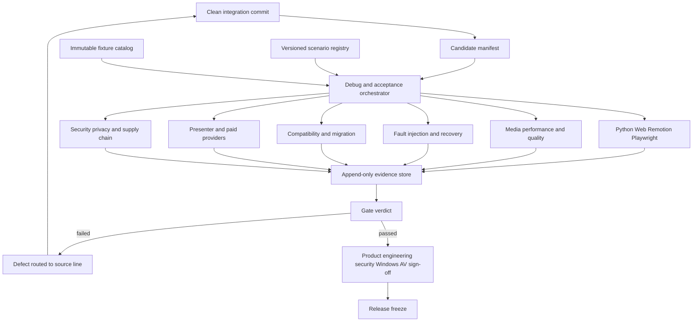

# PPT Video Workbench V1 调试与生产验收完整设计

## 1. 文档信息

- 设计日期：2026-08-11
- 适用仓库：`F:\ppt-video-workbench-v3`
- 文档定位：V1 调试、验证、缺陷关闭和生产验收专项设计
- 配套实施计划：`docs/superpowers/plans/2026-08-11-v1-debugging-and-production-acceptance.md`
- 上游总计划：`docs/superpowers/plans/2026-08-11-remaining-major-projects-program.md`
- 上游收口计划：`docs/superpowers/plans/2026-08-11-v1-production-closure.md`
- Windows 专项：`docs/superpowers/plans/2026-08-11-windows-release-stability-and-full-chain-acceptance.md`

本文解决“已有功能如何被系统性调试、怎样证明可发布、失败如何回到来源线修复”。本文不建立新的产品主线，不替代 Windows、Effects、RenderGraph、Presenter、P03-P12 或三线 Program 方案。

## 2. 当前事实与启动条件

设计时的恢复根目录仍包含大量混合变更，且存在三个正在写入或等待收口的专项：

1. Windows 安装、启动、中断恢复和完整实机链。
2. Effects Task 18-25 来源恢复、RC 完整性和视觉证据。
3. 三线 Program 的 W0 来源盘点与停点冻结。

RenderGraph V2/最终渲染隔离线已有独立 stop point，但只能选择性接入，不允许把生成的 `release/` 或整条历史分支直接并入候选。

本专项的硬启动条件是上游 `G0 ACTIVE_LINES_CLOSED`：

- 当前 Windows、Effects、RenderGraph 执行者均已完成或形成可信停点。
- 根目录及所有 worktree 的 owner、HEAD、dirty 状态和剩余写入范围明确。
- `foundation_source_commit` 可解析且来源未知项为 0。
- 不从共享 dirty root 创建调试分支或发布候选。

在 G0 前只允许编写方案、清单、schema 草案和只读盘点，不允许启动新的长时构建、实机验收或付费调用。

## 3. 目标

### 3.1 产品目标

1. 证明本地 Windows 七步工作流能够处理真实材料并稳定产出可播放、可审计、可恢复的成片。
2. 证明预览、预检、渲染、质量报告和制作包绑定同一不可变输入。
3. 证明项目升级、应用重启、渲染中断、磁盘或进程异常不会破坏用户项目和上一份成功成片。
4. 证明启用的 Presenter、Effects、HeyGen 和 Provider 能力具备真实证据；没有证据的能力保持关闭。
5. 形成一个从 clean commit 构建、可以重复验证、可以人工签署的唯一 V1 候选。

### 3.2 工程目标

1. 建立统一的候选、场景、运行、资源、工件、缺陷和签署契约。
2. 把 Python、Web、Remotion、Playwright、真实媒体、性能、视觉、故障注入、安全和 Windows 结果汇总到同一 evidence manifest。
3. 让每个失败都能定位到 source commit、scenario、step、input hash、runtime fingerprint 和稳定错误码。
4. 让失败修复回到 A/B/C 来源线，不在验收 worktree 长期堆积补丁。
5. 让发布门禁默认失败关闭，不接受旧候选、跨候选、缺 hash、被覆盖或来源不明的证据。

## 4. 非目标

- 不在本专项开发统一时间线、字幕工作台、多规格导出等产品主体功能。
- 不建立第二套 Job、缓存、项目迁移、质量引擎或安装器。
- 不在调试脚本中绕过产品 API 直接修改项目清单来制造通过结果。
- 不把 mock、静态截图、单元测试或 Linux 结果冒充 Windows 实机和人工视听证据。
- 不因测试难以稳定就降低断言、增加无条件重试、扩大超时或添加永久 skip。
- 不在没有单独授权时调用付费 Provider、申请云资源、执行代码签名或删除用户数据。
- macOS/Linux、生产云、插件市场和商业化属于 V1 后 Gate，不阻断纯本地 Windows V1。

## 5. 与现有三条开发线的关系

| Line                    | 本专项责任                                                                    | 不直接负责                            |
| ----------------------- | ----------------------------------------------------------------------------- | ------------------------------------- |
| A：Core Workbench       | CI、Playwright、项目/迁移 fixture、Web 竞态、可访问性、统一 evidence contract | FFmpeg、Windows 安装器、Provider 实现 |
| B：Render & Release     | 真实媒体、性能、音画质量、故障注入、缓存/渲染并发、Windows 候选与工件探针     | Job 核心状态机、云身份                |
| C：Platform & Ecosystem | 真实 Provider、凭证、预算、隐私、failover、云和跨平台 deferred evidence       | 本地七步工作流默认行为                |
| Integration Gate        | 候选冻结、全量执行、跨线缺陷分派、evidence manifest 和签署                    | 长期功能开发                          |

调试结果若需要改代码，必须创建 defect ticket 并退回拥有该路径的来源线。Integration worktree 只允许：

- 合并已审查提交；
- 生成候选和验证证据；
- 修复集成专属的版本号、生成文件或连接冲突；
- 不允许长期保留功能修复。

## 6. 总体架构



### 6.1 控制面

控制面负责：

- 读取唯一 candidate manifest；
- 校验 source clean、commit、lock 和 runtime hashes；
- 展开场景矩阵；
- 为每次运行分配 `run_id` 和隔离目录；
- 设置独立 workspace、数据库、端口、缓存和日志；
- 收集退出码、事件、截图、媒体探针、资源采样和人工复核；
- 生成不可覆盖的结果和 Gate verdict。

### 6.2 执行面

执行面只通过公开入口驱动产品：CLI、API、Web UI、安装器、launcher 和正式 Worker。内部单元测试可以调用模块，但 L3 以上验收不得绕过实际路径。

执行器分为：

- 自动化执行器：pytest、Ruff、mypy、Vitest、TypeScript、build、Playwright。
- 媒体执行器：Office/LibreOffice、Remotion、FFmpeg、ffprobe、OCR、ASR。
- 故障执行器：进程终止、端口占用、文件锁、磁盘配额、网络故障、输入变化。
- 真实服务执行器：HeyGen、LLM、ASR/TTS Provider，默认关闭且预算受控。
- 人工复核执行器：视觉、字幕、音画、交互和 Windows 生命周期签署。

### 6.3 证据面

所有证据追加写入以 candidate 和 run 为根的目录：

```text
docs/acceptance/debug-program/
  candidates/<candidate-id>/
    candidate.json
    runs/<run-id>/
      run.json
      scenarios/
      logs/
      screenshots/
      media-probes/
      resource-samples/
      defects/
      manual-review/
    evidence-manifest.json
    verdict.json
    signoff.json
```

大型 MP4、安装包、浏览器 profile 和运行时不进入 Git。Git 中只保存清单、hash、摘要、缺陷和可审计小证据；大型工件保存在受控 artifact root，并由 manifest 引用。

## 7. 权威契约

### 7.1 CandidateManifestV1

候选清单至少包含：

```json
{
  "schema_version": "1.0",
  "candidate_id": "v1-rc-<git>-<timestamp>",
  "source_commit": "<40-hex>",
  "source_dirty": false,
  "lock_hashes": {},
  "contract_hashes": {},
  "runtime_fingerprint": {},
  "installer": { "path": "relative/path", "size": 0, "sha256": "<64-hex>" },
  "feature_flags": {},
  "created_at": "RFC3339"
}
```

候选一经进入实机验收即不可原地修改。源码、锁文件、runtime、安装包或 feature flags 任一变化都必须创建新 candidate。

### 7.2 ScenarioDefinitionV1

每个场景包含：

- `scenario_id`、版本、owner line 和风险等级；
- 前置能力与适用平台；
- fixture IDs 和预期 hash；
- 公开入口与步骤；
- 机器可判定断言；
- 必需人工断言；
- 资源预算和超时；
- 允许的降级与禁止的绕过；
- 清理范围和恢复方法。

### 7.3 DebugRunV1

运行记录必须包含：

- candidate/source/runtime 身份；
- 主机、OS、CPU、GPU、内存、磁盘、DPI、Office 和浏览器版本；
- 开始/结束时间、退出码和进程残留；
- 每个场景的首次结果和所有重跑结果；
- 日志、截图、媒体、资源样本和缺陷引用；
- `passed`、`failed`、`blocked` 或 `not_applicable` 结论。

`not_applicable` 必须有 feature flag 和产品边界依据，不能用来隐藏失败。

### 7.4 DefectRecordV1

缺陷至少包含：

- 严重度 P0/P1/P2/P3；
- 首次失败 run/scenario/step；
- 稳定错误码和用户可见影响；
- source line、owner、suspected paths；
- 最小复现 fixture 和日志 hash；
- 修复提交、回归场景和关闭 candidate；
- 规避方法、剩余风险和版本计划。

P0/P1 不允许 waiver。P2 waiver 需要产品与工程共同签署；安全类 P2 还需要安全签署。

## 8. 调试阶段与 Gate

| 阶段 | 内容                              | Gate                          |
| ---- | --------------------------------- | ----------------------------- |
| D0   | 活跃窗口停点、来源冻结、候选基础  | DG0 DEBUG_SOURCE_READY        |
| D1   | clean 全量自动化和 CI             | DG1 AUTOMATION_GREEN          |
| D2   | Playwright 真实本地 E2E           | DG2 LOCAL_E2E_GREEN           |
| D3   | 8/50 页性能、压力和长稳           | DG3 PERFORMANCE_ACCEPTED      |
| D4   | 视觉、音频、字幕和质量引擎        | DG4 MEDIA_QUALITY_ACCEPTED    |
| D5   | 故障注入、恢复和原子发布          | DG5 RECOVERY_ACCEPTED         |
| D6   | 缓存、Job、并发、兼容和迁移       | DG6 DATA_SAFETY_ACCEPTED      |
| D7   | Presenter、HeyGen 和真实 Provider | DG7 OPTIONAL_FEATURES_DECIDED |
| D8   | 安全、UI、诊断、唯一 RC 和签署    | DG8 V1_DEBUG_ACCEPTED         |

Gate 严格按 D0 → D8 执行。D7 中未获得授权或真实证据的可选能力可以保持关闭并通过“禁用正确性”进入 D8；不能以代码存在代替真实验收。

## 9. 场景矩阵

### 9.1 自动化与契约

- Python 全量首轮执行。
- Ruff、mypy、Web lint/typecheck/test/build。
- Remotion test/typecheck/build 或 bundle smoke。
- Project Schema、OpenAPI、Python/TypeScript fixtures 和生成客户端漂移。
- migration v1-v4、重复运行、中断恢复和损坏输入。
- Playwright 项目生命周期、本地音频、Presenter、HeyGen fake boundary 和刷新恢复。
- Windows/Ubuntu CI；平台专属测试必须清楚标记。

CI 必须显式运行 Playwright，不能假设 `pnpm check` 已包含 `pnpm e2e`。

### 9.2 真实项目规模

| Profile | 用途       | 最低内容                                      |
| ------- | ---------- | --------------------------------------------- |
| S1      | 快速 smoke | 2 页、短旁白、单一画幅                        |
| S8      | 标准回归   | 8 页、PPTX+DOCX、本地 WAV、字幕、效果、制作包 |
| S50     | 大项目压力 | 50 页、多媒体、长旁白、缓存重用、资源采样     |
| S100    | 极限/夜间  | 100 页或等价时长，只在专用环境执行            |
| SV      | 竖屏/方屏  | 9:16 与 1:1、安全区、裁剪、导出元数据         |
| SP      | Presenter  | 5-8 分钟与 15-20 分钟真人样本                 |
| SE      | Effects    | 固定类别、三关键帧和同候选 Windows 动态复核   |

所有 fixture 必须声明来源、授权、是否可进入仓库、内容 hash、预期页数、时长和敏感级别。

### 9.3 性能与长稳

采集指标：

- 启动到 `/api/health` 时间；
- 导入、解析、预检、预览、分页渲染、合成和制作包耗时；
- API/Worker/Node/FFmpeg 峰值 RSS、CPU、GPU、磁盘和临时空间；
- 缓存冷启动、热启动和部分失效命中率；
- 任务队列等待、lease、attempt、checkpoint 和重试次数；
- 2 小时与 8 小时运行的内存增长、句柄、子进程和端口残留。

首个 clean candidate 生成基线。基线经工程负责人批准后冻结成 `performance-budget-v1.json`。后续默认门禁：

- 不允许 OOM、磁盘写满、失控分页文件或孤儿进程；
- 相同主机/fixture 的关键阶段相对基线回退超过 20% 阻断；
- 2 小时稳定运行末端 RSS 相对稳定区增长超过 15% 进入 P1 调查；
- 热缓存必须证明未读取过期输入，并显著减少重复工作；
- S50 必须记录峰值而非只记录结束值。

### 9.4 视觉、音频和质量

自动检查：

- 解码、流数量、时长、fps、分辨率、像素格式和音频参数；
- 黑帧、冻结、空帧、重复帧、缺帧和异常转场；
- 静音、削波、响度、首尾截断和音画漂移；
- 字幕时间、越界、遮挡、字体回退、断句和双语顺序；
- OCR/布局、Presenter/Overlay/Effects 安全区碰撞；
- 关键帧感知差异和动态阶段抽帧。

视觉回归必须比较实际输出，不得只验证 manifest 中存在 40 个条目或三种 checkpoint。

人工复核至少覆盖：片头、正文随机页、章节边界、片尾、最密字幕页、最复杂 PPT 页和所有高风险效果。人工记录必须绑定 candidate、artifact hash、复核人和时间。

### 9.5 故障注入

故障点覆盖：

- launcher 启动前、健康检查中、浏览器打开后；
- API 导入、解析、预检、入队和发布前；
- Worker claim、页面渲染、FFmpeg 合成和制作包写入；
- 进程 kill、正常关闭、机器重启模拟、端口占用；
- 文件锁、权限拒绝、磁盘配额、临时目录缺失；
- cache/manifest/checkpoint/WAL 损坏；
- 上游输入在排队、渲染和发布前发生变化；
- 网络超时、429、5xx 和 Provider 状态未知。

每个故障必须验证：状态转换正确、错误码稳定、临时文件受控、上一成功结果不变、重启后可诊断、重试不会重复计费或重复发布。

### 9.6 并发、缓存与数据安全

- 同项目重复提交和多标签页 CAS 冲突。
- 多项目队列、优先级、资源等待和取消。
- lease 过期、stale attempt、旧 generation publication。
- GC 与活动读取/写入并发。
- 素材替换、参数变化、runtime 变化和 graph 变化的选择性失效。
- 缓存索引损坏后的重建与保守降级。
- 项目数据库、manifest 和制作包的原子指针。

### 9.7 兼容与迁移

输入矩阵包括：

- Office 与 LibreOffice 支持版本；
- 普通 PPTX、图表、SmartArt、嵌入字体、动画、音视频、透明对象；
- PDF、扫描 PDF、DOCX、图片和损坏/加密输入；
- 中文、空格、超长路径、可移动磁盘和受控网络路径；
- 24/25/30/60fps、16:9/9:16/1:1、常用采样率和 VFR/CFR 输入。

项目矩阵包括真实归档项目、schema v1-v4、重复迁移、迁移中断、旧 reader、feature flag 关闭、卸载重装和版本回滚。迁移测试只操作副本，原项目零写入。

### 9.8 Presenter 与真实 Provider

Presenter 必须验证真实视频探测、ASR、分页锚点、人工修正、音画同步、字幕、遮挡、重启恢复和制作包。

HeyGen/LLM/ASR/TTS 必须验证：

- 显式授权、预算上限、凭证来源和日志脱敏；
- 请求幂等键、远端 request ID 和状态查询；
- 429/5xx/超时/断网/未知状态；
- 成功页缓存、失败页重试和重复计费防护；
- 凭证失效、轮换和撤销；
- fake 与 real adapter 的契约一致性。

没有预算、凭证或授权时，真实场景状态为 `blocked_external_authorization`，能力保持 disabled；这不是本地 V1 阻断。

### 9.9 安全、隐私和供应链

- 路径穿越、绝对路径、符号链接/重解析点和目录逃逸。
- 恶意 OOXML、压缩炸弹、超大媒体、畸形元数据和解析器崩溃。
- loopback API 绑定、CORS、浏览器来源、端口发现和本地权限。
- 密钥存储、日志/诊断包/制作包脱敏和用户数据扫描。
- 依赖锁、SBOM、许可证、运行时来源、hash 和更新签名。
- 降级、重放、坏签名、截断下载和回滚失败。

### 9.10 UI、可访问性和诊断

- 刷新、关闭重开、多标签页、连续点击、前后台切换和网络断开。
- 100%/125%/150%/200% DPI 与浏览器缩放。
- 键盘导航、焦点、可读状态、错误提示和禁用原因。
- 大列表、长文件名、中文文本、超长错误和日志分页。
- 稳定错误码、correlation ID、job/attempt/checkpoint 链和一键诊断包。

## 10. 缺陷严重度与发布策略

| 级别 | 定义                                                            | 发布处理                  |
| ---- | --------------------------------------------------------------- | ------------------------- |
| P0   | 数据丢失、安全破坏、无法安装/启动、成片不可用、错误覆盖成功结果 | 立即阻断                  |
| P1   | 主流程失败、可复现崩溃、严重音画/字幕错误、无法恢复、重复计费   | 阻断                      |
| P2   | 有明确规避的次要功能错误或平台差异                              | 需要 owner、计划和 waiver |
| P3   | 审美、文案、低影响易用性建议                                    | 可进入已知限制            |

每个修复必须：

1. 在原失败场景上复现红灯。
2. 在来源线提交最小修复和回归测试。
3. 生成新 integration commit；若影响 candidate 身份则创建新 candidate。
4. 重跑受影响场景及其依赖 Gate。
5. 保留旧失败证据并在新 candidate 关闭缺陷。

## 11. 隔离与资源规则

- 每次 run 使用唯一 workspace、SQLite、缓存、端口、日志和输出根。
- 不共享浏览器 profile、LibreOffice profile、FFmpeg 临时目录或 Provider request state。
- 资源测试使用专用机器或明确时间窗，不与安装器构建和其他长渲染并行。
- 运行前记录磁盘空间；低于场景预算时直接 blocked，不边跑边填满系统盘。
- 清理只针对 manifest 中声明的 run root，先验证绝对路径位于预期 artifact root。
- 任何物理卸载、版本回滚、付费调用和凭证使用需要显式授权。

## 12. CI 设计

CI 分为五层：

1. PR-fast：Ruff、mypy、契约、单元、Web/Remotion 定向。
2. PR-full：Python/Web/Remotion 全量、build、Playwright fake/local。
3. Nightly-media：S8、视觉关键帧、FFmpeg/Office 能力、故障抽样。
4. Nightly-stress：S50、长稳、资源、并发、缓存和 GC。
5. RC-Windows：安装版 A0-A9、真实媒体、Presenter/Effects 适用项和人工签署。

CI 结果必须保存完整退出码和 artifact。超时、runner 被取消、后台仍运行、仅重跑失败项或 `continue-on-error` 不能算通过。

## 13. 可观测性

所有长任务和调试步骤使用同一关联键：

```text
candidate_id -> run_id -> scenario_id -> project_id -> job_id -> attempt_id -> checkpoint_id -> artifact_id
```

日志采用结构化 JSONL，必须包含时间、level、component、event、稳定错误码和关联键。对用户可见的错误提供简明说明和下一步；内部栈、绝对敏感路径和密钥只进入受控脱敏诊断包。

## 14. 风险与缓解

| 风险                   | 后果               | 缓解                                    |
| ---------------------- | ------------------ | --------------------------------------- |
| 与活跃窗口抢写         | 来源混乱、证据失效 | G0 前只读；stop point 后启动            |
| 根目录混合变更被当候选 | 无法重建           | 只从 clean integration commit 构建      |
| 自动重试掩盖 flaky     | 假绿               | 记录首轮；重跑不覆盖                    |
| 大型测试抢占机器       | 其他任务失败       | 资源日历、独立 run root、串行重负载     |
| 视觉阈值不稳           | 误报/漏报          | 固定 runtime、感知差异、人工抽检        |
| 真实服务重复计费       | 成本和数据风险     | 预算、幂等、远端查询、未知状态确认      |
| 证据跨候选复用         | 错误放行           | candidate/hash 强绑定、失败关闭         |
| 清理误删               | 用户数据损坏       | manifest 白名单、绝对路径校验、显式授权 |
| 测试脚本绕过产品       | 通过无意义         | L3+ 只走公开入口                        |

## 15. 完成定义

本专项只有同时满足以下条件才完成：

1. DG0-DG8 全部产生 schema 正确、hash 可验证的 verdict。
2. 唯一 candidate 来自 clean commit，source/lock/runtime/installer hashes 一致。
3. Python、Web、Remotion、契约、迁移、build 和 Playwright 首轮全绿，无未解释 skip。
4. S8 与 S50 真实项目完成，性能预算、峰值和长稳证据完整。
5. 视觉、音频、字幕、质量引擎和人工视听 P0/P1 为 0。
6. 故障注入、缓存/Job 并发、迁移和原子发布证明用户数据安全。
7. Presenter、Effects、HeyGen/Provider 有真实证据，或明确保持 disabled 并验证关闭路径。
8. 安全、隐私、SBOM、许可证、运行时和诊断脱敏通过。
9. 产品、工程、安全、Windows 操作员和视听复核签署同一 candidate。
10. 发布冻结器拒绝旧、缺失、跨候选、被篡改或含 blocker 的证据。
