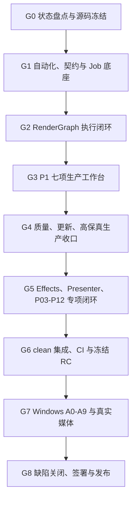

# PPT Video Workbench V1.0 生产收口完整设计

## 1. 文档信息

- 设计日期：2026-08-11
- 适用仓库：`F:\ppt-video-workbench-v3`
- 审计分支：`recovery/root-snapshot-20260810`
- 审计 HEAD：`117fb60cbb0ca877c0920a26f5ceb31d8e42e901`
- 配套实施计划：`docs/superpowers/plans/2026-08-11-v1-production-closure.md`
- 目标：把当前恢复工作树中的主流程、生产底座、专项能力和 Windows 发布工程收口为一个可重建、可验收、可签署的 V1.0 候选。

本文是生产收口总控设计，不替代 RenderGraph、P1、Effects、Presenter、S1、P2 和 Windows 发布专项设计。专项设计解决“怎么实现”，本文解决“按什么顺序集成、以什么事实为准、何时允许发布”。

## 2. 当前基线与问题定义

### 2.1 已存在且必须复用的能力

当前项目不是原型空壳，以下能力已经有领域模型、API、Web、Remotion 或自动化基础：

- 七步工作流：材料导入、解析匹配、旁白、音频、字幕/特效/预检、渲染导出。
- 本地录音、HeyGen、Presenter 三类音频/出镜路线及互斥门禁。
- 异步渲染任务、暂停/恢复/取消、页级缓存、制作包和质量分析。
- RenderGraph V2 schema、编译、snapshot、preflight、Remotion composition 和 FFmpeg 输出链。
- 时间线、素材派生、材料组织、字幕、连续镜头、多规格导出和批量生产基础模块。
- 自动质量检测、安全更新、PPT 高保真、Effects V2、Presenter 和 P03-P12 模块。
- Windows 安装器、GUI launcher、版本槽、发布产物清单和验收器基础代码。

后续不得再建立第二套 Job、时间线、素材存储、RenderGraph、发布器或验收真相。

### 2.2 审计时的硬事实

- 工作树包含 44 个 tracked 修改和 85 个 untracked 条目，尚不是可发布候选。
- Web 当前定向结果为 39 files / 76 tests passed。
- Remotion 当前定向结果为 12 files / 32 tests passed。
- Python 已确认存在 Project Schema 漂移、OpenAPI 漂移、Job attempt 预期冲突和 packaged desktop 入口契约失败。
- M8、Presenter、Effects 和 S1 报告仍处于 `pending_manual_windows` 或 `BLOCK`。
- RenderGraph V2 export 不应在完成真实媒体和 packaged Windows smoke 前作为生产默认值。
- 当前 release 目录中的历史安装包不能替代由干净提交生成的唯一候选和证据清单。

这些数字仅是 2026-08-11 审计快照。实施计划 T00 必须重新采集，后续不得用旧报告覆盖新事实。

## 3. 范围与发布边界

### 3.1 V1.0 必须完成

1. 干净、唯一、可重建的主线提交和候选身份。
2. Python/Web/Remotion/契约/迁移/发布自动化全绿。
3. Job、RenderGraph、素材、缓存和发布结果的权威真相一致。
4. 七步本地 Windows 工作流能够用真实文件完成预览、预检、渲染和制作包。
5. 安装、首次启动、中断恢复、卸载重装、升级回滚和数据保留通过。
6. 真实本地音频、受控 HeyGen、Presenter、Effects 和 P03-P12 的适用门禁有明确结论。
7. 人工视听、P0/P1 缺陷和发布签署闭环。

### 3.2 可作为 V1.0 `internal` 或 `stable_optional`

- RenderGraph V2 export。
- Presenter 模式。
- Effects V2 和模板工作台。
- 高级字幕、连续镜头、多规格导出和批量生产中的高级能力。
- 在线更新与高保真捕获。

这些能力必须默认关闭或显式选择；即使不升为默认，也必须保证关闭时旧链无回归、数据可读、失败明确。

### 3.3 V1.0 后独立推进

- 真实 Provider Kernel 的全供应商迁移。
- macOS/Linux 安装、签名和真实成片。
- Cloud Sync、OIDC、RBAC、对象存储、远端执行和生产云运维。
- 模板市场、任意第三方代码执行和企业分发平台。

P2 未完成能力必须 fail closed，不阻断纯本地 Windows V1.0，但不能被宣称为生产可用。

## 4. 核心设计原则

1. **唯一源码真相**：只从 clean integration commit 构建 RC，不从共享 dirty root 打包。
2. **输入冻结**：长任务入队时冻结 project revision、graph hash、asset hash、preset 和 runtime fingerprint。
3. **单一发布真相**：工件必须经过 size/hash/schema/ffprobe 验证后原子发布；重试不能产生第二个“最新”结果。
4. **兼容优先**：迁移只向前、幂等；回滚依靠旧 reader 和 feature flag，不执行数据库降级 SQL。
5. **默认安全**：新能力默认关闭；关闭时不写新业务状态、不请求外部服务、不改变旧输出。
6. **失败关闭**：证据缺失、候选不一致、报告过期、阻断项存在或进程残留都阻断发布。
7. **真实验收不可替代**：mock、单元测试和 CI 不能替代 Office、FFmpeg、浏览器、安装版、付费服务和人工视听。
8. **证据追加写**：失败记录保留；重跑使用新 `run_id`，不得覆盖历史失败。

## 5. 权威状态模型

| 领域     | 权威真相                                          | 禁止的第二真相                      |
| -------- | ------------------------------------------------- | ----------------------------------- |
| 项目编辑 | `ProjectManifest` + revision                      | UI 本地长期保存另一份项目状态       |
| 长任务   | Job / Attempt / Checkpoint / Lease / Publication  | 各功能自建任务状态机                |
| 素材     | AssetRef + content hash + project ownership       | 仅靠绝对路径引用素材                |
| 时间线   | ProductionTimeline revision                       | Presenter、字幕或特效各自维护时间轴 |
| 渲染     | Immutable RenderGraph snapshot + graph hash       | Worker 重新读取当前可变项目         |
| 缓存     | 输入依赖图 + runtime fingerprint                  | 只按文件名或 mtime 命中             |
| 输出     | Verified artifact manifest + atomic pointer       | 临时文件直接成为最终成片            |
| 发布     | candidate manifest + evidence manifest + sign-off | 搜索“最新 exe”或复用其他候选报告    |

## 6. 总体执行架构



严格主链为 G0 → G1 → G2 → G3 → G4 → G5 → G6 → G7 → G8。任何专项可以在独立 worktree 做不触碰共享契约的准备，但只有通过前置 Gate 的提交才允许进入集成候选。

## 7. 阶段设计

### 7.1 G0：状态盘点与源码冻结

目的：把恢复工作树转化为可审查的来源集合。

- 列出根目录及所有 worktree 的 branch、HEAD、dirty 状态和 owner。
- 将源码、生成物、用户数据、验收证据、备份和未知文件分类。
- 对 shared paths 指定唯一 owner；未知源码所有权必须降为 0。
- 修正文档状态漂移，建立单一状态清单。
- 形成小型 checkpoint commits，并在隔离目录验证可重建。

G0 通过后产生 `FOUNDATION_SOURCE_READY`，之后才允许创建新的功能 worktree。

### 7.2 G1：自动化、契约与生产底座

目的：先消除当前红灯，再冻结共享契约。

- 同步 Project Schema、OpenAPI、Python/TypeScript 类型和 migration fixtures。
- 修复 Job attempt/API 竞争与 packaged desktop 入口契约。
- 完成 Job v3 的 CAS、checkpoint、lease、publication、恢复扫描和付费任务未知状态。
- 完成内容寻址缓存、反向依赖失效和异步 GC。
- 全量测试必须首轮通过，不允许通过 skip、only、重试或降低断言伪造绿灯。

G1 的冻结产物是 schema hash、migration hash、OpenAPI hash、source fingerprint 和共享底座 stop point。

### 7.3 G2：RenderGraph V2 执行闭环

目的：让预览、渲染、质量和制作包指向同一个不可变输入。

- Python/TypeScript 使用同一 timebase golden fixtures。
- 预览任务冻结 graph/range/preset/runtime，支持 cache、pause、cancel 和 restart。
- LegacyProjectAdapter 只读投影旧项目；V2 项目不允许静默回退。
- 素材授权、hash、时长、字幕、转场、overlay 和 J/L Cut 在入队前预检。
- 使用真实 FFmpeg/ffprobe 验证 24/25/30/60fps、16:9/9:16/1:1、软/烧录字幕和音频边界。
- Windows packaged runtime smoke 通过后才能进入 internal export。

### 7.4 G3：P1 七项生产工作台

1. 时间线：选择、拖动、裁剪、分割、吸附、ripple、链接、marker、撤销重做和冲突重放。
2. 素材库：批量导入、对象存储、缩略图、代理、波形、授权、字体、LUT 和品牌包。
3. 材料组织：多文档/课件、章节拆合、页面替换、差异预览和显式同步时间线。
4. 字幕：词级、双语、术语表、逐词高亮、软/烧录/both/none 和人工确认。
5. 连续镜头：转场、J/L Cut、章节 continuity、overlay、安全区和多画幅。
6. 多规格导出：分辨率、fps、画幅、codec、章节、切片、GIF、字幕和制作包。
7. 批量生产：DAG、优先级、资源租约、夜间窗口、失败页重跑、重启恢复和 exactly-once publication。

七项能力共用 Job、AssetRef、Timeline、RenderGraph、Cache 和 Publication，不得复制基础设施。

### 7.5 G4：三项重大能力生产收口

质量检测：建立坏媒体 corpus、策略版本、P0/P1 召回与误报门禁、人工确认和 graph/policy/candidate hash 绑定。

在线安全更新：正式 trust root、阈值签名、anti-rollback、安全下载/解包、独立 helper、激活健康检查、自动回滚、密钥轮换和攻击测试。

PPT 高保真：OOXML 安全扫描、Office/LibreOffice/F0 能力矩阵、原生捕获、60 页 corpus、Fidelity Resolver、元素动画和人工视觉门禁。

### 7.6 G5：专项能力闭环

- Effects V2：模板不可变版本、草稿恢复、发布/回滚、真实 30 页、Windows 安装版和人工视觉。
- Presenter：5–8 分钟和 15–20 分钟私有样本、真实 ASR、锚点修正、碰撞规避、音画同步和性能。
- P03-P12：本地/fake/real Provider 代表链，重点补 P07 付费恢复、P11 分页渲染、P12 质量归档和双人签署。
- 所有专项必须说明 `disabled`、`internal` 或 `stable_optional`，不能因代码存在就默认放行。

### 7.7 G6：集成、CI 与冻结 RC

- 从 G1 clean foundation 创建 integration worktree，按 G2 → G3 → G4 → G5 移植提交。
- 每次只集成一个项目，shared paths 由 integration owner 串行处理。
- CI 必须覆盖 Python、Ruff、mypy、Web、Remotion、Playwright、migration、contract、release、secret scan 和 artifact validation。
- 从 clean HEAD 构建唯一 RC，生成 `candidate_id`、`release-artifacts.json`、SBOM、许可证和 runtime manifest。
- 构建、测试和后续实机验收必须引用同一 candidate/hash。

### 7.8 G7：Windows A0-A9

| 阶段 | 目标                                                         |
| ---- | ------------------------------------------------------------ |
| A0   | 解析并验证候选产物清单，不猜安装包路径                       |
| A1   | 标准用户全新安装，确认布局、签名和退出码                     |
| A2   | 首次启动、无黑窗、健康检查、二次点击和浏览器重开             |
| A3   | 旧项目隔离副本迁移、结构/媒体 hash 和兼容摘要                |
| A4   | 分页 checkpoint 后中断 API，恢复且不重复渲染                 |
| A5   | fresh 预检三轮，跨 API/launcher 重启保持指纹一致             |
| A6   | 真实 UI 从 0 播放至 ended，检查 stall、404 和 console error  |
| A7   | UI 最终导出，ffprobe、制作包、hash 和重启可查询通过          |
| A8   | 卸载保留数据、重装同 RC、项目和记录可重新发现                |
| A9   | baseline → candidate → baseline 回滚，版本指针和项目兼容正确 |

同时执行真实输入、中文路径、Office、扫描 PDF、本地音频、受控 HeyGen、Presenter、Effects 和人工三点视听抽检。

### 7.9 G8：缺陷、签署与发布

- P0=0、P1=0；P2/P3 有 owner、影响、规避和计划版本。
- evidence manifest 引用全部存在且 hash 正确。
- 产品、工程、安全、Windows 操作员和视听复核签署同一 candidate。
- `freeze-release.ps1` 对缺失、过期、候选不一致或 blocker 非空的报告拒绝发布。
- 发布 tag、release notes、用户指南、升级/回滚说明和已知限制与候选一致。

## 8. Worktree、所有权与集成模型

建议分支：

```text
codex/v1-foundation-closure
codex/v1-rendergraph-closure
codex/v1-p1-workbench
codex/v1-quality-update-fidelity
codex/v1-effects-presenter-s1
codex/v1-release-integration
```

共享串行区包括：`domain/`、`storage/migrations.py`、`workspace_db.py`、`jobs/`、`main.py`、OpenAPI、Project Schema、Web client、WorkflowShell、Remotion Root、installer、launcher 和 release scripts。

功能 owner 若需要共享区变更，提交 integration request 或最小补丁，由 integration owner 应用。禁止整目录复制、最后写入者覆盖、`ours/theirs` 整文件决策和从 dirty root 创建新 worktree。

每个 stop point 必须记录 branch、HEAD、owned paths、shared paths、完成项、剩余项、证据、回退方法、`will_write_again=false` 和 safe resume。

## 9. 数据、兼容与回滚

- 项目、素材、缓存和输出只保存受控根下相对路径与 hash。
- 旧项目先只读扫描，再对隔离副本迁移；来源零写入。
- migration 必须幂等、可重入，失败后进入只读诊断，不自动重建数据库。
- 新字段先做到旧 reader 可忽略或提供 adapter，再切换 writer。
- 卸载不删除 workspace-data、用户项目、设置、日志和最终制作包。
- 回滚不移动媒体、不降级 SQL；不可逆迁移必须显式阻断“可回滚”声明。

## 10. 测试与证据模型

| 层级 | 内容                                                 | 证据                                    |
| ---- | ---------------------------------------------------- | --------------------------------------- |
| L0   | 纯函数、模型、状态机、命令                           | 测试数、退出码、日志 hash               |
| L1   | Schema、OpenAPI、Python/TS golden、migration         | 契约 hash、fixture                      |
| L2   | API、数据库、Worker、恢复、安全、故障注入            | Job/Attempt/Checkpoint/Publication 序列 |
| L3   | Web、Playwright、Remotion、FFmpeg/ffprobe 短媒体     | 截图、网络、媒体 probe                  |
| L4   | 8/50/60 页、Presenter、Effects、质量 corpus、P03-P12 | 项目 hash、graph hash、MP4/包清单       |
| L5   | Windows 安装、回滚、异常恢复和人工签署               | schema 2.0 报告和 evidence manifest     |

所有证据必须包含 candidate、run ID、命令、工具版本、开始/结束时间、退出码、输入 hash、输出 hash 和脱敏检查。跳过项必须有 reason code，并在相关 Gate 保持阻断。

## 11. 性能与可靠性预算

- 时间线：1000 clips/30 分钟项目可操作；拖动主线程预算目标 16 ms。
- 首次权威预览和 cache hit 分别记录 P50/P95；cache hit 不启动完整渲染。
- 50/60 页项目记录峰值 CPU、内存、磁盘、临时空间和总时长。
- 20 项目批次证明资源租约、公平调度、暂停恢复和失败项重跑。
- 外部进程必须有超时、取消、输出上限和进程树清理。
- 磁盘满、数据库锁、文件锁、睡眠、GPU/encoder/Office 不可用均返回稳定错误码。

## 12. 安全、隐私与合规

- 输入执行前检查类型伪装、压缩炸弹、宏/OLE/ActiveX、路径逃逸、像素炸弹和超大文件。
- 子进程使用参数数组、受控 cwd、环境白名单和 `shell=False`。
- 密钥仅保存 credential reference；日志和证据脱敏 Authorization、Cookie、JWT、API key、用户名和工作区绝对路径。
- 付费 Provider 的未知远端结果不得自动重复提交。
- 发布包必须有 SBOM、第三方许可证、runtime hash、签名状态和 secret scan。
- 云端和远端执行在独立生产安全 Gate 前默认关闭。

## 13. 灰度和成熟度

统一灰度顺序：

```text
disabled → contract-only → compile-only → preview-only
→ internal export → stable_optional → new-project default
```

每次升级成熟度必须记录启用人、candidate、观察指标、失败回退、数据兼容和签署。关闭开关必须恢复旧路径，不能删除新数据或覆盖既有成片。

## 14. 完成定义

V1.0 只有在以下条件全部满足时完成：

1. clean integration commit 可在隔离目录重建。
2. 全量自动化首轮通过，无未知 skip/失败。
3. 预览、渲染、质量和制作包绑定同一 graph/candidate/input fingerprint。
4. 七项 P1 的声明成熟度与真实实现一致，不再仅有 API/UI 骨架。
5. Effects、Presenter、S1 和外部服务有真实证据或保持明确关闭。
6. 同一 RC 完成 Windows A0-A9、真实媒体、人工视听和故障恢复。
7. P0/P1 为 0，所有必需签署完成。
8. 旧项目、用户数据和上一成功成片在迁移、失败、卸载和回滚中保持安全。
9. 发布冻结只接受当前 candidate 的完整 schema 2.0 报告。
10. P2 未完成能力准确标为 beta/disabled，不被误报为生产能力。
