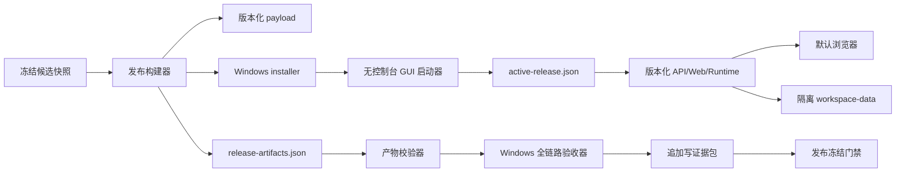
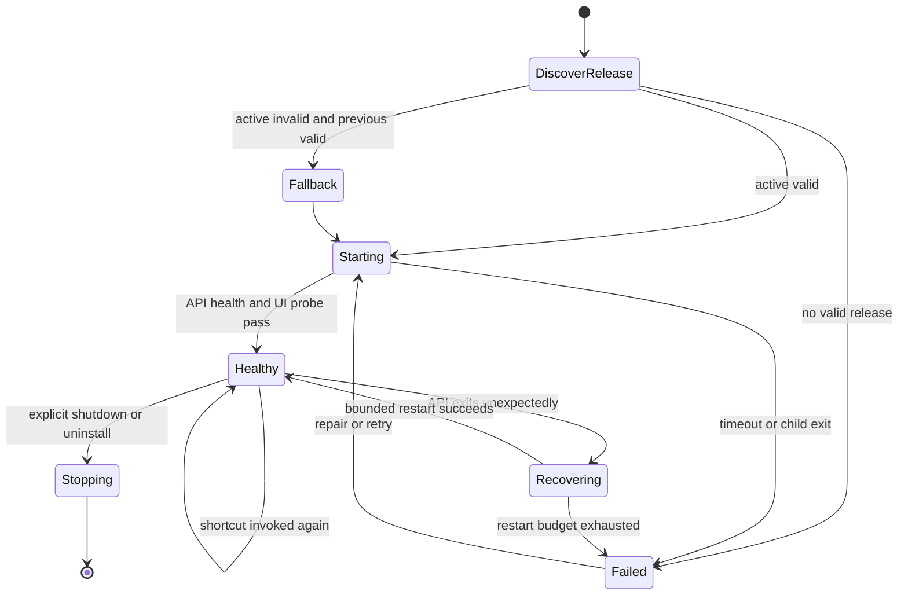

# Windows 安装包、启动器稳定性与全链路实机验收设计

**状态：** Draft  
**日期：** 2026-08-11  
**适用范围：** Windows 10/11 本地安装版、桌面启动器、Web 前端发布门禁、旧项目迁移、预检、播放、渲染导出、卸载/重装与版本回滚  
**目标放行级别：** `RELEASE_READY`

## 1. 背景与当前基线

本方案统一处理三类尚未形成闭环的问题：

1. 最近一次发布验收被 `installer_not_found` 阻断；历史上还出现过安装后不自动启动、PowerShell 黑色窗口被关闭后应用无法恢复、启动预检或项目预检反复不通过。
2. 最近可信历史日志记录过 1 个前端测试文件、3 个测试项失败，但该日志不能证明当前候选版本仍失败，也不能作为已修复的正式发布证据。
3. 现有 P01 Windows 验收只要求 `install`、`first_launch`、`restart`、`uninstall`、`workspace_retention`，没有覆盖旧项目、中断恢复、完整预检、从头播放、最终导出、重新安装和版本回滚。

2026-08-11 在当前工作区重新执行 `pnpm --filter @workbench/web test -- --reporter=verbose`，得到 38 个测试文件、74 个测试项全部通过。该结果用于更新问题判断，但由于它不是从冻结候选快照生成、也没有进入不可变证据包，所以仍需按本方案重新生成正式门禁证据。

### 1.1 已有基础与缺口

| 能力     | 当前实现                                        | 可复用部分                                   | 主要缺口                                                                    |
| -------- | ----------------------------------------------- | -------------------------------------------- | --------------------------------------------------------------------------- |
| 发布构建 | `scripts/build-release.ps1`                     | Web、PyInstaller API、运行时、Inno Setup     | 安装包定位依赖固定文件名/目录；缺少统一产物清单和原子发布                   |
| 安装验收 | `tests/release/windows-acceptance.ps1`          | 安装、两次健康启动、卸载、数据保留、脱敏报告 | 只接受显式安装包路径；场景少；报告 schema 仅 1.0                            |
| 启动器   | `scripts/launcher.ps1`                          | 单实例锁、动态端口、健康检查、隐藏 API、日志 | 快捷方式直接启动 PowerShell；生命周期依赖控制台；缺少可重入启动和版本槽恢复 |
| RC 校验  | `apps/api/src/workbench/effects/rc_manifest.py` | 安装包哈希校验                               | 路径硬编码为 `release/ppt-video-workbench-setup.exe`                        |
| 发布冻结 | `scripts/freeze-release.ps1`                    | 能消费 P01 报告                              | P01 报告是可选输入；未要求完整 Windows 全链路                               |
| 更新回滚 | `apps/api/src/workbench/updates/service.py`     | 暂存、健康检查、自动/手动回滚领域逻辑        | 发布目录与用户工作区边界不清；未和安装器/启动器形成版本激活协议             |

## 2. 目标与非目标

### 2.1 目标

- 构建结束后通过机器可读清单定位安装包；缺失时在构建阶段失败，不把 `installer_not_found` 推迟到发布验收阶段。
- 安装完成后自动启动无控制台窗口的桌面启动器；关闭浏览器后再次点击快捷方式可以恢复到现有健康实例。
- 启动器崩溃、API 异常退出、陈旧锁、端口变化和半写入状态文件均可检测、可诊断、可恢复。
- 前端全量测试在冻结候选快照上首轮通过，并保存测试数量、退出码和日志哈希。
- 在一台专用 Windows 实机上，以同一个 RC 完成从全新安装到版本回滚的连续验收。
- 发布冻结默认拒绝缺失、过期、来源不一致或任一必需阶段失败的 Windows 报告。
- 安装、升级、回滚和卸载不覆盖用户项目；验收使用真实项目的只读来源和隔离副本。

### 2.2 非目标

- 不构建通用企业软件分发系统。
- 不把外部服务凭证、浏览器 profile、用户原始媒体纳入证据包。
- 不以单元测试替代 Windows 实机、真实浏览器播放、真实 FFmpeg/Remotion 导出和卸载。
- 不要求安装器清理用户工作区；删除个人数据必须是独立、明确授权的操作。

## 3. 总体原则

1. **候选版本唯一。** 构建、测试、安装和实机验收都绑定同一个 `candidate_id`、Git commit、依赖锁哈希和产物清单哈希。
2. **产物由清单发现。** 下游不得猜测安装包路径或搜索“最新 exe”。
3. **启动器与业务进程分离。** 快捷方式只进入稳定 GUI 启动器；API、浏览器和版本切换由启动器监督。
4. **应用、状态、项目分区。** 版本化程序文件、启动状态、用户项目和可重建缓存使用不同根目录。
5. **失败关闭。** 必需证据缺失、超时、来源不一致、首轮测试失败或残留受管进程都阻断发布。
6. **证据追加写。** 失败结果保留；重跑产生新的 `run_id`，不得覆盖旧失败记录。
7. **恢复必须验证。** “可以重试”不等于恢复通过；必须证明恢复后状态、输入指纹、缓存和最终产物正确。

## 4. 目标架构



### 4.1 Windows 目录边界

```text
%LOCALAPPDATA%\PPTVideoWorkbench\
├─ app\
│  ├─ launcher\workbench-launcher.exe
│  └─ releases\
│     ├─ 0.1.0\release\...
│     └─ 0.1.1\release\...
├─ state\
│  ├─ active-release.json
│  ├─ previous-release.json
│  ├─ instance.json
│  └─ logs\...
├─ workspace-data\...
├─ update-backups\...
└─ diagnostics\...
```

- `app/releases/<version>` 安装后不可原地修改；升级产生新版本目录。
- `active-release.json` 通过同卷临时文件加原子 replace 更新，记录版本、payload manifest hash 和激活时间。
- `workspace-data` 永远不位于版本目录或 Inno Setup 的 `[UninstallDelete]` 范围内。
- `F:\Video\Cache` 和 `F:\Video\Output` 继续作为可配置缓存/输出，不承担应用安装状态。

## 5. 发布产物与 `installer_not_found` 的根治

### 5.1 单一产物清单

构建器最后生成 `release/release-artifacts.json`：

```json
{
  "schema_version": "1.0",
  "candidate_id": "rc-<commit>-<build-id>",
  "version": "0.1.1",
  "source": {
    "git_commit": "40-char-sha",
    "dirty": false,
    "lock_hashes": {}
  },
  "artifacts": {
    "installer": {
      "relative_path": "release/ppt-video-workbench-setup-0.1.1.exe",
      "size": 0,
      "sha256": "64-char-sha256"
    },
    "payload_manifest": {
      "relative_path": "dist/release/runtime-manifest.json",
      "sha256": "64-char-sha256"
    }
  }
}
```

约束：

- 所有相对路径解析后必须仍位于候选快照根目录。
- 清单只在安装包关闭写句柄、大小稳定且哈希完成后发布。
- 先写 `release-artifacts.json.partial`，完成自校验后原子改名。
- RC manifest、Windows 验收和冻结脚本只读取此清单，不再拼接固定安装包路径。
- 错误细分为 `artifact_manifest_not_found`、`artifact_manifest_invalid`、`installer_file_not_found`、`installer_hash_mismatch`。

### 5.2 构建与验收握手

`build-release.ps1` 成功的定义改为：

1. 源码门禁通过。
2. payload 和 runtime manifest 校验通过。
3. 安装包生成，签名状态、大小和 SHA-256 已记录。
4. `release-artifacts.json` 生成并被独立 verifier 再读一次。
5. 输出唯一标记 `WINDOWS_RELEASE_BUILD=PASS candidate_id=<id> manifest=<path>`。

验收器只接受 `-ArtifactManifest`。清单不存在时产生“构建产物门禁失败”，不进入安装阶段。

## 6. 无黑窗、可重入、可恢复的桌面启动器

### 6.1 进程模型

- 新增 `workbench-launcher.exe`，以 PyInstaller `windowed/noconsole` 模式构建。
- Inno Setup 的开始菜单、桌面快捷方式和安装后运行项都指向该 exe，不再指向 `powershell.exe`。
- `launcher.ps1` 保留为开发诊断和紧急恢复入口，不是最终用户默认入口。
- 启动器持有 Windows named mutex。第二次启动检查现有实例：健康则打开浏览器；不健康则请求旧实例退出或受控恢复。

### 6.2 状态机



### 6.3 状态、所有权与恢复

`state/instance.json` 原子记录 schema、launcher/API PID、进程创建时间、active version、payload hash、loopback URL、健康时间、启动次数和最近错误码。

只有 PID、创建时间和命令指纹都匹配时，启动器才能终止子进程。陈旧状态文件只能替换，不能据此结束未知进程。

- 浏览器关闭：API 和启动器继续；再次点击快捷方式重新打开当前 URL。
- API 异常退出：最多自动恢复 2 次，采用短退避；超过预算显示诊断路径。
- 启动器异常退出：下次启动检查受管孤儿，能接管则接管，否则安全结束后重启。
- 锁文件损坏：结合 named mutex、PID 创建时间和 endpoint 健康状态判定。
- active 启动失败：previous 清单有效时自动回退，并记录 `launcher_automatic_release_fallback`。
- 错误提示使用 GUI 对话框/通知和诊断文件，不依赖控制台。

### 6.4 启动完成判定

必须同时满足：

1. `/api/health` 返回 200，版本与 active release 一致。
2. `/` 返回 200，HTML build ID 与 candidate 一致。
3. endpoint 仅为 `127.0.0.1`。
4. 状态文件已原子落盘。
5. 无可见 PowerShell/cmd 控制台窗口。

## 7. 安装、卸载、重装和回滚

### 7.1 安装事务

安装器按“复制候选版本 → 校验 payload → 注册快捷方式 → 激活版本 → 启动健康检查”执行。任一步失败时不切换 active 指针；保留日志；已有健康版本继续可用；安装器返回非零。

安装后自动启动必须实际观察到 GUI launcher 和健康端点，不能只证明 `[Run]` 被调用。

### 7.2 卸载与重装

- 卸载前通过 `workbench-launcher.exe --shutdown --wait` 停止受管进程。
- 卸载删除 launcher、版本目录、快捷方式和注册信息，保留 `workspace-data`、用户设置和验收保留标记。
- 重装后首次启动必须重新发现保留项目。
- 半完成版本不得成为 active；应隔离并留下诊断。

### 7.3 版本回滚

至少保留 current 与 previous 两个完整、已校验版本槽。回滚步骤：

1. 请求启动器停止 API。
2. 校验 previous payload manifest。
3. 备份设置、工作区索引和数据库；项目媒体不复制、不移动。
4. 原子切换 active/previous。
5. 启动 previous，执行健康、项目打开和只读兼容检查。
6. 失败则切回原 active 并恢复备份。

数据库迁移优先采用向前/向后兼容的增量字段。不可逆迁移必须显式提高兼容版本并阻断“可回滚”声明。

## 8. 前端残余测试关闭标准

历史 1 文件/3 测试失败只在以下条件全部满足后关闭：

1. 保存历史失败测试名和原始日志为问题基线。
2. 冻结候选首轮执行 `pnpm --filter @workbench/web test -- --reporter=verbose`，零失败。
3. 仓库级 `pnpm check` 的 lint、typecheck、test、build 全部零退出。
4. 曾失败的 `WorkflowShell.test.tsx` 场景用独立进程连续运行 3 次，均首轮通过；重试不能掩盖首次失败。
5. 证据记录测试文件/测试项数量、开始/结束时间、退出码、stdout/stderr hash、Node/pnpm 版本和 candidate ID。

测试数量相对冻结基线下降时门禁失败。不能用删除、skip、only 或放宽断言换取绿灯。

## 9. 预检稳定性

### 9.1 三层预检

| 层级              | 目的                                            | 失败行为                            |
| ----------------- | ----------------------------------------------- | ----------------------------------- |
| 安装 payload 校验 | 文件、运行时、manifest、签名、版本              | 阻止激活版本                        |
| 主机诊断          | 磁盘、权限、运行时、端口、FFmpeg                | UI 仍启动；关键能力不可用时阻断生产 |
| 项目/渲染预检     | schema、素材、音频、字幕、RenderGraph、输出合同 | 阻止播放验收或渲染入队              |

### 9.2 确定性与新鲜度

每次完整预检记录 `preflight_run_id`、candidate/project/copy ID、项目 manifest、RenderGraph、Props、素材、配置和工具版本的输入指纹，以及每项稳定 issue code、耗时、证据、缓存来源和报告 SHA-256。

同一输入指纹的结果必须确定；时间相关探针使用明确 TTL。验收模式强制 `fresh=true`，项目变化后旧报告自动标为 stale。

### 9.3 “反复不通过”的关闭条件

- 同一冻结项目副本连续三次 `allowed=true` 且阻断项为 0。
- 第二次前重启 API，第三次前重启桌面启动器。
- 三次输入指纹一致；动态主机字段只能在白名单内变化。
- UI、API JSON 和导出报告一致。

## 10. 中断后恢复

验收使用显式故障注入点：

1. 最终渲染进入 `running` 且至少完成一个分页检查点。
2. 记录 job ID、input fingerprint、已完成页和 staging manifest。
3. 强制结束受管 API，保留启动器和项目数据。
4. 启动器恢复 API；任务进入可解释的 `paused/recoverable`，不得伪报成功。
5. resume 后已完成页为 cache hit，未完成页继续，不能重复发布最终文件。
6. 最终只产生一个有效成片指针；MP4、制作包和 manifest hash 通过。

证据包含中断前后状态、审计事件、缓存命中和最终产物校验。

## 11. Windows 实机完整验收矩阵

主验收机为专用 Windows 11 x64 实体设备，使用标准用户权限、默认浏览器和真实本地磁盘；Windows 10 作为兼容补充。完整链在同一 `candidate_id` 上按顺序完成：

| 阶段            | 操作                                   | 必须证明                                           | 核心证据                         |
| --------------- | -------------------------------------- | -------------------------------------------------- | -------------------------------- |
| A0 候选确认     | 从产物清单解析安装包并复核 hash        | 来源唯一，无安装包定位错误                         | 产物清单、校验日志               |
| A1 全新安装     | 干净应用状态下标准用户安装             | 退出码 0、布局正确、无数据污染                     | 安装日志、目录/快捷方式摘要      |
| A2 首次启动     | 安装后自动运行和快捷方式               | 无黑窗，40 秒内 API/UI 健康；关闭浏览器后可恢复    | 截图/录屏、进程、health/UI probe |
| A3 旧项目兼容   | 打开旧项目隔离副本                     | ID、页、素材、音频、字幕保持；迁移有报告           | 前后摘要/hash、迁移报告          |
| A4 中断后恢复   | 检查点后结束 API，再恢复               | 状态可恢复、无重复/丢页、缓存复用                  | 状态序列、审计、日志             |
| A5 完整预检     | fresh 主机/项目/RenderGraph 预检三轮   | 三轮允许渲染、0 阻断、指纹一致                     | 三份预检报告                     |
| A6 从头播放     | 从 0 播放到 ended                      | 无停滞、致命 console error、素材 404               | 时间采样、网络、起中末截图       |
| A7 最终视频导出 | UI 提交并等待成功                      | MP4/制作包有效，H.264/AAC、尺寸/时长/hash 合同通过 | job、ffprobe、manifest           |
| A8 卸载和重装   | 卸载，确认程序移除/项目保留，再装同 RC | 重装健康，旧项目和导出记录可发现                   | 卸载/重装日志、项目复开          |
| A9 版本回滚     | 基线版升级候选后切回基线               | previous 健康、项目可打开、版本指针正确            | 版本状态、备份/恢复、兼容报告    |

### 11.1 从头播放判定

- 浏览器自动化调用真实 UI 播放按钮，观察 `currentTime` 从接近 0 单调推进到 `ended`。
- 记录总时长、stall 次数/最长时间、资源 4xx/5xx、console error。
- 非致命浏览器能力警告必须白名单化；未知错误阻断。
- 人工抽检开头、中段、结尾的画面、字幕和声音。

### 11.2 最终导出判定

- 渲染任务终态 `succeeded`，重启后仍可查询。
- `ffprobe` 验证视频/音频流、编码、分辨率、帧率和时长。
- 制作包 manifest 的文件大小和 SHA-256 正确。
- 临时文件不能作为最终产物；失败重试不能覆盖上一个成功成片。

## 12. 验收器与证据模型

### 12.1 报告 schema 2.0

`scripts/windows_acceptance_report.py` 升级为 schema 2.0，必需阶段为：

```text
artifact_resolution
clean_install
first_launch
legacy_project
interruption_recovery
full_preflight
play_from_start
final_export
uninstall_reinstall
version_rollback
process_cleanup
workspace_retention
```

每阶段包含 `result`、`started_at`、`finished_at`、`duration_ms`、`attempt`、`reason_codes`、`evidence_refs` 和 `metrics`。只有所有必需阶段通过、引用存在且哈希匹配时，总报告才为 pass。

### 12.2 证据目录

```text
test-results/windows-release/<candidate-id>/<run-id>/
├─ run.json
├─ environment.json
├─ acceptance-evidence.json
├─ acceptance-report.json
├─ acceptance-report.html
├─ evidence-manifest.json
├─ logs/
├─ screenshots/
├─ preflight/
├─ playback/
├─ render/
└─ rollback/
```

- `evidence-manifest.json` 列出逻辑路径、大小、SHA-256 和媒体类型。
- 大 MP4 可外置，但清单必须记录可验证 URI、大小和 hash。
- token、Authorization、Cookie、API key、用户名、用户绝对路径和项目正文必须脱敏。
- 原始项目媒体不进入通用诊断包；只保留批准的缩略图或 hash。

## 13. 发布门禁

### G1：源码与前端

- Python、Ruff、mypy、Web lint/typecheck/unit/build、Remotion 全部通过。
- 历史三个前端失败场景完成稳定性复跑。

### G2：发布构建

- `release-artifacts.json` 自校验通过。
- installer、payload、runtime manifest 和 SBOM hash 一致。

### G3：启动器/安装器自动化

- named mutex、原子状态、陈旧状态、二次启动、API 恢复、previous fallback、卸载 shutdown 有自动测试。
- 安装、卸载、重装 contract 和 Windows 集成通过。

### G4：Windows 实机全链路

- A0-A9、process cleanup、workspace retention 全部通过。
- 报告 candidate、产物清单 hash 与冻结快照一致。

### G5：发布冻结

- `freeze-release.ps1` 必须接收 schema 2.0 Windows 报告，不再可选。
- 报告过期、机器未批准、证据缺失或 blocker 非空时拒绝冻结。

## 14. 稳定错误码

| 错误码                             | 含义                          | 处理                     |
| ---------------------------------- | ----------------------------- | ------------------------ |
| `artifact_manifest_not_found`      | 未发布产物清单                | 回到构建阶段             |
| `installer_file_not_found`         | 清单声明的 installer 不存在   | 候选无效，重新构建       |
| `installer_hash_mismatch`          | installer 与清单不一致        | 隔离并重新构建           |
| `launcher_active_release_invalid`  | active payload 缺失或 hash 错 | 尝试 previous            |
| `launcher_health_timeout`          | API/UI 未按时健康             | 保存日志，受控重试       |
| `launcher_recovery_exhausted`      | 自动恢复预算耗尽              | 显示诊断，阻断验收       |
| `preflight_input_stale`            | 报告不对应当前输入            | 强制 fresh 预检          |
| `render_resume_checkpoint_invalid` | 检查点无法验证                | 不续跑，保留证据         |
| `playback_did_not_reach_end`       | 从头播放未结束                | 保存浏览器/网络证据      |
| `rollback_health_failed`           | previous 回滚后不健康         | 恢复 candidate，阻断发布 |

## 15. 安全与数据保护

- 验收脚本只能结束由当前 run 启动且 PID/创建时间/命令指纹一致的进程。
- 全新安装和卸载使用明确隔离根；不得递归删除 `F:\Video`、用户工作区根或仓库根。
- 旧项目先生成只读来源清单和隔离副本；迁移只发生在副本。
- installer、rollback helper 和 launcher 的路径操作先做 containment 校验，拒绝 `..`、junction/symlink 逃逸和未解析变量。
- 证据收集采用白名单，不抓取完整环境变量、浏览器 profile、凭证库或请求正文。

## 16. 完成标准

1. 下游不再硬编码猜测 installer 路径；安装包缺失在构建交付边界被检测。
2. 默认快捷方式无 PowerShell/cmd 黑窗；浏览器关闭、二次点击、API 崩溃和陈旧状态均可恢复。
3. 冻结候选完整前端和仓库门禁首轮通过，历史 1 文件/3 测试失败有正式关闭证据。
4. 完整预检三次稳定通过，报告绑定当前项目和候选指纹。
5. 同一 RC 在 Windows 实机完成 A0-A9，最终导出和回滚成功。
6. schema 2.0 报告、证据 manifest 和全部引用 hash 通过。
7. `freeze-release.ps1` 对缺失或失败的完整 Windows 报告默认拒绝发布。

## 17. 实机反馈补充（2026-08-11）

实机执行确认原设计中的启动器停止模型需要 Windows 专用实现：`os.kill(SIGTERM)` 不能作为打包 GUI launcher 的可靠关闭机制。最终实现使用 Win32 process handle 终止并等待 API，同时终止旧 supervisor，验收条件为 API PID、supervisor PID 和 `instance.json` 三者同时清零。

实机还确认 Office 渲染必须把 LibreOffice 输入、profile 与临时输出放在 ASCII 临时路径，完成后再复制到用户目标路径；否则中文路径可造成崩溃或超时。Windows 字体能力检测则以系统字体注册表为主、`fc-match` 为跨平台补充。

完整执行结果、产物哈希和边界说明见 `docs/acceptance/windows-full-flow-2026-08-11.md`。
