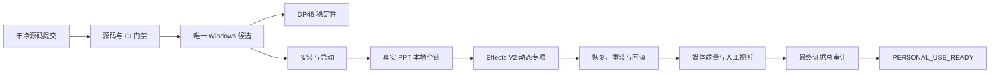

# PPT Video Workbench 本地个人可用与 Effects V2 最终收口设计

> 日期：2026-08-14
>
> 状态：Proposed
>
> 目标工作树：`F:\ppt-video-workbench-v3\.worktrees\program-integration-v1`
>
> 当前设计基线：`codex/program-integration-v1` / `8d2bd7d40b05919f3746fa3e8e434eb9aa1507c0`
>
> 配套实施计划：[2026-08-14-personal-use-effects-final-closure.md](../plans/2026-08-14-personal-use-effects-final-closure.md)

## 1. 设计结论

本轮不重新开发已经存在的 PPT 转视频主链，而是完成最后一段可验证的产品收口：从一个干净、不可变的源码提交构建唯一 Windows 候选，在该候选上完成稳定性、安装、真实 PPT、Effects V2 动态预览与导出、中断恢复、卸载重装、人工视听和最终签署。

最终目标不是“测试很多”或“开发环境能跑”，而是产生一条不可混用的身份链：

```text
source_commit
  -> candidate_id
  -> release-artifacts.json / installer_sha256
  -> runtime-manifest_sha256 / feature-policy_sha256
  -> acceptance_run_id
  -> project/input/graph/export hashes
  -> final_mp4_sha256
  -> manual_av_review
  -> PERSONAL_USE_READY=PASS
```

只要源码、依赖、运行时、安装包、模板、特效策略、功能开关或验收输入发生变化，受影响的下游证据立即失效，不允许沿用旧候选、旧 MP4 或其他 worktree 的结果。

## 2. 当前事实基线

### 2.1 已经具备

- 集成工作树当前干净，开发对象明确为 `program-integration-v1`；根目录恢复快照不是构建源。
- 开发态 S1/S8 本地音频链路已覆盖项目创建、PPTX/DOCX 导入、预检、权威预览、取消重试、刷新恢复和制作包生成。
- Windows 验收报告 schema 2.0、安装/启动验收入口、候选清单、个人使用预检、DP45 runner、Effects V2 隔离验收入口已经存在。
- Effects V2 已具备 EffectPlan、页面分类、L0-L3 安全级别、模板、提示点对齐、设置面板、人工锁、批量应用、预览/渲染解释器、降级、诊断和恢复能力。
- 已有 30 份获准用于内部回归的单页 PPTX、对应 Ground Truth、90 个静态关键帧和静态视觉复核结果。

### 2.2 尚未达到最终放行

- 最近冻结的工程候选绑定 `90a4fa31...`，当前 HEAD 已继续前进，旧候选不能代表当前源码。
- 最新可见 DP45 运行只有循环事件，没有完成标记和正式 PASS 停点。
- 开发态 E2E 明确没有声明真实用户 PPT、冻结 RC、已安装 Windows 候选或人工视听签署。
- Effects V2 的 persistence、preview、render 开关默认关闭；RenderGraph V2 也保持 opt-in。
- 30 页静态样本不能替代同一 Windows RC 上的动态镜头、字幕避让、播放和最终导出验收。
- 同一候选尚未绑定最终安装包、运行时清单、真实 PPT 输入、最终 MP4 哈希和人工复核结论。

## 3. 范围

### 3.1 本轮必须完成

1. 冻结唯一干净源码与候选身份。
2. 在同一源码和依赖锁上完成本地门禁与 CI。
3. 构建并独立校验 Windows 安装包、运行时清单和功能策略。
4. 完成带正式完成标记的 DP45 长稳运行。
5. 完成 Windows 安装、首次启动、再次启动、卸载和工作区保留。
6. 用真实 PPT 副本完成导入、材料、旁白、本地音频、字幕、特效、预检、播放、最终导出和制作包。
7. 在同一候选上完成 Effects V2 动态专项验收，并确定个人候选的默认策略。
8. 完成渲染中断恢复、取消重试、输出锁、低空间、重装和版本回滚。
9. 完成机器媒体检查和由用户执行的人工视听决定。
10. 生成最终证据索引与 `PERSONAL_USE_READY=PASS`，随后再次审计未完成项。

### 3.2 非目标

- 不把云端、插件市场、macOS/Linux、商业发布、公开分发和代码签名加入本轮必需范围。
- 不把真实 HeyGen 调用作为本地个人可用的阻断条件；本地音频与无音频路径必须独立闭环。
- 不自动使用付费 Provider、真实凭证、外部云资源或用户未批准的声音。
- 不修改或删除用户原始 PPT、现有项目、历史安装、恢复数据或其他 worktree。
- 不要求所有复杂 PowerPoint 原生动画 100% 复刻；不支持的对象必须确定性降级并可见说明。

## 4. 核心原则

1. **单一候选。** 最终安装、真实 PPT、特效、恢复、视听和签署必须属于同一 `candidate_id`。
2. **干净构建。** 候选只从 clean commit 构建；构建后源码不可原地修补。
3. **失败关闭。** 缺少完成标记、哈希、阶段报告或人工决定时只能是 blocked，不能推断为 pass。
4. **预览即将导出。** 预览和最终导出消费同一冻结输入、EffectPlan/RenderGraph 和时间轴身份。
5. **旧项目保守。** 旧项目继续保持 V1，只有显式转换才进入 V2；不静默改变既有项目语义。
6. **新项目可回退。** Effects V2 放行后，新个人项目可默认使用 V2，但必须能切回 V1/L0，且不删除 V2 数据。
7. **隔离运行。** 每次验收使用独立 workspace、DB、cache、TEMP、output、logs、端口和 process registry。
8. **原件只读。** 真实 PPT 仅复制到验收空间；开始和结束均验证原件哈希不变。
9. **进程有所有权。** 只管理当前 run 登记且创建时间匹配的进程，不按名称批量结束进程。
10. **人机边界。** 自动化能验证合同和媒体属性，但不能替用户签署主观视听质量。

## 5. 目标架构



### 5.1 候选目录

```text
test-results/personal-use/<candidate-id>/
├─ candidate/
│  ├─ candidate-manifest.json
│  ├─ release-artifacts.json
│  ├─ runtime-manifest.json
│  └─ feature-policy.json
├─ runs/
│  ├─ dp45/<run-id>/
│  ├─ windows/<run-id>/
│  ├─ real-ppt/<run-id>/
│  ├─ effects/<run-id>/
│  ├─ recovery/<run-id>/
│  └─ quality/<run-id>/
├─ defects/
├─ final-evidence-manifest.json
└─ personal-use-signoff.json
```

大文件可保留在受控 evidence root，但索引必须记录绝对解析结果、大小、SHA-256、保留策略和访问边界。Git 只保存必要的结构化结论、脱敏索引和小型报告。

## 6. 统一身份与证据模型

### 6.1 `CandidateIdentityV1`

至少包含：

- `candidate_id`、40 位 `source_commit`、branch、dirty=false。
- `package.json`、`pnpm-lock.yaml`、`pyproject.toml`、`uv.lock` 哈希。
- installer 路径、大小、SHA-256。
- runtime manifest、OpenAPI、Project Schema、Effect template 和 feature policy 哈希。
- Python、Node、pnpm、FFmpeg/FFprobe、Remotion、Windows 版本。
- 构建开始/结束时间、构建主机和构建日志哈希。

### 6.2 `StageResultV1`

每个阶段包含：

- `stage_id`、`run_id`、`candidate_id`、`source_commit`。
- `status`: `passed | failed | blocked | cancelled | stale`。
- 开始/结束时间、attempt、reason codes。
- 输入指纹、配置哈希、证据引用及其 SHA-256。
- 缺陷列表、process registry、恢复入口和下一门禁。

### 6.3 `PersonalUseClosureV1`

最终聚合器只消费阶段报告，不读取“最新目录”猜测状态。它必须验证：

- 所有必需 Gate 均为 pass。
- 所有报告的 candidate/source/runtime/feature policy 一致。
- 引用存在且哈希匹配。
- 没有未关闭 P0/P1；P2 有具名 owner、规避方案和用户接受记录。
- 人工视听记录绑定最终 MP4 SHA-256。
- 当前源码、安装包、运行时或功能策略没有使证据失效。

## 7. 发布列车与 Gate

| 顺序 | 阶段                | 输出 Gate                              | 放行核心                                          |
| ---: | ------------------- | -------------------------------------- | ------------------------------------------------- |
|  G00 | 基线与边界确认      | `BASELINE_CONFIRMED`                   | 唯一工作树、clean、现状证据分级                   |
|  G01 | 源码候选冻结        | `SOURCE_CANDIDATE_FROZEN`              | 所有必需变更已集成，依赖锁稳定                    |
|  G02 | 本地全量与 CI       | `CI_GREEN`                             | 同一提交的 lint/type/test/build/e2e/contract 全绿 |
|  G03 | Windows 候选构建    | `FINAL_CANDIDATE_BUILT`                | 安装包、runtime、feature policy 独立校验          |
|  G04 | DP45 长稳           | `DP45_READY`                           | 正式完成标记、最低周期、资源和孤儿进程通过        |
|  G05 | 安装与启动          | `INSTALLED_READY`                      | 全新安装、首次/再次启动、工作区隔离               |
|  G06 | 真实 PPT 全链       | `LOCAL_FLOW_READY` + `UI_EXPORT_READY` | UI 从导入到最终 MP4/制作包闭环                    |
|  G07 | Effects V2 动态专项 | `EFFECTS_READY`                        | 同计划预览/导出、字幕避让、动态人工抽检           |
|  G08 | 恢复、重装与回滚    | `RECOVERY_READY`                       | 中断不丢失、不重复发布、重装保留项目              |
|  G09 | 质量与人工视听      | `QUALITY_READY`                        | 媒体机器校验 + 用户视听决定                       |
|  G10 | 最终总审计          | `PERSONAL_USE_READY`                   | 单一身份链完整，二次未完成项审计为零              |

`FINAL_SOURCE_READY` 在 G04 通过且从 G01 起没有任何源码或依赖变化时确认；`FINAL_CANDIDATE_READY` 在 G03/G04 都通过且候选未失效时确认。

## 8. Effects V2 最终完善设计

### 8.1 功能策略

新增候选级 `feature-policy.json`，由发布构建生成并纳入 runtime manifest：

- `legacy_project_default = v1`。
- 验收候选可以预先冻结目标策略 `new_project_default = v2`，但只有 G07 通过后才允许把该候选提升为个人可用候选。
- `effect_v2.persistence/preview/render` 必须成组开启；非法组合启动失败。
- 项目保存 `renderer_generation`、effect policy version、template version 和人工锁。
- UI 必须显示当前生成代、降级原因和“切回兼容模式”。
- 回滚只关闭 V2 和切换项目生成代，不删除 EffectPlan 或用户设置。

目标策略在 G01 确定、G03 随候选冻结，G07 只验证而不修改它。若 G07 证明该策略不安全，则修改策略、创建新 commit 和新候选，并从 G01/G03 及受影响 Gate 重跑；禁止在验收后原地替换策略。

### 8.2 动态验收矩阵

动态专项至少覆盖：

- 十类页面各 3 页的已授权 30 页集合。
- L0/L1/L2/L3、四档强度、人工锁、重新推荐和同类页批量应用。
- `ProgressiveReveal`、`StatCounter`、镜头移动、转场、强调和安全降级。
- 字幕安全区、Presenter/Overlay 避让、长字幕、空字幕和音频提示点。
- 播放起点、中段、页边界、结尾和 seek 后状态。
- 预览与最终导出的 EffectPlan hash、RenderGraph hash、帧数、时长和关键画面一致性。
- 取消、重试、刷新、API 重启和旧项目 V1 回退。

### 8.3 Effects 放行标准

- 30/30 页面均成功产生动态预览和最终片段。
- preview/render 使用同一 plan/graph/template/runtime 身份。
- 无 P0/P1；P2 必须关闭或由用户具名接受；P3 有记录。
- L3 不在不允许页面误启用，降级原因稳定可解释。
- 字幕、Presenter 和 Overlay 不出现阻断级碰撞或裁切。
- 关键动态时间点人工抽检通过；静态 PNG 不代替动态复核。
- 关闭 V2 后同一项目副本可通过 V1 预览和导出。

## 9. 真实 PPT 本地全链

### 9.1 输入集合

至少使用三类隔离副本：

1. 小型真实 PPT：2-5 页，用于快速安装后 smoke。
2. 标准真实 PPT：8-15 页，覆盖本地音频、字幕、普通特效和完整导出。
3. 复杂 PPT：30-50 页，覆盖图表、图片、字体、长文本、不同版式和降级。

30 份单页 Effects 样本用于专项回归，不能冒充用户完整制作流程。用户原件只读，验收副本拥有独立 project ID。

### 9.2 UI 全链

```text
安装启动
 -> 新建/打开项目
 -> 导入 PPT 与材料
 -> 页面解析与字体/素材预检
 -> 旁白与本地音频
 -> 字幕生成/导入与人工校正
 -> Effects V2 推荐、预览和调整
 -> fresh 完整预检
 -> 从 0 播放到 ended
 -> UI 提交最终渲染
 -> 校验最终 MP4 与制作包
 -> 刷新/重启后重新发现任务和产物
```

### 9.3 导出标准

- UI 显示规格与实际容器、codec、分辨率、帧率、像素格式一致。
- 视频可完整 decode，无损坏 packet、黑帧长停顿或音频流缺失。
- 实际时长与时间轴/音频容差内一致。
- 制作包清单中的路径、大小和 SHA-256 与文件一致。
- 最终 publication 是 stable 文件，临时文件不成为 `latest`。
- 刷新和重启后仍能查询 job、attempt、graph、spec 和 artifact。

真实 HeyGen 作为独立可选 Gate；没有凭证、声音批准和费用授权时必须显示 `WAIT_EXTERNAL`，不能阻断本地音频路径的 `LOCAL_FLOW_READY`。

## 10. 稳定性与恢复

### 10.1 DP45

- 使用唯一 candidate、run_id、F 盘 TEMP/TMP、workspace、DB、cache、output 和 logs。
- 至少完成配置规定的持续时间和最小周期；两者必须同时满足。
- 覆盖正常、recovery、cancel/retry、缓存复用、日志轮转和 publication 保留。
- 报告必须有完成标记、完整 ledger、资源摘要和退出清理结果。
- 进程消失、调度任务显示 Running、日志停止增长或只有中间循环都不算通过。

### 10.2 故障矩阵

- API、Worker、Remotion/Node、FFmpeg 在受控检查点中断。
- 输出文件锁、输出目录不可写、TEMP 不可写、低磁盘和端口冲突。
- 发布 stable 文件前中断、替换 `latest` 前中断、重复 Worker 和 lease 过期。
- UI 刷新、桌面启动器重启、取消后重试。
- 卸载后项目保留、同 RC 重装、版本回滚。

每项都必须验证：状态真实、attempt 不混用、已完成页可复用、未完成页继续、上一成功结果不被覆盖、最终只发布一次。

## 11. 质量与人工视听

### 11.1 自动检查

- ffprobe、完整 decode-to-null、容器/codec/尺寸/fps/时长/音频检查。
- 黑帧、静帧、音画时长差、响度、字幕边界、丢帧和资源 4xx/5xx 检查。
- preview/render plan/graph/spec hash 一致性。
- 诊断包 secret、Cookie、绝对用户路径和私人正文脱敏。

### 11.2 人工检查

由用户或用户指定 reviewer 检查最终 MP4：

- 开头、中段、结尾和所有页边界。
- 字幕可读性、错字、断句、同步和安全区。
- 音量、爆音、静音、音画不同步。
- 特效节奏、镜头舒适度、信息遮挡、转场和降级。
- 画面裁切、字体替换、图表/图片错误和明显卡顿。

自动化不能代签 `accepted_by`。人工结果必须记录 reviewer、时间、候选、最终 MP4 SHA-256、决定和备注。

## 12. 缺陷、失效与重跑

| 变化                                       | 最早重跑 Gate             |
| ------------------------------------------ | ------------------------- |
| 代码、依赖锁、Schema、迁移                 | G01                       |
| CI/构建脚本                                | G02                       |
| 安装器、runtime、模板、feature policy      | G03                       |
| DP45 runner/config/fixture                 | G04                       |
| 启动器、安装、卸载                         | G05                       |
| 导入、预检、时间线、音频、字幕、导出       | G06                       |
| Effects planner/template/interpreter/flags | G07；如影响渲染则回到 G03 |
| Job、checkpoint、publication、缓存         | G04 与 G08                |
| 最终 MP4 或导出规格                        | G06、G07、G09             |
| 仅报告展示且不改变语义                     | 对应报告 Gate 与 G10      |
| 无法归类的变化                             | 默认回到 G01              |

P0/P1 必须修复后重跑；P2 必须有 owner、影响、规避、`accepted_by` 和 `accepted_at`；P3 可登记进入后续版本。任何修复都创建新 commit；候选冻结后不能原地补丁。

## 13. 安全与数据边界

- 验收不访问正式 workspace DB，除非用户另行明确授权。
- 不覆盖现有安装目录；使用独立 InstallRoot 和 WorkspaceRoot。
- 原 PPT、媒体和旧成片不移动、不删除；所有故障注入只作用于验收副本。
- 付费 Provider、外部云、代码签名、公开推送和真实凭证均需单独授权。
- 输出清理仅清理当前 run 注册的临时目录；证据和失败现场按保留策略处理。

## 14. 预计工作量

在当前功能不再出现新的 P0/P1 且 Windows 构建工具可用的前提下：

| 工作包                       |                       预计 |
| ---------------------------- | -------------------------: |
| 基线、聚合器、策略与门禁补齐 |               1-2 个工作日 |
| 本地全量、CI、候选构建       |               1-2 个工作日 |
| DP45                         | 1 个工作日，含完整长稳窗口 |
| Windows 安装与真实 PPT 全链  |               1-2 个工作日 |
| Effects V2 动态专项          |               1-2 个工作日 |
| 恢复、重装、视听与重跑       |               1-3 个工作日 |
| 合计                         |              6-12 个工作日 |

真实缺陷修复会按失效矩阵增加重跑时间；时间估计不是 Gate，也不能替代证据。

## 15. 完成定义

本设计完成时，用户可以在当前 Windows 电脑上从一个明确安装包开始，导入真实 PPT，使用本地音频和字幕，预览并调整 Effects V2，完成预检和最终导出；程序在刷新、中断、重启、卸载重装和回滚后保持项目与上一成功结果安全；最终 MP4 同时通过机器检查和用户人工视听。

只有以下全部成立时才允许写入 `PERSONAL_USE_READY=PASS`：

- G00-G10 全部通过且属于同一候选身份链。
- `FINAL_SOURCE_READY`、`CI_GREEN`、`FINAL_CANDIDATE_READY`、`INSTALLED_READY`、`LOCAL_FLOW_READY`、`EFFECTS_READY`、`UI_EXPORT_READY`、`RECOVERY_READY`、`QUALITY_READY` 全部为 PASS。
- 无未关闭 P0/P1；P2 已完成具名处理。
- 人工视听绑定最终 MP4 hash。
- 二次未完成项审计为零。
