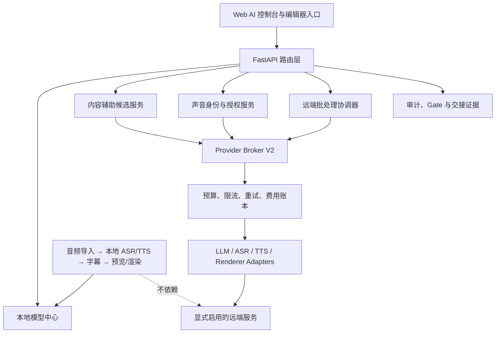

# AI / Provider 平台独立收口线设计文档

> 日期：2026-08-15  
> 状态：待实施  
> 工作树：`F:\ppt-video-workbench-v3\.worktrees\program-integration-v1`  
> 基础提交：`72cb7bbee6fb2fa21485f77d627a8f1443d61eb8`  
> 目标分支：`codex/program-ai-provider-platform`

## 1. 设计结论

本收口线在指定工作树内原地保护并承接现有未提交 AI/Provider 成果，形成一条可独立提交、推送、由 CI 验证、最终只交给集成人员处理的分支。它不修改 `program-core-workbench`，不触碰 DP45 进程、运行根或证据，不合并回 `codex/program-integration-v1`，也不构建或替换最终个人使用候选。

平台分成两个彼此解耦的平面：

- 本地生产面：音频导入、本地 ASR、本地 TTS、字幕、预览和渲染必须在 Provider 平台关闭、无凭证、断网或远端故障时继续工作。
- AI/Provider 控制面：模型管理、统一适配、费用治理、声音授权、远端批处理和内容辅助全部默认关闭或显式 opt-in；关闭时不得影响应用启动和本地生产链。

完成的含义不是“所有真实外部能力都通过”，而是：本地自动化、契约、UI、失败关闭、Windows 打包前置检查、全量回归、分支推送和 CI 交接均有可追溯证据；真实硬件、真实供应商 sandbox、付费操作、声音授权和人工音画审核作为独立外部 Gate 明确保留。

## 2. 当前事实基线

### 2.1 已核对的仓库状态

- 当前分支为 `codex/program-integration-v1`。
- 当前 HEAD 为 `72cb7bbee6fb2fa21485f77d627a8f1443d61eb8`。
- 工作树存在大量尚未提交的 AI/Provider 实现，必须作为用户成果完整保留。
- 已有后端基础覆盖 AI01–AI06：本地模型目录与运行时、Provider V2、费用治理、声音身份、远端批次状态、内容辅助候选流。
- 已有 schema、单元/契约/集成测试与 `docs/acceptance/ai-provider-platform/` 验收资料。
- Web 侧已有 Provider、LLM、HeyGen 等分散入口，但尚未完成统一的 AI 平台信息架构和完整本地链路接线。
- 当前 CI 的 push 分支过滤只包含 `codex/program-integration-v1`，目标独立分支若不补充触发规则，推送不会产生可接受的 push CI 证据。

### 2.2 必须保护的现有成果

保护范围以 AI00 生成的 NUL 安全路径清单、文件大小和 SHA-256 清单为准，至少包括：

- `apps/api/src/workbench/ai_models/`
- `apps/api/src/workbench/audio/local_tts.py`
- `apps/api/src/workbench/providers/` 下 V2、governance、batch、conformance 及已有接线修改
- `apps/api/src/workbench/voices/`
- `apps/api/src/workbench/content_assist/`
- `apps/api/src/workbench/api/` 下 AI/Provider 路由
- `apps/api/src/workbench/main.py`、`p2.py` 中的最小公共入口接线
- `schemas/` 下 AI/Provider 契约
- `tests/unit/`、`tests/contract/`、`tests/integration/` 下对应测试
- `docs/acceptance/ai-provider-platform/` 和现有 AI/Provider 设计、计划文档

同一工作树中的最终候选路线图、个人 Windows 收口文档等非 AI 成果属于用户所有：必须保留在磁盘和工作树中，但不得被 AI 分支提交误带。

## 3. 边界与禁区

### 3.1 允许修改

- 当前指定工作树内与 AI/Provider 收口直接相关的后端、Web、schema、测试、CI 分支触发配置、验收证据和交接文档。
- 公共入口仅允许做最小、可回退、可单独审计的增量接线。

### 3.2 禁止修改或操作

- 不修改任何 `program-core-workbench` 文件或分支。
- 不访问、停止、启动或改变 DP45 进程、计划任务、运行根和证据。
- 不执行 `reset`、`clean`、覆盖式 `checkout`、自动 stash 或任何可能丢失未提交成果的操作。
- 不使用 `git add .`、`git add -A` 或目录范围不清楚的暂存。
- 不合并到 `codex/program-integration-v1`，不自行执行最终分支合并。
- 不写入最终候选、安装包、release pointer 或个人使用验收根。
- 无真实凭证与预算授权时不调用付费服务。
- 无真实授权样本时不进行声音克隆、训练、导出或云端上传。
- fake、fixture、mock、simulated adapter 永远只能证明契约，不得标成真实供应商 PASS。

## 4. 总体架构

### 4.1 依赖方向

Web 只依赖稳定 API 契约；路由只负责鉴权、校验和 DTO；领域服务持有业务状态机；Provider Broker 统一进入治理层；具体 adapter 不得绕开预算、限流、授权或幂等控制。本地音频链可调用模型中心，但不能反向依赖 Broker 或远端 adapter。

### 4.2 关闭与降级语义

- `ai_platform_enabled=false` 是默认值。
- 每个远端 Provider 另有独立 `enabled=false`，不能由全局开关自动启用。
- 应用启动时 Provider SDK、凭证或网络缺失只产生可解释的 `disabled/unavailable` 状态，不得阻断 API、项目打开或本地链路。
- 内容辅助返回候选，不直接覆盖旁白或字幕；用户显式接受后才写入活动版本。
- 翻译无 Provider 时返回 `needs_provider`，不得生成伪译文。
- 未知计费状态进入 `reconcile_required`，禁止自动重试、切换和再次扣费。

## 5. 共享契约与持久化

沿用已有 schema：`LocalModelDescriptorV1`、`ModelInstallRecordV1`、`ModelLicenseRecordV1`、`ModelRuntimeProbeV1`、`ProviderOperationV2`、`ProviderRoutePolicyV2`、`ProviderCostReservationV1`、`ProviderBatchJobV1`、`VoiceIdentityV1`、`VoiceAuthorizationV1`、`ContentAssistRequestV1`、`ContentAssistCandidateV1` 和 adapter conformance 契约。

收口阶段新增或补齐以下契约：

- `AiProviderFeaturePolicyV1`：全局和逐 Provider 开关、local-first、允许的能力、预算引用、是否允许远端上传。
- `AiProviderClosureEvidenceV1`：阶段、命令、源提交、运行环境、结果、外部边界、证据哈希。
- `AiProviderIntegrationHandoffV1`：base/head、分支、提交清单、owned paths、测试/CI、冲突、外部 Gate 和集成说明。

所有项目文件只保存凭证引用，不保存原始 token；模型、声音、批次、账本和候选数据放在受控应用数据目录，采用原子写入、版本字段和可恢复迁移。测试不得写入用户正式目录。

## 6. AI00：保护成果与独立分支

### 6.1 分支策略

在当前工作树、当前 HEAD 上执行 `git switch -c codex/program-ai-provider-platform`，让全部已跟踪修改和未跟踪文件原地随工作树保留。禁止先清理、stash、提交到旧分支或重新复制工作树。

切换前必须确认目标分支本地和远端均不存在；若已存在、HEAD 不符、工作树路径不符或 Git 报告覆盖风险，立即停止并标记 `WAIT_BRANCH_CONFLICT`，不自动修复。

### 6.2 保护证明

切换前后分别保存：

- 工作树绝对路径、当前分支、HEAD、worktree 列表。
- `git status --porcelain=v1 -z` 的原始结果。
- 所有现有未提交文件的路径、类型、大小和 SHA-256。
- 非 AI 用户文件排除清单。

只有切换后 HEAD 不变、分支正确、路径集合一致、所有可读文件哈希一致且唯一写入者规则成立，才能报告 `AI_WORKTREE_ISOLATED=PASS`。

## 7. AI01：本地模型中心

在已有实现上补齐统一库存、离线导入、可恢复下载、manifest/许可校验、runtime probe、资源租约、版本选择、禁用/删除和 UI。ASR 与 TTS 通过稳定 runtime 接口接入，旧配置只做兼容迁移。

关键规则：

- 默认只显示本地可用能力；下载必须显式确认许可、来源和体积。
- 下载到临时文件，校验哈希后原子发布；失败可恢复且不污染 active 指针。
- CPU 可作为基础路径；CUDA/DirectML 等真实硬件仅在实际机器上标记验证。
- 没有本地 TTS 模型时仍允许导入已有音频，不能把 TTS 变成项目导出的硬依赖。

Gate `LOCAL_MODEL_CENTER_READY` 需要 schema、仓库、runtime、API、Web UI、离线 fixture、失败恢复和本地音频兼容测试全部通过。真实大模型与硬件加速单列 `WAIT_REAL_HARDWARE_MODEL`。

## 8. AI02：Provider V2 适配层

统一 LLM、ASR、TTS、Renderer 的 capability、request、result、error、billing、idempotency、probe 与 cancellation 语义。Registry 只注册 adapter factory 和元数据，SDK 延迟加载，禁用 Provider 不得导入重型依赖。

Adapter 必须通过 fake conformance，包括成功、限流、超时、鉴权失败、可重试错误、不可重试错误、取消、未知计费和幂等重放。真实 adapter 只有在 sandbox 凭证、官方测试环境和非零授权预算同时满足时才可获得真实验证状态。

Gate `PROVIDER_ADAPTERS_READY` 表示 V2 契约、注册、迁移兼容和 fake conformance 完整；真实供应商保持 `WAIT_REAL_PROVIDER_SANDBOX`，不能由 fake 替代。

## 9. AI03：治理与费用控制

每次远端操作按“策略允许 → 授权有效 → Provider 启用 → 预算预留 → 限流许可 → 幂等执行 → 账单结算”的顺序运行。费用账本至少支持 estimated、reserved、committed、released、unknown 和 reconciled。

自动失败切换只允许在请求可安全重放、预算仍有余额、上一操作明确未计费、下一个 Provider 被用户策略允许时发生。任何未知计费、不可确认的远端接受状态或输出发布状态都必须失败关闭。

限流至少覆盖全局、Provider、能力和项目四级；本地单进程实现可作为本线交付，跨进程集中限流若无部署存储则明确为部署边界，不伪装为已完成。

Gate `PROVIDER_GOVERNANCE_READY` 需要持久账本、预算、限流、重试/切换矩阵、reconcile API/UI 和故障注入测试通过。

## 10. AI04：声音身份与授权

声音能力先管理身份和授权，再管理模型。每个声音资产绑定主体、来源、样本哈希、用途范围、地域、有效期、训练/合成/上传权限、撤销状态和审计记录。

默认仅允许本地、本人、未过期且明确授权的用途。远端 voice binding 和样本上传必须额外 opt-in；撤销后阻断新任务，历史制品按保留策略处理。开发和自动化只使用合成 fixture，不得声称完成真实声音克隆。

Gate `VOICE_IDENTITY_READY` 需要身份、授权、撤销、导入/导出红线、UI 和自动化通过；真实训练与人工授权签署保持外部 Gate。

## 11. AI05：远端批处理

批次采用持久状态机：`draft → authorized → queued → submitted → polling → succeeded/failed/cancelled/reconcile_required`。每个分片保存幂等键、provider job id、尝试次数、费用预留、最后远端状态和发布结果。

重启后可恢复轮询；webhook 与 polling 去重；提交成功但响应丢失时进入对账，不盲目重提；输出先下载和校验到隔离区，再由显式发布步骤进入项目。HeyGen 只是 V2 adapter 的一个实现，不允许绕过 Broker、治理和批次状态机。

Gate `REMOTE_BATCH_READY` 需要 durable repo、恢复、取消、未知计费、部分成功、重复 webhook/poll 和 fake adapter 测试通过。真实 HeyGen sandbox 与付费 canary 分别保留外部 Gate。

## 12. AI06：内容辅助

旁白润色、智能断句和字幕翻译共用候选模型：输入版本哈希、规则/模型/Provider、原文、候选、差异、质量警告、费用和状态。候选可以接受、拒绝或过期；输入变化后旧候选自动失效。

本地规则引擎必须能完成基础中文标点、断句和长度控制；LLM 只作为显式增强。翻译必须保留时间轴、说话人和格式，对术语表、数字、专名和空字幕做校验。任何候选都不得自动覆盖活动旁白或字幕。

Gate `AI_CONTENT_ASSIST_READY` 需要本地候选流、差异审阅、accept/reject、失效、无 Provider 行为、UI 和测试通过；真实翻译质量与成本仍需 sandbox 和人工审核。

## 13. AI07：Web UI 与完整本地链路

### 13.1 信息架构

在现有 Web 应用内增加一个统一“AI 与供应商”设置区，而不是创建第二套编辑器：

- 本地模型中心：库存、安装、probe、激活、禁用、许可与磁盘占用。
- Provider：能力、启用状态、凭证引用、sandbox/production 标签和 conformance 状态。
- 治理：预算、限流、失败切换、费用账本与人工 reconcile。
- 声音：身份、授权范围、撤销、local/remote 标识。
- 远端任务：批次、分片、费用、恢复、取消、对账。
- 内容辅助：嵌入现有旁白和字幕工作区，始终以候选 diff 展示。

所有页面必须有 disabled、loading、empty、error、offline 和 permission-denied 状态；不得在浏览器日志、URL、本地存储或 DOM 中暴露凭证。

### 13.2 本地独立链路

在 `ai_platform_enabled=false`、所有 Provider disabled、无凭证和网络不可用时验证：应用启动、创建/打开项目、导入音频、使用已有 transcript 或本地 ASR、编辑旁白/字幕、预览和导出均不触发远端请求。若本地 TTS 不可用，音频导入路径仍可完成。

Gate `AI_WEB_UI_READY` 需要 API client、页面、交互测试、可访问性检查、错误态、开关持久化和 local-only E2E 通过。

## 14. AI08：Windows 打包前置验收

本阶段只验证“当前 AI 分支具备进入正式候选构建的条件”，不构建、签名、发布或替换最终个人使用候选，也不更新任何 release pointer。

前置检查包括：Web production build、Python import/compile、OpenAPI/schema 漂移、Windows 路径与编码、普通用户目录权限、可选 Provider SDK 缺失时启动、本地 runtime/FFmpeg/模型目录发现、秘密扫描、包内容白名单、迁移与回滚静态检查。若确需打包 smoke，只能写入全新隔离的 `preflight-only` 临时根并在证据中标注非候选，绝不复制到候选根。

`AI_PACKAGE_PREFLIGHT_READY` 只代表前置条件通过；`WINDOWS_FINAL_CANDIDATE_REVERIFY` 必须保持待复验。

## 15. AI09：全量回归与二次清扫

先执行受影响单元、契约、集成、Web、schema/OpenAPI、local-only E2E 和核心回归。然后扫描未完成标记、跳过、失败、陈旧证据和 `WAIT_CONFLICT`，按以下类别处理：

- `ENGINEERING_DEFECT`：本分支可解决，返回最早受影响阶段修复并重跑下游。
- `SHARED_ENTRY_CONFLICT`：只做最小兼容修复；无法安全解决则登记交接，不修改核心工作树。
- `EXTERNAL_EVIDENCE`：真实硬件、sandbox、付费服务或 Windows 最终候选，保留待验证。
- `HUMAN_SIGNOFF`：声音授权、内容和音画审核，保留待签署。

第一次清扫后必须再审计一次。只有可解决的工程缺陷归零、受影响回归通过、剩余项目全部有负责人/依赖/完成条件时，才报告 `AI_PROVIDER_LOCAL_REGRESSION=PASS`。

## 16. AI10：提交、推送、CI 与交接

提交前重新核对目标分支、HEAD 祖先、owned path 和排除清单。按逻辑提交逐文件暂存，并用 `git diff --cached --name-status` 与清单比对；不得暂存非 AI 用户文件或凭证。

CI 必须显式覆盖 `codex/program-ai-provider-platform` 的 push，至少运行 Linux/Windows 后端与 Web 回归、local-only 测试和契约验证。推送后等待 GitHub Actions 到终态；未触发、无权限、网络不可用或失败都不能标记交接就绪。

最终只生成集成交接包，包含 base/head、提交列表、owned paths 与哈希、默认关闭策略、数据库/schema 迁移、测试证据、CI URL/run id、冲突登记、外部 Gate、建议集成顺序和回退点。不得执行 merge。

## 17. 公共入口冲突策略

`main.py`、`p2.py`、Provider API/Broker、Web router/navigation、OpenAPI 和 CI workflow 属于共享入口。实施前以 AI00 哈希和 base diff 确认来源；只添加路由注册、feature gate 或兼容 shim，不重排无关代码。若与核心线的新契约冲突，优先把实现隔离到 AI 模块，公共入口只保留一行注册；仍无法安全兼容时登记 `WAIT_CONFLICT`、受影响符号、预期集成动作和测试，不跨工作树修复。

## 18. 验收状态模型

每个最终字段只允许 `PASS`、`FAIL`、`BLOCKED_EXTERNAL` 或 `NOT_RUN`，并附证据路径、命令/CI、源提交和时间。最终必须逐项报告：

- `AI_WORKTREE_ISOLATED`
- `LOCAL_MODEL_CENTER_READY`
- `PROVIDER_ADAPTERS_READY`
- `PROVIDER_GOVERNANCE_READY`
- `VOICE_IDENTITY_READY`
- `REMOTE_BATCH_READY`
- `AI_CONTENT_ASSIST_READY`
- `AI_WEB_UI_READY`
- `AI_PACKAGE_PREFLIGHT_READY`
- `AI_PROVIDER_LOCAL_REGRESSION`
- `AI_PROVIDER_INTEGRATION_HANDOFF_READY`

并单独列出六类结论：

- 本地自动化已通过：只汇总可在当前分支重复运行并与 HEAD 绑定的结果。
- Windows 最终候选待复验：本线不构建候选，默认保持待复验。
- 真实硬件模型待验证：列出模型、硬件、runtime 和完成条件。
- 真实供应商 sandbox 待验证：逐 Provider 列出凭证、环境、canary 与验收条件。
- 付费操作待明确授权：列出最大预算、操作和授权人，未授权不执行。
- 人工声音授权和音画审核待签署：列出主体、用途、证据和签署条件。

## 19. 完成定义

本收口线完成需要同时满足：AI00–AI10 顺序执行；本地能力不依赖远端；所有远端功能默认关闭；可解决工程缺陷经二次清扫归零；目标分支已逐文件提交并推送；GitHub Actions 对该分支通过；交接包完整且未执行合并。任何真实硬件、供应商、付费或人工 Gate 未完成都必须如实保持外部状态，不能用本地测试数量替代。
